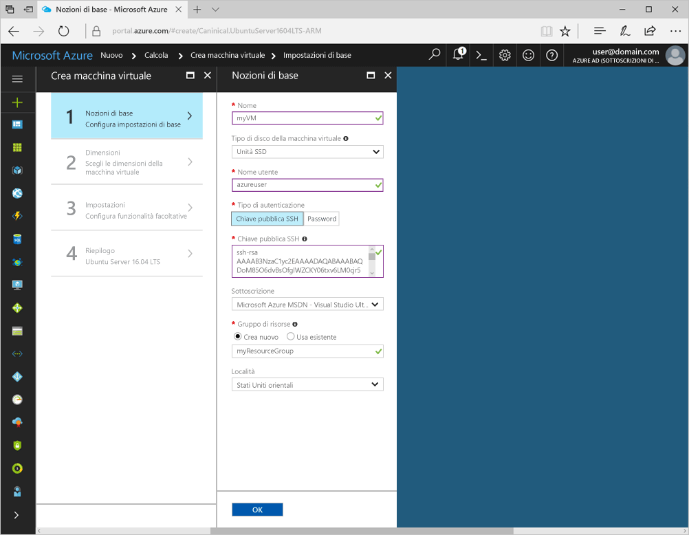
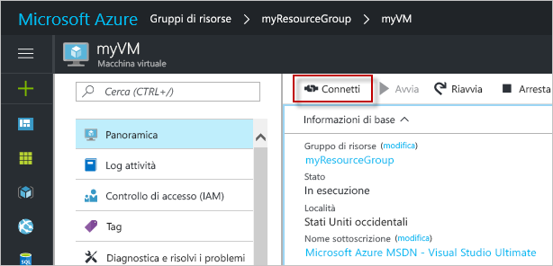

# <a name="create-a-linux-virtual-machine-with-the-azure-portal"></a>Creare una macchina virtuale Linux con il portale di Azure

È possibile creare macchine virtuali di Azure tramite il portale di Azure. Questo metodo fornisce un'interfaccia utente basata sul browser per la creazione e la configurazione delle macchine virtuali e di tutte le risorse correlate. Questa guida introduttiva illustra la creazione di una macchina virtuale e l'installazione di un server Web nella VM.

Se non si ha una sottoscrizione di Azure, creare un [account gratuito](https://azure.microsoft.com/free/?WT.mc_id=A261C142F) prima di iniziare.

## <a name="create-ssh-key-pair"></a>Creare una coppia di chiavi SSH

Per completare questa guida introduttiva è necessaria una coppia di chiavi SSH. Se è già disponibile una coppia di chiavi SSH, questo passaggio può essere ignorato.

In una shell Bash eseguire questo comando e attenersi alle indicazioni visualizzate. L'output del comando include il nome del file di chiave pubblica. Copiare il contenuto del file di chiave pubblica (`cat ~/.ssh/id_rsa.pub`) negli Appunti. Se si usa il sottosistema Windows per Linux, assicurarsi di non copiare i caratteri di interruzione di riga dall'output. Annotare il nome del file di chiave privata per usarlo in un secondo momento.

```bash
ssh-keygen -t rsa -b 2048
```

Altre informazioni dettagliate su questo processo sono disponibili [qui](https://docs.microsoft.com/azure/virtual-machines/linux/mac-create-ssh-keys)

## <a name="log-in-to-azure"></a>Accedere ad Azure 

Accedere al portale di Azure all'indirizzo http://portal.azure.com.

## <a name="create-virtual-machine"></a>Crea macchina virtuale

1. Fare clic su **Crea una risorsa** nell'angolo superiore sinistro del portale di Azure.

2. Selezionare **Calcolo** e quindi **Ubuntu Server 16.04 LTS**. 

3. Immettere le informazioni relative alla macchina virtuale. In **Tipo di autenticazione** selezionare **Chiave pubblica SSH**. Quando si incolla la chiave pubblica SSH, prestare attenzione a rimuovere gli eventuali spazi iniziali o finali. Al termine fare clic su **OK**.

    

4. Selezionare una dimensione per la VM. Per visualizzare altre dimensioni, selezionare **Visualizza tutto** o modificare il filtro **Supported disk type** (Tipo di disco supportato). 

      

5. In **Impostazioni** mantenere le impostazioni predefinite e fare clic su **OK**.

6. Nella pagina del riepilogo fare clic su **OK** per avviare la distribuzione della macchina virtuale.

7. La macchina virtuale verrà aggiunta al dashboard del portale di Azure. Una volta completata la distribuzione verrà automaticamente aperto il riepilogo della macchina virtuale.


## <a name="connect-to-virtual-machine"></a>Connettersi alla macchina virtuale

Creare una connessione SSH alla macchina virtuale.

1. Fare clic sul pulsante **Connetti** nelle proprietà della macchina virtuale. Il pulsante Connetti mostra una stringa di connessione SSH che può essere usata per connettersi alla macchina virtuale.

     

2. Usare il comando seguente per creare una sessione SSH. Sostituire la stringa di connessione con quella copiata dal portale di Azure.

```bash 
ssh azureuser@40.112.21.50
```

## <a name="install-nginx"></a>Installare NGINX

Usare lo script bash seguente per aggiornare le origini dei pacchetti e installare il pacchetto NGINX più recente. 

```bash 
#!/bin/bash

# update package source
sudo apt-get -y update

# install NGINX
sudo apt-get -y install nginx
```

Al termine chiudere la sessione SSH e tornare alle proprietà della macchina virtuale nel portale di Azure.


## <a name="open-port-80-for-web-traffic"></a>Aprire la porta 80 per il traffico Web 

Un gruppo di sicurezza di rete (NSG) consente il traffico in ingresso e in uscita. Quando si crea una VM nel portale di Azure, viene creata una regola in ingresso sulla porta 22 per le connessioni SSH. Questa VM ospita un server Web, quindi è necessario creare una regola del gruppo di sicurezza di rete per la porta 80.

1. Nella macchina virtuale fare clic sul nome del **gruppo di risorse**.
2. Selezionare il **gruppo di sicurezza di rete**. Il gruppo di sicurezza di rete può essere identificato tramite la colonna **Tipo**. 
3. Nel menu a sinistra fare clic su **Regole di sicurezza in ingresso** in Impostazioni.
4. Fare clic su **Aggiungi**.
5. In **Nome** digitare **http**. Assicurarsi che l'opzione **Intervallo di porte di origine** sia impostata su `*`, che l'opzione **Intervallo di porte di destinazione** sia impostata su *80* e che l'opzione **Azione** sia impostata su *Consenti*. 
6. Fare clic su **OK**.


## <a name="view-the-nginx-welcome-page"></a>Visualizzare la pagina iniziale di NGINX

Con NGINX installato e la porta 80 aperta per la macchina virtuale, è ora possibile accedere al server Web da Internet. Aprire un Web browser e immettere l'indirizzo IP pubblico della VM. L'indirizzo IP pubblico è indicato nelle proprietà della macchina virtuale nel portale di Azure.

 

## <a name="clean-up-resources"></a>Pulire le risorse

Quando non serve più, eliminare il gruppo di risorse e tutte le risorse correlate. A tale scopo selezionare il gruppo di risorse per la macchina virtuale e fare clic su **Elimina**.

## <a name="next-steps"></a>Passaggi successivi

In questa guida introduttiva è stata distribuita una macchina virtuale semplice, è stata creata una regola del gruppo di sicurezza di rete ed è stato installato un server Web. Per altre informazioni sulle macchine virtuali di Azure, passare all'esercitazione per le VM di Linux.

> [!div class="nextstepaction"]
> [Esercitazioni per le macchine virtuali di Linux in Azure](./tutorial-manage-vm.md)
