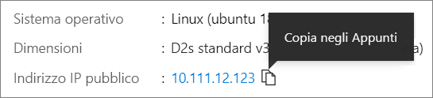

# <a name="quickstart-create-a-linux-virtual-machine-in-the-azure-portal"></a>Avvio rapido: Creare una macchina virtuale Linux nel portale di Azure

È possibile creare macchine virtuali di Azure tramite il portale di Azure. Il portale di Azure è un'interfaccia utente basata su browser per la creazione di risorse di Azure. Questa guida di avvio rapido illustra come usare il portale di Azure per distribuire una macchina virtuale Linux che esegue Ubuntu 18.04 LTS. Per vedere la macchina virtuale in azione, si stabilisce anche una connessione SSH alla macchina virtuale e si installa il server Web NGINX.

Se non si ha una sottoscrizione di Azure, creare un [account gratuito](https://azure.microsoft.com/free/?WT.mc_id=A261C142F) prima di iniziare.

## <a name="sign-in-to-azure"></a>Accedere ad Azure

Accedere al [portale di Azure](https://portal.azure.com), se questa operazione non è già stata eseguita.

## <a name="create-virtual-machine"></a>Creare macchina virtuale

1. Digitare **macchine virtuali** nella casella di ricerca.
1. In **Servizi** selezionare **Macchine virtuali**.
1. Nella pagina **Macchine virtuali** selezionare **Aggiungi**. Viene visualizzata la pagina **Creare una macchina virtuale**.
1. Nella scheda **Nozioni di base**, sotto **Dettagli progetto**, verificare che sia selezionata la sottoscrizione corretta e quindi scegliere **Crea nuovo** gruppo di risorse. Digitare *myResourceGroup* come nome.*. 

    

1. In **Dettagli istanza** digitare *myVM* nel campo **Nome macchina virtuale**, scegliere *Stati Uniti orientali* come valore per il campo **Area** e quindi scegliere *Ubuntu 18.04 LTS* per il campo **Immagine**. Lasciare invariate le altre impostazioni predefinite.

    

1. In **Account amministratore** selezionare **Chiave pubblica SSH**.

1. In **Nome utente** digitare *azureuser*.

1. Per **Origine chiave pubblica SSH**, lasciare l'impostazione predefinita **Genera nuova coppia di chiavi**, quindi digitare *myKey* per il **Nome coppia di chiavi**.

    

1. Sotto **Regole porta in ingresso** > **Porte in ingresso pubbliche**, scegliere **Consentire porte selezionate**, quindi selezionare **SSH (22)** e **HTTP (80)** dall'elenco a discesa. 

    

1. Lasciare invariate le impostazioni predefinite rimanenti, quindi selezionare il pulsante **Rivedi e crea** nella parte inferiore della pagina.

1. Nella pagina **Crea macchina virtuale** è possibile visualizzare i dettagli sulla macchina virtuale che si sta creando. Quando si è pronti, selezionare **Crea**.

1. Quando viene visualizzata la finestra **Genera nuova coppia di chiavi**, selezionare **Scarica la chiave privata e crea la risorsa**. Il file della chiave verrà scaricato con il nome **myKey.pem**. Assicurarsi di scaricare il file `.pem` in un percorso noto, perché sarà necessario nel passaggio successivo.

1. Una volta completata la distribuzione, selezionare **Vai alla risorsa**.

1. Nella pagina per la nuova macchina virtuale selezionare l'indirizzo IP pubblico e copiarlo negli Appunti.


    

## <a name="connect-to-virtual-machine"></a>Connettersi alla macchina virtuale

Creare una connessione SSH con la macchina virtuale.

1. Se si usa un computer Mac o Linux, aprire un prompt di Bash. Se si usa un computer Windows, aprire un prompt di PowerShell. 

1. Al prompt, aprire una connessione SSH alla macchina virtuale. Sostituire l'indirizzo IP con quello della macchina virtuale e il percorso di `.pem` con quello in cui è stato scaricato il file della chiave.

```console
ssh -i .\Downloads\myKey1.pem azureuser@10.111.12.123
```

> [!TIP]
> La chiave SSH creata può essere usata la volta successiva che si crea una macchina virtuale in Azure. È sufficiente selezionare **Usa una chiave esistente archiviata in Azure** per **Origine chiave pubblica SSH** la volta successiva che si crea una macchina virtuale. La chiave privata è già presente nel computer, quindi non è necessario scaricare niente.

## <a name="install-web-server"></a>Installare il server Web

Per visualizzare la macchina virtuale in azione, installare il server Web NGINX. Dalla sessione SSH, aggiornare le origini dei pacchetti e quindi installare il pacchetto NGINX più recente.

```bash
sudo apt-get -y update
sudo apt-get -y install nginx
```

Al termine, digitare `exit` per uscire dalla sessione SSH.


## <a name="view-the-web-server-in-action"></a>Visualizzare il server Web in azione

Usare il Web browser che si preferisce per vedere la pagina iniziale di NGINX predefinita. Digitare l'indirizzo IP pubblico della macchina virtuale come indirizzo Web. L'indirizzo IP pubblico è reperibile nella pagina di panoramica della macchina virtuale o come parte della stringa di connessione SSH usata in precedenza.


## <a name="clean-up-resources"></a>Pulire le risorse

Quando non servono più, è possibile eliminare il gruppo di risorse, la macchina virtuale e tutte le risorse correlate. A tale scopo, selezionare il gruppo di risorse per la macchina virtuale, selezionare **Elimina** e quindi confermare il nome del gruppo di risorse da eliminare.

## <a name="next-steps"></a>Passaggi successivi

In questa guida introduttiva è stata distribuita una macchina virtuale semplice, sono stati creati un gruppo di sicurezza di rete e una regola ed è stato installato un server Web. Per altre informazioni sulle macchine virtuali di Azure, passare all'esercitazione per le VM di Linux.

> [!div class="nextstepaction"]
> [Esercitazioni per le macchine virtuali di Linux in Azure](./tutorial-manage-vm.md)
