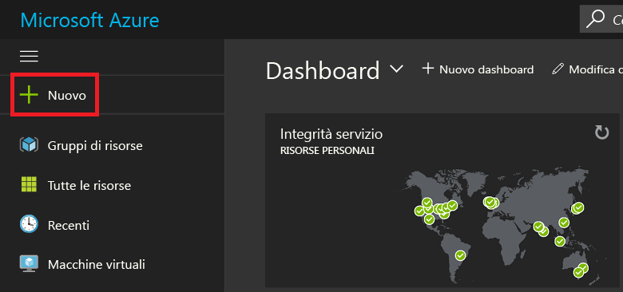
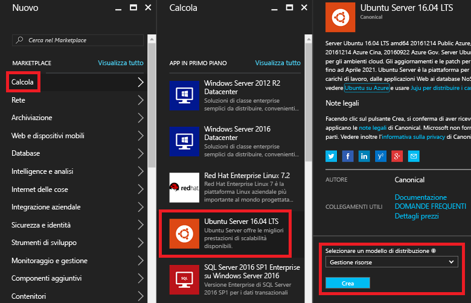
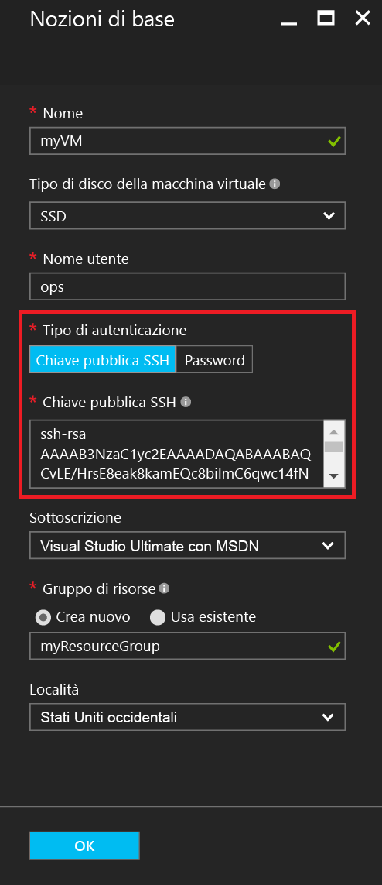
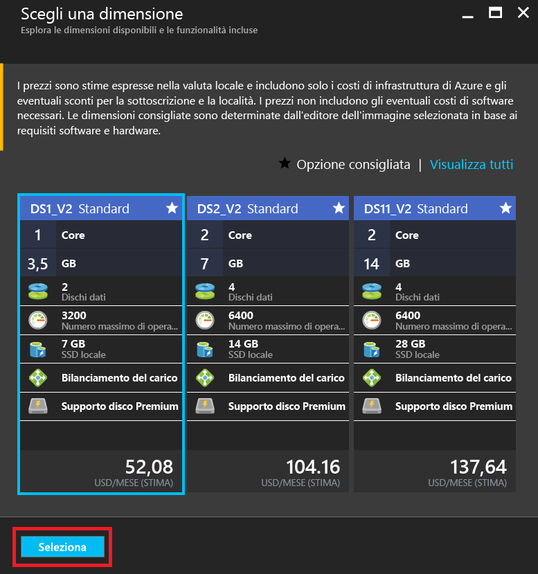
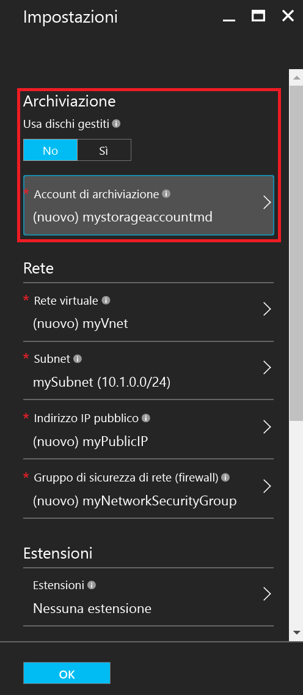
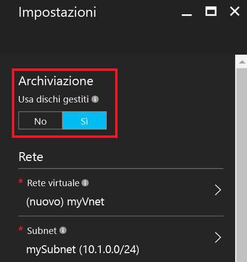
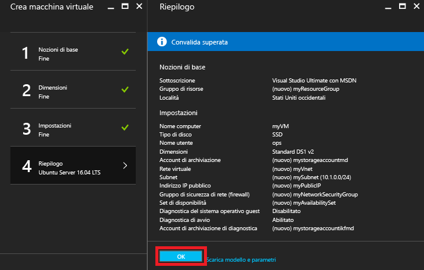
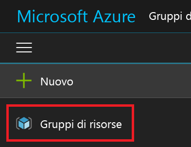
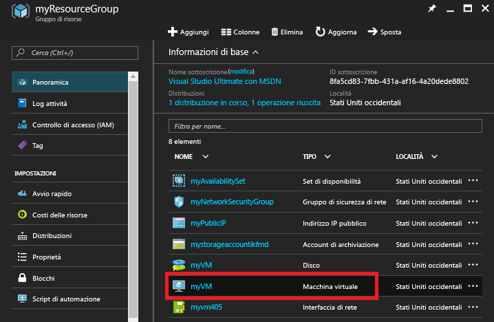
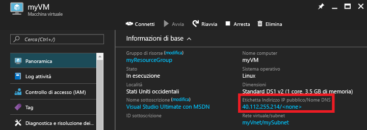

# <a name="create-a-linux-vm-on-azure-using-the-portal"></a>Creare una VM Linux in Azure usando il portale.
Questo articolo illustra come usare il [portale di Azure](https://portal.azure.com/) per creare una macchina virtuale Linux.

I requisiti sono:

* [Un account di Azure](https://azure.microsoft.com/pricing/free-trial/)
* [File di chiavi SSH pubbliche e private](virtual-machines-linux-mac-create-ssh-keys.md?toc=%2fazure%2fvirtual-machines%2flinux%2ftoc.json)

## <a name="sign-in"></a>Accedi
Accedere al portale di Azure con l'identità dell'account Azure. Fare clic su **+ Nuovo** nell'angolo superiore sinistro:



## <a name="choose-vm"></a>Scegliere una VM
Fare clic su **Calcolo** nel **Marketplace**, quindi selezionare **Ubuntu Server 16.04 LTS** dall'elenco di immagini **App in primo piano**.  Verificare nella parte inferiore che il modello di distribuzione sia `Resource Manager` e quindi fare clic su **Crea**.



## <a name="enter-vm-options"></a>Immettere le opzioni della VM
Nella pagina **Informazioni di base** immettere:

* Nome della macchina virtuale
* Tipo di disco della macchina virtuale (unità SSD per impostazione predefinita o HDD)
* Nome utente dell'utente amministratore
* Impostare il **Tipo di autenticazione** su **Chiave pubblica SSH**
* Chiave pubblica SSH sotto forma di stringa, dalla directory `~/.ssh/`
* Nome del gruppo di risorse o selezionare un gruppo di risorse esistente

Fare clic su **OK** per continuare. L'aspetto del pannello sarà simile allo screenshot seguente:



## <a name="choose-vm-size"></a>Scegliere le dimensioni della VM
Scegliere le dimensioni per la macchina virtuale. Nell'esempio seguente viene scelta l'opzione **DS1_V2 Standard**, che installa Ubuntu in un'unità SSD Premium. La lettera **S** nella dimensione della VM indica il supporto per SSD. Fare clic su **Seleziona** per configurare le impostazioni.



## <a name="storage-and-network"></a>Archiviazione e rete
Nel pannello **Impostazioni** è possibile scegliere di usare Azure Managed Disks per la VM. L'impostazione predefinita corrente prevede l'uso di dischi non gestiti. La funzionalità Azure Managed Disks viene gestita dalla piattaforma Azure e non richiede alcuna pianificazione o alcuna posizione per l'archiviazione. Per altre informazioni su Azure Managed Disks, vedere [Azure Managed Disks overview](../storage/storage-managed-disks-overview.md) (Panoramica di Azure Managed Disks). Per i dischi non gestiti è necessario creare o selezionare un account di archiviazione per i dischi rigidi virtuali:



Se si sceglie di usare Azure Managed Disks, non è necessario configurare altre opzioni di archiviazione, come illustrato nell'esempio seguente:



Mantenere le impostazioni predefinite per le altre opzioni di rete.

## <a name="confirm-vm-settings-and-launch"></a>Confermare le impostazioni della VM e avviare
Confermare le impostazioni per la nuova macchina virtuale Ubuntu e fare clic su **OK**.



## <a name="select-the-vm-resource"></a>Selezionare la risorsa della macchina virtuale
Aprire la home page del portale e scegliere **Gruppi di risorse** dal menu disponibile nell'angolo superiore sinistro. Se necessario, fare clic sulle tre barre nella parte superiore del menu per espandere l'elenco, come indicato di seguito:



Selezionare il gruppo di risorse, quindi fare clic sulla nuova macchina virtuale:



## <a name="find-the-public-ip"></a>Trovare l'indirizzo IP pubblico
Visualizzare l'**Indirizzo IP pubblico** assegnato alla macchina virtuale:



## <a name="ssh-to-the-vm"></a>Eseguire SSH sulla VM
Eseguire SSH per accedere all'indirizzo IP pubblico con la chiave SSH pubblica.  Da una workstation Mac o Linux è possibile eseguire SSH direttamente dal Terminale. Se si usa una workstation Windows, è necessario usare PuTTY, MobaXTerm o Cygwin per eseguire SSH su Linux.  Se non è ancora disponibile, qui è fornito un documento per preparare la workstation Windows per eseguire SSH su Linux.

[Come usare le chiavi SSH con Windows su Azure](virtual-machines-linux-ssh-from-windows.md?toc=%2fazure%2fvirtual-machines%2flinux%2ftoc.json)

```
ssh -i ~/.ssh/azure_id_rsa ops@40.112.255.214
```

## <a name="next-steps"></a>Passaggi successivi
A questo punto è stata creata rapidamente una VM Linux da usare per scopi di test o dimostrazione. Per creare una VM Linux personalizzata per l'infrastruttura, è possibile vedere questi articoli.

* [Creare una VM Linux in Azure usando i modelli](virtual-machines-linux-cli-deploy-templates.md?toc=%2fazure%2fvirtual-machines%2flinux%2ftoc.json)
* [Creare una VM Linux protetta usando un modello di Azure](virtual-machines-linux-create-ssh-secured-vm-from-template.md?toc=%2fazure%2fvirtual-machines%2flinux%2ftoc.json)
* [Creare una VM Linux usando l'interfaccia della riga di comando di Azure](virtual-machines-linux-create-cli-complete.md?toc=%2fazure%2fvirtual-machines%2flinux%2ftoc.json)


