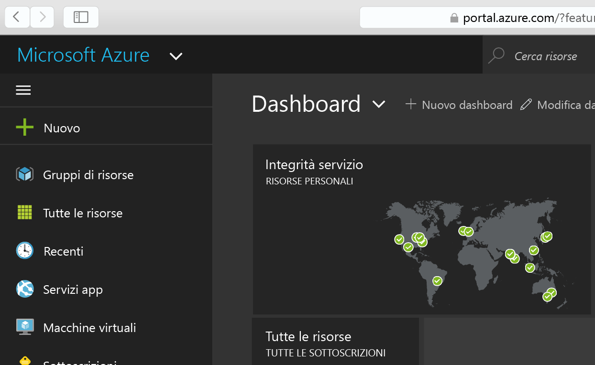
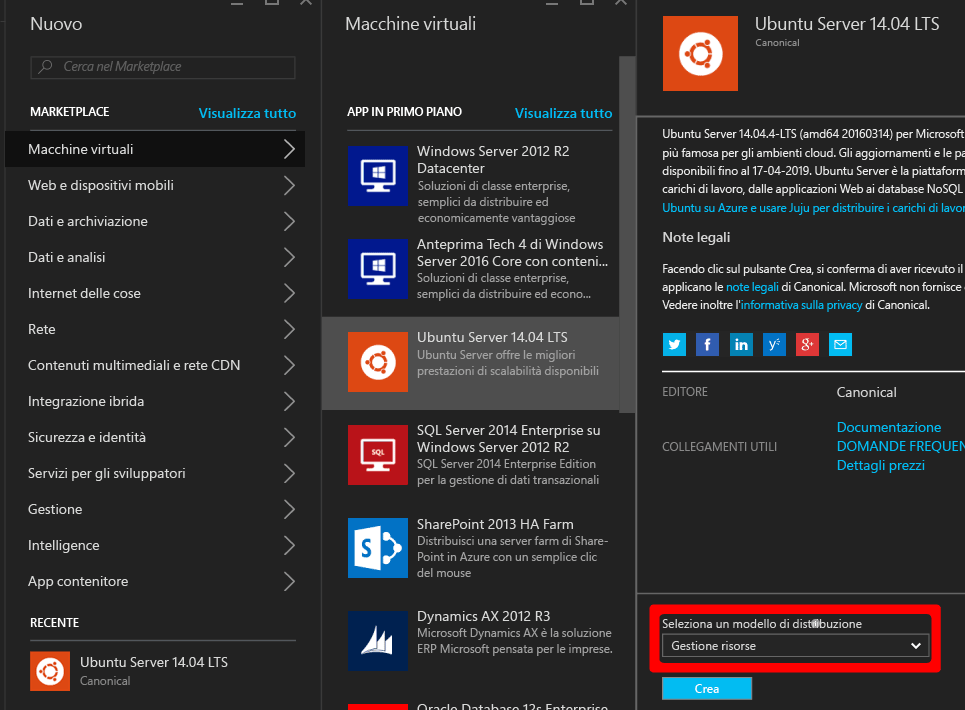
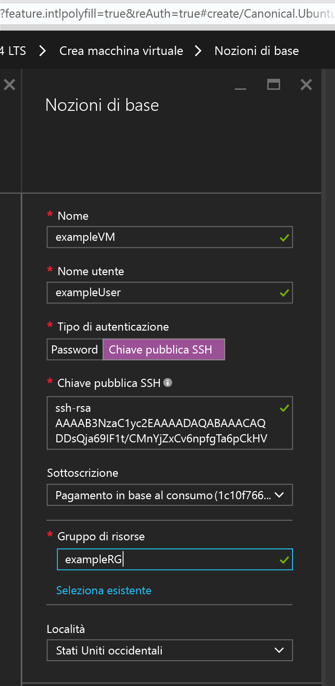
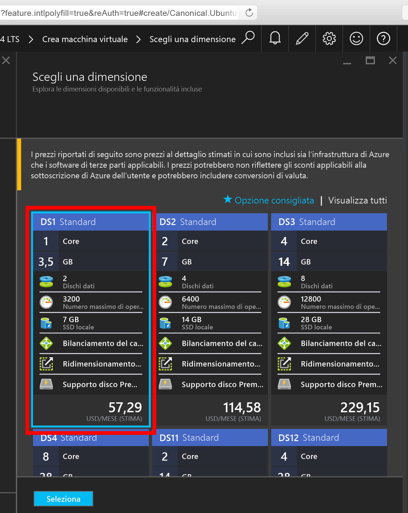
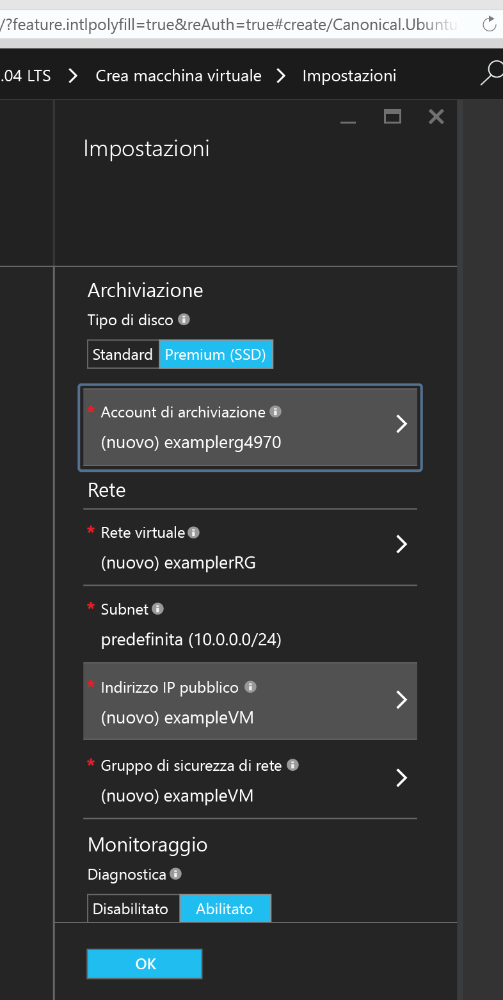
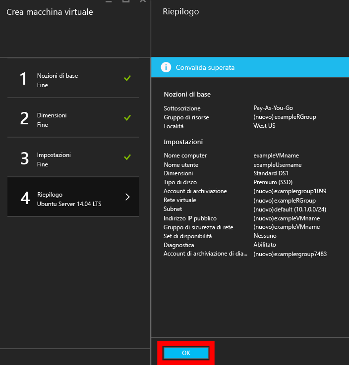
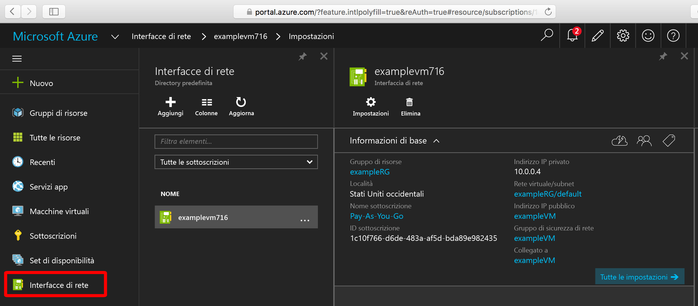
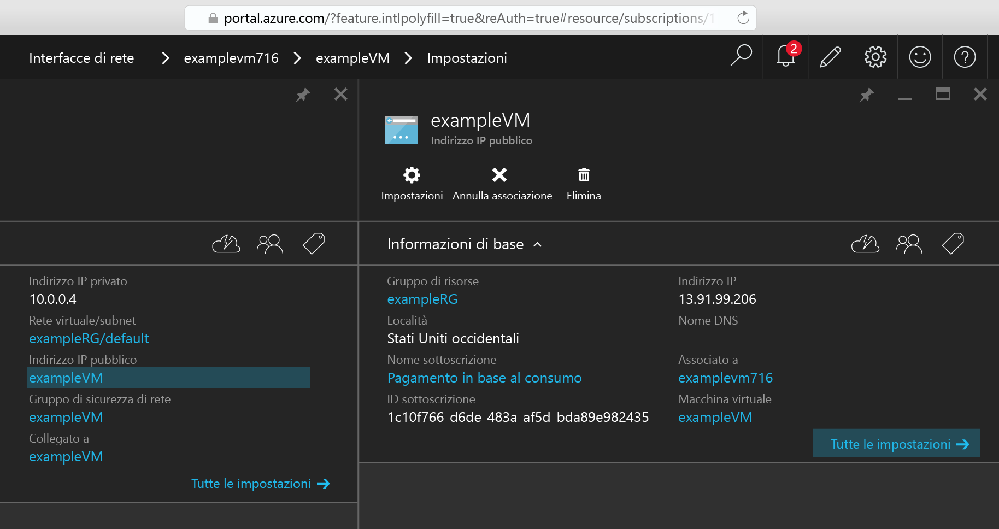

<properties
    pageTitle="Creare una macchina virtuale Linux tramite il portale di Azure | Microsoft Azure"
    description="Creare una macchina virtuale Linux tramite il portale di Azure."
    services="virtual-machines-linux"
    documentationCenter=""
    authors="vlivech"
    manager="timlt"
    editor=""
    tags="azure-resource-manager"
/>

<tags
    ms.service="virtual-machines-linux"
    ms.workload="infrastructure-services"
    ms.tgt_pltfrm="vm-linux"
    ms.devlang="na"
    ms.topic="hero-article"
    ms.date="04/05/2016"
    ms.author="v-livech"
/>

# Creare una macchina virtuale Linux tramite il portale di Azure

Questo articolo illustra come usare il [portale di Azure](https://portal.azure.com/) per creare subito una VM Linux senza installare alcun programma. Gli unici requisiti sono [un account Azure](https://azure.microsoft.com/pricing/free-trial/) e [file di chiavi SSH pubbliche e private](virtual-machines-linux-mac-create-ssh-keys.md).


1. Dopo avere eseguito l'accesso al portale di Azure con l'identità dell'account Azure, fare clic su **+ + Nuovo** nell'angolo superiore sinistro:

    

2. Fare clic su **Macchine virtuali** nel **Marketplace** quindi su **Ubuntu Server 14.04 LTS** dall'elenco immagini **App in primo piano**. Verrà visualizzata la schermata seguente:

    

3. Verificare nella parte inferiore che il modello di distribuzione sia `Resource Manager` e quindi fare clic su **Crea**.

4. Nella pagina **Nozioni di base** immettere:
    - Nome della macchina virtuale
    - Nome utente dell'utente amministratore
    - Tipo di autenticazione impostato su **Chiave pubblica SSH**
    - Chiave pubblica SSH sotto forma di stringa, per impostazione predefinita dalla directory `~/.ssh/`
    - Nome di un gruppo di risorse, per creare un nuovo gruppo di distribuzione, o selezionare un gruppo esistente

    Fare clic su **OK** per continuare e scegliere le dimensioni della macchina virtuale, che saranno simili. Le impostazioni saranno simili alle seguenti:

    

5. Scegliere **DS1** come dimensioni per installare Ubuntu su un'unità SSD Premium e fare clic su **Seleziona** per configurare le impostazioni.

    

6. In **Impostazioni**, lasciare le impostazioni predefinite per i valori di archiviazione e di rete e fare clic su **OK** per visualizzare il riepilogo.

    

7. Confermare le impostazioni per la nuova VM Ubuntu e fare clic su **OK**.

    

8. Aprire il dashboard del portale e in **Interfacce di rete** scegliere la scheda di rete.

    

9. Aprire il menu di indirizzi IP pubblici sotto le impostazioni della scheda di rete.

    

10. Usare SSH per accedere all'indirizzo IP pubblico con la chiave SSH pubblica.

```
user@slackware$ ssh -i ~/.ssh/azure_id_rsa ubuntu@13.91.99.206
```

## Passaggi successivi

È possibile proseguire e [aggiungere un disco](virtual-machines-linux-add-disk.md).

<!---HONumber=AcomDC_0413_2016-->