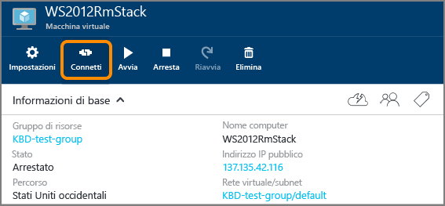

<properties
	pageTitle="Accedere a una macchina virtuale di Windows Server | Microsoft Azure"
	description="Informazioni su come accedere a una VM Windows Server tramite il portale di Azure e il modello di distribuzione di gestione delle risorse."
	services="virtual-machines-windows"
	documentationCenter=""
	authors="cynthn"
	manager="timlt"
	editor="tysonn"
	tags="azure-resource-manager"/>

<tags
	ms.service="virtual-machines-windows"
	ms.workload="infrastructure-services"
	ms.tgt_pltfrm="vm-windows"
	ms.devlang="na"
	ms.topic="get-started-article"
	ms.date="01/21/2016"
	ms.author="cynthn"/>

# Come accedere a una macchina virtuale che esegue Windows Server 

[AZURE.INCLUDE [learn-about-deployment-models](../../includes/learn-about-deployment-models-rm-include.md)] [classic deployment model](virtual-machines-windows-classic-connect-logon.md).

Per avviare una sessione di Desktop remoto si userà il pulsante **Connetti** nel portale di Azure. Effettuare la connessione alla macchina virtuale, quindi accedere al sistema.

## Connettersi alla macchina virtuale

1. Accedere al [portale di Azure](https://portal.azure.com/), se questa operazione non è già stata eseguita.

2.	Nel menu Hub, fare clic su **Macchine virtuali**.

3.	Selezionare la macchina virtuale dall'elenco.

4. Nel pannello della macchina virtuale fare clic su **Connetti**.

	

## Accesso alla macchina virtuale

[AZURE.INCLUDE [virtual-machines-log-on-win-server](../../includes/virtual-machines-log-on-win-server.md)]

## Risoluzione dei problemi

Se le istruzioni non sono sufficienti o non sono quelle necessarie, vedere [Risolvere i problemi di connessioni Desktop remoto a una macchina virtuale di Azure basata su Windows](virtual-machines-windows-troubleshoot-rdp-connection.md). In questo articolo viene illustrato come diagnosticare e risolvere i problemi più comuni.

<!----HONumber=AcomDC_0323_2016-->