<properties
	pageTitle="Creare la prima macchina virtuale Windows | Microsoft Azure"
	description="Informazioni su come creare la prima macchina virtuale Windows nel portale di Azure."
	keywords="Macchina virtuale di Windows,creare una macchina virtuale,computer virtuale,configurazione di una macchina virtuale"
	services="virtual-machines-windows"
	documentationCenter=""
	authors="cynthn"
	manager="timlt"
	editor=""
	tags="azure-resource-manager"/>
<tags
	ms.service="virtual-machines-windows"
	ms.workload="infrastructure-services"
	ms.tgt_pltfrm="vm-windows"
	ms.devlang="na"
	ms.topic="hero-article"
	ms.date="08/29/2016"
	ms.author="cynthn"/>



# Creare la prima macchina virtuale Windows nel portale di Azure

Questa esercitazione illustra come è facile creare una VM Windows in pochi minuti nel portale di Azure.

Se non si ha una sottoscrizione di Azure, è possibile creare un [account gratuito](https://azure.microsoft.com/free/) in pochi minuti.

Ecco un [video con la procedura dettagliata](https://channel9.msdn.com/Blogs/Azure-Documentation-Shorts/Create-A-Virtual-Machine-Running-Windows-In-The-Azure-Preview-Portal) di questa esercitazione.

## Scegliere l'immagine della VM dal Marketplace

Come esempio viene usata un'immagine di Windows Server 2012 R2 Datacenter, che è solo una delle molte immagini disponibili in Azure. Le opzioni relative all'immagine dipendono dalla sottoscrizione. Per gli [abbonati MSDN](https://azure.microsoft.com/pricing/member-offers/msdn-benefits-details/?WT.mc_id=A261C142F) sono ad esempio disponibili immagini desktop.

1. Accedere al [portale di Azure](https://portal.azure.com).

2. Scegliere **Nuovo** > **Macchine virtuali** > **Windows Server 2012 R2 Datacenter** dal menu Hub.

	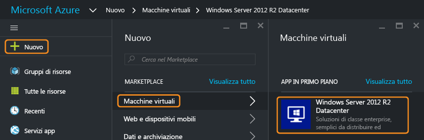

3. Nel pannello **Windows Server 2012 R2 Datacenter** verificare che in **Selezionare un modello di distribuzione** sia selezionata l'opzione **Resource Manager**. Fare clic su **Create**.

	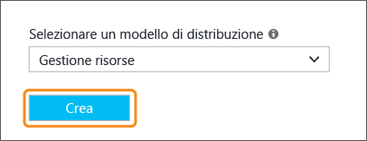

## Creare la macchina virtuale Windows

Dopo aver selezionato l'immagine, è possibile usare le impostazioni predefinite di Azure per quasi tutto il processo di configurazione e creare rapidamente la macchina virtuale.

1. Nel pannello **Informazioni di base** immettere un **Nome** per la macchina virtuale. Il nome deve avere una lunghezza compresa tra 1 e 15 caratteri e non può contenere caratteri speciali.

2. Immettere un **Nome utente** e una **Password** complessa, da usare per creare un account locale nella VM. L'account locale viene usato per accedere alla macchina virtuale e gestirla.

	La password deve avere una lunghezza compresa tra 8 e 123 caratteri e soddisfare almeno tre dei quattro requisiti di complessità seguenti: una lettera minuscola, una lettera maiuscola, un numero e un carattere speciale. Sono disponibili altre informazioni sui [requisiti relativi a nome utente e password](virtual-machines-windows-faq.md#what-are-the-username-requirements-when-creating-a-vm).

3. Selezionare un [gruppo di risorse](../resource-group-overview.md#resource-groups) esistente o specificare il nome di un nuovo gruppo. Immettere la **Località** per un data center di Azure, ad esempio **Stati Uniti occidentali**.

4. Al termine, fare clic su **OK** per passare alla sezione successiva.

	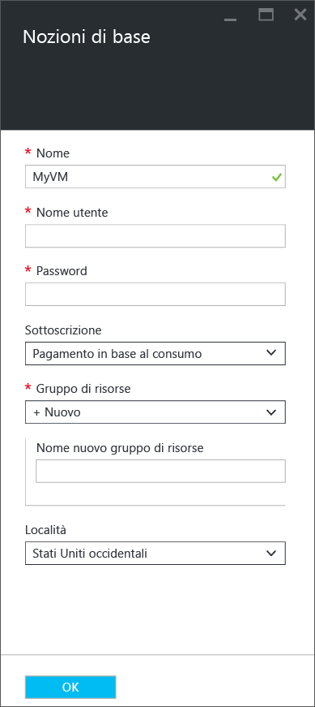



	
5. Scegliere le [dimensioni](virtual-machines-windows-sizes.md) per la macchina virtuale e quindi fare clic su **Seleziona** per continuare.

	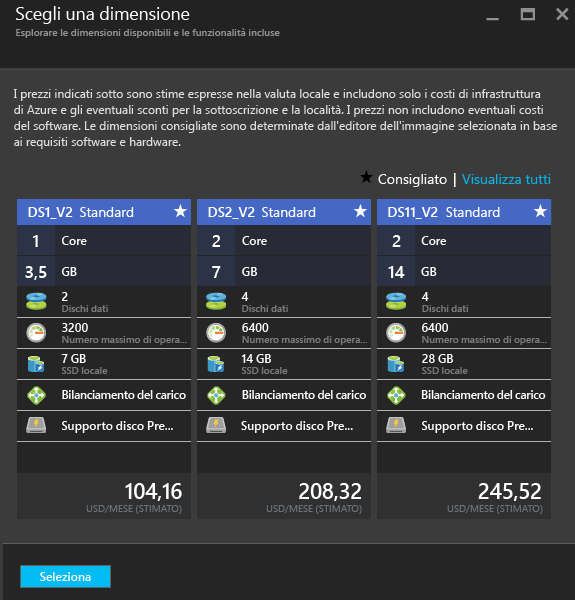



6. Nel pannello **Impostazioni** è possibile cambiare le opzioni di archiviazione e di rete. Per questa esercitazione, accettare le impostazioni predefinite. Se sono state selezionate dimensioni di macchina virtuale che lo supportano, è possibile provare il servizio Archiviazione Premium selezionando **Premium (SSD)** in **Tipo di disco**. Al termine delle modifiche, fare clic su **OK**.

	



7. Fare clic su **Riepilogo** per verificare le modifiche. Quando viene visualizzato il messaggio **Convalida superata**, fare clic su **OK**.

	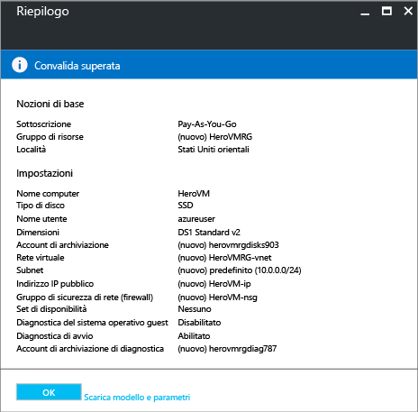



8. Mentre Azure crea la macchina virtuale, è possibile tenere traccia dello stato di avanzamento in **Macchine virtuali** nel menu Hub.

## Connettersi alla macchina virtuale ed effettuare l'accesso

1.	Scegliere **Macchine virtuali** dal menu Hub.

2.	Selezionare la macchina virtuale dall'elenco.

3. Nel pannello della macchina virtuale fare clic su **Connetti**. Verrà creato e scaricato un file Remote Desktop Protocol (file con estensione rdp), che è analogo a un collegamento per la connessione alla macchina virtuale. È consigliabile salvare il file sul desktop per semplificare l'accesso. **Aprire** questo file per connettersi alla macchina virtuale.

	



4. Verrà visualizzato un avviso che indica che l'autore del file RDP è sconosciuto. Si tratta di una situazione normale. Nella finestra di Desktop remoto, fare clic su **Connetti** per continuare.

	



5. Nella finestra Sicurezza di Windows immettere il nome utente e la password per l'account locale creato quando è stata creata la VM. Il nome utente viene immesso come *nomevm*&#92;*nomeutente*. Fare quindi clic su **OK**.

	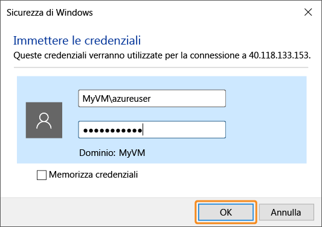


 	
6.	Verrà visualizzato un avviso che indica che non è possibile verificare il certificato. Si tratta di una situazione normale. Fare clic su **Sì** per verificare l'identità della macchina virtuale e terminare la procedura di accesso.

	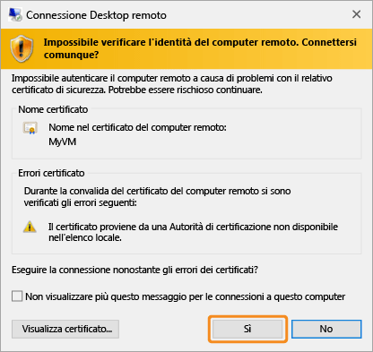



In caso di problemi quando si cerca di eseguire la connessione, vedere [Risolvere i problemi di connessioni Desktop remoto a una macchina virtuale di Azure che esegue Windows](virtual-machines-windows-troubleshoot-rdp-connection.md).

È ora possibile lavorare con la macchina virtuale nello stesso modo in cui lo si farebbe con qualsiasi altro server.

## Installare IIS nella macchina virtuale

Dopo aver eseguito l'accesso alla macchina virtuale, verrà installato un ruolo del server che permette di fare ulteriori prove.

1. Aprire **Server Manager** se non è già aperto. Fare clic sul menu **Start** e quindi su **Server Manager**.
2. In **Server Manager** selezionare **Server locale** nel riquadro a sinistra.
3. Nel menu selezionare **Gestione** > **Aggiungi ruoli e funzionalità**.
4. Nella pagina **Tipo di installazione** dell'Aggiunta guidata ruoli e funzionalità scegliere **Installazione basata su ruoli o basata su funzionalità** e quindi fare clic su **Avanti**.

	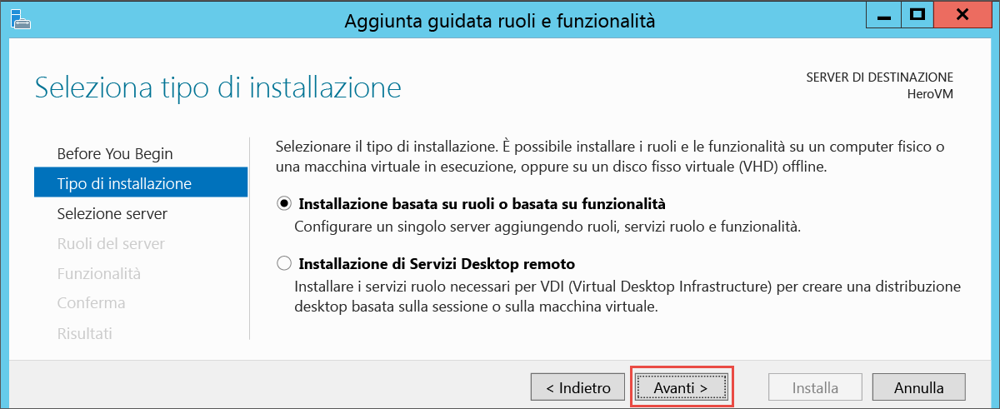



5. Selezionare la macchina virtuale dal pool di server e fare clic su **Avanti**.
6. Nella pagina **Ruoli server** selezionare **Server Web (IIS)**.

	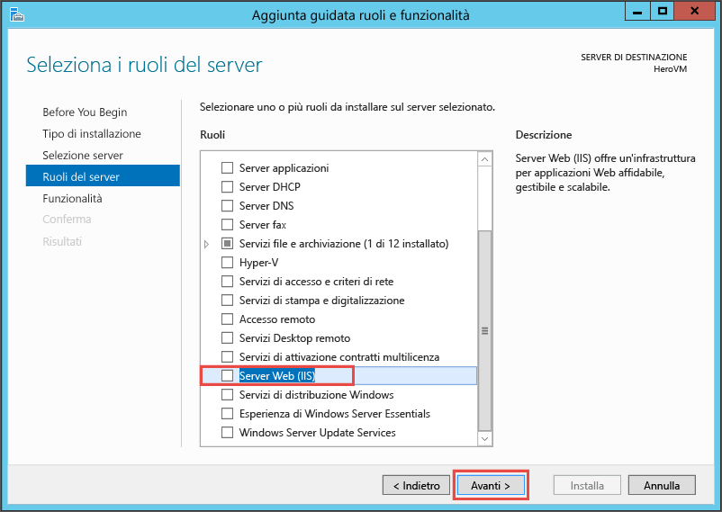



7. Nella finestra popup sull'aggiunta di funzionalità necessarie per IIS accertarsi che sia selezionata l'opzione **Includi strumenti di gestione** e quindi fare clic su **Aggiungi funzionalità**. Quando si chiude la finestra popup, fare clic su **Avanti** nella procedura guidata.

	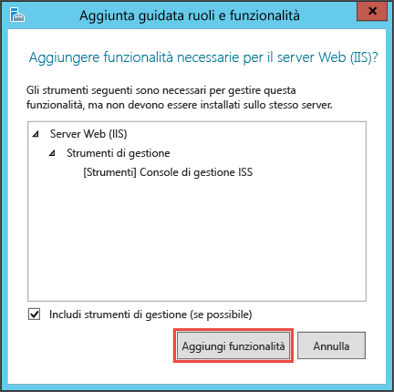



8. Nella pagina delle funzionalità fare clic su **Avanti**.
9. Nella pagina **Ruolo Server Web (IIS)** fare clic su **Avanti**.
10. Nella pagina **Servizi ruolo** fare clic su **Avanti**.
11. Nella pagina **Conferma** fare clic su **Avanti**.
12. Al termine dell'installazione fare clic su **Chiudi** nella procedura guidata.

## Aprire la porta 80 

Perché la macchina virtuale possa accettare il traffico in ingresso attraverso porta 80, è necessario aggiungere una regola in ingresso al gruppo di sicurezza di rete.

1. Aprire il [portale di Azure](https://portal.azure.com).
2. In **Macchine virtuali** selezionare la macchina virtuale creata.
3. In Impostazioni macchina virtuale scegliere **Interfacce di rete** e quindi selezionare l'interfaccia di rete esistente.

	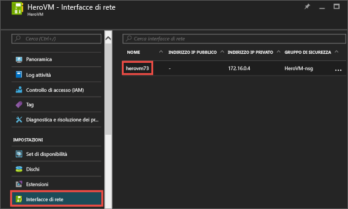



4. In **Informazioni di base** per l'interfaccia di rete fare clic sul **Gruppo di sicurezza di rete**.

	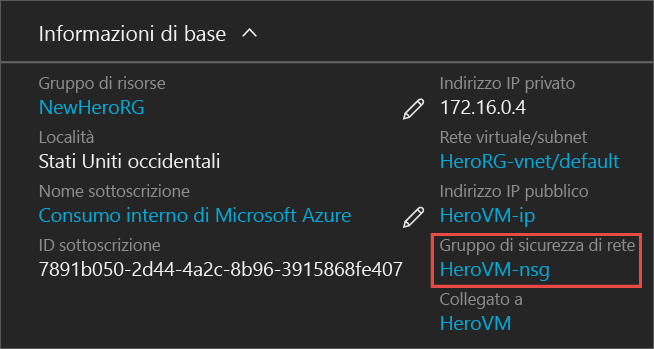



5. Nel pannello **Informazioni di base** per il gruppo di sicurezza di rete dovrebbe essere già presente una regola in ingresso predefinita per **default-allow-rdp**, che consente di accedere alla macchina virtuale. Aggiungere un'altra regola in ingresso per consentire il traffico IIS. Fare clic su **Regole di sicurezza in ingresso**.

	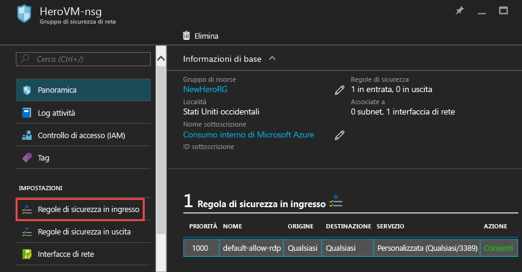



6. In **Regole di sicurezza in ingresso** fare clic su **Aggiungi**.

	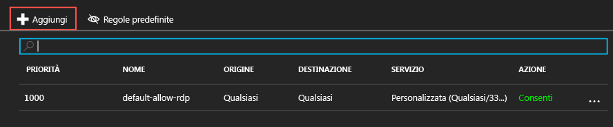

7. In **Regole di sicurezza in ingresso** fare clic su **Aggiungi**. Digitare **80** nell'intervallo di porte e assicurarsi che sia selezionata l'opzione **Consenti**. Al termine, fare clic su **OK**.

	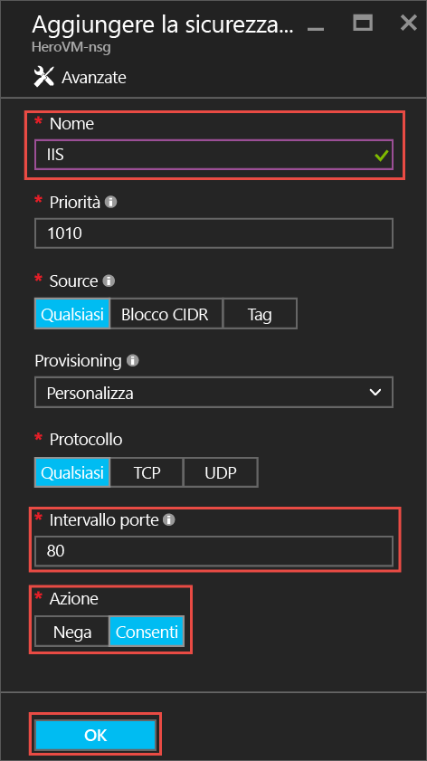


 
Per altre informazioni sui gruppi di sicurezza di rete e le regole in ingresso e in uscita, vedere [Consentire l'accesso esterno alla VM mediante il portale di Azure](virtual-machines-windows-nsg-quickstart-portal.md).
 
## Connettersi al sito Web IIS predefinito

1. Nel portale di Azure fare clic su **Macchine virtuali** e quindi selezionare la macchina virtuale.
2. Copiare l'**indirizzo IP pubblico** nel pannello **Informazioni di base**.

	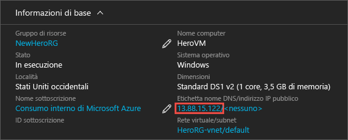

2. Aprire un browser e digitare l'indirizzo IP pubblico nella barra degli indirizzi come segue: http://<indirizzoIPpubblico>. Quindi premere **INVIO** per passare a tale indirizzo.
3. Il browser aprirà la pagina Web di IIS predefinita, che avrà un aspetto simile al seguente:

	

## Arrestare la VM

È consigliabile arrestare la VM, in modo che non vengano effettuati addebiti quando non la si usa. È sufficiente fare clic sul pulsante **Arresta** e quindi su **Sì**.

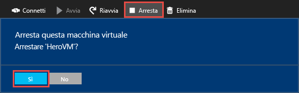


	
Fare clic sul pulsante **Avvia** per riavviare la macchina virtuale quando si è pronti per usarla di nuovo.

## Passaggi successivi

* È anche possibile provare a [collegare un disco dati](virtual-machines-windows-attach-disk-portal.md) alla macchina virtuale. I dischi dati forniscono più risorse di archiviazione per la macchina virtuale.

* È anche possibile [creare una macchina virtuale Windows con Powershell](virtual-machines-windows-ps-create.md) o [creare una macchina virtuale Linux in Azure tramite l'interfaccia della riga di comando](virtual-machines-linux-quick-create-cli.md).

* Per automatizzare le distribuzioni, vedere [Creare una macchina virtuale Windows con un modello di Resource Manager](virtual-machines-windows-ps-template.md).

<!---HONumber=AcomDC_0831_2016-->