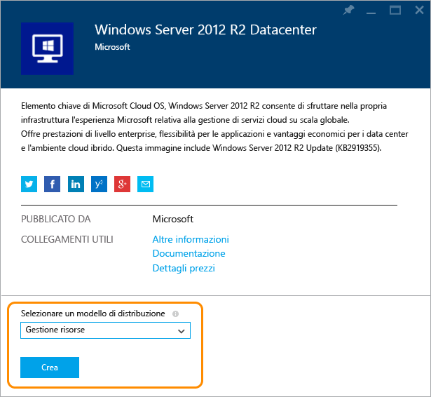
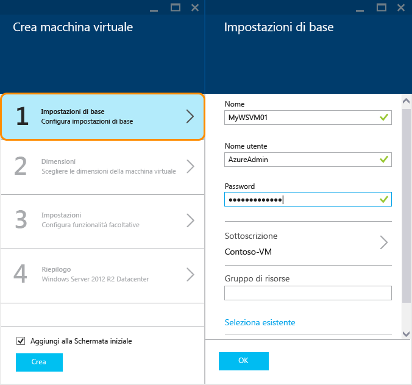

<properties
	pageTitle="Creare una VM Windows nel portale di Azure | Microsoft Azure"
	description="Informazioni su come creare una macchina virtuale Windows nel portale di Azure"
	keywords="Macchina virtuale di Windows,creare una macchina virtuale,computer virtuale,configurazione di una macchina virtuale"
	services="virtual-machines-windows"
	documentationCenter=""
	authors="cynthn"
	manager="timlt"
	editor=""
	tags="azure-resource-manager"/>
<tags
	ms.service="virtual-machines-windows"
	ms.workload="infrastructure-services"
	ms.tgt_pltfrm="vm-windows"
	ms.devlang="na"
	ms.topic="hero-article"
	ms.date="04/14/2016"
	ms.author="cynthn"/>

# Creare una macchina virtuale di Windows nel portale di Azure

Questa esercitazione illustra come è facile creare una VM Windows in pochi minuti nel portale di Azure. Come esempio viene usata un'immagine di Windows Server 2012 R2 Datacenter, che è solo una delle molte immagini disponibili in Azure. Le opzioni relative all'immagine dipendono dalla sottoscrizione. Per gli [abbonati a MSDN](https://azure.microsoft.com/pricing/member-offers/msdn-benefits-details/?WT.mc_id=A261C142F) sono ad esempio disponibili immagini desktop.

Se non si ha una sottoscrizione di Azure, è possibile creare un [account gratuito](https://azure.microsoft.com/free/) in pochi minuti.

## Procedura dettagliata video

Ecco una [procedura dettagliata video](https://channel9.msdn.com/Blogs/Azure-Documentation-Shorts/Create-A-Virtual-Machine-Running-Windows-In-The-Azure-Preview-Portal) di questa esercitazione.

## Selezionare un'immagine di macchina virtuale Windows 2012 R2 dal Marketplace

1. Accedere al [portale di Azure](https://portal.azure.com).

2. Nel menu Hub fare clic su **Nuovo** > **Calcolo** > **Windows Server 2012 R2 Datacenter**.

	

3. Nella pagina **Windows Server 2012 R2 Datacenter**, in **Selezionare un modello di distribuzione** fare clic su **Gestione risorse**. Fare clic su **Create**.

	

## Creare la macchina virtuale Windows

Dopo aver selezionato l'immagine, è possibile usare le impostazioni predefinite di Azure per quasi tutto il processo di configurazione e creare rapidamente la macchina virtuale.

1. Nel pannello **Crea macchina virtuale** fare clic su **Informazioni di base**.

2. Immettere un **Nome** per la macchina virtuale. Il nome non può contenere caratteri speciali.

3. Immettere un **Nome utente** amministrativo e una **Password** complessa. La password deve avere una lunghezza compresa tra 8 e 123 caratteri e includere almeno 3 degli elementi seguenti: una lettera minuscola, una lettera maiuscola, un numero e un carattere speciale. **Nome utente e password sono necessari per la connessione alla macchina virtuale**.

4. Se si hanno più sottoscrizioni, specificarne una per la nuova macchina virtuale. Selezionare un [Gruppo di risorse](../resource-group-overview/#resource-groups) nuovo o esistente e una **Posizione** del data center di Azure, ad esempio **Stati Uniti occidentali**.

	

	
2. Fare clic su **Dimensioni** e selezionare le dimensioni di macchina virtuale appropriate in base alle proprie esigenze. Ogni dimensione specifica il numero di core di calcolo, la memoria e altre funzionalità, come il supporto per Archiviazione Premium, che influiscono sul prezzo. Azure consiglia determinate dimensioni automaticamente a seconda dell'immagine scelta.

	

	>[AZURE.NOTE] Il servizio di archiviazione Premium è disponibile per le macchine virtuali della serie DS in alcune aree. Il servizio di archiviazione Premium è la migliore opzione di archiviazione per i carichi di lavoro con utilizzo intensivo, come ad esempio un database. Per ulteriori informazioni, vedere [Archiviazione Premium: archiviazione ad alte prestazioni per carichi di lavoro delle macchine virtuali di Azure](../storage/storage-premium-storage.md).

3. Fare clic su **Impostazioni** per visualizzare le impostazioni di archiviazione e di rete per la nuova macchina virtuale. Per la prima macchina virtuale è in genere possibile accettare le impostazioni predefinite. Se sono state selezionate dimensioni di macchina virtuale che lo supportano, è possibile provare il servizio Archiviazione Premium selezionando **Premium (SSD)** in **Tipo di disco**.

	

6. Fare clic su **Riepilogo** per esaminare le scelte di configurazione. Al termine della revisione o dell'aggiornamento delle impostazioni, fare clic su **Crea**.

	

8. Mentre Azure crea la macchina virtuale, è possibile tenere traccia dello stato di avanzamento in **Macchine virtuali** nel menu Hub.

## Connettersi alla macchina virtuale ed effettuare l'accesso

1. Accedere al [portale di Azure](https://portal.azure.com/), se questa operazione non è già stata eseguita.

2.	Scegliere **Macchine virtuali** dal menu Hub.

3.	Selezionare la macchina virtuale dall'elenco.

4. Nel pannello della macchina virtuale fare clic su **Connetti**.

	

[AZURE.INCLUDE [virtual-machines-log-on-win-server](../../includes/virtual-machines-log-on-win-server.md)]

In caso di problemi quando si cerca di eseguire la connessione, vedere [Risolvere i problemi di connessioni Desktop remoto a una macchina virtuale di Azure che esegue Windows](virtual-machines-windows-troubleshoot-rdp-connection.md).

È ora possibile lavorare con la macchina virtuale nello stesso modo in cui lo si farebbe con qualsiasi altro server.

## Passaggi successivi

* È anche possibile [creare una VM Windows usando Powershell](virtual-machines-windows-ps-create.md) o [creare una macchina virtuale Linux](virtual-machines-linux-quick-create-cli.md) usando l'interfaccia della riga di comando di Azure.

<!---HONumber=AcomDC_0427_2016-->