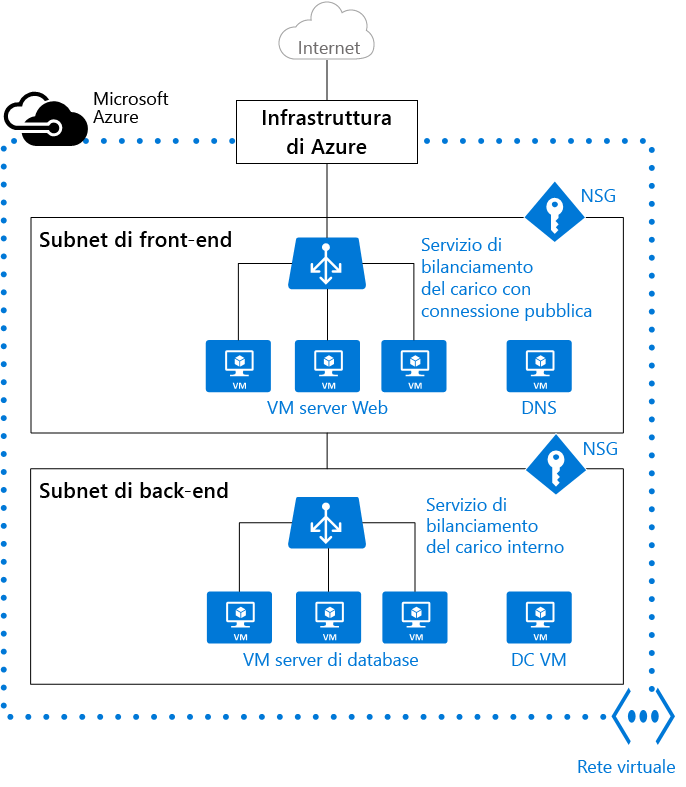

# Reti virtuali e macchine virtuali Windows in Azure 

Quando si crea una macchina virtuale (VM) di Azure, è necessario creare una [rete virtuale](../virtual-network/virtual-networks-overview.md) o usarne una esistente. È anche necessario decidere come si accederà alle macchine virtuali nella rete virtuale. È importante [pianificare prima di creare risorse](../virtual-network/virtual-network-vnet-plan-design-arm.md) e comprendere i [limiti delle risorse di rete](../azure-subscription-service-limits.md#networking-limits).

Nella figura seguente, le VM vengono rappresentate come server Web e server di database. Ogni set di VM viene assegnato a subnet separate nella rete virtuale.

È possibile creare una rete virtuale prima o durante la creazione di una VM. La rete virtuale viene creata dall'utente oppure automaticamente quando si crea una VM.

Creare queste risorse per supportare la comunicazione con una VM:

- Interfacce di rete
- Indirizzi IP
- Rete virtuale e subnet

Oltre a queste risorse di base è opportuno prendere in considerazione anche queste risorse facoltative:

- Gruppi di sicurezza di rete
- Servizi di bilanciamento del carico 

## Interfacce di rete

Un'[interfaccia di rete (NIC)](../virtual-network/virtual-network-network-interface.md) rappresenta l'interconnessione tra una VM e una rete virtuale. Una VM deve avere almeno un'interfaccia di rete, ma può averne più di una, a seconda delle dimensioni della VM creata. Per informazioni sul numero di interfacce di rete supportate a seconda delle dimensioni della VM, vedere [Dimensioni delle macchine virtuali in Azure](virtual-machines-windows-sizes.md). 

Per creare una VM con più di un'interfaccia di rete è sufficiente creare la VM con almeno due interfacce.  Dopo la creazione è possibile aggiungere altre interfacce di rete fino al numero supportato dalle dimensioni della VM, ma non è possibile aggiungere altre interfacce di rete a una macchina virtuale creata con una sola interfaccia, a prescindere dal numero di interfacce supportate dalle dimensioni della VM. 

Se la VM viene aggiunta a un set di disponibilità, tutte le VM del set di disponibilità devono avere una o più interfacce di rete. Le VM con più interfacce di rete non devono avere necessariamente lo stesso numero di interfacce, a condizione che ognuna ne abbia tuttavia almeno due.

Ogni interfaccia di rete collegata a una VM deve trovarsi nello stesso percorso e nella stessa sottoscrizione della VM. Ogni interfaccia di rete deve essere connessa a una rete virtuale che si trova nello stesso percorso e nella stessa sottoscrizione di Azure dell'interfaccia. Dopo la creazione di un'interfaccia di rete, è possibile modificare la subnet a cui è connessa, ma non la rete virtuale.  A ogni interfaccia di rete collegata a una VM viene assegnato un indirizzo MAC che non cambia finché non viene eliminata la VM.

Questa tabella elenca i metodi che è possibile usare per creare un'interfaccia di rete.

| Metodo | Description |
| ------ | ----------- |
| Portale di Azure | Quando si crea una VM nel portale di Azure, viene creata automaticamente un'interfaccia di rete. Non è possibile usare un'interfaccia di rete creata separatamente dall'utente. Il portale crea una VM con una sola interfaccia di rete. Una VM con più di un'interfaccia di rete dovrà essere creata con un metodo diverso. |
| [Azure PowerShell](../virtual-network/virtual-network-deploy-multinic-arm-ps.md) | Usare [New-AzureRmNetworkInterface](https://docs.microsoft.com/powershell/resourcemanager/AzureRM.Network/v1.0.13/New-AzureRmNetworkInterface) con il parametro **-PublicIpAddressId** per specificare l'identificatore dell'indirizzo IP pubblico creato in precedenza. |
| [Interfaccia della riga di comando di Azure](../virtual-network/virtual-network-deploy-multinic-arm-cli.md) | Per specificare l'identificatore dell'indirizzo IP pubblico creato in precedenza, usare [az network nic create](https://docs.microsoft.com/cli/azure/network/nic#create) con il parametro **--public-ip-address**. |
| [Modello](../virtual-network/virtual-network-deploy-multinic-arm-template.md) | Vedere [Network Interface in a Virtual Network with Public IP Address](https://github.com/Azure/azure-quickstart-templates/tree/master/101-nic-publicip-dns-vnet) (Interfaccia di rete in una rete virtuale con indirizzo IP pubblico) per istruzioni sulla distribuzione di un'interfaccia di rete con un modello. |

## Indirizzi IP 

È possibile assegnare questi tipi di [indirizzi IP](../virtual-network/virtual-network-ip-addresses-overview-arm.md) a un'interfaccia di rete in Azure:

- **Indirizzi IP pubblici**: usati per comunicare in ingresso e in uscita, senza NAT (Network Address Translation), con Internet e altre risorse di Azure non connesse a una rete virtuale. L'assegnazione di un indirizzo IP pubblico a un'interfaccia di rete è facoltativa. Per gli indirizzi IP pubblici è previsto un addebito nominale ed è fissato un numero massimo per ogni sottoscrizione.
- **Indirizzi IP privati**: usati per la comunicazione nella rete virtuale, nella rete locale e in Internet (con NAT). È necessario assegnare almeno un indirizzo IP privato a una VM. Per altre informazioni su NAT in Azure, vedere [Informazioni sulle connessioni in uscita in Azure](../load-balancer/load-balancer-outbound-connections.md).

È possibile assegnare gli indirizzi IP pubblici a VM o servizi di bilanciamento del carico con connessione internet. È possibile assegnare gli indirizzi IP privati a VM e servizi di bilanciamento del carico interni. Assegnare gli indirizzi IP a una VM usando un'interfaccia di rete.

Gli indirizzi IP vengono allocati a una risorsa con due metodi: dinamico o statico. Il metodo di allocazione predefinito è dinamico, in cui un indirizzo IP non viene allocato al momento della creazione. L'indirizzo IP viene invece allocato quando si crea una VM o si avvia una VM arrestata. L'indirizzo IP viene rilasciato quando si arresta o si elimina la VM. 

Per far sì che l'indirizzo IP della VM rimanga invariato, è possibile impostare in modo esplicito il metodo di allocazione statico. In questo caso, un indirizzo IP viene assegnato immediatamente. Viene rilasciato solo quando si elimina la VM o si modifica il relativo metodo di allocazione in dinamico.
    
Questa tabella elenca i metodi che è possibile usare per creare un indirizzo IP.

| Metodo | Descrizione |
| ------ | ----------- |
| [Portale di Azure](../virtual-network/virtual-network-deploy-static-pip-arm-portal.md) | Per impostazione predefinita, gli indirizzi IP pubblici sono dinamici e l'indirizzo associato può cambiare quando la VM viene arrestata o eliminata. Per garantire che la VM usi sempre lo stesso indirizzo IP pubblico, creare un indirizzo IP pubblico statico. Per impostazione predefinita, il portale assegna un indirizzo IP privato dinamico a un'interfaccia di rete durante la creazione di una VM. È possibile modificare l'indirizzo in statico dopo aver creato la VM.|
| [Azure PowerShell](../virtual-network/virtual-network-deploy-static-pip-arm-ps.md) | Usare [New-AzureRmPublicIpAddress](https://docs.microsoft.com/powershell/resourcemanager/AzureRM.Network/v1.0.13/New-AzureRmPublicIpAddress) con il parametro **-AllocationMethod** impostato su Dynamic o Static. |
| [Interfaccia della riga di comando di Azure](../virtual-network/virtual-network-deploy-static-pip-arm-cli.md) | Usare [az network public-ip create](https://docs.microsoft.com/cli/azure/network/public-ip#create) con il parametro **--allocation-method** impostato su Dynamic o Static. |
| [Modello](../virtual-network/virtual-network-deploy-static-pip-arm-template.md) | Vedere [Network Interface in a Virtual Network with Public IP Address](https://github.com/Azure/azure-quickstart-templates/tree/master/101-nic-publicip-dns-vnet) (Interfaccia di rete in una rete virtuale con indirizzo IP pubblico) per istruzioni sulla distribuzione di un indirizzo IP pubblico con un modello. |

Dopo aver creato un indirizzo IP pubblico è possibile associarlo a una VM assegnandolo a un'interfaccia di rete.

## Rete virtuale e subnet

Una subnet è un intervallo di indirizzi IP nella rete virtuale. È possibile dividere la rete virtuale in più subnet per obiettivi di organizzazione e sicurezza. Ogni interfaccia di rete in una VM è connessa a una subnet in una rete virtuale. Le interfacce di rete connesse alle subnet (alla stessa o a diverse) di una rete virtuale possono comunicare tra loro senza nessuna configurazione aggiuntiva.

Quando si configura una rete virtuale si specifica la topologia, inclusi gli spazi degli indirizzi e le subnet disponibili. Se la rete virtuale deve essere connessa ad altre reti virtuali o a reti locali, è necessario selezionare intervalli di indirizzi che non si sovrappongano. Gli indirizzi IP sono privati e non accessibili da Internet. In precedenza questo valeva solo per gli indirizzi IP non instradabili quali 10.0.0.0/8, 172.16.0.0/12 o 192.168.0.0/16. Azure considera ora qualunque intervallo di indirizzi come parte dello spazio degli indirizzi IP privato della rete virtuale raggiungibile solo all'interno della rete virtuale, delle reti virtuali interconnesse e dal percorso locale. 

Se si lavora in un'organizzazione in cui un altro utente è responsabile delle reti interne, è consigliabile consultare questa persona prima di selezionare lo spazio degli indirizzi. Verificare che non ci siano sovrapposizioni e comunicare al responsabile lo spazio che si intende usare in modo che non venga usato lo stesso intervallo di indirizzi IP. 

Per impostazione predefinita non esiste alcun limite di sicurezza tra subnet, quindi le VM in ognuna di queste subnet possono comunicare tra loro. È tuttavia possibile configurare gruppi di sicurezza di rete (NSG) che consentono di controllare il flusso di traffico da e verso le subnet e da e verso le VM. 

Questa tabella elenca i metodi che è possibile usare per creare una rete virtuale e le subnet.    

| Metodo | Descrizione |
| ------ | ----------- |
| [Portale di Azure](../virtual-network/virtual-networks-create-vnet-arm-pportal.md) | Se è Azure a creare una rete virtuale quando si crea una VM, il nome sarà una combinazione del nome del gruppo di risorse che contiene la rete virtuale e **-vnet**. Lo spazio degli indirizzi è 10.0.0.0/24, il nome della subnet è **default** e l'intervallo di indirizzi della subnet è 10.0.0.0/24. |
| [Azure PowerShell](../virtual-network/virtual-networks-create-vnet-arm-ps.md) | Usare [New-AzureRmVirtualNetworkSubnetConfig](https://docs.microsoft.com/powershell/resourcemanager/AzureRM.Network/v1.0.13/New-AzureRmVirtualNetworkSubnetConfig) e [New-AzureRmVirtualNetwork](https://docs.microsoft.com/powershell/resourcemanager/AzureRM.Network/v1.0.13/New-AzureRmVirtualNetwork) per creare una subnet e una rete virtuale. È anche possibile usare [Add-AzureRmVirtualNetworkSubnetConfig](https://docs.microsoft.com/powershell/resourcemanager/AzureRM.Network/v1.0.13/Add-AzureRmVirtualNetworkSubnetConfig) per aggiungere una subnet a una rete virtuale esistente. |
| [Interfaccia della riga di comando di Azure](../virtual-network/virtual-networks-create-vnet-arm-cli.md) | La subnet e la rete virtuale vengono create nello stesso momento. Specificare un parametro **--subnet-name** per [az network vnet create](https://docs.microsoft.com/cli/azure/network/vnet#create) con il nome della subnet. |
| [Modello](../virtual-network/virtual-networks-create-vnet-arm-template-click.md) | Il modo più semplice per creare una rete virtuale e le subnet consiste nello scaricare un modello esistente, ad esempio il modello disponibile in [Virtual Network with two Subnets](https://github.com/Azure/azure-quickstart-templates/tree/master/101-vnet-two-subnets) (Rete virtuale con due subnet) e modificarlo in base alle esigenze. |

## Gruppi di sicurezza di rete

Un [gruppo di sicurezza di rete (NSG)](../virtual-network/virtual-networks-nsg.md) contiene una serie di regole dell'elenco di controllo di accesso (ACL) che consentono o rifiutano il traffico di rete verso le subnet, le interfacce di rete o entrambe. I gruppi di sicurezza di rete possono essere associati a subnet o singole interfacce di rete connesse a una subnet. Quando un gruppo di sicurezza di rete viene associato a una subnet, le regole ACL si applicano a tutte le VM in tale subnet. Il traffico verso una singola interfaccia di rete può essere limitato associando un gruppo di sicurezza di rete direttamente a un'interfaccia di rete.

I gruppi di sicurezza di rete includono due tipi di regole: In ingresso e In uscita. La priorità per una regola deve essere univoca all'interno di ogni set. Ogni regola ha proprietà di protocollo, intervalli di porte di origine e destinazione, prefissi degli indirizzi, direzione del traffico, priorità e tipo di accesso. 

Tutti i gruppi di sicurezza di rete contengono un set di regole predefinite. Le regole predefinite non possono essere eliminate, ma poiché hanno la priorità più bassa, è possibile eseguirne l'override con le regole create dall'utente. 

Quando si associa un NSG a una scheda di rete, le regole di accesso di rete nell’NSG vengono applicate solo a tale scheda di rete. Un gruppo di sicurezza di rete applicato a una singola interfaccia di rete di una VM con più interfacce di rete non influisce sul traffico verso le altre interfacce di rete. È possibile associare più gruppi di sicurezza di rete a un'interfaccia di rete (o a una VM, a seconda del modello di distribuzione) e alla subnet a cui è associata un'interfaccia di rete o una VM. La priorità viene assegnata in base alla direzione del traffico.

[Pianificare](../virtual-network/virtual-networks-nsg.md#planning) i gruppi di sicurezza di rete quando si pianificano le VM e la rete virtuale.

Questa tabella elenca i metodi che è possibile usare per creare un gruppo di sicurezza di rete.

| Metodo | Descrizione |
| ------ | ----------- |
| [Portale di Azure](../virtual-network/virtual-networks-create-nsg-arm-pportal.md) | Quando si crea una VM nel portale di Azure, un gruppo di sicurezza di rete viene creato e associato automaticamente all'interfaccia di rete creata dal portale. Il nome del gruppo di sicurezza di rete è una combinazione del nome della VM e **-nsg**. Questo gruppo di sicurezza di rete contiene una regola in ingresso con una priorità pari a 1000, il servizio impostato su RDP, il protocollo impostato su TCP, la porta impostata su 3389 e l'azione impostata su Consenti. Per consentire altro traffico in ingresso nella macchina virtuale è necessario aggiungere regole al gruppo di sicurezza di rete. |
| [Azure PowerShell](../virtual-network/virtual-networks-create-nsg-arm-ps.md) | Usare [New-AzureRmNetworkSecurityRuleConfig](https://docs.microsoft.com/powershell/resourcemanager/AzureRM.Network/v1.0.13/New-AzureRmNetworkSecurityRuleConfig) e specificare le informazioni necessarie per la regola. Usare [New-AzureRmNetworkSecurityGroup](https://docs.microsoft.com/powershell/resourcemanager/AzureRM.Network/v1.0.13/New-AzureRmNetworkSecurityGroup) per creare il gruppo di sicurezza di rete. Usare [Set-AzureRmVirtualNetworkSubnetConfig](https://docs.microsoft.com/powershell/resourcemanager/AzureRM.Network/v1.0.13/Set-AzureRmVirtualNetworkSubnetConfig) per configurare il gruppo di sicurezza di rete per la subnet. Usare [Set-AzureRmVirtualNetwork](https://docs.microsoft.com/powershell/resourcemanager/AzureRM.Network/v1.0.13/Set-AzureRmVirtualNetwork?redirectedfrom=msdn) per aggiungere il gruppo di sicurezza di rete alla rete virtuale. |
| [Interfaccia della riga di comando di Azure](../virtual-network/virtual-networks-create-nsg-arm-cli.md) | Usare [az network nsg create](https://docs.microsoft.com/cli/azure/network/nsg#create) per creare il gruppo di sicurezza di rete. Usare [az network nsg rule create](https://docs.microsoft.com/cli/azure/network/nsg/rule#create) per aggiungere regole al gruppo di sicurezza di rete. Usare [az network vnet subnet update](https://docs.microsoft.com/en-us/cli/azure/network/vnet/subnet#update) per aggiungere il gruppo di sicurezza di rete alla subnet. |
| [Modello](../virtual-network/virtual-networks-create-nsg-arm-template.md) | Vedere [Create a Network Security Group](https://github.com/Azure/azure-quickstart-templates/tree/master/101-security-group-create) (Creare un gruppo di sicurezza di rete) per istruzioni sulla distribuzione di un gruppo di sicurezza di rete con un modello. |

## Servizi di bilanciamento del carico

[Azure Load Balancer](../load-balancer/load-balancer-overview.md) offre elevati livelli di disponibilità e prestazioni di rete per le applicazioni. È possibile configurare un servizio di bilanciamento del carico per [bilanciare il traffico Internet in ingresso](../load-balancer/load-balancer-internet-overview.md) nelle VM o [bilanciare il traffico tra VM in una rete virtuale](../load-balancer/load-balancer-internal-overview.md). Un servizio di bilanciamento del carico può anche bilanciare il traffico tra computer locali e VM in una rete virtuale cross-premise oppure inoltrare il traffico esterno a una VM specifica.

Il servizio di bilanciamento del carico esegue il mapping del traffico in ingresso e in uscita tra l'indirizzo IP pubblico e la porta del servizio di bilanciamento del carico e l'indirizzo IP privato e la porta della VM.

Quando si crea un servizio di bilanciamento del carico è anche necessario considerare questi elementi di configurazione:

- **Configurazione IP front-end**: un servizio di bilanciamento del carico può includere uno o più indirizzi IP front-end, anche noti come IP virtuali (indirizzi VIP). Questi indirizzi IP vengono usati come ingresso per il traffico.
- **Pool di indirizzi back-end**: indirizzi IP associati all'interfaccia di rete in cui viene distribuito il carico.
- **Regole NAT**: definiscono il modo in cui il traffico in ingresso attraversa l'IP front-end e viene distribuito all'IP back-end.
- **Regole di bilanciamento del carico**: eseguono il mapping di una specifica combinazione di IP e porte front-end a un set di combinazioni di indirizzi IP e porte back-end. Un bilanciamento del carico singolo può avere più regole di bilanciamento del carico. Ogni regola è una combinazione di un IP e una porta front-end e un IP e una porta back-end associata alle VM.
- **[Probe](../load-balancer/load-balancer-custom-probe-overview.md)**: monitorano l'integrità delle VM. Se un probe non risponde, il servizio di bilanciamento del carico interrompe l'invio di nuove connessioni alla VM non integra. Le connessioni esistenti non sono interessate, mentre quelle nuove vengono inviate alle VM integre.

Questa tabella elenca i metodi che è possibile usare per creare un servizio di bilanciamento del carico con connessione Internet.

| Metodo | Description |
| ------ | ----------- |
| Portale di Azure | Non è attualmente possibile creare un servizio di bilanciamento del carico con connessione Internet usando il portale di Azure. |
| [Azure PowerShell](../load-balancer/load-balancer-get-started-internet-arm-ps.md) | Usare [New-AzureRmLoadBalancerFrontendIpConfig](https://docs.microsoft.com/powershell/resourcemanager/AzureRM.Network/v1.0.13/New-AzureRmLoadBalancerFrontendIpConfig) con il parametro **-PublicIpAddress** per specificare l'identificatore dell'indirizzo IP pubblico creato in precedenza. Usare [New-AzureRmLoadBalancerBackendAddressPoolConfig](https://docs.microsoft.com/powershell/resourcemanager/AzureRM.Network/v1.0.13/New-AzureRmLoadBalancerBackendAddressPoolConfig) per creare la configurazione del pool di indirizzi back-end. Usare [New-AzureRmLoadBalancerInboundNatRuleConfig](https://docs.microsoft.com/powershell/resourcemanager/AzureRM.Network/v1.0.13/New-AzureRmLoadBalancerInboundNatRuleConfig) per creare regole NAT in ingresso associate alla configurazione IP front-end creata. Usare [New-AzureRmLoadBalancerProbeConfig](https://docs.microsoft.com/powershell/resourcemanager/AzureRM.Network/v1.0.13/New-AzureRmLoadBalancerProbeConfig) per creare i probe necessari. Usare [New-AzureRmLoadBalancerRuleConfig](https://docs.microsoft.com/powershell/resourcemanager/AzureRM.Network/v1.0.13/New-AzureRmLoadBalancerRuleConfig) per creare la configurazione del servizio di bilanciamento del carico. Usare [New-AzureRmLoadBalancer](https://docs.microsoft.com/powershell/resourcemanager/AzureRM.Network/v1.0.13/New-AzureRmLoadBalancer) per creare il servizio di bilanciamento del carico.|
| [Interfaccia della riga di comando di Azure](../load-balancer/load-balancer-get-started-internet-arm-cli.md) | Usare [az network lb create](https://docs.microsoft.com/cli/azure/network/lb#create) per creare la configurazione del servizio di bilanciamento del carico. Usare [az network lb frontend-ip create](https://docs.microsoft.com/cli/azure/network/lb/frontend-ip#create) per aggiungere l'indirizzo IP pubblico creato in precedenza. Usare [az network lb address-pool create](https://docs.microsoft.com/cli/azure/network/lb/address-pool#create) per aggiungere la configurazione del pool di indirizzi back-end. Usare [az network lb inbound-nat-rule create](https://docs.microsoft.com/cli/azure/network/lb/inbound-nat-rule#create) per aggiungere le regole NAT. Usare [az network lb rule create](https://docs.microsoft.com/cli/azure/network/lb/rule#create) per aggiungere le regole del servizio di bilanciamento del carico. Usare [az network lb probe create](https://docs.microsoft.com/cli/azure/network/lb/probe#create) per aggiungere i probe. |
| [Modello](../load-balancer/load-balancer-get-started-internet-arm-template.md) | Vedere [Creare 2 macchine virtuali in un servizio di bilanciamento del carico e configurare le regole NAT nel servizio di bilanciamento del carico](https://github.com/Azure/azure-quickstart-templates/tree/master/201-2-vms-loadbalancer-natrules) per istruzioni sulla distribuzione di un servizio di bilanciamento del carico con un modello. |
    
Questa tabella elenca i metodi che è possibile usare per creare un servizio di bilanciamento del carico interno.

| Metodo | Description |
| ------ | ----------- |
| Portale di Azure | Non è attualmente possibile creare un servizio di bilanciamento del carico interno usando il portale di Azure. |
| [Azure PowerShell](../load-balancer/load-balancer-get-started-ilb-arm-ps.md) | Per specificare un indirizzo IP privato nella subnet della rete, usare [New-AzureRmLoadBalancerFrontendIpConfig](https://docs.microsoft.com/powershell/resourcemanager/AzureRM.Network/v1.0.13/New-AzureRmLoadBalancerFrontendIpConfig) con il parametro **-PrivateIpAddress**. Usare [New-AzureRmLoadBalancerBackendAddressPoolConfig](https://docs.microsoft.com/powershell/resourcemanager/AzureRM.Network/v1.0.13/New-AzureRmLoadBalancerBackendAddressPoolConfig) per creare la configurazione del pool di indirizzi back-end. Usare [New-AzureRmLoadBalancerInboundNatRuleConfig](https://docs.microsoft.com/powershell/resourcemanager/AzureRM.Network/v1.0.13/New-AzureRmLoadBalancerInboundNatRuleConfig) per creare regole NAT in ingresso associate alla configurazione IP front-end creata. Usare [New-AzureRmLoadBalancerProbeConfig](https://docs.microsoft.com/powershell/resourcemanager/AzureRM.Network/v1.0.13/New-AzureRmLoadBalancerProbeConfig) per creare i probe necessari. Usare [New-AzureRmLoadBalancerRuleConfig](https://docs.microsoft.com/powershell/resourcemanager/AzureRM.Network/v1.0.13/New-AzureRmLoadBalancerRuleConfig) per creare la configurazione del servizio di bilanciamento del carico. Usare [New-AzureRmLoadBalancer](https://docs.microsoft.com/powershell/resourcemanager/AzureRM.Network/v1.0.13/New-AzureRmLoadBalancer) per creare il servizio di bilanciamento del carico.|
| [Interfaccia della riga di comando di Azure](../load-balancer/load-balancer-get-started-ilb-arm-cli.md) | Usare il comando [az network lb create](https://docs.microsoft.com/cli/azure/network/lb#create) per creare la configurazione del servizio di bilanciamento del carico. Per definire l'indirizzo IP privato, usare [az network lb frontend-ip create](https://docs.microsoft.com/cli/azure/network/lb/frontend-ip#create) con il parametro **--private-ip-address**. Usare [az network lb address-pool create](https://docs.microsoft.com/cli/azure/network/lb/address-pool#create) per aggiungere la configurazione del pool di indirizzi back-end. Usare [az network lb inbound-nat-rule create](https://docs.microsoft.com/cli/azure/network/lb/inbound-nat-rule#create) per aggiungere le regole NAT. Usare [az network lb rule create](https://docs.microsoft.com/cli/azure/network/lb/rule#create) per aggiungere le regole del servizio di bilanciamento del carico. Usare [az network lb probe create](https://docs.microsoft.com/cli/azure/network/lb/probe#create) per aggiungere i probe.|
| [Modello](../load-balancer/load-balancer-get-started-ilb-arm-template.md) | Vedere [Creare 2 macchine virtuali in un servizio di bilanciamento del carico e configurare le regole NAT nel servizio di bilanciamento del carico](https://github.com/Azure/azure-quickstart-templates/tree/master/201-2-vms-internal-load-balancer) per istruzioni sulla distribuzione di un servizio di bilanciamento del carico con un modello. |

## VM

Le VM possono essere create nella stessa rete virtuale e possono connettersi tra loro usando indirizzi IP privati. Possono connettersi anche se si trovano in subnet diverse senza dover configurare un gateway o usare indirizzi IP pubblici. Per inserire VM in una rete virtuale, creare la rete virtuale e quindi ogni VM, assegnandola alla rete virtuale e alla subnet. Le VM acquisiscono le impostazioni di rete durante la distribuzione o l'avvio.  

Alle VM viene assegnato un indirizzo IP quando vengono distribuite. Se si distribuiscono più VM in una rete virtuale o in una subnet, gli indirizzi IP verranno assegnati al momento dell'avvio. Un indirizzo IP dinamico (DIP) è l'indirizzo IP interno associato a una VM. È possibile allocare un DIP statico a una VM. Se si assegna un DIP statico, considerare l'uso di una subnet specifica per evitare di riusare accidentalmente un DIP statico per un'altra VM.  

Se si crea una VM e successivamente si vuole eseguirne la migrazione in una rete virtuale, non si tratta di una semplice modifica della configurazione. È necessario ridistribuire la VM nella rete virtuale. Il modo più semplice per ridistribuire consiste nell'eliminare la VM, ma non i dischi collegati a essa, quindi ricreare la VM con i dischi originali nella rete virtuale. 

Questa tabella elenca i metodi che è possibile usare per creare una VM in una rete virtuale.

| Metodo | Descrizione |
| ------ | ----------- |
| [Portale di Azure](virtual-machines-windows-hero-tutorial.md) | Usa le impostazioni di rete predefinite citate in precedenza per creare una VM con una singola interfaccia di rete. Per creare una VM con più interfacce di rete è necessario procedere con un metodo diverso. |
| [Azure PowerShell](virtual-machines-windows-ps-create.md) | Prevede l'uso di [Add-AzureRmVMNetworkInterface](https://docs.microsoft.com/powershell/resourcemanager/azurerm.compute/v1.3.4/Add-AzureRmVMNetworkInterface) per aggiungere l'interfaccia di rete creata in precedenza alla configurazione della VM. |
| [Modello](virtual-machines-windows-ps-template.md) | Vedere [Very simple deployment of a Windows VM](https://github.com/Azure/azure-quickstart-templates/tree/master/101-vm-simple-windows) (Distribuzione molto semplice di una VM Windows) per istruzioni sulla distribuzione di una VM con un modello. |

## Passaggi successivi

- Informazioni sulla configurazione di [route definite dall'utente e inoltro IP](../virtual-network/virtual-networks-udr-overview.md). 
- Informazioni sulla configurazione di [connessioni tra reti virtuali](../vpn-gateway/vpn-gateway-vnet-vnet-rm-ps.md).
- Informazioni sulla [risoluzione dei problemi relativi alle route](../virtual-network/virtual-network-routes-troubleshoot-portal.md).

