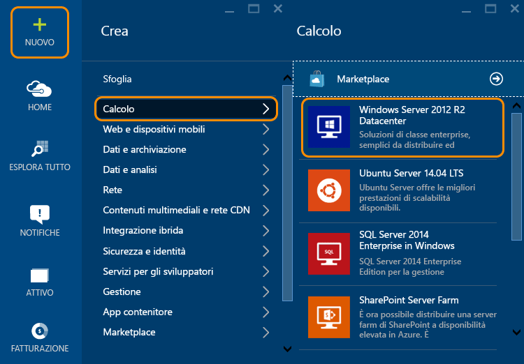
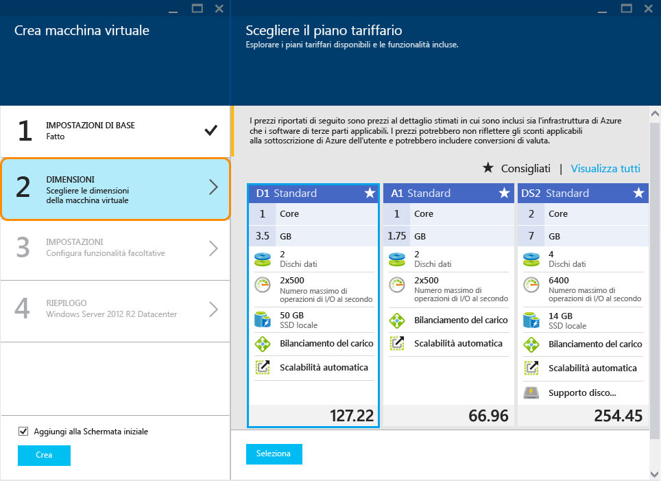
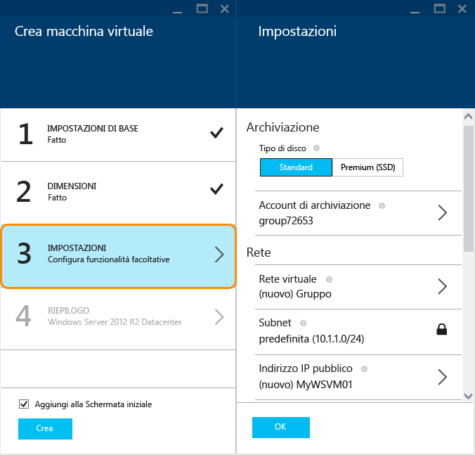
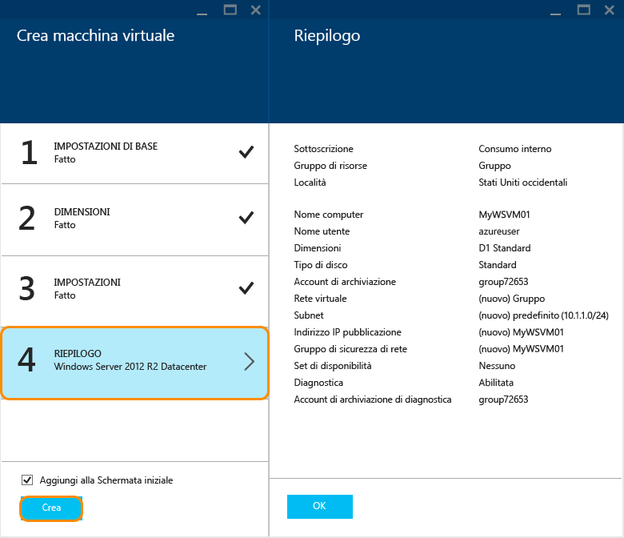

<properties
	pageTitle="Creare una macchina virtuale che esegue Windows nel portale di anteprima di Azure | Microsoft Azure"
	description="Informazioni su come creare una macchina virtuale di Azure che esegue Windows usando Azure Marketplace nel portale di anteprima di Azure"
	services="virtual-machines"
	documentationCenter=""
	authors="cynthn"
	manager="timlt"
	editor=""
	tags="azure-resource-manager"/>
<tags
	ms.service="virtual-machines"
	ms.workload="infrastructure-services"
	ms.tgt_pltfrm="vm-windows"
	ms.devlang="na"
	ms.topic="hero-article"
	ms.date="08/14/2015"
	ms.author="cynthn"/>

# Creare una macchina virtuale che esegue Windows nel portale di anteprima di Azure#

> [AZURE.SELECTOR]
- [Azure preview portal](virtual-machines-windows-tutorial.md)
- [Azure portal](virtual-machines-windows-tutorial-classic-portal.md)
- [PowerShell: Resource Manager deployment](virtual-machines-deploy-rmtemplates-powershell.md)
- [PowerShell: Classic deployment](virtual-machines-ps-create-preconfigure-windows-vms.md)

 [AZURE.INCLUDE [learn-about-deployment-models](../../includes/learn-about-deployment-models-rm-include.md)]Modello di distribuzione classica.

Questa esercitazione illustra come è facile creare una macchina virtuale di Azure in pochi minuti nel portale di anteprima di Azure. Verrà usata un'immagine Windows Server 2012 R2 Datacenter come esempio per creare la macchina virtuale, ma è solo una delle molte immagini offerte da Azure. Le opzioni relative all'immagine dipendono dalla sottoscrizione. Ad esempio, gli abbonati MSDN possono usufruire di immagini desktop.

È inoltre possibile creare macchine virtuali usando le proprie immagini, con modelli di Gestione risorse o con strumenti di automazione. Per altre informazioni sui diversi metodi, vedere [Diversi modi per creare una macchina virtuale Windows](virtual-machines-windows-choices-create-vm.md).

Questa esercitazione usa il modello di distribuzione di Gestione risorse per creare la macchina virtuale. È consigliabile usare questo modello anziché il modello di distribuzione classico, che si basa sulle API di gestione dei servizi. Per altre informazioni su Gestione risorse, vedere [Panoramica di Gestione risorse di Microsoft Azure](resource-group-overview.md). Per altre informazioni sui vantaggi derivanti dall'uso di Gestione risorse per le macchine virtuali, vedere [Provider di calcolo, rete e di archiviazione in Gestione risorse di Microsoft Azure](virtual-machines-azurerm-versus-azuresm.md).

[AZURE.INCLUDE [free-trial-note](../../includes/free-trial-note.md)]

## Procedura dettagliata video

Di seguito è riportata una procedura dettagliata di questa esercitazione.

[AZURE.VIDEO create-a-virtual-machine-running-windows-in-the-azure-preview-portal]

## Selezionare l'immagine

1. Accedere al portale di anteprima di Azure.

2. Nel menu Hub fare clic su **Nuovo** > **Calcolo** > **Windows Server 2012 R2 Datacenter**.

	

	>[AZURE.TIP]Per individuare immagini aggiuntive, fare clic su **Marketplace**, quindi eseguire una ricerca o applicare un filtro per gli elementi disponibili.

3. Nella pagina **Windows Server 2012 R2 Datacenter** fare clic su **Gestione risorse** in **Selezionare un modello di distribuzione**. Fare clic su **Crea**.

	

## Creare la macchina virtuale

Dopo aver selezionato l'immagine, è possibile usare le impostazioni predefinite di Azure per quasi tutto il processo di configurazione e creare rapidamente la macchina virtuale.

1. Nel pannello **Crea macchina virtuale**, fare clic su **Informazioni di base**. Immettere un **Nome** per la macchina virtuale, il **Nome utente** amministrativo e una **Password** complessa. Se si hanno più sottoscrizioni, specificare quella per la nuova macchina virtuale, un **Gruppo di risorse** nuovo o esistente e la **Località** per il data center di Azure.

	

	>[AZURE.NOTE]**Nome utente** indica l'account amministrativo da usare per la gestione del server. Creare una password difficile da scoprire, ma facile da ricordare. **Il nome utente e la password serviranno per accedere alla macchina virtuale**.

2. Fare clic su **Dimensioni** e selezionare le dimensioni di macchina virtuale appropriate in base alle proprie esigenze. Ogni dimensione specifica il numero di core di calcolo, la memoria e altre funzionalità, come il supporto per Archiviazione Premium, che influiranno sul prezzo. Azure consiglia determinate dimensioni automaticamente a seconda dell'immagine scelta.

	

	>[AZURE.NOTE]Il servizio di archiviazione Premium è disponibile per le macchine virtuali della serie DS in alcune aree. Il servizio di archiviazione Premium è la migliore opzione di archiviazione per i carichi di lavoro con utilizzo intensivo, come ad esempio un database. Per ulteriori informazioni, vedere [Archiviazione Premium: archiviazione ad alte prestazioni per carichi di lavoro delle macchine virtuali di Azure](storage-premium-storage-preview-portal.md).

3. Fare clic su **Impostazioni** per visualizzare le impostazioni di archiviazione e di rete per la nuova macchina virtuale. Per la prima macchina virtuale è in genere possibile accettare le impostazioni predefinite. Se sono state selezionate dimensioni di macchina virtuale che lo supportano, è possibile provare il servizio Archiviazione Premium selezionando **Premium (SSD)** in **Tipo di disco**.

	

6. Fare clic su **Riepilogo** per esaminare le scelte di configurazione. Al termine della revisione o dell'aggiornamento delle impostazioni, fare clic su **Crea**.

	

8. Mentre Azure crea la macchina virtuale, è possibile tenere traccia dello stato di avanzamento in **Notifiche** nel menu Hub. Dopo che Azure ha creato la macchina virtuale, quest'ultima verrà visualizzata nella schermata iniziale, a meno che non sia stata deselezionata l'opzione **Aggiungi alla Schermata iniziale** nel pannello **Crea macchina virtuale**.

## Accesso alla macchina virtuale

Dopo aver creato la macchina virtuale, sarà possibile accedervi per gestire le impostazioni e le applicazioni che verranno eseguite al suo interno.

>[AZURE.NOTE]Per informazioni sui requisiti e suggerimenti per la risoluzione dei problemi, vedere [Connettersi a una macchina virtuale di Azure con RDP o SSH](https://msdn.microsoft.com/library/azure/dn535788.aspx).

1. Accedere al portale di anteprima di Azure se questa operazione non è già stata eseguita.

2. Fare clic sulla macchina virtuale nella Schermata iniziale. Per trovarla, fare clic su **Esplora tutto** > **Recenti** o **Esplora tutto** > **Macchine virtuali**. Selezionare quindi la macchina virtuale dall'elenco.

3. Nel pannello della macchina virtuale fare clic su **Connetti**.

	

4. Fare clic su **Apri** per usare il file RDP (Remote Desktop Protocol) creato automaticamente per la macchina virtuale Windows Server.

5. Fare clic su **Connetti**.

6. Digitare il nome utente e la password impostati al momento della creazione della macchina virtuale e quindi fare clic su **OK**.

7. Fare clic su **Yes** per verificare l'identità della macchina virtuale.

	È ora possibile lavorare con la macchina virtuale nello stesso modo in cui lo si farebbe con qualsiasi altro server.

## Passaggi successivi

* Usare Azure PowerShell e l'interfaccia della riga di comando di Azure per [Trovare e selezionare le immagini delle macchine virtuali](resource-groups-vm-searching.md).
* Automatizzare la gestione e la distribuzione della macchina virtuale e del carico di lavoro con [Gestione risorse di Azure](virtual-machines-how-to-automate-azure-resource-manager.md) e i [Modelli di avvio rapido di Azure](http://azure.microsoft.com/documentation/templates/).

<!---HONumber=Nov15_HO3-->