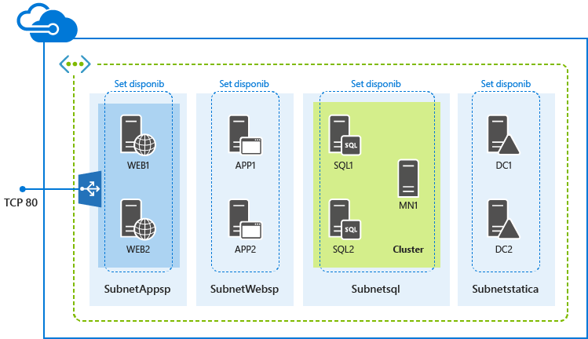

<properties
	pageTitle="Distribuzione delle farm di SharePoint con i modelli di Gestione risorse di Azure"
	description="Distribuire facilmente una farm di SharePoint a tre o nove server con modelli di gestione delle risorse e il portale Azure Preview, Azure PowerShell o Azure CLI."
	services="virtual-machines"
	documentationCenter=""
	authors="davidmu1"
	manager="timlt"
	editor=""
	tags="azure-resource-manager"/>

<tags
	ms.service="virtual-machines"
	ms.workload="infrastructure-services"
	ms.tgt_pltfrm="vm-windows-sharepoint"
	ms.devlang="na"
	ms.topic="hero-article"
	ms.date="06/29/2015"
	ms.author="davidmu"/>

# Distribuzione delle farm di SharePoint con i modelli di Gestione risorse di Azure

Utilizzare le istruzioni riportate in questo articolo per distribuire una nuova farm di SharePoint Server 2013 a tre o nove server utilizzando i modelli di gestione risorse.

## Distribuire una farm di SharePoint a tre server

Per una farm di SharePoint Server 2013 base, un modello di gestione risorse crea tre macchine virtuali in una nuova rete virtuale in tre diverse subnet.

È possibile eseguire il modello con il portale di anteprima di Azure, Azure PowerShell, o con Azure CLI.

### Portale di anteprima di Azure

Per distribuire il carico di lavoro utilizzando un modello di gestione delle risorse e il portale di anteprima di Azure, fare clic [qui](https://portal.azure.com/#create/Microsoft.Template/uri/https%3A%2F%2Fraw.githubusercontent.com%2FAzure%2Fazure-quickstart-templates%2Fmaster%2Fsharepoint-three-vm%2Fazuredeploy.json).

1.	Per il riquadro**Modello**, fare clic su **Salva**.
2.	Fare clic su **Parametri**. Nel riquadro**Parametri** immettere nuovi valori, selezionare dai valori consentiti o accettare i valori predefiniti e quindi fare clic su **OK**.
3.	Se necessario, fare clic su **Sottoscrizione** e selezionare la sottoscrizione di Azure corretta.
4.	Fare clic su **Gruppo di risorse** e selezionare un gruppo di risorse esistente. In alternativa, fare clic su **O crea nuovi** per creare una nuova istanza per questo carico di lavoro.
5.	Se necessario, fare clic su **Percorso del gruppo di risorse** e selezionare il percorso corretto di Azure.
6.	Se necessario, fare clic su **Note legali** per esaminare i termini e il contratto di utilizzo del modello.
7.	Fare clic su **Crea**.

A seconda del modello, la compilazione del carico di lavoro richiede tempi diversi. Al termine, si disporrà di una nuova farm di SharePoint a tre server nel gruppo di risorse nuove o esistenti.

### Azure PowerShell

Prima di iniziare, accertarsi di avere la versione corretta di Azure PowerShell installata, di avere effettuato l'accesso e di avere impostato la nuova modalità di gestione delle risorse. Per informazioni dettagliate, fare clic [qui](virtual-machines-deploy-rmtemplates-powershell.md#setting-up-powershell-for-resource-manager-templates).

Inserire un nome per la distribuzione di Azure, un nuovo nome gruppo di risorse e la posizione del data center di Azure, nel seguente set di comandi. Rimuovere tutti gli elementi all'interno delle virgolette, inclusi i caratteri < and >.

	$deployName="<deployment name>"
	$RGName="<resource group name>"
	$locName="<Azure location, such as West US>"
	$templateURI="https://raw.githubusercontent.com/Azure/azure-quickstart-templates/master/sharepoint-three-vm/azuredeploy.json"
	New-AzureResourceGroup -Name $RGName -Location $locName
	New-AzureResourceGroupDeployment -Name $deployName -ResourceGroupName $RGName -TemplateUri $templateURI

Di seguito è fornito un esempio.

	$deployName="TestDeployment"
	$RGName="TestRG"
	$locname="West US"
	$templateURI="https://raw.githubusercontent.com/Azure/azure-quickstart-templates/master/sharepoint-three-vm/azuredeploy.json"
	New-AzureResourceGroup -Name $RGName -Location $locName
	New-AzureResourceGroupDeployment -Name $deployName -ResourceGroupName $RGName -TemplateUri $templateURI

Successivamente, eseguire il blocco di comandi nel prompt di Azure PowerShell.

Quando si esegue il comando **New-AzureResourceGroupDeployment**, verrà richiesto di fornire i valori per una serie di parametri. Dopo aver specificato tutti i valori dei parametri, **New-AzureResourceGroupDeployment** crea e configura le macchine virtuali.

Al termine, si disporrà di una nuova farm di SharePoint a tre server nel gruppo di risorse nuove.

### Interfaccia della riga di comando di Azure

Prima di iniziare, accertarsi di avere la versione corretta di Azure CLI installata, di avere effettuato l'accesso e di avere impostato la nuova modalità di gestione delle risorse. Per informazioni dettagliate, fare clic [qui](virtual-machines-deploy-rmtemplates-azure-cli.md#getting-ready).

Per prima cosa, creare un nuovo gruppo di risorse. Utilizzare il seguente comando e specificare il nome del gruppo e la posizione del data center di Azure in cui si desidera distribuire.

	azure group create <group name> <location>

Successivamente, utilizzare il seguente comando e specificare il nome del nuovo gruppo di risorse e il nome di una distribuzione di Azure.

	azure group deployment create --template-uri https://raw.githubusercontent.com/Azure/azure-quickstart-templates/master/sharepoint-three-vm/azuredeploy.json <group name> <deployment name>

Di seguito è fornito un esempio.

	azure group create sp3serverfarm eastus2
	azure group deployment create --template-uri https://raw.githubusercontent.com/Azure/azure-quickstart-templates/master/sharepoint-three-vm/azuredeploy.json sp3serverfarm spdevtest

Quando si esegue il comando **Crea gruppo di distribuzione Azure**, verrà richiesto di fornire i valori per una serie di parametri. Dopo aver specificato i valori dei parametri, Azure crea e configura le macchine virtuali.

Si avrà ora una nuova farm di SharePoint a tre server nel gruppo di risorse nuove.

##Distribuire una farm di SharePoint a nove server

Per una farm di SharePoint Server 2013 ad alta disponibilità, un modello di gestione risorse crea nove macchine virtuali in una nuova rete virtuale in quattro diverse subnet.

### Portale di anteprima di Azure

Per distribuire il carico di lavoro utilizzando un modello di gestione delle risorse e il portale di anteprima di Azure, fare clic [qui](https://portal.azure.com/#create/Microsoft.Template/uri/https%3A%2F%2Fraw.githubusercontent.com%2FAzure%2Fazure-quickstart-templates%2Fmaster%2Fsharepoint-server-farm-ha%2Fazuredeploy.json).

1.	Per il riquadro **Modello**, fare clic su **Salva**.
2.	Fare clic su **Parametri**. Nel riquadro **Parametri**, immettere nuovi valori, selezionare dai valori consentiti o accettare i valori predefiniti, quindi fare clic su **OK**.
3.	Se necessario, fare clic su **Sottoscrizione** e selezionare la sottoscrizione di Azure corretta.
4.	Fare clic su **Gruppo di risorse** e selezionare un gruppo di risorse esistente. In alternativa, fare clic su **O crea nuovi** per creare una nuova istanza per questo carico di lavoro.
5.	Se necessario, fare clic su **Percorso del gruppo di risorse** e selezionare il percorso corretto di Azure.
6.	Se necessario, fare clic su Note legali per esaminare i termini e il contratto per l'utilizzo del modello.
7.	Fare clic su **Create**.

A seconda del modello, la compilazione del carico di lavoro richiede tempi diversi. Al termine, si disporrà di una nuova farm di SharePoint a nove server nel gruppo di risorse nuove o esistenti.

### Azure PowerShell

Prima di iniziare, accertarsi di avere la versione corretta di Azure PowerShell installata, di avere effettuato l'accesso e di avere impostato la nuova modalità di gestione delle risorse. Per informazioni dettagliate, fare clic [qui](virtual-machines-deploy-rmtemplates-powershell.md#setting-up-powershell-for-resource-manager-templates).

Inserire un nome per la distribuzione di Azure, un nuovo nome gruppo di risorse e la posizione del data center di Azure, nel seguente set di comandi. Rimuovere tutti gli elementi all'interno delle virgolette, inclusi i caratteri < and >.

	$deployName="<deployment name>"
	$RGName="<resource group name>"
	$locName="<Azure location, such as West US>"
	$templateURI="https://raw.githubusercontent.com/Azure/azure-quickstart-templates/master/sharepoint-server-farm-ha/azuredeploy.json"
	New-AzureResourceGroup -Name $RGName -Location $locName
	New-AzureResourceGroupDeployment -Name $deployName -ResourceGroupName $RGName -TemplateUri $templateURI

Di seguito è fornito un esempio.

	$deployName="TestDeployment"
	$RGName="TestRG"
	$locname="West US"
	$templateURI="https://raw.githubusercontent.com/Azure/azure-quickstart-templates/master/sharepoint-server-farm-ha/azuredeploy.json"
	New-AzureResourceGroup -Name $RGName -Location $locName
	New-AzureResourceGroupDeployment -Name $deployName -ResourceGroupName $RGName -TemplateUri $templateURI

Successivamente, eseguire il blocco di comandi nel prompt di Azure PowerShell.

Quando si esegue il comando **New-AzureResourceGroupDeployment**, verrà richiesto di fornire i valori per una serie di parametri. Dopo aver specificato tutti i valori dei parametri, **New-AzureResourceGroupDeployment** crea e configura le macchine virtuali.

Al termine, si disporrà di una nuova farm di SharePoint a nove server nel gruppo di risorse nuove.

### Interfaccia della riga di comando di Azure

Prima di iniziare, accertarsi di avere la versione corretta di Azure CLI installata, di avere effettuato l'accesso e di avere impostato la nuova modalità di gestione delle risorse. Per informazioni dettagliate, fare clic [qui](virtual-machines-deploy-rmtemplates-azure-cli.md#getting-ready).

Fare clic su Crea un nuovo gruppo di risorse. Utilizzare il seguente comando e specificare il nome del gruppo e la posizione del data center di Azure in cui si desidera distribuire.

	azure group create <group name> <location>

Successivamente, utilizzare il seguente comando e specificare il nome del nuovo gruppo di risorse e il nome di una distribuzione di Azure.

	azure group deployment create --template-uri https://raw.githubusercontent.com/Azure/azure-quickstart-templates/master/sharepoint-server-farm-ha/azuredeploy.json <group name> <deployment name>

Di seguito è fornito un esempio.

	azure group create sphaserverfarm eastus2
	azure group deployment create --template-uri https://raw.githubusercontent.com/Azure/azure-quickstart-templates/master/sharepoint-server-farm-ha/azuredeploy.json sphaserverfarm spdevtest

Quando si esegue il comando **Crea gruppo di distribuzione Azure**, verrà richiesto di fornire i valori per una serie di parametri. Dopo aver specificato i valori dei parametri, Azure crea e configura le macchine virtuali.

Al termine, si disporrà di una nuova farm di SharePoint Server 2013 a nove server nel gruppo di risorse nuove.

## Risorse aggiuntive

[Distribuzione e gestione delle macchine virtuali utilizzando i modelli di Gestione risorse di Azure e Azure PowerShell](virtual-machines-deploy-rmtemplates-powershell.md)

[Provider di calcolo, rete e archiviazione in Gestione risorse di Microsoft Azure](virtual-machines-azurerm-versus-azuresm.md)

[Panoramica di Gestione risorse di Microsoft Azure](../resource-group-overview.md)

[Distribuzione e gestione delle macchine virtuali utilizzando i modelli di Gestione risorse di Azure e l'interfaccia della riga di comando di Azure](virtual-machines-deploy-rmtemplates-azure-cli.md)

[Macchine virtuali - Documentazione](http://azure.microsoft.com/documentation/services/virtual-machines/)

[Come installare e configurare Azure PowerShell](../install-configure-powershell.md)

<!---HONumber=August15_HO6-->