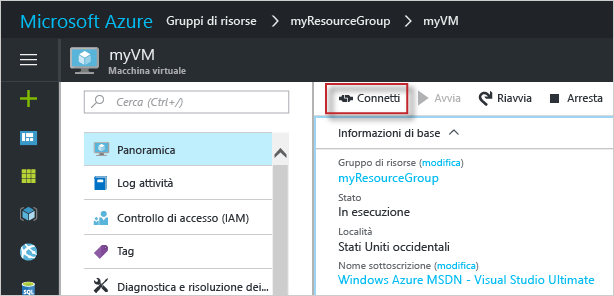

# <a name="create-a-windows-virtual-machine-with-the-azure-portal"></a>Creare una macchina virtuale Windows con il portale di Azure

È possibile creare macchine virtuali di Azure tramite il portale di Azure. Questo metodo fornisce un'interfaccia utente basata sul browser per la creazione e la configurazione delle macchine virtuali e di tutte le risorse correlate. Questa guida introduttiva illustra la creazione di una macchina virtuale e l'installazione di un server Web nella VM.

Se non si ha una sottoscrizione di Azure, creare un [account gratuito](https://azure.microsoft.com/free/?WT.mc_id=A261C142F) prima di iniziare.

## <a name="log-in-to-azure"></a>Accedere ad Azure

Accedere al portale di Azure all'indirizzo http://portal.azure.com.

## <a name="create-virtual-machine"></a>Crea macchina virtuale

1. Fare clic sul pulsante **Nuovo** nell'angolo superiore sinistro del portale di Azure.

2. Nel pannello **Calcolo** selezionare **Windows Server 2016 Datacenter** e verificare che sia selezionato il modello di distribuzione **Resource Manager**. Selezionare il pulsante **Create** . 

3. Immettere le informazioni relative alla macchina virtuale. Il nome utente e la password immessi in questo modulo verranno usati per accedere alla macchina virtuale. Al termine fare clic su **OK**.

      

4. Selezionare una dimensione per la VM. Per visualizzare altre dimensioni, selezionare **Visualizza tutto** o modificare il filtro **Supported disk type** (Tipo di disco supportato). 

      

5. Nel pannello delle impostazioni selezionare **Sì** in **Usa dischi gestiti**, mantenere i valori predefiniti per le altre impostazioni e fare clic su **OK**.

6. Nella pagina del riepilogo fare clic su **OK** per avviare la distribuzione della macchina virtuale.

7. La macchina virtuale verrà aggiunta al dashboard del portale di Azure. Una volta completata la distribuzione verrà automaticamente aperto il pannello di riepilogo della macchina virtuale.


## <a name="connect-to-virtual-machine"></a>Connettersi alla macchina virtuale

Creare una connessione Desktop remoto alla macchina virtuale.

1. Fare clic sul pulsante **Connetti** nelle proprietà della macchina virtuale. Verrà creato e scaricato un file Remote Desktop Protocol, con estensione rdp.

     

2. Per connettersi alla VM, aprire il file RDP scaricato. Se richiesto, fare clic su **Connetti**. In Mac, è necessario un client RDP come questo [client Desktop remoto](https://itunes.apple.com/us/app/microsoft-remote-desktop/id715768417?mt=12) disponibile nel Mac App Store.

3. Immettere il nome utente e la password specificati al momento della creazione della macchina virtuale e quindi fare clic su **OK**.

4. Durante il processo di accesso potrebbe essere visualizzato un avviso relativo al certificato. Fare clic su **Sì** o **Continua** per procedere con la connessione.


## <a name="install-iis-using-powershell"></a>Installare IIS tramite PowerShell

Nella macchina virtuale avviare una sessione di PowerShell ed eseguire questo comando per installare IIS.

```powershell
Install-WindowsFeature -name Web-Server -IncludeManagementTools
```

Al termine chiudere la sessione RDP e tornare alle proprietà della macchina virtuale nel portale di Azure.

## <a name="open-port-80-for-web-traffic"></a>Aprire la porta 80 per il traffico Web 

Un gruppo di sicurezza di rete (NSG) consente il traffico in ingresso e in uscita. Quando si crea una VM nel portale di Azure, viene creata una regola in ingresso sulla porta 3389 per le connessioni RDP. Questa VM ospita un server Web, quindi è necessario creare una regola del gruppo di sicurezza di rete per la porta 80.

1. Nella macchina virtuale fare clic sul nome del **gruppo di risorse**.
2. Selezionare il **gruppo di sicurezza di rete**. Il gruppo di sicurezza di rete può essere identificato tramite la colonna **Tipo**. 
3. Nel menu a sinistra fare clic su **Regole di sicurezza in ingresso** in Impostazioni.
4. Fare clic su **Aggiungi**.
5. In **Nome** digitare **http**. Assicurarsi che l'opzione **Intervallo di porte** sia impostata su 80 e l'opzione **Azione** sia impostata su **Consenti**. 
6. Fare clic su **OK**.


## <a name="view-the-iis-welcome-page"></a>Visualizzare la pagina iniziale di IIS

Con IIS installato e la porta 80 aperta per la macchina virtuale, è ora possibile accedere al server Web da Internet. Aprire un Web browser e immettere l'indirizzo IP pubblico della VM. L'indirizzo IP pubblico è indicato nel pannello della macchina virtuale nel portale di Azure.

 

## <a name="clean-up-resources"></a>Pulire le risorse

Quando non serve più, eliminare il gruppo di risorse e tutte le risorse correlate. A tale scopo selezionare il gruppo di risorse nel pannello della macchina virtuale e fare clic su **Elimina**.

## <a name="next-steps"></a>Passaggi successivi

In questa guida introduttiva è stata distribuita una macchina virtuale semplice, è stata creata una regola del gruppo di sicurezza di rete ed è stato installato un server Web. Per altre informazioni sulle macchine virtuali di Azure, passare all'esercitazione per le VM di Windows.

> [!div class="nextstepaction"]
> [Esercitazioni per le macchine virtuali di Windows in Azure](./tutorial-manage-vm.md)

