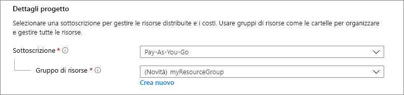
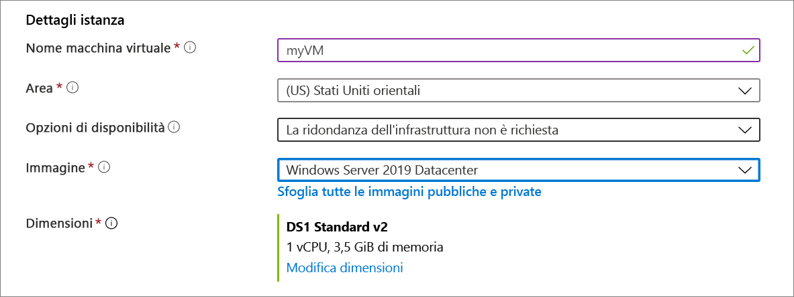
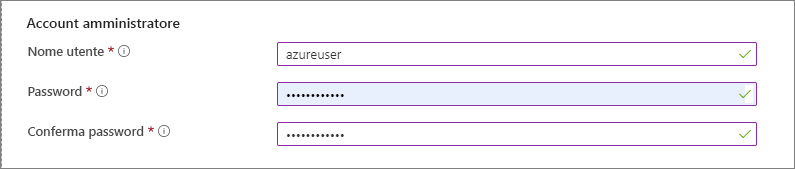
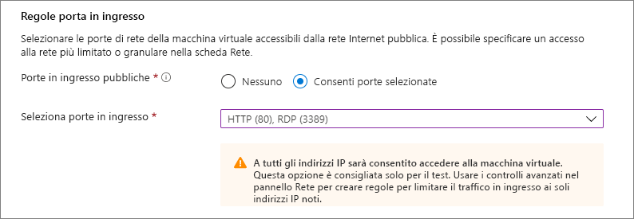
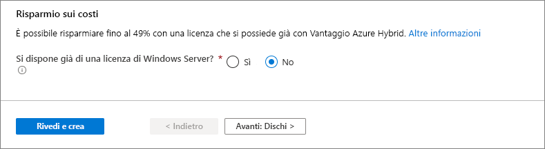
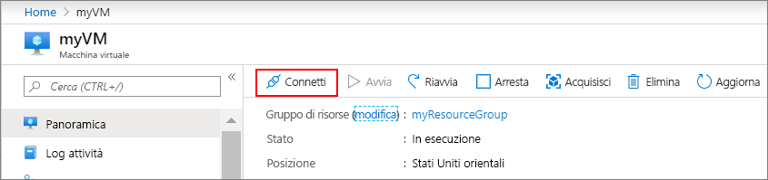

# <a name="quickstart-create-a-windows-virtual-machine-in-the-azure-portal"></a>Guida introduttiva: Creare una macchina virtuale di Windows nel portale di Azure

È possibile creare macchine virtuali di Azure tramite il portale di Azure. Questo metodo fornisce un'interfaccia utente basata su browser per creare le macchine virtuali e le risorse associate. Questa Guida di avvio rapido illustra come usare il portale di Azure per distribuire una macchina virtuale in Azure che esegue Windows Server 2019. Per vedere la macchina virtuale in azione, eseguire RDP nella macchina virtuale e installare il server Web IIS.

Se non si ha una sottoscrizione di Azure, creare un [account gratuito](https://azure.microsoft.com/free/?WT.mc_id=A261C142F) prima di iniziare.

## <a name="sign-in-to-azure"></a>Accedere ad Azure

Accedere al portale di Azure all'indirizzo https://portal.azure.com.

## <a name="create-virtual-machine"></a>Creare macchina virtuale

1. Digitare **macchine virtuali** nella casella di ricerca.
1. In **Servizi** selezionare **Macchine virtuali**.
1. Nella pagina **Macchine virtuali** selezionare **Aggiungi**. 
1. Nella scheda **Nozioni di base**, sotto **Dettagli progetto**, verificare che sia selezionata la sottoscrizione corretta e quindi scegliere **Crea nuovo** gruppo di risorse. Immettere *myResourceGroup* come nome. 

    

1. In **Dettagli istanza** digitare *myVM* nel campo **Nome macchina virtuale**, scegliere *Stati Uniti orientali* come **Area** e quindi scegliere *Windows Server 2019 Datacenter* come valore per **Immagine**. Lasciare invariate le altre impostazioni predefinite.

    

1. In **Account amministratore**, specificare un nome utente, ad esempio *azureuser*, e una password. La password deve contenere almeno 12 caratteri e soddisfare i [requisiti di complessità definiti](faq.md#what-are-the-password-requirements-when-creating-a-vm).

    

1. Sotto **Regole porta in ingresso**, scegliere **Consenti porte selezionate**, quindi selezionare **RDP (3389)** e **HTTP (80)** dall'elenco a discesa.

    

1. Lasciare invariate le impostazioni predefinite rimanenti, quindi selezionare il pulsante **Rivedi e crea** nella parte inferiore della pagina.

    


## <a name="connect-to-virtual-machine"></a>Connettersi alla macchina virtuale

Creare una connessione Desktop remoto alla macchina virtuale. Queste istruzioni spiegano come connettersi alla macchina virtuale da un computer Windows. In un Mac, è necessario un client RDP come questo [client Desktop remoto](https://apps.apple.com/app/microsoft-remote-desktop/id1295203466?mt=12) disponibile nel Mac App Store.

1. Selezionare il pulsante **Connetti** nella pagina di panoramica della macchina virtuale. 

    
    
2. Nella pagina **Connetti a macchina virtuale** mantenere le opzioni predefinite per la connessione con indirizzo IP sulla porta 3389 e fare clic su **Scarica file RDP file**.

2. Aprire il file RDP scaricato e fare clic su **Connetti** quando richiesto. 

3. Nella finestra **Sicurezza di Windows** selezionare **Altre opzioni** e quindi **Usa un altro account**. Digitare il nome utente come **localhost**\\*nomeutente*, immettere la password creata per la macchina virtuale e quindi fare clic su **OK**.

4. Durante il processo di accesso potrebbe essere visualizzato un avviso relativo al certificato. Fare clic su **Sì** o **Continua** per procedere con la connessione.

## <a name="install-web-server"></a>Installare il server Web

Per visualizzare la macchina virtuale in azione, installare il server Web IIS. Aprire un prompt di PowerShell nella VM ed eseguire questo comando:

```powershell
Install-WindowsFeature -name Web-Server -IncludeManagementTools
```

Al termine chiudere la connessione RDP con la macchina virtuale.


## <a name="view-the-iis-welcome-page"></a>Visualizzare la pagina iniziale di IIS

Nel portale, selezionare la macchina virtuale e nella panoramica della macchina virtuale, usare il pulsante **Fare clic per copiare** a destra dell'indirizzo IP per copiarlo e incollarlo in una scheda del browser. Si aprirà la pagina iniziale di IIS predefinita, che avrà il seguente aspetto:


## <a name="clean-up-resources"></a>Pulire le risorse

Quando non servono più, è possibile eliminare il gruppo di risorse, la macchina virtuale e tutte le risorse correlate. 

Selezionare il gruppo di risorse per la macchina virtuale, quindi fare clic su **Elimina**. Confermare il nome del gruppo di risorse da terminare eliminando le risorse.

## <a name="next-steps"></a>Passaggi successivi

In questa guida introduttiva è stata distribuita una macchina virtuale semplice, è stata aperta una porta di rete per il traffico Web ed è stato installato un server Web di base. Per altre informazioni sulle macchine virtuali di Azure, passare all'esercitazione per le VM di Windows.

> [!div class="nextstepaction"]
> [Esercitazioni per le macchine virtuali di Windows in Azure](./tutorial-manage-vm.md)
