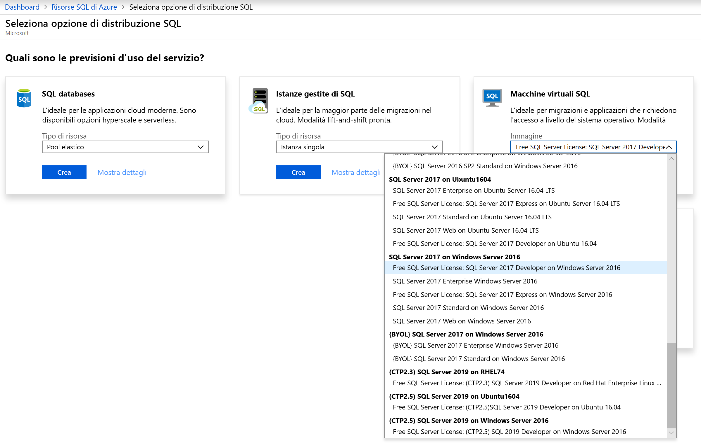
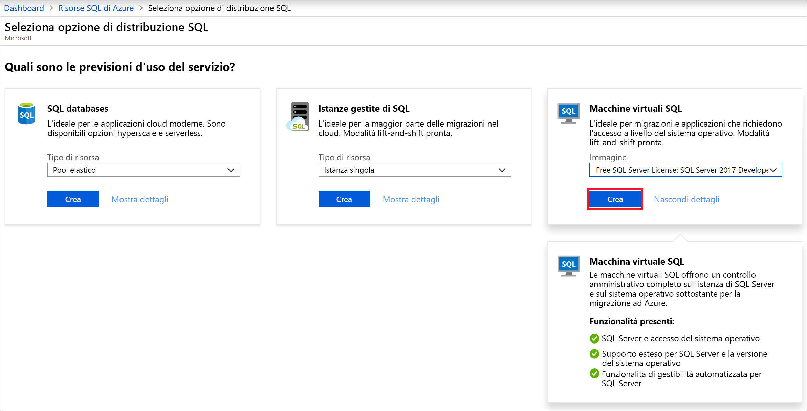
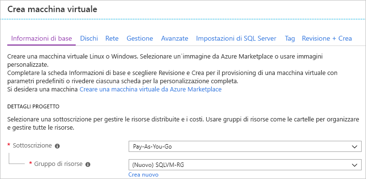
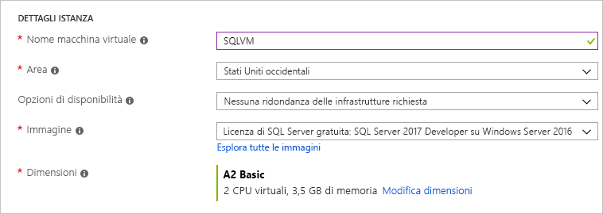
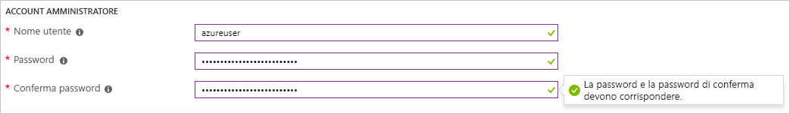
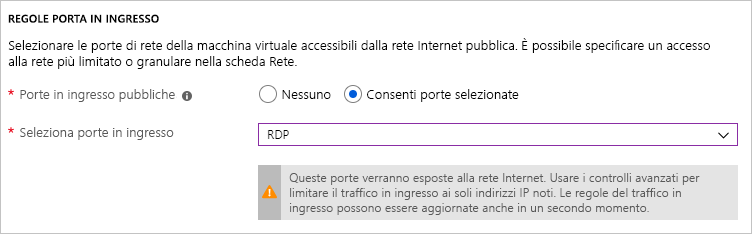
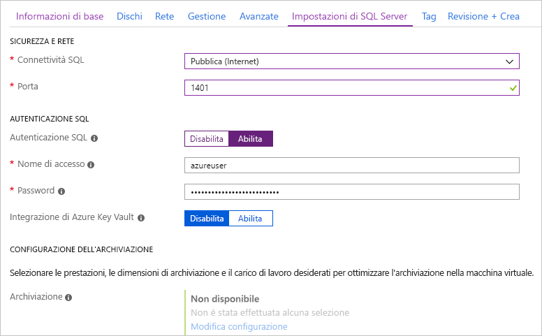

# Guida introduttiva: Creare una macchina virtuale Windows di SQL Server 2017 nel portale di Azure

> [!div class="op_single_selector"]
> * [Windows](quickstart-sql-vm-create-portal.md)
> * [Linux](../../linux/sql/provision-sql-server-linux-virtual-machine.md)

Questa guida introduttiva illustra la creazione di una macchina virtuale di SQL Server nel portale di Azure.

  > [!TIP]
  > - Questa guida introduttiva offre un percorso per effettuare il provisioning e connettersi rapidamente a una macchina virtuale SQL. Per altre informazioni su altre opzioni di provisioning delle macchine virtuali SQL, vedere [Guida al provisioning di macchine virtuali Windows con SQL Server nel portale di Azure](virtual-machines-windows-portal-sql-server-provision.md).
  > - In caso di domande sulle macchine virtuali SQL Server, vedere le [domande frequenti](virtual-machines-windows-sql-server-iaas-faq.md).

##  Ottenere una sottoscrizione di Azure

Se non si ha una sottoscrizione di Azure, creare un [account gratuito](https://azure.microsoft.com/free/?WT.mc_id=A261C142F) prima di iniziare.

##  Selezionare un'immagine di VM di SQL Server

1. Accedere al [portale di Azure](https://portal.azure.com) con il proprio account.

1. Selezionare **Azure SQL** dal menu a sinistra nel portale di Azure. Se **Azure SQL** non è presente nell'elenco, selezionare **Tutti i servizi** e quindi digitare *Azure SQL* nella casella di ricerca.
1. Selezionare **+ Aggiungi** per aprire la pagina di **selezione dell'opzione di distribuzione SQL**. È possibile visualizzare informazioni aggiuntive selezionando **Mostra dettagli** nel riquadro **Macchine virtuali SQL**.
1. Selezionare l'immagine denominata **Licenza gratuita di SQL Server: SQL Server 2017 Developer in Windows Server 2016** dall'elenco a discesa.

   

1. Selezionare **Create** (Crea).

   

##  Specificare i dettagli di base

Nella scheda **Nozioni di base** specificare le informazioni seguenti:

1. Nella sezione **Dettagli progetto** selezionare la sottoscrizione di Azure e quindi selezionare **Crea nuovo** per creare un nuovo gruppo di risorse. Digitare _SQLVM-RG_ come nome.

   

1. In **Dettagli istanza**:
    1. Digitare _SQLVM_ come **nome della macchina virtuale**. 
    1. Scegliere una posizione per l'**area**. 
    1. Ai fini di questa guida di avvio rapido lasciare **Opzioni di disponibilità** impostato su _La ridondanza dell'infrastruttura non è richiesta_. Per altre informazioni sulle opzioni di disponibilità, vedere [Disponibilità](../../windows/availability.md). 
    1. Nell'elenco **Immagine** selezionare _Free SQL Server License: SQL Server 2017 Developer in Windows Server 2016_. 
    1. Scegliere **Modifica dimensioni** per modificare le **dimensioni** della macchina virtuale e selezionare l'offerta **A2 Basic**. Assicurarsi di cancellare le risorse quando non sono più necessarie per evitare eventuali addebiti imprevisti. 

   

1. In **Account amministratore** specificare un nome utente, ad esempio _azureuser_, e una password. La password deve contenere almeno 12 caratteri e soddisfare i [requisiti di complessità definiti](../../windows/faq.md#what-are-the-password-requirements-when-creating-a-vm).

   

1. In **Regole porta in ingresso** scegliere **Consenti porte selezionate**, quindi selezionare **RDP (3389)** dall'elenco a discesa. 

   

## Impostazioni di SQL Server

Nella scheda **Impostazioni di SQL Server** configurare le opzioni seguenti:

1. In **Sicurezza e rete** selezionare _Pubblico (Internet_) per **Connettività SQL** e cambiare la porta in `1401` per evitare di usare un numero di porta noto nello scenario pubblico. 
1. In **Autenticazione SQL** selezionare **Abilita**. L'account di accesso di SQL è impostato sugli stessi nome utente e password configurati per la macchina virtuale. Usare le impostazioni predefinite per [**Integrazione di Azure Key Vault**](virtual-machines-windows-ps-sql-keyvault.md). **Configurazione dell'archiviazione** non è disponibile per l'immagine di VM di SQL Server di base, ma è possibile trovare altre informazioni sulle opzioni disponibili per altre immagini in [Configurazione dell'archiviazione](virtual-machines-windows-sql-server-storage-configuration.md#new-vms).  

   

1. Modificare altre impostazioni, se necessario, e quindi selezionare **Rivedi e crea**. 

   

## Creare la VM di SQL Server

Nella scheda **Rivedi e crea** esaminare il riepilogo e fare clic su **Crea** per creare SQL Server, il gruppo di risorse e le risorse specificati per questa VM.

È possibile monitorare la distribuzione dal portale di Azure. Il pulsante **Notifiche** nella parte superiore della schermata mostra lo stato di base della distribuzione. Questa operazione può richiedere alcuni minuti. 

## Connettersi a SQL Server

1. Nel portale trovare l'**indirizzo IP pubblico** della macchina virtuale SQL Server nella sezione **Panoramica** delle proprietà della macchina virtuale.

1. In un altro computer connesso a Internet aprire [SQL Server Management Studio (SSMS)](/sql/ssms/download-sql-server-management-studio-ssms).

1. Nella finestra di dialogo **Connetti al server** o **Connetti al motore di database** modificare il valore di **Nome server**. Immettere l'indirizzo IP pubblico della macchina virtuale. Aggiungere quindi una virgola e la porta personalizzata, **1401**, specificata durante la configurazione della nuova macchina virtuale. Ad esempio: `11.22.33.444,1401`.

1. Nella casella **Autenticazione** selezionare **Autenticazione di SQL Server**.

1. Nella casella **Accesso** digitare il nome di un account di accesso SQL valido.

1. Nella casella **Password** digitare la password dell'account di accesso.

1. Selezionare **Connessione**.

    

##  Accedere alla macchina virtuale in modalità remota

Seguire questa procedura per connettersi alla macchina virtuale SQL Server con Desktop remoto:

[!INCLUDE [Connect to SQL Server VM with remote desktop](../../../../includes/virtual-machines-sql-server-remote-desktop-connect.md)]

Dopo essersi connessi alla macchina virtuale di SQL Server, è possibile avviare SQL Server Management Studio e connettersi con l'autenticazione di Windows usando le credenziali di amministratore locale. Se è stata abilitata l'autenticazione di SQL Server, è anche possibile connettersi con l'Autenticazione SQL usando l'account di accesso e la password di SQL configurati durante il provisioning.

L'accesso alla macchina virtuale consente di modificare direttamente le impostazioni di SQL Server in base ai requisiti specifici. Ad esempio, è possibile configurare le impostazioni del firewall o modificare le impostazioni di configurazione di SQL Server.

## Pulire le risorse

Se non occorre che la VM di SQL Server sia sempre in esecuzione, è possibile arrestarla quando non è in uso per evitare costi non necessari. È anche possibile eliminare definitivamente tutte le risorse associate alla macchina virtuale eliminando il gruppo di risorse associato nel portale. In questo modo viene eliminata definitivamente anche la macchina virtuale, quindi usare questo comando con cautela. Per altre informazioni, vedere [Gestire le risorse di Azure mediante il portale](../../../azure-resource-manager/manage-resource-groups-portal.md).

## Passaggi successivi

In questa guida di avvio rapido è stata creata una macchina virtuale di SQL Server 2017 nel portale di Azure. Per altre informazioni su come eseguire la migrazione dei dati nella nuova VM di SQL Server, vedere l'articolo seguente.

> [!div class="nextstepaction"]
> [Eseguire la migrazione di un database in una VM di SQL Server](virtual-machines-windows-migrate-sql.md)
