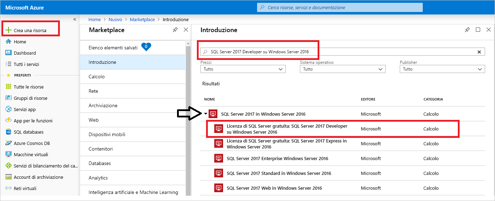
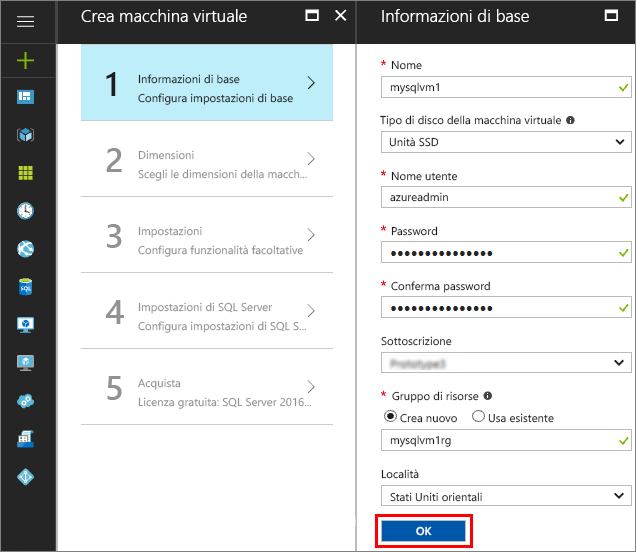
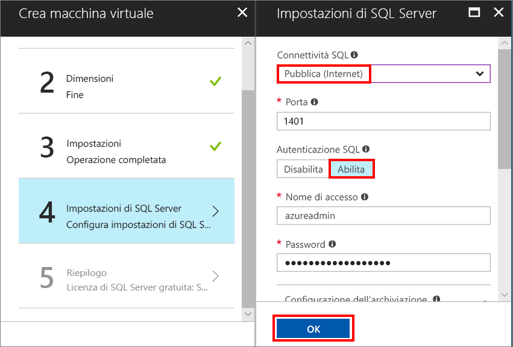
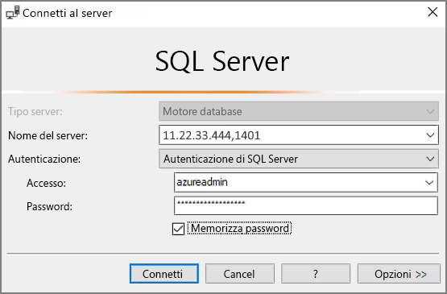

# Creare una macchina virtuale Windows di SQL Server 2017 nel portale di Azure

> [!div class="op_single_selector"]
> * [Windows](quickstart-sql-vm-create-portal.md)
> * [Linux](../../linux/sql/provision-sql-server-linux-virtual-machine.md)

Questa guida introduttiva illustra la creazione di una macchina virtuale di SQL Server nel portale di Azure.

Se non si ha una sottoscrizione di Azure, creare un [account gratuito](https://azure.microsoft.com/free/?WT.mc_id=A261C142F) prima di iniziare.

##  Selezionare un'immagine di VM di SQL Server

1. Accedere al [portale di Azure](https://portal.azure.com) con il proprio account.

1. Nel portale di Azure fare clic su **Nuovo**. Nel portale verrà aperta la finestra **Nuovo**.

1. Nel campo di ricerca digitare **SQL Server 2017 Developer in Windows Server 2016** e premere INVIO.

1. Selezionare l'immagine **Free SQL Server License: SQL Server 2017 Developer on Windows Server 2016** (Licenza gratuita di SQL Server: SQL Server 2017 Developer in Windows Server 2016).

   

   > [!TIP]
   > L'edizione per sviluppatori viene usata in questa esercitazione perché è una versione completa di SQL Serve gratuita a scopo di test per lo sviluppo. Si paga solo il costo dell'esecuzione della macchina virtuale. Per informazioni complete sui prezzi, vedere [Guida ai prezzi per le VM di SQL Server in Azure](virtual-machines-windows-sql-server-pricing-guidance.md).

1. Fare clic su **Crea**.

##  Specificare i dettagli di base

Nella finestra **Informazioni di base** specificare le informazioni seguenti:

1. Nel campo **Nome** immettere un nome univoco per la macchina virtuale. 

1. Nel campo **Nome utente** immettere un nome per l'account amministratore locale nella macchina virtuale.

1. Specificare una **Password**complessa.

1. Immettere un nuovo nome in **Gruppo di risorse**. Questo gruppo è utile per gestire tutte le risorse associate alla macchina virtuale.

1. Verificare le altre impostazioni predefinite e fare clic su **OK** per continuare.

   

## Scegliere le dimensioni della macchina virtuale

Nel passaggio **Dimensioni** scegliere le dimensioni della macchina virtuale nella finestra **Scegli una dimensione**. Inizialmente la finestra visualizza le dimensioni della macchina virtuale consigliate in base all'immagine selezionata. 

1. Fare clic su **Visualizza tutto** per visualizzare tutte le dimensioni di macchine virtuali disponibili.

1. Per questa guida introduttiva selezionare **D2S_V3**. Il portale mostra il costo stimato mensile per la macchina virtuale per l'uso continuo (esclusi i costi di licenza di SQL Server). Si noti che l'edizione Developer non prevede costi aggiuntivi per le licenze per SQL Server. Per informazioni più specifiche sui prezzi, vedere la [pagina dei prezzi](https://azure.microsoft.com/pricing/details/virtual-machines/windows/).

   > [!TIP]
   > Le dimensioni della macchina **D2S_V3** consentono di risparmiare durante i test. Per i carichi di lavoro di produzione, vedere però le dimensioni e la configurazione consigliate per la macchina virtuale in [Procedure consigliate per le prestazioni per SQL Server in Macchine virtuali di Azure](virtual-machines-windows-sql-performance.md).

1. Fare clic su **Seleziona** per continuare.

## Configurare le funzionalità facoltative

Nella finestra **Impostazioni** fare clic su **OK** per selezionare i valori predefiniti.

## Impostazioni di SQL Server

Nella finestra **Impostazioni di SQL Server** configurare le opzioni seguenti.

1. Nell'elenco a discesa **Connettività SQL** selezionare **Pubblico (Internet)**. Questa selezione consente le connessioni di SQL Server tramite Internet.

1. Impostare la **Porta** su **1401** per evitare di usare un nome di porta noto nello scenario pubblico.

1. In **Autenticazione SQL** fare clic su **Abilita**. L'account di accesso di SQL è impostato sugli stessi nome utente e password configurati per la macchina virtuale.

1. Modificare altre impostazioni, se necessario, quindi fare clic su **OK** per completare la configurazione della VM di SQL Server.

   

## Creare la VM di SQL Server

Nella finestra **Riepilogo** esaminare le informazioni e fare clic su **Acquista** per creare l'istanza di SQL Server, il gruppo di risorse e le risorse specificati per questa VM.

È possibile monitorare la distribuzione dal portale di Azure. Il pulsante **Notifiche** nella parte superiore della schermata mostra lo stato di base della distribuzione.

> [!TIP]
> La distribuzione di una VM di SQL Server Windows può richiedere alcuni minuti.

## Connettersi a SQL Server

1. Nel portale trovare l'**indirizzo IP pubblico** della macchina virtuale nella sezione **Panoramica** delle proprietà della macchina virtuale.

1. In un altro computer connesso a Internet aprire SQL Server Management Studio (SSMS).

   > [!TIP]
   > Se SQL Server Management Studio non è installato, è possibile scaricarlo [qui](https://docs.microsoft.com/sql/ssms/download-sql-server-management-studio-ssms).

1. Nella finestra di dialogo **Connetti al server** o **Connetti al motore di database** modificare il valore di **Nome server**. Immettere l'indirizzo IP pubblico della macchina virtuale. Aggiungere quindi una virgola e la porta personalizzata, **1401**, specificata durante la configurazione della nuova macchina virtuale. ad esempio `11.22.33.444,1401`.

1. Nella casella **Autenticazione** selezionare **Autenticazione di SQL Server**.

1. Nella casella **Accesso** digitare il nome di un account di accesso SQL valido.

1. Nella casella **Password** digitare la password dell'account di accesso.

1. Fare clic su **Connect**.

    

##  Accedere alla macchina virtuale in modalità remota

Seguire questa procedura per connettersi alla macchina virtuale SQL Server con Desktop remoto:

[!INCLUDE [Connect to SQL Server VM with remote desktop](../../../../includes/virtual-machines-sql-server-remote-desktop-connect.md)]

Dopo essersi connessi alla macchina virtuale di SQL Server, è possibile avviare SQL Server Management Studio e connettersi con l'autenticazione di Windows usando le credenziali di amministratore locale. Se è stata abilitata l'autenticazione di SQL Server, è anche possibile connettersi con l'Autenticazione SQL usando l'account di accesso e la password di SQL configurati durante il provisioning.

L'accesso alla macchina virtuale consente di modificare direttamente le impostazioni di SQL Server in base ai requisiti specifici. Ad esempio, è possibile configurare le impostazioni del firewall o modificare le impostazioni di configurazione di SQL Server.

## Pulire le risorse

Se non occorre che la VM di SQL Server sia sempre in esecuzione, è possibile arrestarla quando non è in uso per evitare costi non necessari. È anche possibile eliminare definitivamente tutte le risorse associate alla macchina virtuale eliminando il gruppo di risorse associato nel portale. In questo modo viene eliminata definitivamente anche la macchina virtuale, quindi usare questo comando con cautela. Per altre informazioni, vedere [Gestire le risorse di Azure mediante il portale](../../../azure-resource-manager/resource-group-portal.md).

## Passaggi successivi

In questa guida introduttiva sono state illustrate le procedure per creare una macchina virtuale di SQL Server 2017 nel portale di Azure. Per altre informazioni su come eseguire la migrazione dei dati nella nuova VM di SQL Server, vedere l'articolo seguente.

> [!div class="nextstepaction"]
> [Eseguire la migrazione di un database in una VM di SQL Server](virtual-machines-windows-migrate-sql.md)
