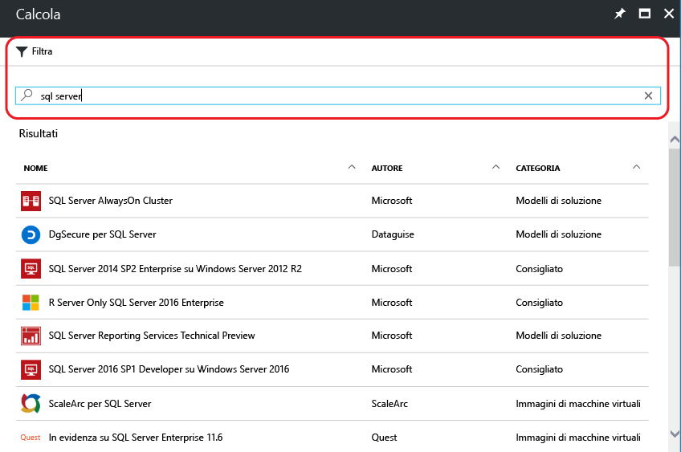
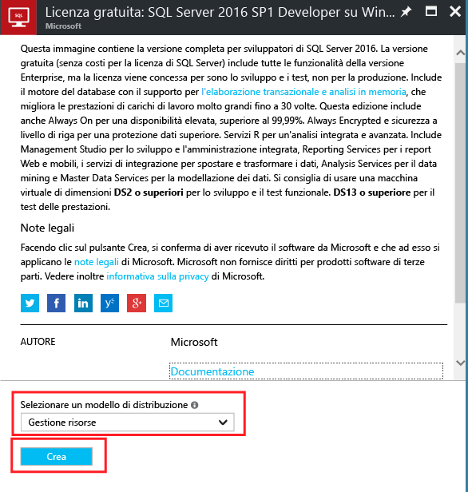
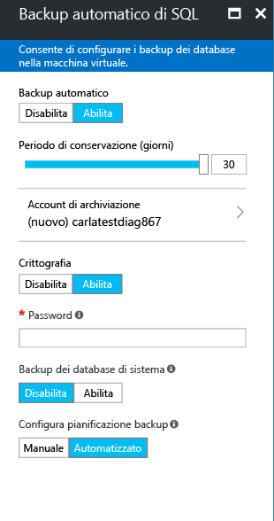

# Effettuare il provisioning di una macchina virtuale di SQL Server nel portale di Azure
> [!div class="op_single_selector"]
> * [Portale](virtual-machines-windows-portal-sql-server-provision.md)
> * [PowerShell](virtual-machines-windows-ps-sql-create.md)
> 
> 

Questa esercitazione end-to-end mostra come usare il portale di Azure per effettuare il provisioning di una macchina virtuale che esegue SQL Server.

La raccolta di macchine virtuali (VM) di Azure include numerose immagini che contengono Microsoft SQL Server. Sono sufficienti pochi clic per selezionare una delle immagini di VM di SQL dalla raccolta ed effettuarne il provisioning nell'ambiente Azure.

In questa esercitazione si apprenderà come:

* [Selezionare un'immagine di VM di SQL dalla raccolta](#select-a-sql-vm-image-from-the-gallery)
* [Configurare e creare la macchina virtuale](#configure-the-vm)
* [Aprire la macchina virtuale tramite Desktop remoto](#open-the-vm-with-remote-desktop)
* [Connettersi a SQL Server in modalità remota](#connect-to-sql-server-remotely)

## Selezionare un'immagine di VM di SQL dalla raccolta
1. Accedere al [portale di Azure](https://portal.azure.com) con il proprio account.
   
   > [!NOTE]
   > Se non si dispone di un account Azure, provare la [versione di valutazione gratuita di Azure](https://azure.microsoft.com/pricing/free-trial/).
   > 
   > 
2. Nel portale di Azure fare clic su **Nuovo**. Nel portale verrà aperto il pannello **Nuovo** . Le risorse di VM di SQL Server si trovano nel gruppo **Calcolo** del Marketplace.
3. Nel pannello **Nuovo** fare clic su **Calcolo** e quindi su **Visualizza tutto**.
4. Nella casella di testo **Filtro** digitare SQL Server, quindi premere il tasto INVIO.

   

5. Esaminare le immagini di SQL Server disponibili. Ogni immagine identifica una versione di SQL Server e un sistema operativo. 
6. Selezionare l'immagine per sviluppatori di SQL Server 2016 SP1 su Windows Server 2016.

   > [!TIP]
   > L'edizione per sviluppatori viene usata in questa esercitazione perché è una versione completa di SQL Serve gratuita a scopo di test per lo sviluppo. Si paga solo il costo dell'esecuzione della macchina virtuale.
   
   > [!NOTE]
   > Le immagini VM di SQL includono i costi di licenza per SQL Server nei prezzi al minuto della VM creata (ad eccezione delle versioni Developer ed Express). SQL Server per sviluppatori è gratuito per sviluppo/test (non per la produzione), mentre SQL Express è gratuito per carichi di lavoro leggeri (inferiori a 1 GB di memoria e a 10 GB di archiviazione). Esiste un'altra opzione per Bring Your Own License (BYOL) e il pagamento della sola VM. Tali nomi di immagine hanno il prefisso {BYOL}. Per altre informazioni su questa opzione, vedere [Panoramica di SQL Server in macchine virtuali di Azure](virtual-machines-windows-sql-server-iaas-overview.md).
   > 
   > 
7. In **Selezionare un modello di distribuzione** assicurarsi che l'opzione **Resource Manager** sia selezionata. Resource Manager è il modello di distribuzione consigliato per le nuove macchine virtuali. Fare clic su **Crea**.
   
    

## Configurare la VM
Sono disponibili cinque pannelli per la configurazione di una macchina virtuale di SQL Server.

| Passaggio | Descrizione |
| --- | --- |
| **Nozioni di base** |[Configurare le impostazioni di base](#1-configure-basic-settings) |
| **Dimensione** |[Scegliere le dimensioni della macchina virtuale](#2-choose-virtual-machine-size) |
| **Impostazioni** |[Configurare le funzionalità facoltative](#3-configure-optional-features) |
| **Impostazioni di SQL Server** |[Configurare le impostazioni di SQL Server](#4-configure-sql-server-settings) |
| **Riepilogo** |[Esaminare il riepilogo](#5-review-the-summary) |

## 1. Configurare le impostazioni di base
Nel pannello **Nozioni di base** specificare le informazioni seguenti:

* Immettere un **Nome**univoco per la macchina virtuale.
* Specificare un **Nome utente** per l'account amministratore locale nella VM. Questo account viene aggiunto anche al ruolo del server fisso **sysadmin** di SQL Server.
* Specificare una **Password**complessa.
* Se sono disponibili più sottoscrizioni, verificare che la sottoscrizione sia corretta per la nuova VM.
* Nella casella **Gruppo di risorse** digitare un nome per il nuovo gruppo di risorse. In alternativa fare clic su **Usa esistente** per usare un gruppo di risorse esistente. Un gruppo di risorse è una raccolta di risorse correlate in Azure, ovvero macchine virtuali, account di archiviazione, reti virtuali e così via.
  
  > [!NOTE]
  > L'uso di un nuovo gruppo di risorse risulta utile se si stanno solo eseguendo test o se si sta iniziando a usare le distribuzioni di SQL Server in Azure. Dopo aver completato il test, eliminare il gruppo di risorse per eliminare automaticamente la macchina virtuale e tutte le risorse associate a tale gruppo di risorse. Per altre informazioni sui gruppi di risorse, vedere [Panoramica di Azure Resource Manager](../../../azure-resource-manager/resource-group-overview.md).
  > 
  > 
* Selezionare una **Località** per la distribuzione.
* Fare clic su **OK** per salvare le impostazioni.
  
    

## 2. Scegliere le dimensioni della macchina virtuale
Nel passaggio **Dimensioni** scegliere le dimensioni della macchina virtuale nel pannello **Scegli una dimensione**. Inizialmente il pannello visualizza le dimensioni della macchina virtuale consigliate in base all'immagine selezionata.

> [!IMPORTANT]
> Il costo mensile stimato visualizzato nel pannello **Scegli una dimensione** non include i costi di licenza di SQL Server, ma solo il costo della VM. Per le edizioni Express e Developer di SQL Server, si tratta del costo stimato totale. Per altre edizioni, vedere la [pagina dei prezzi delle macchine virtuali Windows](https://azure.microsoft.com/pricing/details/virtual-machines/windows/) e selezionare l'edizione di SQL Server di interesse. 

Per carichi di lavoro di produzione, è consigliabile selezionare dimensioni della macchina virtuale che supportino [Archiviazione Premium](../../../storage/storage-premium-storage.md). Se questo livello di prestazioni non è necessario, usare il pulsante **Visualizza tutto** per visualizzare tutte le opzioni relative alle dimensioni della macchina virtuale. Ad esempio, è possibile usare dimensioni di macchine virtuali minori per un ambiente di sviluppo o di test.

> [!NOTE]
> Per altre informazioni sulle dimensioni di macchine virtuali, vedere [Dimensioni delle macchine virtuali](../sizes.md?toc=%2fazure%2fvirtual-machines%2fwindows%2ftoc.json). Per considerazioni sulle dimensioni della VM di SQL Server, vedere [Procedure consigliate per le prestazioni per SQL Server in Macchine virtuali di Azure](virtual-machines-windows-sql-performance.md).
> 
> 

Scegliere le dimensioni della macchina virtuale e quindi fare clic su **Seleziona**.

## 3. Configurare le funzionalità facoltative
Nel pannello **Impostazioni** configurare l'archiviazione di Azure, la rete e il monitoraggio per la macchina virtuale.

* In **Archiviazione** specificare un **Tipo di disco**, ad esempio Standard o Premium (unità SSD). Archiviazione Premium è l'impostazione consigliata per i carichi di lavoro di produzione.

> [!NOTE]
> Se si seleziona l'opzione Premium (SSD) per dimensioni della macchina virtuale che non supportano l'Archiviazione Premium, le dimensioni della macchina virtuale vengono modificate automaticamente.  
> 
> 

* In **Account di archiviazione**è possibile accettare il nome dell'account di archiviazione di cui viene effettuato il provisioning automaticamente. È anche possibile fare clic su **Account di archiviazione** per scegliere un account esistente e configurare il tipo di account di archiviazione. Per impostazione predefinita, Azure crea un nuovo account di archiviazione con archiviazione con ridondanza locale. Per altre informazioni sulle opzioni di archiviazione, vedere [Replica di Archiviazione di Azure](../../../storage/storage-redundancy.md).
* In **Rete**è possibile accettare i valori popolati automaticamente. È anche possibile fare clic sulle singole funzionalità per configurare manualmente la **Rete virtuale**, la **Subnet**, l'**Indirizzo IP pubblico** e il **Gruppo di sicurezza di rete**. Ai fini di questa esercitazione, è possibile mantenere i valori predefiniti.
* Azure abilita l'opzione **Monitoraggio** per impostazione predefinita con lo stesso account di archiviazione designato per la VM. Queste impostazioni possono essere modificate qui, se necessario.
* In **Set di disponibilità**specificare un set di disponibilità. Ai fini di questa esercitazione, è possibile selezionare **nessuno**. Se si prevede di impostare i gruppi di disponibilità SQL AlwaysOn, configurare la disponibilità per evitare di ricreare la macchina virtuale.  Per altre informazioni, vedere [Gestione della disponibilità delle macchine virtuali](../manage-availability.md?toc=%2fazure%2fvirtual-machines%2fwindows%2ftoc.json).

Al termine della configurazione di queste impostazioni, fare clic su **OK**.

## 4. Configurare le impostazioni di SQL Server
Nel pannello **Impostazioni di SQL Server** configurare le impostazioni e le ottimizzazioni specifiche per SQL Server. Le impostazioni che è possibile configurare per SQL Server includono le seguenti:

| Impostazione |
| --- |
| [Connettività](#connectivity) |
| [Autenticazione](#authentication) |
| [Configurazione dell'archiviazione](#storage-configuration) |
| [Applicazione automatica delle patch](#automated-patching) |
| [Backup automatico](#automated-backup) |
| [Integrazione dell'insieme di credenziali delle chiavi di Azure](#azure-key-vault-integration) |
| [Servizi R](#r-services) |

### Connettività
In **Connettività SQL**specificare il tipo di accesso da assegnare all'istanza di SQL Server nella VM. Ai fini di questa esercitazione, selezionare **Pubblica (Internet)** per consentire connessioni a SQL Server da macchine virtuali o servizi su Internet. Se si seleziona questa opzione, Azure configura automaticamente il firewall e il gruppo di sicurezza di rete per consentire il traffico sulla porta 1433.  

Per connettersi a SQL Server tramite Internet, è necessario abilitare anche l'Autenticazione di SQL Server, illustrata nella sezione successiva.

> [!NOTE]
> È possibile aggiungere alla macchina virtuale di SQL Server altre restrizioni relative alle comunicazioni di rete. modificando il gruppo di sicurezza di rete dopo la creazione della VM. Per altre informazioni, vedere [Che cos'è un gruppo di sicurezza di rete](../../../virtual-network/virtual-networks-nsg.md)
> 
> 

Se si preferisce non abilitare le connessioni al motore di database tramite Internet, scegliere una delle opzioni seguenti:

* **Locale (solo all'interno della macchina virtuale)** per consentire le connessioni a SQL Server solo dalla VM.
* **Privata (solo all'interno della rete virtuale)** per consentire le connessioni a SQL Server da computer o servizi nella stessa rete virtuale.

> [!NOTE]
> L'immagine della macchina virtuale per SQL Server Express Edition non abilita automaticamente il protocollo TCP/IP. Lo stesso avviene anche per le opzioni di connettività pubblica e privata. Per Express Edition, è necessario usare Gestione configurazione SQL Server per [abilitare manualmente il protocollo TCP/IP](#configure-sql-server-to-listen-on-the-tcp-protocol) dopo avere creato la VM.
> 
> 

È in genere possibile migliorare la sicurezza scegliendo la connettività più restrittiva consentita dallo scenario specifico. Tutte le opzioni possono essere comunque protette tramite le regole del gruppo di sicurezza di rete e l'Autenticazione di SQL o Windows.

**Portaa** è 1433. ma è possibile specificare un numero di porta diverso.
Per altre informazioni, vedere [Connettersi a una macchina virtuale di SQL Server in Azure (Resource Manager)](virtual-machines-windows-sql-connect.md).

### Autenticazione
Se è necessaria l'autenticazione di SQL Server, fare clic su **Abilita** under **Autenticazione SQL**.

> [!NOTE]
> Se si prevede di accedere a SQL Server tramite Internet, ovvero l'opzione di connettività Pubblica, è necessario abilitare l'autenticazione di SQL in questa area. L'accesso pubblico a SQL Server richiede l'uso dell'autenticazione di SQL.
> 
> 

Se si abilita l'autenticazione di SQL Server, specificare un **Nome di accesso** e una **Password**. Questo nome utente viene configurato come account di accesso di Autenticazione di SQL Server e membro del ruolo del server fisso **sysadmin** . Per altre informazioni sulle modalità di autenticazione, vedere [Scegliere una modalità di autenticazione](http://msdn.microsoft.com/library/ms144284.aspx) .

Se non si abilita l'autenticazione di SQL Server, è possibile usare l'account amministratore locale nella macchina virtuale per connettersi all'istanza di SQL Server.

### Configurazione dell'archiviazione
Fare clic su **Configurazione dell'archiviazione** per specificare i requisiti di archiviazione.

> [!NOTE]
> Se è stata selezionata l'archiviazione Standard, questa opzione non è disponibile. L'ottimizzazione automatica delle risorse di archiviazione è disponibile solo per l'Archiviazione Premium.
> 
> 

È possibile specificare requisiti come operazioni di I/O al secondo, velocità effettiva in Mbps e dimensioni di archiviazione totali. Configurare questi valori usando i dispositivi di scorrimento. Il portale calcola automaticamente il numero di dischi in base a questi requisiti.

Per impostazione predefinita, Azure ottimizza l'archiviazione per 5000 operazioni di I/O al secondo, 200 Mbps e 1 TB di spazio di archiviazione. È possibile modificare queste impostazioni di archiviazione in base al carico di lavoro. In **Ottimizzazione dell'archiviazione**selezionare una delle opzioni seguenti:

* **Generale** : è l'impostazione predefinita e supporta la maggior parte dei carichi di lavoro.
* **Elaborazione transazionale** : ottimizza l'archiviazione per carichi di lavoro OLTP di database tradizionali.
* **Data warehousing** : ottimizza l'archiviazione per i carichi di lavoro di analisi e creazione di report.

> [!NOTE]
> I limiti superiori dei dispositivi di scorrimento dipendono dalle dimensioni selezionate per le macchine virtuali.
> 
> 

### Applicazione automatica delle patch
**Automated patching** è abilitata per impostazione predefinita. Questa opzione consente ad Azure di applicare automaticamente le patch a SQL Server e al sistema operativo. Specificare un giorno della settimana, un'ora e una durata per la finestra di manutenzione. Durante la finestra di manutenzione Azure esegue l'applicazione delle patch. La pianificazione dell'ora, la finestra di manutenzione usa le impostazioni locali della macchina virtuale. Se non si vuole consentire ad Azure di applicare automaticamente le patch per SQL Server e per il sistema operativo, fare clic su **Disabilita**.  

Per altre informazioni, vedere [Applicazione automatica delle patch per SQL Server nelle macchine virtuali di Azure (Resource Manager)](virtual-machines-windows-sql-automated-patching.md).

### Backup automatico
Abilitare i backup automatici dei database per tutti i database in **Backup automatico**. L'opzione Backup automatico è disabilitata per impostazione predefinita.

Quando si abilita il backup automatico di SQL è possibile configurare quanto segue:

* Periodo di conservazione (giorni) per i backup
* Account di archiviazione da usare per i backup
* Opzione di crittografia e password per i backup
* Backup dei database di sistema
* Pianificazione dei backup

Per crittografare il backup, fare clic su **Abilita**. Specificare quindi la **Password**. Azure crea un certificato per crittografare i backup e usa la password specificata per proteggere il certificato.

 Per altre informazioni, vedere [Backup automatizzato per SQL Server in Macchine virtuali di Azure](virtual-machines-windows-sql-automated-backup.md).

### Integrazione dell'insieme di credenziali delle chiavi di Azure
Per archiviare i segreti di sicurezza in Azure per la crittografia, fare clic su **Integrazione dell'insieme di credenziali delle chiavi di Azure** e quindi su **Abilita**.

La tabella seguente include l'elenco dei parametri necessari per configurare l'integrazione dell'insieme di credenziali delle chiavi di Azure.

| PARAMETRO | Descrizione | ESEMPIO |
| --- | --- | --- |
| **URL dell'insieme di credenziali delle chiavi** |Percorso dell'insieme di credenziali delle chiavi. |https://contosokeyvault.vault.azure.net/ |
| **Nome dell'entità** |Nome dell'entità servizio di Azure Active Directory. È detto anche ID client. |fde2b411-33d5-4e11-af04eb07b669ccf2 |
| **Segreto dell'entità** |Nome dell'entità servizio di Azure Active Directory. È detto anche Segreto client. |9VTJSQwzlFepD8XODnzy8n2V01Jd8dAjwm/azF1XDKM= |
| **Nome credenziali** |**Nome della credenziale**: l'integrazione di AKV crea una credenziale all'interno di SQL Server, consentendo alla macchina virtuale di avere accesso all'insieme di credenziali delle chiavi. Scegliere un nome per la credenziale. |mycred1 |

Per altre informazioni, vedere [Configurare l'integrazione dell'insieme di credenziali delle chiavi di Azure per SQL Server in macchine virtuali di Azure (Resource Manager)](virtual-machines-windows-ps-sql-keyvault.md).

Al termine della configurazione delle impostazioni di SQL Server, fare clic su **OK**.

### Servizi R
È possibile abilitare i [servizi R di SQL Server](https://msdn.microsoft.com/library/mt604845.aspx). Questo consente di usare l'analisi avanzata con SQL Server 2016. Fare clic su **Abilita** on the **SQL Server Settings** .

## 5. Esaminare il riepilogo
Nel pannello **Riepilogo** esaminare i dati e fare clic su **OK** per creare SQL Server, il gruppo di risorse e le risorse, in base a quanto specificato per questa VM.

È possibile monitorare la distribuzione dal portale di Azure. Il pulsante **Notifiche** nella parte superiore della schermata mostra lo stato di base della distribuzione.

> [!NOTE]
> Per dare un'idea dei tempi di distribuzione, è stata distribuita una macchina virtuale di SQL nell'area Stati Uniti orientali con le impostazioni predefinite. Il completamento della distribuzione di prova ha richiesto in totale 26 minuti. È possibile che i tempi di distribuzione specifici siano minori o maggiori in base all'area in cui ci si trova e alle impostazioni selezionate.
> 
> 

## Aprire la macchina virtuale tramite Desktop remoto
Seguire questa procedura per connettersi alla macchina virtuale con Desktop remoto:

1. Dopo la creazione della macchina virtuale di Azure, l'icona per la VM viene visualizzata nel dashboard di Azure. È possibile trovarla anche esplorando le macchine virtuali esistenti. Fare clic sulla nuova macchina virtuale di SQL. I relativi dettagli vengono visualizzati nel pannello **Macchina virtuale** .
2. Nella parte superiore del pannello **Macchina virtuale** fare clic su **Connetti**.
3. Il browser scarica un file RDP per la macchina virtuale. Aprire il file RDP.
    
4. La Connessione Desktop remoto invia una notifica che indica che l'autore della connessione remota non può essere identificato. Fare clic su **Connetti** per continuare.
5. Nella finestra di dialogo **Protezione di Windows** fare clic su **Usa un altro account**.
6. In **Nome utente** digitare il **\<nome utente>**, dove <user name> è il nome utente specificato durante la configurazione della VM. È necessario aggiungere una barra rovesciata iniziale prima del nome.
7. Digitare la **Password** configurata in precedenza per questa VM, quindi fare clic su **OK** per connettersi.
8. Se un'altra finestra di dialogo di **Connessione Desktop remoto** richiede se si vuole stabilire la connessione, fare clic su **Sì**.

Dopo essersi connessi alla macchina virtuale di SQL Server, è possibile avviare SQL Server Management Studio e connettersi con l'autenticazione di Windows usando le credenziali di amministratore locale. Se è stata abilitata l'autenticazione di SQL Server, è anche possibile connettersi con l'Autenticazione SQL usando l'account di accesso e la password di SQL configurati durante il provisioning.

L'accesso alla macchina virtuale consente di modificare direttamente le impostazioni di SQL Server in base ai requisiti specifici. Ad esempio, è possibile configurare le impostazioni del firewall o modificare le impostazioni di configurazione di SQL Server.

## Connettersi a SQL Server in modalità remota
In questa esercitazione è stato selezionato l'accesso **Pubblico** per la macchina virtuale ed è stata scelta l'**Autenticazione di SQL Server**. Queste impostazioni hanno configurato automaticamente la macchina virtuale in modo da consentire connessioni a SQL Server da qualsiasi client su Internet, purché abbiano l'account di accesso SQL corretto.

> [!NOTE]
> Se non è stato selezionato Pubblico durante il provisioning, sono necessari altri passaggi per accedere all'istanza di SQL Server tramite Internet. Per altre informazioni, vedere [Connettersi a una macchina virtuale di SQL Server](virtual-machines-windows-sql-connect.md).
> 
> 

Le sezioni seguenti illustrano come connettersi all'istanza di SQL Server nella VM da un computer diverso tramite Internet.

> [!INCLUDE [Connect to SQL Server in a VM Resource Manager](../../../../includes/virtual-machines-sql-server-connection-steps-resource-manager.md)]
> 
> 

## Passaggi successivi
Per altre informazioni sull'uso di SQL Server in Azure, vedere [SQL Server in macchine virtuali di Azure](virtual-machines-windows-sql-server-iaas-overview.md) e le [domande frequenti](virtual-machines-windows-sql-server-iaas-faq.md).

Per una panoramica su SQL Server in Macchine virtuali di Azure, guardare il video [Azure VM is the best platform for SQL Server 2016](https://channel9.msdn.com/Events/DataDriven/SQLServer2016/Azure-VM-is-the-best-platform-for-SQL-Server-2016)(VM di Azure come piattaforma ottimale per SQL Server 2016).

[Esplorare il percorso di apprendimento](https://azure.microsoft.com/documentation/learning-paths/sql-azure-vm/) per SQL Server in macchine virtuali di Azure.

