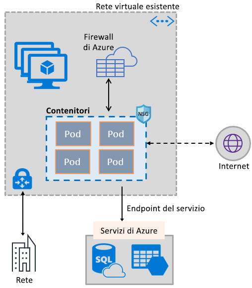
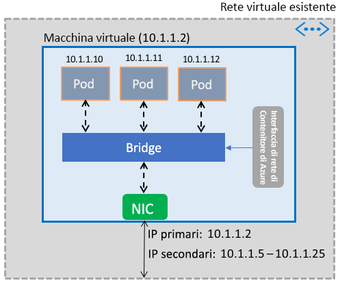

# Abilitare i contenitori per usare le funzionalità di Rete virtuale di Azure

È possibile sfruttare la vasta gamma di funzionalità di rete di Azure nei contenitori, usando lo stesso stack di reti definite dal software (SDN) su cui si basano le macchine virtuali. Il plug-in di interfaccia di rete dei contenitori di Rete virtuale di Azure viene installato in una macchina virtuale di Azure. Il plug-in assegna indirizzi IP da una rete virtuale ai contenitori attivati nella macchina virtuale, collegandoli alla rete virtuale e connettendoli direttamente ad altri contenitori e risorse di rete virtuale. Il plug-in non si basa su reti di overlay, o route, per la connettività e fornisce le stesse prestazioni delle macchine virtuali. A livello generale, il plug-in offre le funzionalità seguenti:

- Un indirizzo IP di rete virtuale viene assegnato a ogni pod, che può essere costituito da uno o più contenitori.
- I pod possono connettersi a reti virtuali con peering e all'ambiente locale tramite ExpressRoute o una VPN da sito a sito. I pod sono raggiungibili anche da reti con peering e locali.
- I pod possono accedere a servizi, ad esempio Archiviazione di Azure e database SQL di Azure, protetti da endpoint servizio di rete virtuale.
- Route e gruppi di sicurezza di rete possono essere applicati direttamente ai pod.
- I pod possono essere posizionati direttamente dietro un servizio di bilanciamento del carico pubblico o interno di Azure, analogamente alle macchine virtuali.
- Ai pod può essere assegnato un indirizzo IP pubblico, per renderli direttamente accessibili da Internet. I pod possono anche accedere a Internet.
- Funziona perfettamente con le risorse Kubernetes, come servizi, controller di ingresso e Kube DNS. Un servizio Kubernetes può anche essere esposto internamente o esternamente tramite Azure Load Balancer.

L'immagine seguente mostra in che modo il plug-in fornisce le funzionalità di Rete virtuale di Azure ai pod:

Il plug-in supporta entrambe le piattaforme Linux e Windows.

## Connessione di pod a una rete virtuale

I pod vengono attivati in una macchina virtuale che fa parte di una rete virtuale. Per i pod viene configurato un pool di indirizzi IP come indirizzi secondari nell'interfaccia di rete di una macchina virtuale. L'interfaccia di rete dei contenitori di Azure configura la connettività di rete di base per i pod e gestisce l'utilizzo degli indirizzi IP nel pool. Quando un pod viene attivato nella macchina virtuale, l'interfaccia di rete dei contenitori di Azure assegna un indirizzo IP disponibile dal pool e connette il pod a un bridge software nella macchina virtuale. Quando il pod viene terminato, l'indirizzo IP viene aggiunto di nuovo al pool. L'immagine seguente illustra la modalità di connessione dei pod a una rete virtuale:

## Accesso a Internet

Per consentire ai pod di accedere a Internet, il plug-in configura regole *iptables* per la conversione degli indirizzi di rete (NAT) del traffico verso Internet dai pod. L'indirizzo IP di origine del pacchetto viene convertito nell'indirizzo IP primario nell'interfaccia di rete della macchina virtuale. Le macchine virtuali Windows eseguono automaticamente la conversione degli indirizzi di rete di origine (SNAT) del traffico destinato agli indirizzi IP esterni alla subnet in cui si trova la macchina virtuale. In genere, viene convertito tutto il traffico destinato a un indirizzo IP al di fuori dell'intervallo IP della rete virtuale.

## Limiti

Il plug-in supporta fino a 250 pod per macchina virtuale e fino a 16.000 pod in una rete virtuale. Questi limiti sono diversi per il [servizio Azure Kubernetes](../azure-subscription-service-limits.md?toc=%2fazure%2fvirtual-network%2ftoc.json#azure-kubernetes-service-limits).

## Uso del plug-in

Il plug-in può essere usato nei modi seguenti, per fornire un collegamento di rete virtuale di base per pod e contenitori Docker:

- **Servizio Azure Kubernetes**: il plug-in è integrato nel servizio Azure Kubernetes e può essere usato scegliendo l'opzione *Advanced Networking* (Rete avanzata). La rete avanzata permette di distribuire un cluster Kubernetes in una rete virtuale nuova o esistente. Per altre informazioni sulla rete avanzata e sui passaggi per configurarla, vedere [Configurazione della rete in servizio Azure Kubernetes](../aks/networking-overview.md?toc=%2fazure%2fvirtual-network%2ftoc.json).
- **AKS-Engine**: Azure Kubernetes Engine è uno strumento che genera un modello di Azure Resource Manager per la distribuzione di un cluster Kubernetes in Azure. Per istruzioni dettagliate, vedere [Distribuire il plug-in per i cluster Kubernetes di Azure Kubernetes Engine](deploy-container-networking.md#deploy-the-azure-virtual-network-container-network-interface-plug-in).
- **Creazione di un cluster Kubernetes in Azure**: il plug-in può essere usato per fornire funzionalità di rete di base per i pod nei cluster Kubernetes distribuiti, senza usare il servizio Azure Kubernetes o strumenti come AKS-Engine. In questo caso, il plug-in viene installato e abilitato in ogni macchina virtuale in un cluster. Per istruzioni dettagliate, vedere [Distribuire il plug-in per un cluster Kubernetes](deploy-container-networking.md#deploy-plug-in-for-a-kubernetes-cluster).
- **Collegamento di rete virtuale per i contenitori Docker in Azure**: il plug-in può essere usato nei casi in cui non si vuole creare un cluster Kubernetes e si preferisce creare contenitori Docker con collegamento di rete virtuale nelle macchine virtuali. Per istruzioni dettagliate, vedere [Distribuire il plug-in per i contenitori Docker](deploy-container-networking.md#deploy-plug-in-for-docker-containers).

## Passaggi successivi

[Distribuire il plug-in](deploy-container-networking.md) per i cluster Kubernetes o i contenitori Docker
