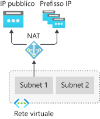
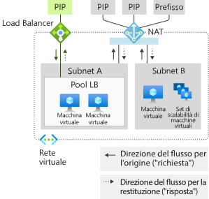
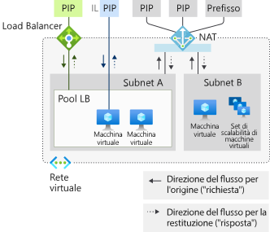
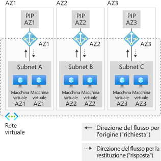
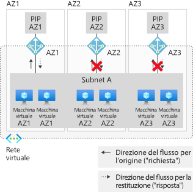
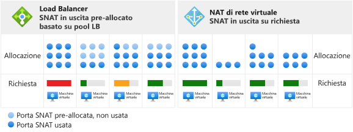
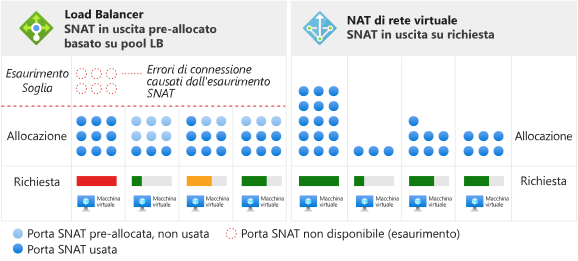

# Progettazione di reti virtuali con risorse gateway NAT

Le risorse gateway NAT fanno parte del servizio [NAT di rete virtuale](nat-overview.md) e forniscono la connettività Internet in uscita per una o più subnet di una rete virtuale. La subnet della rete virtuale determina quale gateway NAT verrà usato. NAT fornisce funzionalità SNAT (Source Network Address Translation) per una subnet.  Le risorse gateway NAT specificano gli indirizzi IP statici usati dalle macchine virtuali durante la creazione di flussi in uscita. Gli indirizzi IP statici provengono da risorse indirizzo IP pubblico, da risorse prefisso di indirizzo IP pubblico o da entrambe. Se si usa una risorsa prefisso di indirizzo IP pubblico, tutti gli indirizzi IP dell'intera risorsa prefisso di indirizzo IP pubblico vengono utilizzati da una risorsa gateway NAT. Una risorsa gateway NAT può usare in totale fino a 16 indirizzi IP statici da una delle due risorse.

  

*Figura: NAT di rete virtuale per il flusso in uscita verso Internet*

## Come distribuire NAT

La configurazione e l'uso del gateway NAT sono procedure intenzionalmente semplificate:  

Risorsa gateway NAT:
- Creare una risorsa gateway NAT a livello di area o di zona (con isolamento della zona)
- Assegnare gli indirizzi IP
- Se necessario, modificare il timeout di inattività TCP (facoltativo).  Vedere [Timer](#timers) <ins>prima di</ins> cambiare il valore predefinito.

Rete virtuale
- Configurare la subnet di rete virtuale per l'uso di un gateway NAT.

Le route definite dall'utente non sono necessarie.

## Risorsa

La risorsa è progettata per essere semplice, come si può notare nell'esempio di Azure Resource Manager seguente, in un formato simile a un modello.  Questo formato viene mostrato di seguito per illustrare i concetti e la struttura.  Modificare l'esempio in base alle esigenze.  Questo documento non è concepito come un'esercitazione.

Il diagramma seguente mostra i riferimenti scrivibili tra le diverse risorse di Azure Resource Manager.  La freccia indica la direzione del riferimento, originata dal punto in cui è scrivibile. Verifica 

  

*Figura: Modello a oggetti di NAT di rete virtuale*

NAT è consigliato per la maggior parte dei carichi di lavoro, a meno che non esista una dipendenza specifica dalla [connettività in uscita con Load Balancer basata sul pool](../load-balancer/load-balancer-outbound-connections.md).  

È possibile eseguire la migrazione da scenari di bilanciamento del carico standard, con [regole in uscita](../load-balancer/load-balancer-outbound-rules-overview.md), al gateway NAT. Per eseguire la migrazione, spostare le risorse di indirizzi IP pubblici e prefissi di indirizzi IP pubblici dai front-end del servizio di bilanciamento del carico al gateway NAT. Per il gateway NAT, non sono necessari nuovi indirizzi IP. È possibile riutilizzare risorse indirizzo IP pubblico e la risorsa prefisso di indirizzo IP pubblico standard, purché il totale non superi 16 indirizzi IP. Pianificare la migrazione tenendo presente l'interruzione del servizio durante la transizione.  Per ridurre l'interruzione, è possibile automatizzare il processo. Testare prima la migrazione in un ambiente di staging.  Durante la transizione, i flussi originati in ingresso non sono interessati.

L'esempio seguente è un frammento di un modello di Azure Resource Manager.  Questo modello distribuisce diverse risorse, incluso un gateway NAT.  In questo esempio si useranno i parametri seguenti per il modello:

- **natgatewayname**: nome del gateway NAT.
- **location**: area di Azure in cui si trova la risorsa.
- **publicipname**: nome dell'IP pubblico in uscita associato al gateway NAT.
- **vnetname**: nome della rete virtuale.
- **subnetname**: nome della subnet associata al gateway NAT.

Il numero totale di indirizzi IP forniti da tutte risorse di indirizzi IP e prefissi non può superare 16 indirizzi IP. È consentito usare un numero qualsiasi di indirizzi IP compreso tra 1 e 16.

:::code language="json" source="~/quickstart-templates/101-nat-gateway-vnet/azuredeploy.json" range="81-96":::

Una volta creata, la risorsa gateway NAT può essere usata in una o più subnet di una rete virtuale. Specificare quali subnet usano la risorsa gateway NAT. Un gateway NAT può essere usato in un'unica rete virtuale. Non è necessario assegnare lo stesso gateway NAT a tutte le subnet di una rete virtuale. È possibile configurare le singole subnet con risorse gateway NAT diverse.

Gli scenari in cui non si usano zone di disponibilità saranno a livello di area (senza zone specificate). Se si usano zone di disponibilità, è possibile specificare una zona specifica in cui isolare NAT. La ridondanza della zona non è supportata. Vedere le [zone di disponibilità](#availability-zones) per NAT.

:::code language="json" source="~/quickstart-templates/101-nat-gateway-vnet/azuredeploy.json" range="1-146" highlight="81-96":::

I gateway NAT vengono definiti con una proprietà in una subnet all'interno di una rete virtuale. Il gateway NAT verrà usato dai flussi creati dalle macchine virtuali nella subnet **subnetname** della rete virtuale **vnetname**. Per tutta la connettività in uscita verranno usati gli indirizzi IP associati a **natgatewayname** come indirizzi IP di origine.

Per altre informazioni sul modello di Azure Resource Manager usato in questo esempio, vedere:

- [Avvio rapido: Creare un gateway NAT - Modello di Resource Manager](quickstart-create-nat-gateway-template.md)
- [NAT di rete virtuale](https://azure.microsoft.com/resources/templates/101-nat-gateway-1-vm/)

## Linee guida per la progettazione

Leggere questa sezione per acquisire familiarità con gli aspetti da considerare per la progettazione di reti virtuali con NAT.  

1. [Ottimizzazione dei costi](#cost-optimization)
1. [Coesistenza di flussi in ingresso e in uscita](#coexistence-of-inbound-and-outbound)
2. [Gestione delle risorse di base](#managing-basic-resources)
3. [Zone di disponibilità](#availability-zones)

### Ottimizzazione dei costi

Gli [endpoint di servizio](virtual-network-service-endpoints-overview.md) e il [collegamento privato](../private-link/private-link-overview.md) sono opzioni da considerare per ottimizzare i costi. NAT non è necessario per questi servizi. Il traffico indirizzato agli endpoint di servizio o al collegamento privato non viene elaborato da NAT della rete virtuale.  

Gli endpoint di servizio vincolano le risorse dei servizi di Azure alla rete virtuale e controllano l'accesso a tali risorse. Ad esempio, quando si accede all'archiviazione di Azure, usare un endpoint di servizio per l'archiviazione per evitare gli addebiti associati ai dati elaborati da NAT. Gli endpoint di servizio sono gratuiti.

Il collegamento privato espone il servizio PaaS di Azure (o altri servizi ospitati con un collegamento privato) come endpoint privato all'interno di una rete virtuale.  Il collegamento privato viene fatturato in base alla durata e ai dati elaborati.

Valutare se uno o entrambi questi approcci sono indicati per uno specifico scenario e adottarli in base alle necessità.

### Coesistenza di flussi in ingresso e in uscita

Il gateway NAT è compatibile con:

 - Load Balancer Standard
 - Indirizzo IP pubblico standard
 - Prefisso di indirizzo IP pubblico standard

Per lo sviluppo di una nuova distribuzione, iniziare con SKU standard.

  

*Figura: NAT di rete virtuale per il flusso in uscita verso Internet*

Lo scenario con il solo flusso in uscita verso Internet fornito dal gateway NAT può essere ampliato con funzionalità di flusso in ingresso proveniente da Internet. Ogni risorsa riconosce la direzione da cui si origina il flusso. In una subnet con un gateway NAT, tutti gli scenari del flusso in uscita verso Internet vengono sostituiti dal gateway NAT. Gli scenari con flusso in ingresso proveniente da Internet vengono forniti dalla rispettiva risorsa.

#### NAT e VM con indirizzo IP pubblico a livello di istanza

  

*Figura: NAT di rete virtuale e VM con indirizzo IP pubblico a livello di istanza*

| Direction | Risorsa |
|:---:|:---:|
| In ingresso | VM con indirizzo IP pubblico a livello di istanza |
| In uscita | Gateway NAT |

La VM userà il gateway NAT per il flusso in uscita.  Il flusso in ingresso originato non è interessato.

#### NAT e VM con Load Balancer pubblico

  

*Figura: NAT di rete virtuale e VM con Load Balancer pubblico*

| Direction | Risorsa |
|:---:|:---:|
| In ingresso | Load Balancer pubblico |
| In uscita | Gateway NAT |

Qualsiasi configurazione in uscita proveniente da una regola di bilanciamento del carico o da regole in uscita viene sostituita dal gateway NAT.  Il flusso in ingresso originato non è interessato.

#### NAT e VM con indirizzo pubblico a livello di istanza e Load Balancer pubblico

  

*Figura: NAT di rete virtuale e VM con indirizzo pubblico a livello di istanza e Load Balancer pubblico*

| Direction | Risorsa |
|:---:|:---:|
| In ingresso | VM con indirizzo pubblico a livello di istanza e Load Balancer pubblico |
| In uscita | Gateway NAT |

Qualsiasi configurazione in uscita proveniente da una regola di bilanciamento del carico o da regole in uscita viene sostituita dal gateway NAT.  La VM userà anche il gateway NAT per il flusso in uscita.  Il flusso in ingresso originato non è interessato.

### Gestione delle risorse di base

Load Balancer Standard, gli indirizzi IP pubblici e i prefissi di indirizzi IP pubblici sono compatibili con il gateway NAT. I gateway NAT operano nell'ambito di una subnet. Lo SKU di base di questi servizi deve essere distribuito in una subnet senza gateway NAT. Questa separazione consente a entrambe le varianti dello SKU di coesistere nella stessa rete virtuale.

I gateway NAT hanno la precedenza sugli scenari in uscita della subnet. Load Balancer di base o l'IP pubblico (e tutti i servizi gestiti associati) non può essere modificato con le traduzioni corrette. Il gateway NAT assume il controllo del traffico in uscita verso Internet in una subnet. Il traffico in ingresso verso il servizio di bilanciamento del carico di base e l'indirizzo IP pubblico non è disponibile. Il traffico in ingresso verso un servizio di bilanciamento del carico di base e/o un indirizzo IP pubblico configurato in una macchina virtuale non sarà disponibile.

### Zone di disponibilità

#### Isolamento della zona con stack di zona

  

*Figura: Rete virtuale NAT con isolamento zona, creando più "stack di zona"*

Anche senza le zone di disponibilità, NAT è resiliente e può sopravvivere a più errori dei componenti dell'infrastruttura.  Le zone di disponibilità si basano su questa resilienza con scenari di isolamento della zona per NAT.

Le reti virtuali e le rispettive subnet sono costrutti a livello di area.  Le subnet non sono limitate a una zona.

Una promessa di zona per l'isolamento delle zone esiste quando un'istanza di macchina virtuale che usa una risorsa gateway NAT si trova nella stessa zona della risorsa gateway NAT e dei relativi indirizzi IP pubblici. Il modello da usare per l'isolamento della zona consiste nel creare uno "stack di zona" per ogni zona di disponibilità.  Questo "stack di zona" è costituito da istanze di macchine virtuali, risorse gateway NAT, risorse di indirizzi e/o prefissi IP pubblici in una subnet che si presuppone serva solo la stessa zona.   Le operazioni del piano di controllo e il piano dati sono allineati e vincolati alla zona specificata. 

Un errore in una zona diversa da quella in cui si trova lo scenario non dovrebbe avere effetti su NAT. Il traffico in uscita proveniente da macchine virtuali nella stessa zona avrà esito negativo a causa dell'isolamento della zona.  

#### Integrazione di endpoint in ingresso

Se lo scenario richiede endpoint in ingresso, sono disponibili due opzioni:

| Opzione | Modello | Esempio | Pro | Contro |
|---|---|---|---|---|
| (1) | **Allineare** gli endpoint in ingresso con i rispettivi **stack di zona** creati in uscita. | Creare un'istanza di Load Balancer Standard con un front-end di zona. | Modello di integrità e modalità di errore identici in ingresso e in uscita. Maggiore gestibilità. | Può essere necessario mascherare i singoli indirizzi IP per ogni zona con un nome DNS comune. |
| (2) | **Sovrapporre** gli stack di zona con un endpoint in ingresso **tra zone**. | Creare un'istanza di Load Balancer Standard con un front-end con ridondanza della zona. | Singolo indirizzo IP per l'endpoint in ingresso. | Modello di integrità e modalità di errore variabili in ingresso e in uscita.  Maggiore complessità nella gestione. |

>[!NOTE]
> Un gateway NAT con isolamento della zona richiede indirizzi IP che corrispondono alla zona del gateway NAT. Le risorse gateway NAT con indirizzi IP di una zona diversa o senza una zona non sono consentite.

#### Scenari in uscita tra zona non supportati

  

*Figura: NAT di rete virtuale non compatibile con la subnet che si estende tra più zone*

Non è possibile ottenere una promessa di zona con risorse gateway NAT quando le istanze di macchine virtuali vengono distribuite in più zone all'interno della stessa subnet.   Anche se sono presenti più gateway NAT di zona collegati a una subnet, l'istanza di macchina virtuale non riconosce la risorsa gateway NAT da selezionare.

Una promessa di zona non esiste quando a) la zona di un'istanza di macchina virtuale e le zone di un gateway NAT di zona non sono allineate oppure b) viene usata una risorsa gateway NAT a livello di area con le istanze di macchine virtuali di zona.

Anche se lo scenario sembra funzionare, il modello di integrità e la modalità di errore non sono definiti dal punto di vista della zona di disponibilità. È consigliabile adottare in alternativa gli stack di zona o tutto a livello di area.

>[!NOTE]
>La proprietà delle zone di una risorsa gateway NAT non è modificabile.  Ridistribuire la risorsa gateway NAT con la preferenza prevista per area o zona.

>[!NOTE] 
>Gli indirizzi IP non sono di per sé con ridondanza della zona se non viene specificata una zona.  Il front-end di [Load Balancer Standard è con ridondanza della zona](../load-balancer/load-balancer-standard-availability-zones.md#frontend) se non viene creato un indirizzo IP in una zona specifica.  Ciò non si applica a NAT.  È supportato solo l'isolamento a livello di area o di zona.

## Prestazioni

Ogni risorsa gateway NAT può garantire fino a 50 Gbps di velocità effettiva. È possibile suddividere le distribuzioni in più subnet e assegnare a ogni subnet o gruppo di subnet un gateway NAT per aumentare il numero di istanze.

Ogni gateway NAT può supportare 64.000 connessioni per ogni indirizzo IP in uscita assegnato.  Per informazioni dettagliate, vedere la sezione seguente relativa a SNAT (Source Network Address Translation), oltre all'articolo sulla [risoluzione dei problemi](https://docs.microsoft.com/azure/virtual-network/troubleshoot-nat) per indicazioni specifiche sulla risoluzione dei problemi.

## Source Network Address Translation

SNAT (Source Network Address Translation) riscrive l'origine di un flusso per impostare un indirizzo IP diverso.  Le risorse gateway NAT usano una variante di SNAT nota come PAT (Port Address Translation). PAT riscrive l'indirizzo e la porta di origine. Con SNAT, non esiste una relazione fissa tra il numero di indirizzi privati e i relativi indirizzi pubblici tradotti.  

### Nozioni fondamentali

Esaminiamo un esempio di quattro flussi per illustrare il concetto di base.  Il gateway NAT usa la risorsa di indirizzo IP pubblico 65.52.0.2.

| Flusso | Tupla di origine | Tupla di destinazione |
|:---:|:---:|:---:|
| 1 | 192.168.0.16:4283 | 65.52.0.1:80 |
| 2 | 192.168.0.16:4284 | 65.52.0.1:80 |
| 3 | 192.168.0.17.5768 | 65.52.0.1:80 |
| 4 | 192.168.0.16:4285 | 65.52.0.2:80 |

Questi flussi potrebbero essere simili ai seguenti dopo l'applicazione di PAT:

| Flusso | Tupla di origine | Tupla di origine con SNAT | Tupla di destinazione | 
|:---:|:---:|:---:|:---:|
| 1 | 192.168.0.16:4283 | 65.52.0.2:234 | 65.52.0.1:80 |
| 2 | 192.168.0.16:4284 | 65.52.0.2:235 | 65.52.0.1:80 |
| 3 | 192.168.0.17.5768 | 65.52.0.2:236 | 65.52.0.1:80 |
| 4 | 192.168.0.16:4285 | 65.52.0.2:237 | 65.52.0.2:80 |

La destinazione vedrà l'origine del flusso come 65.52.0.2 (tupla di origine con SNAT) con la porta assegnata mostrata.  PAT, come illustrato nella tabella precedente, viene anche detto SNAT con mascheramento delle porte.  Vengono mascherate più origini private dietro un indirizzo IP e una porta.

Non considerare il modo specifico in cui vengono assegnate le porte.  La tabella precedente serve solo a illustrare il concetto di base.

SNAT fornito da NAT è diverso da [Load Balancer](../load-balancer/load-balancer-outbound-connections.md) per molti versi.

### Su richiesta

NAT prevede porte SNAT su richiesta per i nuovi flussi di traffico in uscita. Tutte le porte SNAT in inventario vengono usate da qualsiasi macchina virtuale nelle subnet configurate con NAT. 

  

*Figura: SNAT in uscita su richiesta per NAT di rete virtuale*

Qualsiasi configurazione IP di una macchina virtuale può creare flussi in uscita su richiesta secondo necessità.  Non è necessario procedere alla pianificazione di pre-allocazione per ogni istanza, incluso l'overprovisioning del caso peggiore per istanza.  

  

*Figura: Differenze negli scenari di esaurimento*

Le porte SNAT rilasciate diventano disponibili per l'uso da parte di qualsiasi macchina virtuale nelle subnet configurate con NAT.  L'allocazione su richiesta consente di usare le porte SNAT secondo necessità per i carichi di lavoro dinamici e divergenti nelle subnet.  Purché siano disponibili porte SNAT in inventario, il flusso SNAT avrà esito positivo. Una maggiore concentrazione di porte SNAT trae invece vantaggio dall'inventario più ampio. La porte SNAT non vengono lasciate inutilizzate per le macchine virtuali che le richiedono attivamente.

### Scalabilità

La scalabilità di NAT è principalmente una funzione della gestione dell'inventario di porte SNA disponibile e condiviso. Per NAT deve esistere un inventario di porte SNAT sufficiente per gestire il flusso di picco in uscita previsto per tutte le subnet collegate a una risorsa gateway NAT.  Per creare un inventario di porte SNAT, è possibile usare risorse di indirizzi IP pubblici, risorse di prefissi IP pubblici o entrambe.  

>[!NOTE]
>Se si sta assegnando una risorsa prefisso di indirizzo IP pubblico, verrà usato l'intero prefisso di indirizzo IP pubblico.  Non è possibile assegnare una risorsa prefisso IP pubblico e quindi estrarre singoli indirizzi IP da assegnare ad altre risorse.  Se si vuole assegnare singoli indirizzi IP da un prefisso IP pubblico a più risorse, è necessario creare singoli indirizzi IP pubblici dalla risorsa prefisso di indirizzo IP pubblico e assegnarli in base alle esigenze invece di usare la risorsa prefisso di indirizzo IP pubblico.

SNAT associa gli indirizzi privati a uno o più indirizzi IP pubblici, riscrivendo l'indirizzo di origine e la porta di origine nei processi. Per questa conversione, una risorsa gateway NAT userà 64.000 porte (SNAT) per ogni indirizzo IP pubblico configurato. Le risorse gateway NAT sono scalabili fino a 16 indirizzi IP pubblici e 1 milione di porte SNAT. Se viene fornita una risorsa prefisso di indirizzo IP pubblico, ogni indirizzo IP all'interno del prefisso fornisce l'inventario delle porte SNAT. Inoltre, l'aggiunta di altri indirizzi IP pubblici aumenta l'inventario disponibile di porte SNAT. TCP e UDP sono inventari di porte SNAT separati e non correlati.

Le risorse gateway NAT riutilizzano opportunisticamente le porte di origine. Ai fini della scalabilità, è consigliabile presupporre che ogni flusso richieda una nuova porta SNAT e aumentare il numero totale di indirizzi IP pubblici per il traffico in uscita.

### Protocolli

Le risorse gateway NAT interagiscono con le intestazioni IP e di trasporto IT dei flussi UDP e TCP e sono indipendenti dai payload del livello applicativo.  Gli altri protocolli IP non sono supportati.

### Timer

>[!IMPORTANT]
>Un timer di inattività lungo può aumentare inutilmente la probabilità che si verifichi un esaurimento SNAT. Maggiore è l'intervallo di tempo specificato per un timer, più a lungo NAT manterrà il collegamento alle porte SNAT finché non viene raggiunto il timeout di inattività. Se i flussi raggiungono il timeout di inattività, alla fine avranno comunque esito negativo e consumeranno inutilmente porte SNAT dell'inventario.  I flussi che non riescono dopo 2 ore avrebbero comunque avuto esito negativo anche dopo i 4 minuti predefiniti. L'aumento del timeout di inattività è un'opzione da usare con moderazione come ultima risorsa. Se un flusso non è mai inattivo, non sarà influenzato dal timer di inattività.

Il timeout di inattività TCP può essere cambiato da 4 minuti (impostazione predefinita) a 120 minuti (2 ore) per tutti i flussi.  Inoltre, è possibile reimpostare il timer di inattività con il traffico di un flusso.  Un modello consigliato per l'aggiornamento di connessioni inattive per lungo tempo e il rilevamento dell'attività degli endpoint è costituito dai keep-alive TCP.  I keep-alive TCP vengono considerati come ACK duplicati dagli endpoint, prevedono un sovraccarico ridotto e sono invisibili al livello applicativo.

Per il rilascio di porte SNAT vengono usati i timer seguenti:

| Timer | valore |
|---|---|
| TCP FIN | 60 secondi |
| TCP RST | 10 secondi |
| TCP half open | 30 secondi |

Una porta SNAT è disponibile per il riutilizzo nello stesso indirizzo IP di destinazione e nella stessa porta di destinazione dopo 5 secondi.

>[!NOTE] 
>Queste impostazioni dei timer sono soggette a modifica. I valori vengono forniti per facilitare la risoluzione dei problemi e al momento non bisogna fare affidamento su timer specifici.

## Limitazioni

- NAT è compatibile con risorse di indirizzi IP pubblici, prefissi di indirizzi IP pubblici e servizi di bilanciamento del carico di SKU standard.   Le risorse di base, ad esempio il servizio di bilanciamento del carico di base, nonché qualsiasi prodotto derivato non sono compatibili con NAT.  Le risorse di base devono essere inserite in una subnet non configurata con NAT.
- La famiglia di indirizzi IPv4 è supportata.  NAT non interagisce con la famiglia di indirizzi IPv6.  Non è possibile distribuire NAT in una subnet con prefisso IPv6.
- NAT non può estendersi in più reti virtuali.

## Suggerimenti

Ci interessa sapere come possiamo migliorare il servizio. Manca una funzionalità? Proporre suggerimenti per sviluppi futuri in [UserVoice per NAT](https://aka.ms/natuservoice).

## Passaggi successivi

* Informazioni sul [servizio NAT di rete virtuale](nat-overview.md).
* Informazioni su [metriche e avvisi per le risorse gateway NAT](nat-metrics.md).
* Informazioni sulla [risoluzione dei problemi delle risorse gateway NAT](troubleshoot-nat.md).
* Esercitazione per la convalida del gateway NAT
  - [Interfaccia della riga di comando di Azure](tutorial-create-validate-nat-gateway-cli.md)
  - [PowerShell](tutorial-create-validate-nat-gateway-powershell.md)
  - [Portale](tutorial-create-validate-nat-gateway-portal.md)
* Avvio rapido per la distribuzione di una risorsa gateway NAT
  - [Interfaccia della riga di comando di Azure](./quickstart-create-nat-gateway-cli.md)
  - [PowerShell](./quickstart-create-nat-gateway-powershell.md)
  - [Portale](./quickstart-create-nat-gateway-portal.md)
  - [Modello](./quickstart-create-nat-gateway-template.md)
* Informazioni sull'API della risorsa gateway NAT
  - [REST API](https://docs.microsoft.com/rest/api/virtualnetwork/natgateways)
  - [Interfaccia della riga di comando di Azure](https://docs.microsoft.com/cli/azure/network/nat/gateway?view=azure-cli-latest)
  - [PowerShell](https://docs.microsoft.com/powershell/module/az.network/new-aznatgateway)
* Informazioni sulle [zone di disponibilità](../availability-zones/az-overview.md).
* Informazioni su [Azure Load Balancer Standard](../load-balancer/load-balancer-standard-overview.md).
* Informazioni su [zone di disponibilità e Load Balancer Standard](../load-balancer/load-balancer-standard-availability-zones.md).
* [Segnalare le nuove funzionalità richieste per NAT di rete virtuale in UserVoice](https://aka.ms/natuservoice).

