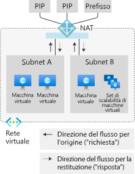

# Metriche del servizio NAT di rete virtuale di Azure

Le risorse gateway NAT di rete virtuale di Azure forniscono metriche multidimensionali. È possibile usare queste metriche per osservare l'operazione e per la [risoluzione dei problemi](nat-metrics.md).  È possibile configurare gli avvisi per problemi critici, ad esempio l'esaurimento delle porte SNAT.

  

*Figura: NAT di rete virtuale per il flusso in uscita verso Internet*

>[!NOTE] 
>NAT di rete virtuale è attualmente disponibile in anteprima pubblica e in un set limitato di [aree](nat-overview.md#region-availability). Questa anteprima viene messa a disposizione senza contratto di servizio e non è consigliata per i carichi di lavoro di produzione. Alcune funzionalità potrebbero non essere supportate o potrebbero presentare funzionalità limitate. Vedere [Condizioni supplementari per l'uso delle anteprime di Microsoft Azure](https://azure.microsoft.com/support/legal/preview-supplemental-terms).

## Metriche

Le risorse gateway NAT forniscono le metriche multidimensionali seguenti in Monitoraggio di Azure:

| Metrica | Descrizione | Aggregazione consigliata | Dimensioni |
|---|---|---|---|
| Byte | Byte elaborati in ingresso e in uscita | SUM | Direzione (ingresso; uscita), protocollo (TCP 6; UDP 17) |
| Pacchetti | Pacchetti elaborati in ingresso e in uscita | SUM | Direzione (ingresso; uscita), protocollo (TCP 6; UDP 17) |
| Pacchetti eliminati | Pacchetti eliminati dal gateway NAT | SUM | / |
| Numero di connessioni SNAT | Transizioni di stato per intervallo | SUM | Stato connessione, protocollo (TCP 6; UDP 17) |
| Totale numero di connessioni SNAT | Connessioni SNAT attive correnti (~ porte SNAT in uso) | SUM | Protocollo (TCP 6; UDP 17) |

## Avvisi

È possibile configurare gli avvisi per le metriche in Monitoraggio di Azure per ognuna delle [metriche](#metrics) precedenti.

## Limitazioni

Il servizio Integrità risorse non è supportato.

## Passaggi successivi

* Informazioni sul [servizio NAT di rete virtuale](nat-overview.md)
* Informazioni sulla [risorsa gateway NAT](nat-gateway-resource.md)
* Informazioni su [Monitoraggio di Azure](../azure-monitor/overview.md)
* Informazioni sulla [risoluzione dei problemi delle risorse gateway NAT](troubleshoot-nat.md).
* [Segnalare le nuove funzionalità richieste per NAT di rete virtuale in UserVoice](https://aka.ms/natuservoice).

