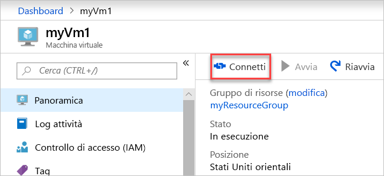

# <a name="create-a-virtual-network-using-the-azure-portal"></a>Creare una rete virtuale usando il portale di Azure

Una rete virtuale consente alle risorse di Azure, come le macchine virtuali (VM), di comunicare privatamente tra loro e con Internet. Questo articolo illustra come creare una rete virtuale. Dopo avere creato una rete virtuale, si distribuiscono due VM nella rete virtuale. Quindi si effettua la connessione a una VM da Internet e si comunica privatamente tra le due VM.

Se non si ha una sottoscrizione di Azure, creare un [account gratuito](https://azure.microsoft.com/free/?WT.mc_id=A261C142F) prima di iniziare.

## <a name="log-in-to-azure"></a>Accedere ad Azure 

Accedere al portale di Azure all'indirizzo https://portal.azure.com.

## <a name="create-a-virtual-network"></a>Crea rete virtuale

1. Selezionare **+ Crea una risorsa** nell'angolo in alto a sinistra del portale di Azure.
2. Selezionare **Rete** e quindi **Rete virtuale**.
3. Immettere o selezionare le informazioni seguenti, accettare le impostazioni predefinite rimanenti e quindi selezionare **Crea**:

    |Impostazione|Valore|
    |---|---|
    |NOME|myVirtualNetwork|
    |Sottoscrizione| Selezionare la propria sottoscrizione.|
    |Gruppo di risorse| Selezionare **Crea nuovo** e immettere *myResourceGroup*.|
    |Località| Selezionare **Stati Uniti orientali**.|

    

## <a name="create-virtual-machines"></a>Creare macchine virtuali

Creare due VM nella rete virtuale:

### <a name="create-the-first-vm"></a>Creare la prima VM

1. Selezionare **+ Crea una risorsa** visualizzato nell'angolo in alto a sinistra del portale di Azure.
2. Selezionare **Calcolo** e quindi **Windows Server 2016 Datacenter**.
3. Immettere o selezionare le informazioni seguenti, accettare le impostazioni predefinite rimanenti e quindi scegliere **OK**:

    |Impostazione|Valore|
    |---|---|
    |NOME|myVm1|
    |Nome utente| Immettere un nome utente a scelta.|
    |Password| Immettere una password a scelta. La password deve contenere almeno 12 caratteri e soddisfare i [requisiti di complessità definiti](../virtual-machines/windows/faq.md?toc=%2fazure%2fvirtual-network%2ftoc.json#what-are-the-password-requirements-when-creating-a-vm).|
    |Sottoscrizione| Selezionare la propria sottoscrizione.|
    |Gruppo di risorse| Selezionare **Usa esistente** e selezionare **myResourceGroup**.|
    |Località| Selezionare **Stati Uniti orientali**.|

    

4. Selezionare una dimensione per la VM e quindi selezionare **Seleziona**.
5. In **Impostazioni**  accettare tutte le impostazioni predefinite e quindi scegliere **OK**.

    

6. In **Crea** in **Riepilogo** selezionare **Crea** per avviare la distribuzione della VM. La distribuzione della VM richiede alcuni minuti. 

### <a name="create-the-second-vm"></a>Creare la seconda VM

Completare nuovamente i passaggi 1-6, ma nel passaggio 3 assegnare alla VM il nome *myVm2*.

## <a name="connect-to-a-vm-from-the-internet"></a>Connettersi a una VM da Internet

1. Dopo avere creato *myVm1*, effettuare la connessione. Nella parte superiore del portale di Azure immettere *myVm1*. Selezionare **myVm1** quando viene visualizzato nei risultati della ricerca. Scegliere il pulsante **Connetti**.

    

2. Dopo aver selezionato il pulsante **Connetti**, viene creato e scaricato nel computer un file Remote Desktop Protocol con estensione rdp.  
3. Aprire il file con estensione rdp scaricato. Quando richiesto, selezionare **Connetti**. Immettere il nome utente e la password specificati al momento della creazione della VM. Potrebbe essere necessario selezionare **Altre opzioni**, quindi **Usa un altro account** per specificare le credenziali immesse al momento della creazione della VM. 
4. Selezionare **OK**.
5. Durante il processo di accesso potrebbe essere visualizzato un avviso relativo al certificato. Se viene visualizzato l'avviso, selezionare **Sì** o **Continua** per procedere con la connessione.

## <a name="communicate-privately-between-vms"></a>Comunicare privatamente tra VM

1. Da PowerShell immettere `ping myvm2`. Il ping non riesce, dal momento che usa il protocollo Internet Control Message Protocol (ICMP) e ICMP non è consentito in Windows Firewall per impostazione predefinita.
2. Per consentire a *myVm2* di effettuare il ping in *myVm1* in un passaggio successivo, immettere il comando seguente da PowerShell, che consente il protocollo ICMP in ingresso in Windows Firewall:

    ```powershell
    New-NetFirewallRule –DisplayName “Allow ICMPv4-In” –Protocol ICMPv4
    ```

3. Chiudere la connessione Desktop remoto a *myVm1*. 

4. Completare nuovamente i passaggi descritti in [Connettersi a una VM da Internet](#connect-to-a-vm-from-the-internet), ma questa volta connettersi a *myVm2*. Da un prompt dei comandi immettere `ping myvm1`.

    Si ricevono risposte da *myVm1*, poiché il protocollo ICMP è stato consentito in Windows Firewall nella VM *myVm1* in un passaggio precedente.

5. Chiudere la connessione Desktop remoto a *myVm2*.

## <a name="clean-up-resources"></a>Pulire le risorse

Quando non sono più necessari, eliminare il gruppo di risorse e tutte le risorse in esso contenute:

1. Immettere *myResourceGroup* nella casella di **ricerca** nella parte superiore del portale. Selezionare **myResourceGroup** quando viene visualizzato nei risultati della ricerca.
2. Selezionare **Elimina gruppo di risorse**.
3. Immettere *myResourceGroup* in **DIGITARE IL NOME DEL GRUPPO DI RISORSE** e selezionare **Elimina**.

## <a name="next-steps"></a>Passaggi successivi

In questo articolo sono state create una rete virtuale predefinita e due VM. È stata effettuata la connessione a una VM da Internet e si è comunicato privatamente tra le due VM. Per altre informazioni sulle impostazioni della rete virtuale, vedere [Manage a virtual network](manage-virtual-network.md) (Gestire una rete virtuale).

Per impostazione predefinita, Azure consente comunicazioni private senza restrizioni tra le macchine virtuali, ma permette solo connessioni Desktop remoto in ingresso alle VM Windows da Internet. Per informazioni su come consentire o limitare i diversi tipi di comunicazione di rete da e verso le VM, passare all'esercitazione successiva.

> [!div class="nextstepaction"]
> [Filtrare il traffico di rete](virtual-networks-create-nsg-arm-pportal.md)