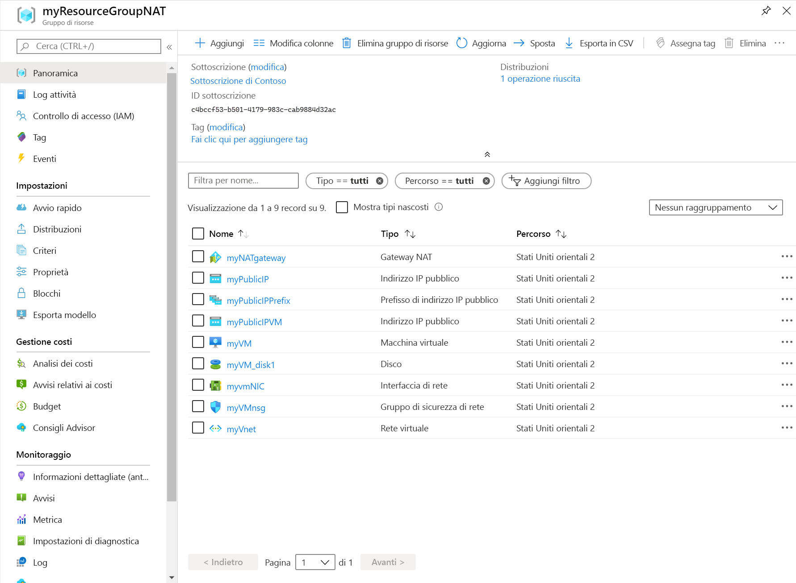

# <a name="quickstart-create-a-nat-gateway---resource-manager-template"></a>Guida introduttiva: Creare un gateway NAT - Modello di Resource Manager

Introduzione a NAT di rete virtuale con l'uso di un modello di Azure Resource Manager.  Questo modello distribuisce una rete virtuale, una risorsa gateway NAT e una macchina virtuale Ubuntu. La macchina virtuale Ubuntu viene distribuita in una subnet associata alla risorsa gateway NAT.

[!INCLUDE [About Azure Resource Manager](../../includes/resource-manager-quickstart-introduction.md)]

Se non si ha una sottoscrizione di Azure, creare un [account gratuito](https://azure.microsoft.com/free/?WT.mc_id=A261C142F) prima di iniziare.

## <a name="create-a-nat-gateway-and-supporting-resources"></a>Creare un gateway NAT e le risorse di supporto

Questo modello è configurato per la creazione di 

* Rete virtuale 
* Risorsa gateway NAT
* Macchina virtuale Ubuntu

La macchina virtuale Ubuntu viene distribuita in una subnet associata alla risorsa gateway NAT.

### <a name="review-the-template"></a>Rivedere il modello

Il modello usato in questo argomento di avvio rapido proviene dai [modelli di avvio rapido di Azure](https://raw.githubusercontent.com/Azure/azure-quickstart-templates/master/101-nat-gateway-1-vm/azuredeploy.json)

:::code language="json" source="~/quickstart-templates/101-nat-gateway-1-vm/azuredeploy.json" range="1-335" highlight="256-282":::

Nel modello sono definite nove risorse di Azure:

**Microsoft.Network**

* **[Microsoft.Network/natGateways](https://docs.microsoft.com/azure/templates/microsoft.network/natgateways)** : creare una risorsa gateway NAT.

* **[Microsoft.Network/networkSecurityGroups](https://docs.microsoft.com/azure/templates/microsoft.network/networksecuritygroups)** : Crea un gruppo di sicurezza di rete.

    * **[Microsoft.Network/networkSecurityGroups/securityRules](https://docs.microsoft.com/azure/templates/microsoft.network/networksecuritygroups/securityrules)** : crea una regola di sicurezza.

* **[Microsoft.Network/publicIPAddresses](https://docs.microsoft.com/azure/templates/microsoft.network/publicipaddresses)** : Crea un indirizzo IP pubblico.

* **[Microsoft.Network/publicIPPrefixes](https://docs.microsoft.com/azure/templates/microsoft.network/publicipprefixes)** : crea un prefisso IP pubblico.

* **[Microsoft.Network/virtualNetworks](https://docs.microsoft.com/azure/templates/microsoft.network/virtualnetworks)** : Crea una rete virtuale.

    * **[Microsoft.Network/virtualNetworks/subnets](https://docs.microsoft.com/azure/templates/microsoft.network/virtualnetworks/subnets)** : crea una subnet della rete virtuale.

* **[Microsoft.Network/networkinterfaces](https://docs.microsoft.com/azure/templates/microsoft.network/networkinterfaces)** : Crea un'interfaccia di rete.

**Microsoft.Compute**

* **[Microsoft.Compute/virtualMachines](https://docs.microsoft.com/azure/templates/Microsoft.Compute/virtualMachines)** : Consente di creare una macchina virtuale.

### <a name="deploy-the-template"></a>Distribuire il modello

**Interfaccia della riga di comando di Azure**

```azurecli-interactive
read -p "Enter the location (i.e. westcentralus): " location
resourceGroupName="myResourceGroupNAT"
templateUri="https://raw.githubusercontent.com/Azure/azure-quickstart-templates/master/101-nat-gateway-1-vm/azuredeploy.json" 

az group create \
--name $resourceGroupName \
--location $location

az group deployment create \
--resource-group $resourceGroupName \
--template-uri  $templateUri
```

**Azure PowerShell**

```azurepowershell-interactive
$location = Read-Host -Prompt "Enter the location (i.e. westcentralus)"
$templateUri = "https://raw.githubusercontent.com/Azure/azure-quickstart-templates/master/101-nat-gateway-1-vm/azuredeploy.json"

$resourceGroupName = "myResourceGroupNAT"

New-AzResourceGroup -Name $resourceGroupName -Location $location
New-AzResourceGroupDeployment -ResourceGroupName $resourceGroupName -TemplateUri $templateUri
```

**Azure portal**

[](https://portal.azure.com/#create/Microsoft.Template/uri/https%3A%2F%2Fraw.githubusercontent.com%2FAzure%2Fazure-quickstart-templates%2Fmaster%2F101-nat-gateway-1-vm%2Fazuredeploy.json)

## <a name="review-deployed-resources"></a>Esaminare le risorse distribuite

1. Accedere al [portale di Azure](https://portal.azure.com).

2. Selezionare **Gruppi di risorse** nel riquadro sinistro.

3. Selezionare il gruppo di risorse creato nella sezione precedente. Il nome del gruppo di risorse predefinito è **myResourceGroupNAT**

4. Verificare che le risorse seguenti siano state create nel gruppo di risorse:

    

## <a name="clean-up-resources"></a>Pulire le risorse

**Interfaccia della riga di comando di Azure**

Quando il gruppo di risorse e tutte le risorse al suo interno non sono più necessari, usare il comando [az group delete](/cli/azure/group#az-group-delete) per rimuoverli.

```azurecli-interactive 
  az group delete \
    --name myResourceGroupNAT
```

**Azure PowerShell**

Quando il gruppo di risorse e tutte le risorse al suo interno non sono più necessari, usare il comando [Remove-AzResourceGroup](https://docs.microsoft.com/powershell/module/az.resources/remove-azresourcegroup?view=latest) per rimuoverli.

```azurepowershell-interactive 
Remove-AzResourceGroup -Name myResourceGroupNAT
```

**Azure portal**

Quando non sono più necessari, eliminare il gruppo di risorse, il gateway NAT e tutte le risorse correlate. Selezionare il gruppo di risorse **myResourceGroupNAT** che contiene il gateway NAT e quindi fare clic su **Elimina**.

## <a name="next-steps"></a>Passaggi successivi

In questo argomento di avvio rapido sono stati creati questi componenti:

* Risorsa gateway NAT
* Rete virtuale
* Macchina virtuale Ubuntu

La macchina virtuale viene distribuita in una subnet della rete virtuale associata al gateway NAT. 

Per altre informazioni su NAT di rete virtuale e Azure Resource Manager, continuare con gli articoli seguenti.

* Vedere [Panoramica di NAT di rete virtuale](nat-overview.md)
* Vedere [Risorsa gateway NAT](nat-gateway-resource.md)
* Vedere altre informazioni su [Azure Resource Manager](../azure-resource-manager/management/overview.md)
