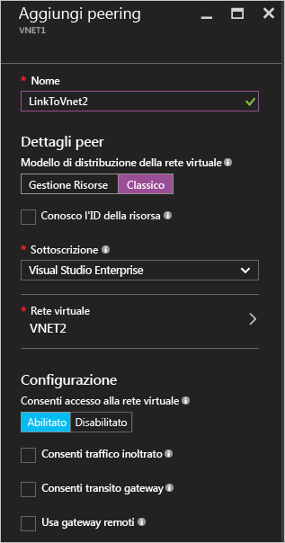
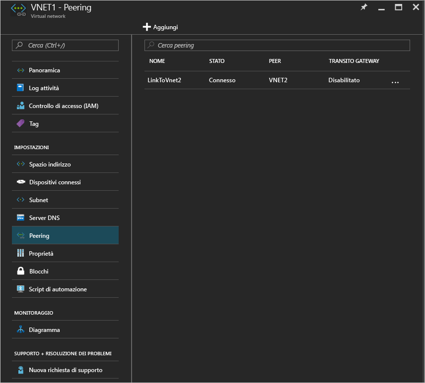

# Creare un peering reti virtuali usando il portale di Azure
[!INCLUDE [virtual-networks-create-vnet-selectors-arm-include](../../includes/virtual-networks-create-vnetpeering-selectors-arm-include.md)]

[!INCLUDE [virtual-networks-create-vnet-intro](../../includes/virtual-networks-create-vnetpeering-intro-include.md)]

[!INCLUDE [virtual-networks-create-vnet-scenario-basic-include](../../includes/virtual-networks-create-vnetpeering-scenario-basic-include.md)]

Per creare un peering reti virtuali basato sullo scenario usando il portale di Azure, seguire questa procedura:

1. In un browser passare a http://portal.azure.com e, se necessario, accedere con l'account Azure.
2. Per stabilire un peering reti virtuali, è necessario creare due collegamenti, uno per ogni direzione, tra due reti virtuali. È possibile creare prima il collegamento per il peering reti virtuali da VNet1 a VNet2. Nel portale di Azure fare clic su **Esplora** > **Reti virtuali**.

    
3. Nel pannello **Reti virtuali** scegliere *VNET1* e fare clic su **Peer** e quindi su **Aggiungi** come illustrato nell'immagine seguente:

    
4. Nel pannello **Aggiungi peering** immettere *LinkToVnet2* in **Nome**, scegliere una sottoscrizione e la **rete virtuale** peer *VNET2* e quindi fare clic su **OK**.

    
5. Dopo la creazione del collegamento per il peering reti virtuali, verrà visualizzato lo stato del collegamento come illustrato nell'immagine seguente:

    
6. Creare il collegamento per il peering reti virtuali da VNET2 a VNET1. Nel pannello **Reti virtuali** scegliere *VNET2* e fare clic su **Peer** e quindi su **Aggiungi** come illustrato nell'immagine seguente:

    
7. Nel pannello **Aggiungi peering** immettere *LinkToVnet1* in **Nome**, scegliere la sottoscrizione, selezionare *VNET1* in **Rete virtuale** e quindi fare clic su **OK**.

    
8. Dopo la creazione del collegamento per il peering reti virtuali, verrà visualizzato lo stato del collegamento come illustrato nell'immagine seguente:

    
9. Controllare lo stato di **LinkToVnet2**, che ora risulta anch'esso *Connesso*.  
    
    

    > [!NOTE]
    > Il peering reti virtuali viene stabilito solo se entrambi i collegamenti risultano connessi.
    > 
    > 

Esistono alcune proprietà configurabili per ogni collegamento:

| Opzione | Descrizione | Default |
|:--- |:--- |:--- |
| AllowVirtualNetworkAccess |Indica se lo spazio indirizzi della rete virtuale peer deve essere incluso come parte del tag Virtual_network. |Sì |
| AllowForwardedTraffic |Consente di accettare o eliminare il traffico che non ha origine da una rete virtuale con peering. |No |
| AllowGatewayTransit |Consente alla rete virtuale peer di usare il gateway di rete virtuale. |No |
| UseRemoteGateways |Consente di usare il gateway di rete virtuale del peer. Per la rete virtuale peer deve essere configurato un gateway con l'opzione AllowGatewayTransit selezionata. Non è possibile usare questa opzione se si ha un gateway configurato. |No |

Ogni collegamento in un peering reti virtuali include il precedente set di proprietà. Dal portale è possibile fare clic sul collegamento per il **peering reti virtuali** e modificare le opzioni disponibili. Fare clic su **Salva** per applicare le modifiche.

[!INCLUDE [virtual-networks-create-vnet-scenario-crosssub-include](../../includes/virtual-networks-create-vnetpeering-scenario-crosssub-include.md)]

1. In un browser passare a http://portal.azure.com e, se necessario, accedere con l'account Azure.
2. In questo esempio, l'utente A ha autorizzazioni amministrative per la sottoscrizione A, mentre l'utente B ha autorizzazioni amministrative per la sottoscrizione B. Entrambe le sottoscrizioni sono associate allo stesso tenant di Azure Active Directory. Non è possibile creare un peering tra le sottoscrizioni associate a diversi tenant di Azure Active Directory.
3. Nel portale fare clic su **Esplora** e scegliere **Reti virtuali**. Fare clic sulla rete virtuale per cui si vuole configurare il peering.
4. Nel pannello della rete virtuale selezionata fare clic su **Controllo di accesso** e quindi su **Aggiungi**, come illustrato nell'immagine seguente:

    
4. Nel pannello **Aggiungi accesso** fare clic per selezionare un ruolo e scegliere **Collaboratore Rete**, fare clic su **Aggiungi utenti**, digitare il nome di accesso dell'utente B e fare clic su OK.

    

5. Accedere al portale di Azure come utente B, che è l'utente con privilegi per la sottoscrizione B. Seguire la procedura precedente per aggiungere l'utente A al ruolo Collaboratore Rete, come illustrato nell'immagine seguente:

    

    > [!NOTE]
    > È possibile disconnettersi e accedere in entrambe le sessioni utente nel browser per verificare che l'autorizzazione sia abilitata correttamente.
    >
    >

    > [!IMPORTANT]
    > Se si sta creando il peering tra due reti virtuali create con il modello di distribuzione Azure Resource Manager, continuare con i passaggi rimanenti di questa sezione. Se le due reti virtuali sono state create con modelli di distribuzione diversi, ignorare i passaggi rimanenti di questa sezione e completare la procedura descritta nella sezione [Peering di reti virtuali create con modelli di distribuzione diversi](#x-model) di questo articolo.

6. Accedere al portale come utente A, passare al pannello di VNET3, fare clic su **Peer**, selezionare la casella di controllo **Conosco l'ID della risorsa** e digitare l'ID risorsa per VNET5 nel formato illustrato nell'esempio seguente:
   
    /subscriptions/{SubscriptionID}/resourceGroups/{ResourceGroupName}/providers/Microsoft.Network/virtualNetworks/{VNETname}
   
    
7. Accedere al portale come utente B e seguire la procedura precedente per creare il collegamento per il peering da VNET5 a VNet3.
   
    
8. Verrà stabilito il peering. Tutte le VM connesse a VNet3 potranno comunicare con tutte le VM connesse a VNet5.

[!INCLUDE [virtual-networks-create-vnet-scenario-transit-include](../../includes/virtual-networks-create-vnetpeering-scenario-transit-include.md)]

1. Come primo passaggio viene creato il collegamento per il peering reti virtuali da HubVnet a VNET1. Si noti che l'opzione Consenti traffico inoltrato non è selezionata per il collegamento.
   
    
2. Come passaggio successivo è possibile creare collegamenti per il peering da VNET1 a HubVnet. Si noti che l'opzione Consenti traffico inoltrato è selezionata.
   
    
3. Dopo aver stabilito il peering, è possibile vedere questo [articolo](virtual-network-create-udr-arm-ps.md) e creare route definite dall'utente per reindirizzare il traffico di VNet1 attraverso un'appliance virtuale per usarne le funzionalità. Quando si specifica l'indirizzo hop successivo nella route, è possibile impostarlo sull'indirizzo IP dell'appliance virtuale nella rete virtuale peer HubVNet.

[!INCLUDE [virtual-networks-create-vnet-scenario-asmtoarm-include](../../includes/virtual-networks-create-vnetpeering-scenario-asmtoarm-include.md)]

1. In un browser passare a http://portal.azure.com e, se necessario, accedere con l'account Azure.
2. Se si sta creando un peering tra reti virtuali distribuite con modelli di distribuzione diversi nella *stessa* sottoscrizione, andare al passaggio 3. La possibilità di creare un peering tra reti virtuali distribuite con modelli di distribuzione diversi in sottoscrizioni *diverse* è disponibile in versione di **anteprima**. Le funzionalità in anteprima non offrono lo stesso livello di affidabilità e lo stesso contratto di servizio delle funzionalità in versione di disponibilità generale. Se si sta creando un peering tra reti virtuali distribuite con modelli di distribuzione diversi in sottoscrizioni diverse, è necessario prima completare le attività seguenti:
    - Registrare la funzionalità in anteprima nella sottoscrizione di Azure immettendo il comando seguente di PowerShell: `Register-AzureRmProviderFeature -FeatureName AllowClassicCrossSubscriptionPeering -ProviderNamespace Microsoft.Network` e `Register-AzureRmResourceProvider -ProviderNamespace Microsoft.Network` Questo passaggio non può essere eseguito nel portale.
    - Completare i passaggi da 1 a 6 della sezione [Peering tra sottoscrizioni](#x-sub) di questo articolo.
3. Per stabilire il peering reti virtuali in questo scenario, è necessario creare solo un collegamento, dalla rete virtuale in Azure Resource Manager a quella nella distribuzione classica, ovvero da **VNET1** a **VNET2**. Nel portale fare clic su **Esplora** > e scegliere **Reti virtuali**
4. Nel pannello Reti virtuali scegliere **VNET1**. Fare clic su **Peer**, quindi su **Aggiungi**.
5. Nel pannello **Aggiungi peering** assegnare un nome al collegamento. Qui è chiamato **LinkToVNet2**. In Dettagli peer selezionare **Classica**.
6. Scegliere la sottoscrizione e la rete virtuale peer **VNET2**. Fare quindi clic su OK.

    
7. Dopo avere creato questo collegamento del peering reti virtuali, viene eseguito il peering delle due reti virtuali e sarà possibile visualizzare quanto segue:

    

## Rimuovere il peering reti virtuali
1. In un browser passare a http://portal.azure.com e, se necessario, accedere con l'account Azure.
2. Passare al pannello della rete virtuale e fare clic su Peer, quindi sul collegamento da rimuovere e infine su **Elimina**.

    
3. Dopo la rimozione di un collegamento nel peering reti virtuali, lo stato del collegamento peer sarà Disconnesso.

    
4. Con questo stato non si potrà ricreare il collegamento fino a quando lo stato del collegamento peer non diventerà Avviato. È consigliabile rimuovere entrambi i collegamenti prima di ricreare il peering reti virtuali.

