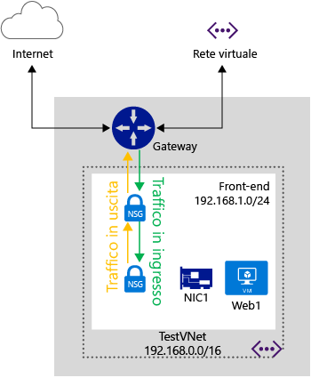

<properties 
   pageTitle="Che cos'è un gruppo di sicurezza di rete"
   description="Informazioni sui gruppi di sicurezza di rete"
   services="virtual-network"
   documentationCenter="na"
   authors="telmosampaio"
   manager="carmonm"
   editor="tysonn" />
<tags 
   ms.service="virtual-network"
   ms.devlang="na"
   ms.topic="article"
   ms.tgt_pltfrm="na"
   ms.workload="infrastructure-services"
   ms.date="12/11/2015"
   ms.author="telmos" />

# Che cos'è un gruppo di sicurezza di rete

Un gruppo di sicurezza di rete contiene un elenco di regole dell'elenco di controllo di accesso (ACL) che consentono/rifiutano il traffico di rete alle istanze VM in una rete virtuale. I gruppi di sicurezza di rete possono essere associati a subnet o singole istanze VM in una subnet. Quando un gruppo di sicurezza di rete viene associato a una subnet, le regole dell'elenco di controllo di accesso si applicano a tutte le istanze VM in tale subnet. Inoltre il traffico verso una singola VM può essere ulteriormente limitato associando un gruppo di sicurezza di rete direttamente a tale VM.

I gruppi di sicurezza di rete contengono le proprietà seguenti.

|Proprietà|Descrizione|Vincoli|Considerazioni|
|---|---|---|---|
|Nome|Nome per il gruppo di sicurezza di rete|Deve essere univoco nell'area Può contenere lettere, numeri, caratteri di sottolineatura, punti e segni meno Deve iniziare con una lettera o un numero Deve terminare con una lettera, un numero o un carattere di sottolineatura Può contenere fino a 80 caratteri|Poiché potrebbe essere necessario creare diversi gruppi di sicurezza di rete, assicurarsi di usare una convenzione di denominazione che permetta di identificare facilmente la funzione dei gruppi di sicurezza di rete|
|Region|Area di Azure in cui è ospitato il gruppo di sicurezza di rete|I gruppi di sicurezza di rete possono essere applicati solo alle risorse nell'area in cui vengono creati|Vedere più avanti i [limiti](#Limits) per sapere quanti gruppi di sicurezza di rete possono esistere in un'area|
|Gruppo di risorse|Gruppo di risorse a cui appartiene il gruppo di sicurezza di rete|Anche se un gruppo di sicurezza di rete appartiene a un gruppo di risorse, può essere associato alle risorse di qualsiasi gruppo di risorse, purché le risorse facciano parte della stessa area di Azure del gruppo di sicurezza di rete|I gruppi di risorse vengono usati per gestire insieme più risorse, come unità di distribuzione È possibile raggruppare il gruppo di sicurezza di rete con le risorse a cui è associato|
|Regole|Regole che definiscono dove il traffico è consentito o rifiutato||Vedere più avanti [Regole NSG](#Nsg-rules)| 

>[AZURE.NOTE]Gli elenchi di controllo di accesso basati su endpoint e i gruppi di sicurezza di rete non sono supportati nella stessa istanza di macchina virtuale. Se si vuole usare un gruppo di sicurezza di rete ed è già presente un elenco di controllo di accesso basato su endpoint, rimuovere prima l'elenco di controllo di accesso. Per informazioni su come procedere, vedere [Gestione degli elenchi di controllo di accesso (ACL) per gli endpoint tramite PowerShell](virtual-networks-acl-powershell.md).

### Regole NSG

Le regole dei gruppi di sicurezza di rete contengono le proprietà seguenti.

|Proprietà|Descrizione|Vincoli|Considerazioni|
|---|---|---|---|
|**Nome**|Nome per la regola|Deve essere univoco nell'area Può contenere lettere, numeri, caratteri di sottolineatura, punti e segni meno Deve iniziare con una lettera o un numero Deve terminare con una lettera, un numero o un carattere di sottolineatura Può contenere fino a 80 caratteri|Se in un gruppo di sicurezza di rete ci sono più regole, assicurarsi di seguire una convenzione di denominazione che consenta di identificare la funzione della regola|
|**Protocollo**|Protocollo per la regola|TCP, UDP o *|L'uso di * come protocollo include ICMP (solo traffico orizzontale destra-sinistra), oltre a UDP e TCP e può ridurre il numero di regole necessarie Al tempo stesso, l'uso di * potrebbe essere un approccio troppo ampio, quindi assicurarsi di usarlo solo quando è davvero necessario|
|**Intervallo porte di origine**|Intervallo di porte di origine per la regola|Numero di porta singola da 1 a 65535, intervallo di porte (ad esempio, 100-2000) o * (per tutte le porte)|Cercare di usare il più possibile gli intervalli di porte per evitare di dover applicare più regole|
|**Intervallo di porte di destinazione**|Intervallo di porte di destinazione per la regola|Numero di porta singola da 1 a 65535, intervallo di porte (ad esempio, 100-2000) o * (per tutte le porte)|Cercare di usare il più possibile gli intervalli di porte per evitare di dover applicare più regole|
|**Prefisso dell'indirizzo di origine**|Prefisso o tag dell'indirizzo di origine per la regola|Indirizzo IP singolo (ad esempio, 10.10.10.10), subnet IP (ad esempio, 192.168.1.0/24), [tag predefinito](#Default-Tags) o * (per tutti gli indirizzi)|È possibile usare intervalli, tag e * per ridurre il numero di regole|
|**Prefisso dell’indirizzo di destinazione**|Prefisso o tag dell'indirizzo di destinazione per la regola|Indirizzo IP singolo (ad esempio, 10.10.10.10), subnet IP (ad esempio, 192.168.1.0/24), [tag predefinito](#Default-Tags) o * (per tutti gli indirizzi)|È possibile usare intervalli, tag e * per ridurre il numero di regole|
|**Direzione**|Direzione del traffico per la regola|in ingresso o in uscita|Le regole in ingresso e in uscita vengono elaborate separatamente, in base alla direzione|
|**Priorità**|Le regole vengono controllate nell'ordine di priorità. Una volta che viene applicata una regola, non viene verificata la corrispondenza di altre regole.|Numero compreso tra 100 e 65535|È possibile creare regole che saltano le priorità a 100 per volta per ogni regola, lasciando spazio per inserire nuove regole tra quelle esistenti|
|**Accesso**|Tipo di accesso da applicare se la regola corrisponde|consentire o negare|Tenere presente che, se per un pacchetto non viene trovata una regola di consenso, il pacchetto viene rimosso|

### Tag predefiniti

I tag predefiniti sono identificatori forniti dal sistema per risolvere una categoria di indirizzi IP. È possibile usare i tag predefiniti nelle proprietà **prefisso dell'indirizzo di origine** e **prefisso dell'indirizzo di destinazione** di qualsiasi regola. Esistono tre tag predefiniti, che è possibile utilizzare.

- **VIRTUAL\_NETWORK:** questo tag predefinito identifica tutto lo spazio di indirizzi della rete. Include lo spazio di indirizzi della rete virtuale (intervalli CIDR definiti in Azure), nonché tutti gli spazi di indirizzi locali e rete virtuali di Azure connesse (reti locali).

- **AZURE\_LOADBALANCER:** questo tag predefinito identifica il servizio di bilanciamento del carico dell'infrastruttura di Azure. Viene convertito in un IP del data center di Azure da cui hanno origine i probe di integrità di Azure.

- **INTERNET:** questo tag predefinito identifica lo spazio di indirizzi IP esterno alla rete virtuale e raggiungibile tramite la rete Internet pubblica. Questo intervallo include anche lo [spazio di IP pubblici appartenenti ad Azure](https://www.microsoft.com/download/details.aspx?id=41653).

### Regole predefinite

Tutti i gruppi di sicurezza di rete contengono un set di regole predefinite. Le regole predefinite non possono essere eliminate, ma poiché hanno la priorità più bassa, è possibile eseguirne l'override con le regole create dall'utente.

Come illustrato dalle regole predefinite seguenti, il traffico che origina e termina in una rete virtuale è consentito sia in ingresso che in uscita. Mentre la connettività a Internet è consentita per la direzione in uscita, per impostazione predefinita è bloccata per la direzione in ingresso. È disponibile una regola predefinita per consentire al servizio di bilanciamento del carico di Azure di eseguire il probe dell'integrità delle VM e delle istanze del ruolo. È possibile eseguire l'override di questa regola se non si sta usando un set con carico bilanciato.

**Regole predefinite In ingresso**

| Nome | Priorità | IP di origine | Porta di origine | IP di destinazione | Porta di destinazione | Protocollo | Accesso |
|-----------------------------------|----------|--------------------|-------------|-----------------|------------------|----------|--------|
| CONSENTI RETE VIRTUALE IN INGRESSO | 65000 | VIRTUAL\_NETWORK | * | VIRTUAL\_NETWORK | * | * | CONSENTI |
| CONSENTI BILANCIAMENTO DEL CARICO DI AZURE IN INGRESSO | 65001 | AZURE\_LOADBALANCER | * | * | * | * | CONSENTI |
| NEGA TUTTO IN INGRESSO | 65500 | * | * | * | * | * | NEGA |

**Regole predefinite In uscita**

| Nome | Priorità | IP di origine | Porta di origine | IP di destinazione | Porta di destinazione | Protocollo | Accesso |
|-------------------------|----------|-----------------|-------------|-----------------|------------------|----------|--------|
| CONSENTI RETE VIRTUALE IN USCITA | 65000 | VIRTUAL\_NETWORK | * | VIRTUAL\_NETWORK | * | * | CONSENTI |
| CONSENTI INTERNET IN USCITA | 65001 | * | * | INTERNET | * | * | CONSENTI |
| NEGA TUTTO IN USCITA | 65500 | * | * | * | * | * | NEGA |

## Associazione di gruppi di sicurezza di rete

È possibile associare un gruppo di sicurezza di rete alle VM, alle schede di interfaccia di rete e alle subnet, a seconda del modello di distribuzione usato.

[AZURE.INCLUDE [learn-about-deployment-models-both-include.md](../../includes/learn-about-deployment-models-both-include.md)]
 
- **Associazione di un gruppo di sicurezza di rete a una VM (solo distribuzioni classiche).** Quando si associa un NSG a una VM, le regole di accesso alla rete nell’NSG vengono applicate a tutto il traffico verso e dalla VM. 

- **Associazione di un gruppo di sicurezza di rete a una scheda di interfaccia di rete (solo distribuzioni di Gestione risorse).** Quando si associa un NSG a una scheda di rete, le regole di accesso di rete nell’NSG vengono applicate solo a tale scheda di rete. Ciò significa che in una VM con più schede di rete, se un gruppo di sicurezza di rete viene applicato a una singola scheda di rete, non influisce sul traffico associato alle altre schede di rete.

- **Associazione di un gruppo di sicurezza di rete a una subnet (tutte le distribuzioni)**. Quando si associa un gruppo di sicurezza di rete a una subnet, le regole di accesso alla rete del gruppo di sicurezza di rete vengono applicate a tutte le risorse IaaS e PaaS nella subnet.

È possibile associare gruppi di sicurezza di rete diversi a una VM (o a una scheda di interfaccia di rete, a seconda del modello di distribuzione) e alla subnet a cui è associata una scheda di interfaccia di rete o una VM. In questo caso, tutte le regole di accesso alla rete vengono applicate al traffico nell'ordine seguente:

- **Traffico in ingresso**
	1. NSG applicato alla subnet.
	2. NSG applicato alla scheda di interfaccia di rete (Gestione risorse) o alla VM (classica).
- **Traffico in uscita**
	1. NSG applicato alla scheda di interfaccia di rete (Gestione risorse) o alla VM (classica).
	3. NSG applicato alla subnet.

>[AZURE.NOTE]Anche se è possibile associare solo un singolo NSG a una subnet, una VM o una scheda di rete; è possibile associare lo stesso NSG a quante risorse si desidera.

## Pianificazione

Prima di implementare i gruppi di sicurezza di rete, è necessario rispondere alle domande seguenti:

1. Verso o da quali tipi di risorse si vuole filtrare il traffico (schede di interfaccia di rete nella stessa VM, VM o altre risorse, ad esempio servizi cloud o ambienti del servizio dell'applicazione connessi alla stessa subnet oppure tra le risorse connesse a subnet diverse)?

2. Le risorse verso/da cui si vuole filtrare il traffico sono connesse alle subnet nelle reti virtuali esistenti o verranno connesse a nuove reti virtuali o subnet?
 
Per altre informazioni sulla pianificazione della sicurezza della rete in Azure, leggere le [procedure consigliate per i servizi cloud e la sicurezza della rete](best-practices-network-security.md).

## Considerazioni sulla progettazione

Dopo avere risposto alle domande della sezione [Pianificazione](#Planning), esaminare le informazioni seguenti prima di definire i gruppi di sicurezza di rete.

### Limiti

È necessario considerare le seguenti limitazioni quando si progettano gli NSG.

|**Descrizione**|**Limite predefinito**|**Implicazioni**|
|---|---|---|
|Numero di NSG che è possibile associare a una subnet, una VM o una scheda di rete|1|Non è possibile combinare gruppi di sicurezza di rete. Assicurarsi che tutte le regole necessarie per un determinato set di risorse siano incluse in un singolo gruppo di sicurezza di rete.|
|NSG per area per sottoscrizione|100|Per impostazione predefinita, per ogni VM creata nel portale di Azure viene creato un nuovo gruppo di sicurezza di rete. Se si consente questo comportamento predefinito, i gruppi di sicurezza di rete si esauriranno rapidamente. Tenere sempre presente questo limite durante la progettazione e, se necessario, separare le risorse in più aree o sottoscrizioni. |
|Regole NSG per NSG|200|Usare a un ampio intervallo di IP e porte per essere certi di non oltrepassare questo limite. |

>[AZURE.IMPORTANT]Verificare di visualizzare tutti i [limiti relativi ai servizi di rete in Azure](../azure-subscription-service-limits/#networking-limits) prima di progettare la soluzione. Alcun limiti possono essere aumentati aprendo un ticket di supporto.

### Progettazione di reti virtuali e subnet

Poiché i gruppi di sicurezza di rete possono essere applicati alle subnet, è possibile ridurre al minimo il numero di gruppi di sicurezza di rete raggruppando le risorse per subnet e applicando i gruppi di sicurezza di rete alle subnet. Se si decide di applicare i gruppi di sicurezza di rete alle subnet, è possibile che le reti virtuali e le subnet esistenti non sono state definite pensando ai gruppi di sicurezza di rete. Potrebbe essere necessario definire nuove reti virtuali e nuove subnet per supportare la progettazione dei gruppi di sicurezza di rete e distribuire le nuove risorse nelle nuove subnet. Sarà quindi possibile definire una strategia di migrazione per spostare le risorse esistenti nelle nuove subnet.

### Regole speciali

È necessario prendere in considerazione le regole speciali elencate di seguito. Assicurarsi di non bloccare il traffico consentito da tali regole, in caso contrario l'infrastruttura non sarà in grado di comunicare con i servizi essenziali di Azure.

- **IP virtuale del nodo host:** i servizi di infrastruttura di base come DHCP, DNS e il monitoraggio dello stato vengono forniti mediante l'indirizzo IP dell'host virtualizzato 168.63.129.16. Questo indirizzo IP pubblico appartiene a Microsoft e sarà l'unico indirizzo IP virtualizzato usato in tutte le aree a questo scopo. Questo indirizzo IP è mappato all'indirizzo IP fisico del computer server (nodo host) che ospita la macchina virtuale. Il nodo host svolge la funzione di inoltro DHCP, di resolver ricorsivo DNS e di origine probe per il probe di integrità del bilanciamento del carico e per il probe di integrità del computer. La comunicazione con questo indirizzo IP non deve essere considerata come un attacco.

- **Licenze (servizio di gestione delle chiavi):** le immagini Windows in esecuzione sulle macchine virtuali devono essere concesse in licenza. A tale scopo viene inviata una richiesta di licenza ai server host del servizio di gestione delle chiavi che gestiscono le query di questo tipo. Questo avverrà sempre sulla porta in uscita 1688.

### Traffico ICMP

Le regole del gruppo di sicurezza di rete correnti consentono solo i protocolli *TCP* o *UDP*. Non esiste un tag specifico per *ICMP*. Il traffico ICMP è tuttavia consentito in una rete virtuale per impostazione predefinita tramite le regole della rete virtuale in ingresso che consentono il traffico da/verso qualsiasi porta e protocollo all'interno della rete virtuale.

### Subnet

- Considerare il numero di livelli richiesto dal carico di lavoro. Ogni livello può essere isolato usando una subnet a cui è applicato un gruppo di sicurezza di rete. 
- Se è necessario implementare una subnet per un gateway VPN o un circuito ExpressRoute, verificare di **NON** applicare un gruppo di sicurezza di rete a tale subnet. In caso contrario, la connettività tra reti virtuali o cross-premise non funzionerà.
- Se è necessario implementare un'appliance virtuale, assicurarsi di distribuirla nella relativa subnet, in modo che le route definite dall'utente funzionino correttamente. È possibile implementare un gruppo di sicurezza di rete a livello di subnet per filtrare il traffico in ingresso e in uscita da questa subnet. Altre informazioni su [come controllare il flusso del traffico e usare appliance virtuali](virtual-networks-udr-overview.md).

### Servizi di bilanciamento del carico

- Considerare le regole di bilanciamento del carico e NAT per ogni servizio di bilanciamento del carico usato da ogni carico di lavoro. Queste regole sono associate a un pool back-end contenente schede di interfaccia di rete (distribuzioni di Gestione risorse) o VM/istanze del ruolo (distribuzioni classiche). È possibile creare un gruppo di interfaccia di rete per ogni pool back-end, consentendo solo il traffico di cui è stato eseguito il mapping con le regole implementate nei servizi di bilanciamento del carico. In questo modo si garantisce che venga filtrato anche il traffico che arriva direttamente al pool back-end, senza passare dal servizio di bilanciamento del carico.
- Nelle distribuzioni classiche si creano endpoint che eseguono il mapping delle porte di un servizio di bilanciamento del carico alle porte delle VM o delle istanze del ruolo. È anche possibile creare un proprio servizio di bilanciamento del carico esposto al pubblico in una distribuzione di Gestione risorse. Se si intende limitare il traffico alle VM e alle istanze del ruolo che fanno parte di un pool back-end in un servizio di bilanciamento del carico usando i gruppi di sicurezza di rete, ricordare che la porta di destinazione per il traffico in ingresso è la porta effettiva nella VM o nell'istanza del ruolo e non la porta esposta dal servizio di bilanciamento del carico. Ricordare anche che la porta e l'indirizzo di origine per la connessione alla VM sono una porta e un indirizzo del computer remoto in Internet e non la porta e l'indirizzo esposti dal servizio di bilanciamento del carico.
- Come per i servizi di bilanciamento del carico esposti al pubblico, quando si creano gruppi di sicurezza di rete per filtrare il traffico che passa da un servizio di bilanciamento del carico interno, deve essere chiaro che l'intervallo di porte e indirizzi di origine applicato è quello del computer da cui ha origine la chiamata e non quello del servizio di bilanciamento del carico. L'intervallo di porte e indirizzi di destinazione sono invece correlati al computer che riceve il traffico e non al servizio di bilanciamento del carico.

### Altri

- Gli elenchi di controllo di accesso basati su endpoint e i gruppi di sicurezza di rete non sono supportati nella stessa istanza VM. Se si vuole usare un gruppo di sicurezza di rete ed è già presente un elenco di controllo di accesso basato su endpoint, rimuovere prima l'elenco di controllo di accesso. Per informazioni su come eseguire questa operazione, vedere [Gestire elenchi di controllo di accesso basati su endpoint](virtual-networks-acl-powershell.md).
- Nel modello di distribuzione di Gestione risorse è possibile usare un gruppo di sicurezza di rete associato a una scheda di interfaccia di rete in modo che le VM con più schede di interfaccia di rete consentano la gestione (accesso remoto) in base alla scheda di interfaccia di rete, isolando quindi il traffico.
- Come quando si usano i servizi di bilanciamento del carico, quando si filtra il traffico da altre reti virtuali, è necessario usare l'intervallo di indirizzi di origine del computer remoto e non quello del gateway che si connette alle reti virtuali.
- Molti servizi di Azure non possono connettersi alle reti virtuali di Azure e quindi il traffico verso e da tali reti non può essere filtrato con i gruppi di sicurezza di rete. Per sapere se i servizi usati possono essere connessi alle reti virtuali, leggere la relativa documentazione.

## Distribuzione di esempio

Per dimostrare nella pratica le informazioni contenute in questo articolo, verranno definiti i gruppi di sicurezza di rete per filtrare il traffico di rete per una soluzione di carico di lavoro a due livelli con i requisiti seguenti:

1. Separazione del traffico tra front-end (server Web Windows) e back-end (server di database SQL).
2. Regole di bilanciamento del carico per inoltrare il traffico diretto al servizio di bilanciamento del carico a tutti i server Web della porta 80.
3. Regole NAT per inoltrare il traffico diretto alla porta 50001 del servizio di bilanciamento del carico alla porta 3389 di una sola VM del front-end.
4. Nessun accesso alle VM front-end o back-end da Internet, ad eccezione del requisito numero 1.
5. Nessun accesso dal front-end o dal back-end a Internet.
6. Accesso alla porta 3389 per qualsiasi server Web nel front-end, per il traffico in arrivo direttamente dalla subnet front-end.
7. Accesso alla porta 3389 per tutte le VM SQL Server nel back-end solo dalla subnet front-end.
8. Accesso alla porta 1433 per tutte le VM SQL Server nel back-end solo dalla subnet front-end.
9. Separazione del traffico di gestione (porta 3389) e del traffico di database (1433) su schede di interfaccia di rete diverse nelle VM back-end.

Come illustrato nel diagramma precedente, le VM *Web1* e *Web2* sono connesse alla subnet *FrontEnd* e le VM *DB1* e *DB2* sono connesse alla subnet *BackEnd*. Entrambe le subnet fanno parte delle rete virtuale *TestVNet*. Tutte le risorse vengono assegnate all'area di Azure *Stati Uniti occidentali*.

Tutti i precedenti requisiti da 1 a 6 (ad eccezione del 3) sono limitati agli spazi delle subnet. Per ridurre al minimo il numero di regole necessarie per ogni gruppo di sicurezza di rete e facilitare l'aggiunta di altre VM alle subnet che eseguono gli stessi tipi di carichi di lavoro delle VM esistenti, è possibile implementare i gruppi di sicurezza di rete seguenti a livello di subnet.

### Gruppi di sicurezza di rete per la subnet FrontEnd

**Regole in ingresso**

|Regola|Access|Priorità|Intervallo di indirizzi di origine|Porta di origine|Intervallo di indirizzi di destinazione|Porta di destinazione|Protocollo|
|---|---|---|---|---|---|---|---|
|Consenti HTTP|Consenti|100|INTERNET|*|*|80|TCP|
|Consenti RDP da FrontEnd|Consenti|200|192\.168.1.0/24|*|*|3389|TCP|
|Nega tutto da Internet|Nega|300|INTERNET|*|*|*|TCP|

**Regole in uscita**

|Regola|Access|Priorità|Intervallo di indirizzi di origine|Porta di origine|Intervallo di indirizzi di destinazione|Porta di destinazione|Protocollo|
|---|---|---|---|---|---|---|---|
|Nega Internet|Nega|100|*|*|INTERNET|*|*|

### Gruppo di sicurezza di rete per la subnet BackEnd

**Regole in ingresso**

|Regola|Access|Priorità|Intervallo di indirizzi di origine|Porta di origine|Intervallo di indirizzi di destinazione|Porta di destinazione|Protocollo|
|---|---|---|---|---|---|---|---|
|Nega Internet|Nega|100|INTERNET|*|*|*|*|

**Regole in uscita**

|Regola|Access|Priorità|Intervallo di indirizzi di origine|Porta di origine|Intervallo di indirizzi di destinazione|Porta di destinazione|Protocollo|
|---|---|---|---|---|---|---|---|
|Nega Internet|Nega|100|*|*|INTERNET|*|*|

### Gruppo di sicurezza di rete per VM singola (scheda di interfaccia di rete) in FrontEnd per RDP da Internet

**Regole in ingresso**

|Regola|Access|Priorità|Intervallo di indirizzi di origine|Porta di origine|Intervallo di indirizzi di destinazione|Porta di destinazione|Protocollo|
|---|---|---|---|---|---|---|---|
|Consenti RDP da Internet|Consenti|100|INTERNET|**|*|3389|TCP|

>[AZURE.NOTE]Si noti che l'intervallo di indirizzi di origine per questa regola è **Internet** e non l'indirizzo VIP per il servizio di bilanciamento del carico. La porta di origine è ***** e non 500001. Non confondere le regole NAT/regole di bilanciamento del carico con le regole dei gruppi di sicurezza di rete. Le regole dei gruppi di sicurezza di rete sono sempre correlate all'origine e alla destinazione finale del traffico, **NON** al servizio di bilanciamento del carico tra le due.

### Gruppo di sicurezza di rete per le schede di interfaccia di rete di gestione in BackEnd

**Regole in ingresso**

|Regola|Access|Priorità|Intervallo di indirizzi di origine|Porta di origine|Intervallo di indirizzi di destinazione|Porta di destinazione|Protocollo|
|---|---|---|---|---|---|---|---|
|Consenti RDP dal front-end|Consenti|100|192\.168.1.0/24|**|*|3389|TCP|

### Gruppo di sicurezza di rete per le schede di interfaccia di rete di accesso al database nel back-end

**Regole in ingresso**

|Regola|Access|Priorità|Intervallo di indirizzi di origine|Porta di origine|Intervallo di indirizzi di destinazione|Porta di destinazione|Protocollo|
|---|---|---|---|---|---|---|---|
|Consenti SQL dal front-end|Consenti|100|192\.168.1.0/24|**|*|1433|TCP|

Poiché alcuni gruppi di sicurezza di rete devono essere associati a singole schede di interfaccia di rete, è necessario distribuire questo scenario come distribuzione di Gestione risorse. Si noti che le regole vengono combinate a livello di subnet e di scheda di interfaccia di rete, in base a come è necessario applicarle.

## Passaggi successivi

- [Distribuire gruppi di sicurezza di rete nel modello di distribuzione classica](virtual-networks-create-nsg-classic-ps.md).
- [Distribuire gruppi di sicurezza di rete in Gestione risorse](virtual-networks-create-nsg-arm-pportal.md).
- [Gestire i log dei gruppi di sicurezza di rete](virtual-network-nsg-manage-log.md).

<!---HONumber=AcomDC_1217_2015-->