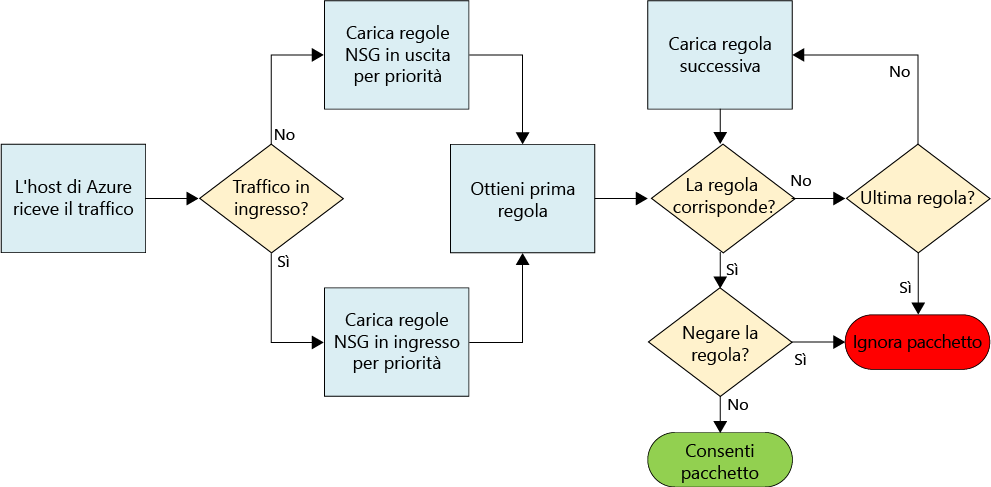
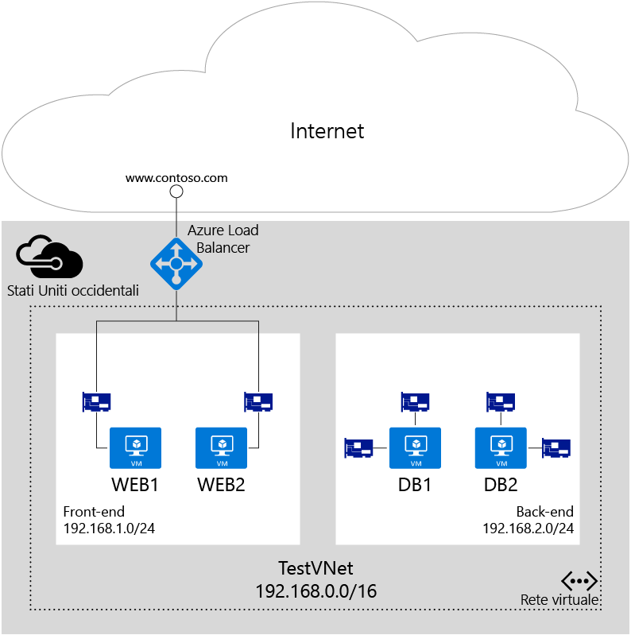

# Filtrare il traffico di rete con gruppi di sicurezza di rete

Un gruppo di sicurezza di rete (NSG) contiene un elenco di regole di sicurezza che consentono o rifiutano il traffico di rete verso le risorse connesse a reti virtuali di Azure. I gruppi di sicurezza di rete possono essere associati a subnet, singole VM (distribuzione classica) o singole interfacce di rete collegate a VM (Resource Manager). Quando un gruppo di sicurezza di rete è associato a una subnet, le regole si applicano a tutte le risorse connesse alla subnet. Il traffico può essere ulteriormente limitato associando un gruppo di sicurezza di rete anche a una VM o un'interfaccia di rete.

> [!NOTE]
> Azure offre due modelli di distribuzione per creare e usare le risorse: [Gestione risorse e la distribuzione classica](../resource-manager-deployment-model.md). In questo articolo viene illustrato l'utilizzo di entrambi i modelli, ma Microsoft indica che le distribuzioni più nuove utilizzano il modello di gestione delle.

## Risorsa del gruppo di sicurezza di rete
I gruppi di sicurezza di rete contengono le proprietà seguenti:

| Proprietà | Descrizione | Vincoli | Considerazioni |
| --- | --- | --- | --- |
| Nome |Nome per il gruppo di sicurezza di rete |Deve essere univoco nell'area. Può contenere lettere, numeri, caratteri di sottolineatura, punti e trattini. Deve iniziare con una lettera o un numero. Deve terminare con una lettera, un numero o un carattere di sottolineatura. Non può superare gli 80 caratteri. |Dato che potrebbe essere necessario creare diversi gruppi di sicurezza di rete, assicurarsi di usare una convenzione di denominazione che consenta di identificarne facilmente la funzione. |
| Region |[Area](https://azure.microsoft.com/regions) di Azure in cui viene creato il gruppo di sicurezza di rete. |I gruppi di sicurezza di rete possono essere associati solo a risorse nella stessa area del gruppo. |Per informazioni sul numero di gruppi di sicurezza di rete consentito per area, vedere l'articolo relativo ai [limiti di Azure](../azure-subscription-service-limits.md#virtual-networking-limits-classic).|
| Resource group |[Gruppo di risorse](../azure-resource-manager/resource-group-overview.md#resource-groups) in cui si trova il gruppo di sicurezza di rete. |Anche se un gruppo di sicurezza di rete si trova in un gruppo di risorse, può essere associato a risorse di qualsiasi gruppo di risorse, a condizione che la risorsa faccia parte della stessa area di Azure del gruppo di sicurezza di rete. |I gruppi di risorse vengono usati per gestire insieme più risorse come un'unità di distribuzione. È possibile raggruppare il gruppo di sicurezza di rete con le risorse a cui è associato. |
| Regole |Regole in ingresso e in uscita che definiscono il traffico consentito o rifiutato. | |Vedere la sezione [regole NSG](#Nsg-rules) di questo articolo. |

> [!NOTE]
> Gli elenchi di controllo di accesso basati su endpoint e i gruppi di sicurezza di rete non sono supportati nella stessa istanza di macchina virtuale. Se si vuole usare un gruppo di sicurezza di rete ed è già presente un elenco di controllo di accesso basato su endpoint, rimuovere prima l'elenco di controllo di accesso. Per informazioni su come rimuovere un elenco di controllo di accesso, vedere l'articolo relativo alla [gestione degli elenchi di controllo di accesso (ACL) per gli endpoint con PowerShell](virtual-networks-acl-powershell.md).
> 

### Regole NSG
Le regole dei gruppi di sicurezza di rete contengono le proprietà seguenti:

| Proprietà | Descrizione | Vincoli | Considerazioni |
| --- | --- | --- | --- |
| **Nome** |Nome della regola. |Deve essere univoco nell'area. Può contenere lettere, numeri, caratteri di sottolineatura, punti e trattini. Deve iniziare con una lettera o un numero. Deve terminare con una lettera, un numero o un carattere di sottolineatura. Non può superare gli 80 caratteri. |Dato che un gruppo di sicurezza di rete potrebbe contenere più regole, assicurarsi di seguire una convenzione di denominazione che consenta di identificare la funzione della regola. |
| **Protocollo** |Protocollo per la regola. |TCP, UDP o * |L'uso di * come protocollo include ICMP (solo traffico orizzontale destra-sinistra), oltre a TCP e UDP, e può ridurre il numero delle regole necessarie. Al tempo stesso, l'uso di * potrebbe essere un approccio troppo ampio, quindi è consigliabile usare * solo quando necessario. |
| **Intervallo porte di origine** |Intervallo di porte di origine per la regola. |Singolo numero di porta da 1 a 65535, intervallo di porte (ad esempio, 1-65535) o * (per tutte le porte). |Le porte di origine potrebbero essere temporanee. A meno che il programma client non usi una porta specifica, usare * nella maggior parte dei casi. Cercare di usare il più possibile intervalli di porte per evitare di dover applicare più regole. Non è possibile raggruppare più porte o intervalli di porte con una virgola. |
| **Intervallo di porte di destinazione** |Intervallo di porte di destinazione per la regola. |Singolo numero di porta da 1 a 65535, intervallo di porte (ad esempio, 1-65535) o \* (per tutte le porte). |Cercare di usare il più possibile intervalli di porte per evitare di dover applicare più regole. Non è possibile raggruppare più porte o intervalli di porte con una virgola. |
| **Prefisso dell'indirizzo di origine** |Prefisso o tag dell'indirizzo di origine per la regola. |Singolo indirizzo IP (ad esempio, 10.10.10.10), subnet IP (ad esempio, 192.168.1.0/24), [tag predefinito](#default-tags) o * (per tutti gli indirizzi). |È possibile usare intervalli, tag predefiniti e * per ridurre il numero di regole. |
| **Prefisso dell’indirizzo di destinazione** |Prefisso o tag dell'indirizzo di destinazione per la regola. | Singolo indirizzo IP (ad esempio, 10.10.10.10), subnet IP (ad esempio, 192.168.1.0/24), [tag predefinito](#default-tags) o * (per tutti gli indirizzi). |È possibile usare intervalli, tag predefiniti e * per ridurre il numero di regole. |
| **Direzione** |Direzione del traffico per la regola. |In ingresso o in uscita. |Le regole in ingresso e in uscita vengono elaborate separatamente, in base alla direzione. |
| **Priorità** |Le regole vengono controllate in ordine di priorità. Dopo che è stata applicata una regola, non viene verificata la corrispondenza di altre regole. | Numero compreso tra 100 e 4096. | È possibile creare le regole saltando 100 priorità per volta per ogni regola in modo da lasciare spazio per nuove regole che si potrebbero creare in futuro. |
| **Accesso** |Tipo di accesso da applicare in caso di corrispondenza della regola. | Consentire o rifiutare. | Tenere presente che, se per un pacchetto non viene trovata una regola di consenso, il pacchetto viene rimosso. |

I gruppi di sicurezza di rete contengono due set di regole: le regola in ingresso e quelle in uscita. La priorità per una regola deve essere univoca all'interno di ogni set. 

 

L'immagine precedente illustra come vengono elaborate le regole dei gruppi di sicurezza di rete.

### Tag predefiniti
I tag predefiniti sono identificatori forniti dal sistema per risolvere una categoria di indirizzi IP. È possibile usare i tag predefiniti nelle proprietà **prefisso dell'indirizzo di origine** e **prefisso dell'indirizzo di destinazione** di qualsiasi regola. Esistono tre tag predefiniti utilizzabili.

* **VirtualNetwork** (Resource Manager) o **VIRTUAL_NETWORK** (distribuzione classica): questo tag include lo spazio indirizzi della rete virtuale (intervalli CIDR definiti in Azure), tutti gli spazi indirizzi locali connessi e le reti virtuali di Azure connesse (reti locali).
* **AzureLoadBalancer** (Resource Manager) o **AZURE_LOADBALANCER** (distribuzione classica): questo tag identifica il servizio di bilanciamento del carico dell'infrastruttura di Azure. Viene convertito in un IP del data center di Azure da cui hanno origine i probe di integrità di Azure.
* **Internet** (Resource Manager) o **INTERNET** (distribuzione classica): questo tag identifica lo spazio indirizzi IP esterno alla rete virtuale e raggiungibile tramite Internet pubblico. L'intervallo include lo [spazio degli IP pubblici appartenenti ad Azure](https://www.microsoft.com/download/details.aspx?id=41653).

### Regole predefinite
Tutti i gruppi di sicurezza di rete contengono un set di regole predefinite. Le regole predefinite non possono essere eliminate, ma poiché hanno la priorità più bassa, è possibile eseguirne l'override con le regole create dall'utente. 

Le regole predefinite consentono o rifiutano il traffico come illustrato di seguito.
- **Rete virtuale:** il traffico che ha origine e termina in una rete virtuale è consentito sia in ingresso che in uscita.
- **Internet:** il traffico in uscita è consentito, mentre il traffico in ingresso viene bloccato.
- **Servizio di bilanciamento del carico:** viene consentito al servizio di bilanciamento del carico di Azure di verificare tramite probe l'integrità delle VM e delle istanze del ruolo. Se non si usa un set con bilanciamento del carico, è possibile eseguire l'override di questa regola.

**Regole predefinite In ingresso**

| Nome | Priorità | IP di origine | Porta di origine | IP di destinazione | Porta di destinazione | Protocollo | Accesso |
| --- | --- | --- | --- | --- | --- | --- | --- |
| AllowVNetInBound |65000 | VirtualNetwork | * | VirtualNetwork | * | * | CONSENTI |
| AllowAzureLoadBalancerInBound | 65001 | AzureLoadBalancer | * | * | * | * | CONSENTI |
| DenyAllInBound |65500 | * | * | * | * | * | NEGA |

**Regole predefinite In uscita**

| Nome | Priorità | IP di origine | Porta di origine | IP di destinazione | Porta di destinazione | Protocollo | Accesso |
| --- | --- | --- | --- | --- | --- | --- | --- |
| AllowVnetOutBound | 65000 | VirtualNetwork | * | VirtualNetwork | * | * | CONSENTI |
| AllowInternetOutBound | 65001 | * | * | Internet | * | * | CONSENTI |
| DenyAllOutBound | 65500 | * | * | * | * | * | NEGA |

## Associazione di gruppi di sicurezza di rete
A seconda del modello di distribuzione usato, è possibile associare un gruppo di sicurezza di rete a VM, interfacce di rete e subnet, come illustrato di seguito.

* **VM (solo distribuzione classica):** le regole di sicurezza vengono applicate a tutto il traffico da e verso la VM. 
* **Interfaccia di rete (solo Resource Manager):** le regole di sicurezza vengono applicate a tutto il traffico da e verso l'interfaccia di rete a cui è associato il gruppo di sicurezza di rete. In una VM con più interfacce di rete, è possibile applicare singolarmente a ogni interfaccia diversi gruppi di sicurezza di rete (oppure lo stesso). 
* **Subnet (distribuzione classica e Resource Manager):** le regole di sicurezza vengono applicate a tutto il traffico da o verso qualsiasi risorsa connessa alla rete virtuale.

È possibile associare gruppi di sicurezza di rete diversi a una VM (o a un'interfaccia di rete, a seconda del modello di distribuzione) e alla subnet a cui è associata l'interfaccia di rete o la VM. Le regole di sicurezza vengono applicate al traffico in base alla priorità in ogni gruppo di sicurezza di rete, nell'ordine seguente.

- **Traffico in ingresso**

  1. **Gruppo di sicurezza di rete applicato alla subnet:** se un gruppo di sicurezza di rete di una subnet ha una regola corrispondente per rifiutare il traffico, il pacchetto viene rimosso.

  2. **Gruppo di sicurezza di rete applicato all'interfaccia di rete** (Resource Manager) o alla VM (distribuzione classica): se il gruppo di sicurezza di rete della macchina virtuale o dell'interfaccia di rete ha una regola corrispondente che rifiuta il traffico, i pacchetti vengono rimossi a livello di macchina virtuale o interfaccia di rete anche se il gruppo di sicurezza di rete della subnet ha una regola corrispondente che consente il traffico.

- **Traffico in uscita**

  1. **Gruppo di sicurezza di rete applicato all'interfaccia di rete** (Resource Manager) o alla VM (distribuzione classica): se il gruppo di sicurezza di rete della macchina virtuale o dell'interfaccia di rete ha una regola corrispondente che rifiuta il traffico, i pacchetti vengono rimossi.

  2. **Gruppo di sicurezza di rete applicato alla subnet:** se il gruppo di sicurezza di rete di una subnet ha una regola corrispondente che rifiuta il traffico, i pacchetti vengono rimossi anche se il gruppo di sicurezza di rete di una VM o un'interfaccia di rete ha una regola corrispondente che consente il traffico.

> [!NOTE]
> Anche se è possibile associare solo un singolo NSG a una subnet, una VM o una scheda di rete; è possibile associare lo stesso NSG a quante risorse si desidera.
>

## Implementazione
È possibile implementare i gruppi di sicurezza di rete nei modelli di distribuzione classica o Resource Manager usando gli strumenti seguenti:

| Documentazione di distribuzione | Classico | Gestione risorse |
| --- | --- | --- |
| Portale di Azure   | No | [Sì](virtual-networks-create-nsg-arm-pportal.md) |
| PowerShell     | [Sì](virtual-networks-create-nsg-classic-ps.md) | [Sì](virtual-networks-create-nsg-arm-ps.md) |
| Interfaccia della riga di comando di Azure **versione 1**   | [Sì](virtual-networks-create-nsg-classic-cli.md) | [Sì](virtual-networks-create-nsg-arm-cli.md) |
| Interfaccia della riga di comando di Azure **versione 2**   | No | [Sì](virtual-networks-create-nsg-arm-cli.md) |
| Modello di Azure Resource Manager   | No  | [Sì](virtual-networks-create-nsg-arm-template.md) |

## Pianificazione
Prima di implementare i gruppi di sicurezza di rete, è necessario rispondere alle domande seguenti:

1. Da o verso quali tipi di risorse si vuole filtrare il traffico? È possibile connettere risorse come interfacce di rete (Resource Manager), VM (distribuzione classica), servizi cloud, ambienti del servizio dell'applicazione e set di scalabilità di macchine virtuali. 
2. Le risorse da/verso cui si vuole filtrare il traffico sono connesse a subnet in reti virtuali esistenti?

Per altre informazioni sulla pianificazione della sicurezza di rete in Azure, vedere l'articolo relativo a [Servizi cloud e sicurezza di rete](../best-practices-network-security.md). 

## Considerazioni sulla progettazione
Dopo avere risposto alle domande della sezione [Pianificazione](#Planning), prima di definire i gruppi di sicurezza di rete esaminare le sezioni seguenti.

### Limiti
Il numero di gruppi di sicurezza di rete che è possibile includere in una sottoscrizione e il numero di regole per gruppo di sicurezza di rete sono soggetti a limiti. Per altre informazioni sui limiti, vedere l'articolo [Limiti di Azure](../azure-subscription-service-limits.md#networking-limits).

### Progettazione di reti virtuali e subnet
Poiché i gruppi di sicurezza di rete possono essere applicati alle subnet, è possibile ridurre al minimo il numero di gruppi di sicurezza di rete raggruppando le risorse per subnet e applicando i gruppi di sicurezza di rete alle subnet.  Se si decide di applicare i gruppi di sicurezza di rete alle subnet, è possibile che le reti virtuali e le subnet esistenti non sono state definite pensando ai gruppi di sicurezza di rete. Potrebbe essere necessario definire nuove reti virtuali e subnet per supportare la progettazione dei gruppi di sicurezza di rete, nonché distribuire le nuove risorse nelle nuove subnet. Sarà quindi possibile definire una strategia di migrazione per spostare le risorse esistenti nelle nuove subnet. 

### Regole speciali
Se si blocca il traffico consentito dalla regole riportate di seguito, l'infrastruttura non può comunicare con servizi essenziali di Azure.

* **IP virtuale del nodo host:** servizi di infrastruttura di base come DHCP, DNS e il monitoraggio dello stato vengono forniti tramite l'indirizzo IP host virtualizzato 168.63.129.16. Questo indirizzo IP pubblico appartiene a Microsoft ed è l'unico indirizzo IP virtualizzato usato a questo scopo in tutte le aree. Questo indirizzo IP è mappato all'indirizzo IP fisico del computer server (nodo host) che ospita la macchina virtuale. Il nodo host svolge la funzione di inoltro DHCP, di resolver ricorsivo DNS e di origine probe per il probe di integrità del bilanciamento del carico e per il probe di integrità del computer. La comunicazione con questo indirizzo IP non è un attacco.
* **Licenze (Servizio di gestione delle chiavi)**: le immagini Windows in esecuzione nelle VM devono essere concesse in licenza. Per verificare la concessione della licenza, viene inviata una richiesta ai server host del Servizio di gestione delle chiavi che gestiscono le query di questo tipo. La richiesta viene inviata in uscita tramite la porta 1688.

### Traffico ICMP
Le regole del gruppo di sicurezza di rete correnti consentono solo i protocolli *TCP* o *UDP*. Non esiste un tag specifico per *ICMP*. Il traffico ICMP è tuttavia consentito all'interno di una rete virtuale dalla regola predefinita AllowVNetInBound, che consente il traffico da e verso qualsiasi porta e protocollo nella rete virtuale.

### Subnet
* Considerare il numero di livelli richiesto dal carico di lavoro. Ogni livello può essere isolato usando una subnet a cui è applicato un gruppo di sicurezza di rete. 
* Se è necessario implementare una subnet per un gateway VPN o un circuito ExpressRoute, **non** applicare un gruppo di sicurezza di rete a tale subnet. In caso contrario, la connettività cross-premise o tra reti virtuali potrebbe non funzionare. 
* Se è necessario implementare un'appliance virtuale di rete, connettere l'appliance alla relativa subnet e creare route definite dall'utente da e verso l'appliance virtuale di rete. È possibile implementare un gruppo di sicurezza di rete a livello di subnet per filtrare il traffico in ingresso e in uscita da questa subnet. Per altre informazioni sulle route definite dall'utente, vedere l'articolo [Route definite dall'utente](virtual-networks-udr-overview.md).

### Servizi di bilanciamento del carico
* Considerare le regole di bilanciamento del carico e NAT (Network Address Translation) per ogni servizio di bilanciamento del carico usato da ogni carico di lavoro. Le regole NAT sono associate a un pool back-end contenente interfacce di rete (Resource Manager) o VM/istanze del ruolo Servizi cloud (distribuzione classica). Valutare la possibilità di creare un gruppo di sicurezza di rete per ogni pool back-end, consentendo solo il traffico di cui è stato eseguito il mapping tramite le regole implementate nei servizi di bilanciamento del carico. La creazione di un gruppo di sicurezza di rete per ogni pool back-end garantisce che venga filtrato anche il traffico che arriva al pool back-end direttamente anziché attraverso il servizio di bilanciamento del carico.
* Nelle distribuzioni classiche si creano endpoint che eseguono il mapping delle porte di un servizio di bilanciamento del carico alle porte delle VM o delle istanze del ruolo. È anche possibile creare un proprio servizio di bilanciamento del carico pubblico tramite Resource Manager. La porta di destinazione per il traffico in ingresso è la porta effettiva della VM o dell'istanza del ruolo e non la porta esposta da un servizio di bilanciamento del carico. La porta e l'indirizzo di origine per la connessione alla VM sono una porta e un indirizzo del computer remoto in Internet e non la porta e l'indirizzo esposti dal servizio di bilanciamento del carico.
* Quando si creano gruppi di sicurezza di rete per filtrare il traffico che passa attraverso un servizio di bilanciamento del carico interno, l'intervallo di porte e indirizzi di origine applicato è quello del computer di origine e non quello del servizio di bilanciamento del carico. L'intervallo di porte e indirizzi di destinazione è quello del computer di destinazione e non quello del servizio di bilanciamento del carico.

### Altri
* Gli elenchi di controllo di accesso (ACL) basati su endpoint e i gruppi di sicurezza di rete non sono supportati nella stessa istanza di VM. Se si vuole usare un gruppo di sicurezza di rete ed è già presente un elenco di controllo di accesso basato su endpoint, rimuovere prima l'elenco di controllo di accesso. Per informazioni sulla rimozione di un ACL basato su endpoint, vedere l'articolo [Gestire elenchi di controllo di accesso di endpoint](virtual-networks-acl-powershell.md).
* In Resource Manager, per le VM con più interfacce di rete è possibile usare un gruppo di sicurezza di rete associato a un'interfaccia di rete per consentire la gestione (con accesso remoto) in base all'interfaccia di rete. L'associazione di gruppi di sicurezza di rete univoci a ogni interfaccia di rete consente la separazione dei tipi di traffico tra le interfacce.
* Come quando si usano i servizi di bilanciamento del carico, quando si filtra il traffico da altre reti virtuali, è necessario usare l'intervallo di indirizzi di origine del computer remoto e non quello del gateway che si connette alle reti virtuali.
* Molti servizi di Azure non possono essere connessi a reti virtuali. Se una risorsa di Azure non è connessa a una rete virtuale, non è possibile usare un gruppo di sicurezza di rete per filtrare il traffico verso la risorsa.  Per stabilire se i servizi usati possono essere connessi a una rete virtuale, vedere la relativa documentazione.

## Distribuzione di esempio
Per illustrare l'applicazione delle informazioni contenute in questo articolo, considerare lo scenario comune di un'applicazione a due livelli riportato nell'immagine seguente:

Come illustrato nel diagramma, le VM *Web1* e *Web2* sono connesse alla subnet *FrontEnd* e le VM *DB1* e *DB2* sono connesse alla subnet *BackEnd*.  Entrambe le subnet fanno parte delle rete virtuale *TestVNet* . Ogni componente dell'applicazione viene eseguito in una VM di Azure connessa a una rete virtuale. Lo scenario presenta i requisiti seguenti:

1. Separazione del traffico tra i server WEB e DB.
2. Regole di bilanciamento del carico che inoltrano il traffico dal servizio di bilanciamento del carico a tutti i server Web sulla porta 80.
3. Regole NAT del servizio di bilanciamento del carico che inoltrano il traffico in arrivo nel servizio di bilanciamento del carico sulla porta 50001 alla porta 3389 della VM WEB1.
4. Nessun accesso alle macchine virtuali front-end o back-end da Internet, tranne per i requisiti 2 e 3.
5. Nessun accesso a Internet in uscita dai server WEB o DB.
6. Accesso consentito dalla subnet FrontEnd alla porta 3389 di qualsiasi server Web.
7. Accesso consentito dalla subnet FrontEnd alla porta 3389 di qualsiasi server DB.
8. Accesso consentito dalla subnet FrontEnd alla porta 1433 di qualsiasi server DB.
9. Separazione del traffico di gestione (porta 3389) e del traffico di database (1433) su interfacce di rete diverse nei server DB.

Tutti i requisiti da 1 a 6 (tranne i requisiti 3 e 4) sono limitati agli spazi delle subnet. I gruppi di sicurezza di rete seguenti soddisfano i requisiti precedenti, riducendo contemporaneamente al minimo il numero dei gruppi di sicurezza di rete necessari:

### FrontEnd
**Regole in ingresso**

| Regola | Accesso | Priorità | Intervallo di indirizzi di origine | Porta di origine | Intervallo di indirizzi di destinazione | Porta di destinazione | Protocollo |
| --- | --- | --- | --- | --- | --- | --- | --- |
| Allow-Inbound-HTTP-Internet | CONSENTI | 100 | Internet | * | * | 80 | TCP |
| Allow-Inbound-RDP-Internet | CONSENTI | 200 | Internet | * | * | 3389 | TCP |
| Deny-Inbound-All | NEGA | 300 | Internet | * | * | * | TCP |

**Regole in uscita**

| Regola | Accesso | Priorità | Intervallo di indirizzi di origine | Porta di origine | Intervallo di indirizzi di destinazione | Porta di destinazione | Protocollo |
| --- | --- | --- | --- | --- | --- | --- | --- |
| Deny-Internet-All |NEGA |100 | * | * | Internet | * | * |

### BackEnd
**Regole in ingresso**

| Regola | Accesso | Priorità | Intervallo di indirizzi di origine | Porta di origine | Intervallo di indirizzi di destinazione | Porta di destinazione | Protocollo |
| --- | --- | --- | --- | --- | --- | --- | --- |
| Deny-Internet-All | NEGA | 100 | Internet | * | * | * | * |

**Regole in uscita**

| Regola | Accesso | Priorità | Intervallo di indirizzi di origine | Porta di origine | Intervallo di indirizzi di destinazione | Porta di destinazione | Protocollo |
| --- | --- | --- | --- | --- | --- | --- | --- |
| Deny-Internet-All | NEGA | 100 | * | * | Internet | * | * |

I gruppi di sicurezza di rete seguenti vengono creati e associati alle interfacce di rete in queste VM:

### WEB1
**Regole in ingresso**

| Regola | Accesso | Priorità | Intervallo di indirizzi di origine | Porta di origine | Intervallo di indirizzi di destinazione | Porta di destinazione | Protocollo |
| --- | --- | --- | --- | --- | --- | --- | --- |
| Allow-Inbound-RDP-Internet | CONSENTI | 100 | Internet | * | * | 3389 | TCP |
| Allow-Inbound-HTTP-Internet | CONSENTI | 200 | Internet | * | * | 80 | TCP |

> [!NOTE]
> L'intervallo di indirizzi di origine per le regole precedenti è **Internet**, non l'indirizzo IP virtuale per il servizio di bilanciamento del carico. La porta di origine è *, non 500001. Le regole NAT per i servizi di bilanciamento del carico non sono uguali alle regole di sicurezza dei gruppi di sicurezza di rete. Le regole di sicurezza dei gruppi di sicurezza di rete sono sempre correlate all'origine e alla destinazione finale del traffico, **non** al servizio di bilanciamento del carico tra le due. 
> 
> 

### WEB2
**Regole in ingresso**

| Regola | Accesso | Priorità | Intervallo di indirizzi di origine | Porta di origine | Intervallo di indirizzi di destinazione | Porta di destinazione | Protocollo |
| --- | --- | --- | --- | --- | --- | --- | --- |
| Deny-Inbound-RDP-Internet | NEGA | 100 | Internet | * | * | 3389 | TCP |
| Allow-Inbound-HTTP-Internet | CONSENTI | 200 | Internet | * | * | 80 | TCP |

### Server DB (interfaccia di rete per gestione)
**Regole in ingresso**

| Regola | Accesso | Priorità | Intervallo di indirizzi di origine | Porta di origine | Intervallo di indirizzi di destinazione | Porta di destinazione | Protocollo |
| --- | --- | --- | --- | --- | --- | --- | --- |
| Allow-Inbound-RDP-Front-end | CONSENTI | 100 | 192.168.1.0/24 | * | * | 3389 | TCP |

### Server DB (interfaccia di rete per traffico di database)
**Regole in ingresso**

| Regola | Accesso | Priorità | Intervallo di indirizzi di origine | Porta di origine | Intervallo di indirizzi di destinazione | Porta di destinazione | Protocollo |
| --- | --- | --- | --- | --- | --- | --- | --- |
| Allow-Inbound-SQL-Front-end | CONSENTI | 100 | 192.168.1.0/24 | * | * | 1433 | TCP |

Dato che alcuni gruppi di sicurezza di rete sono associati a singole interfacce di rete, le regole riguardano le risorse distribuite tramite Resource Manager. La combinazione delle regole per la subnet e l'interfaccia di rete dipende dal modo in cui sono associate. 

## Passaggi successivi
* [Distribuire gruppi di sicurezza di rete (Resource Manager)](virtual-networks-create-nsg-arm-pportal.md).
* [Distribuire gruppi di sicurezza di rete (distribuzione classica)](virtual-networks-create-nsg-classic-ps.md).
* [Gestire i log dei gruppi di sicurezza di rete](virtual-network-nsg-manage-log.md).
* [Risolvere i problemi relativi ai gruppi di sicurezza di rete] (virtual-network-nsg-troubleshoot-portal.md)
