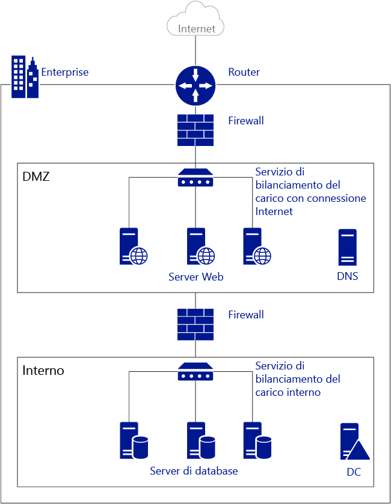
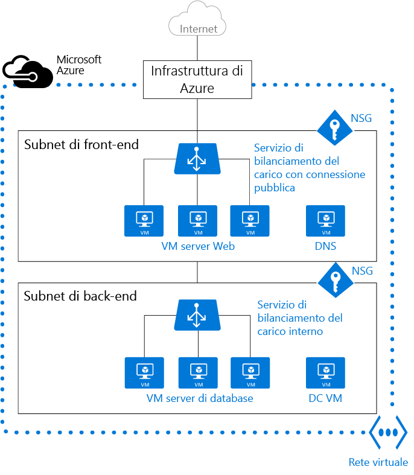

<properties
   pageTitle="Panoramica della rete virtuale (VNet) di Azure"
   description="Informazioni sulle reti virtuali in Azure"
   services="virtual-network"
   documentationCenter="na"
   authors="telmosampaio"
   manager="carmonm"
   editor="tysonn" />
<tags
   ms.service="virtual-network"
   ms.devlang="na"
   ms.topic="get-started-article"
   ms.tgt_pltfrm="na"
   ms.workload="infrastructure-services"
   ms.date="03/15/2016"
   ms.author="telmos" />

# Panoramica di Rete virtuale

Una rete virtuale di Azure (VNet) è una rappresentazione della propria rete personalizzata nel cloud. È un isolamento logico del cloud di Azure dedicato alla sottoscrizione. È possibile controllare completamente i blocchi di indirizzi IP, le impostazioni DNS, i criteri di sicurezza e le tabelle di route in questa rete. È anche possibile segmentare ulteriormente la rete virtuale in subnet e avviare macchine virtuali (VM) IaaS di Azure e/o [servizi cloud (istanze del ruolo PaaS)](../cloud-services/cloud-services-choose-me.md). È anche possibile connettere la rete virtuale alla rete locale usando una delle [opzioni di connettività](../vpn-gateway/vpn-gateway-cross-premises-options.md) disponibili in Azure. In pratica è possibile espandere la rete ad Azure, con il controllo completo sui blocchi di indirizzi IP con tutti i vantaggi di livello aziendale offerti da Azure.

Per meglio comprendere le reti virtuali, vedere la figura seguente che mostra una rete locale semplificata.

La figura precedente mostra una rete locale connessa a Internet pubblico attraverso un router. È anche possibile visualizzare un firewall tra il router e una rete perimetrale che ospita un server DNS e un server farm Web. Il server farm Web è con carico bilanciato usando un servizio di bilanciamento del carico hardware che viene esposto a Internet e consuma risorse dalla subnet interna. La subnet interna è separata dalla rete perimetrale da un altro firewall e ospita i server, i server di database e i server delle applicazioni del controller di dominio di Active Directory.

La stessa rete può essere ospitata in Azure come illustrato nella figura seguente.

Si noti come l'infrastruttura di Azure assume il ruolo di router, consentendo l'accesso dalla propria VNet a Internet pubblico senza la necessità di alcuna configurazione. I firewall possono essere sostituiti da gruppi di sicurezza di rete (NSG) applicati a ogni singola subnet. I servizi di bilanciamento del carico fisici vengono sostituiti da servizi di bilanciamento del carico Internet e interni in Azure.

>[AZURE.NOTE] Esistono due diverse modalità di distribuzione in Azure: classica (nota anche come Gestione dei servizi) e Gestione risorse di Azure. Le reti virtuali classiche possono essere aggiunte a un gruppo di affinità o create come reti virtuali regionali. Se si ha disposizione una rete virtuale in un gruppo di affinità, si consiglia di [eseguirne la migrazione a una rete virtuale regionale](virtual-networks-migrate-to-regional-vnet.md).

## Vantaggi della rete virtuale

- **Isolamento**. Le reti virtuali sono completamente isolate una dall'altra. In questo modo è possibile creare reti non contigue per la distribuzione, il test e la produzione che usano gli stessi blocchi di indirizzi CIDR.

- **Accesso a Internet pubblico**. Tutte le istanze del ruolo PaaS e delle macchine virtuali IaaS in una rete virtuale possono accedere a Internet pubblico per impostazione predefinita. È possibile controllare l'accesso usando gruppi di sicurezza di rete (NSG).

- **Accesso alle macchine virtuali all'interno della rete virtuale**. Le istanze del ruolo PaaS e le VM IaaS possono essere avviate nella stessa rete virtuale e possono connettersi tra loro usando indirizzi IP privati, anche se sono in subnet diverse, senza che sia necessario configurare un gateway o usare indirizzi IP pubblici.

- **Risoluzione dei nomi**. Azure offre una risoluzione dei nomi interna per le istanze del ruolo PaaS e delle macchine virtuali IaaS distribuiti nella propria rete virtuale. È possibile anche distribuire i propri server DNS e configurare la rete virtuale per usarli.

- **Sicurezza**. Il traffico in entrata e in uscita nelle macchine virtuali e nelle istanze del ruolo PaaS in una rete virtuale può essere controllato con i gruppi di sicurezza di rete.

- **Connettività**. Le reti virtuali possono essere connesse tra loro e anche al data center locale usando una connessione VPN da sito a sito o una connessione ExpressRoute. Per altre informazioni sui gateway VPN, visitare [Informazioni sui gateway VPN](../vpn-gateway/vpn-gateway-about-vpngateways.md). Per altre informazioni su ExpressRoute, visitare [Panoramica tecnica relativa a ExpressRoute](../expressroute/expressroute-introduction.md).

    >[AZURE.NOTE] Verificare di aver creato una nuova rete virtuale prima di distribuire eventuali istanze del ruolo PaaS o delle macchine virtuali IaaS nell'ambiente Azure. Le macchine virtuali basate su ARM richiedono una rete virtuale e, se non si specifica una rete virtuale esistente, Azure crea una rete virtuale predefinita che potrebbe presentare un conflitto dei blocchi di indirizzi CIDR con la propria rete locale, rendendo impossibile la connessione tra la propria rete virtuale e la propria rete locale.

## Subnet

Una subnet è un intervallo di indirizzi IP nella rete virtuale. È possibile suddividere la rete virtuale in più subnet per una maggiore organizzazione e sicurezza. Le VM e le istanze del ruolo PaaS distribuite nelle subnet (nella stessa o in diverse) in una rete virtuale possono comunicare tra loro senza nessuna configurazione aggiuntiva. È anche possibile configurare tabelle di route e gruppi di sicurezza di rete per una subnet.

## Indirizzi IP

Esistono due tipi di indirizzi IP assegnati alle risorse in Azure: *pubblici* e *privati*. Gli indirizzi IP pubblici consentono alle risorse di Azure di comunicare con Internet e altri servizi pubblici di Azure, ad esempio [Cache Redis di Azure](https://azure.microsoft.com/services/cache/) e [Hub eventi di Azure](https://azure.microsoft.com/documentation/services/event-hubs/). Gli indirizzi IP privati consentono la comunicazione tra risorse in una rete virtuale, oltre che con quelle connesse tramite una VPN, senza usare indirizzi IP instradabili tramite Internet.

Per altre informazioni sugli indirizzi IP in Azure, visitare [Indirizzi IP in una rete virtuale](virtual-network-ip-addresses-overview-arm.md)

## Servizi di bilanciamento del carico di Azure

Le macchine virtuali e i servizi cloud in una rete virtuale possono essere esposti a Internet usando i servizio di bilanciamento del carico di Azure. È possibile bilanciare il carico delle applicazioni line-of-business connesse alla rete interna solo usando il servizio di bilanciamento del carico interno.

- **Servizio di bilanciamento del carico esterno**. È possibile usare un servizio di bilanciamento del carico esterno per garantire un'elevata disponibilità per istanze del ruolo PaaS e delle macchine virtuali IaaS a cui si è eseguito l'accesso da Internet pubblico.

- **Servizio di bilanciamento del carico interno**. È possibile usare un servizio di bilanciamento del carico interno per garantire un'elevata disponibilità per le istanze del ruolo PaaS e delle macchine virtuali IaaS a cui si è eseguito l'accesso da altri servizi nella propria rete virtuale.

Per altre informazioni sul servizio di bilanciamento del carico in Azure, visitare [Panoramica del servizio di bilanciamento del carico](../load-balancer/load-balancer-overview.md).

## Gruppo di sicurezza di rete

È possibile creare gruppi di sicurezza di rete per controllare l'accesso in ingresso e in uscita per le interfacce di rete (NIC), le macchine virtuali e le subnet. Ogni gruppo di sicurezza di rete contiene una o più regole che specificano se il traffico è approvato o respinto in base all'indirizzo IP di origine, alla porta di origine, all'indirizzo IP di destinazione e alla porta di destinazione. Per altre informazioni sui gruppi di sicurezza di rete, visitare [Che cos'è un gruppo di sicurezza di rete](virtual-networks-nsg.md).

## Dispositivo virtuale

Un dispositivo virtuale è semplicemente un'altra macchina virtuale nella propria rete virtuale che esegue una funzione di dispositivo basata sul software, come ad esempio un firewall, l'ottimizzazione WAN o il rilevamento intrusione. È possibile creare una route in Azure per indirizzare il traffico della rete virtuale attraverso un dispositivo virtuale per usarne le funzionalità.

Ad esempio, i gruppi di sicurezza di rete possono essere usati per garantire la sicurezza nella propria rete virtuale. I gruppi di sicurezza di rete tuttavia offrono l'elenco di controllo di accesso di rete (ACL) di livello 4 a pacchetti in entrata e in uscita. Se si vuole usare un modello di sicurezza di livello 7, è necessario usare un dispositivo firewall.

Le appliance virtuali dipendono da [route e inoltro IP definiti dall'utente](virtual-networks-udr-overview.md).

## Limiti
In una sottoscrizione è consentito solo un numero limitato di reti virtuali. Per altre informazioni, vedere [Limiti relativi alle reti di Azure](../azure-subscription-service-limits.md#networking-limits).

## Prezzi
L'uso di reti virtuali in Azure non comporta costi aggiuntivi. Le istanze di calcolo avviate nella rete virtuale saranno addebitate in base alle tariffe standard, come illustrato in [Prezzi di Macchine virtuali di Azure](https://azure.microsoft.com/pricing/details/virtual-machines/). Anche i [gateway VPN](https://azure.microsoft.com/pricing/details/vpn-gateway/) e gli [indirizzi IP pubblici](https://azure.microsoft.com/pricing/details/ip-addresses/) usati nella rete virtuale saranno addebitati in base alle tariffe standard.

## Passaggi successivi

- [Creare una rete virtuale](virtual-networks-create-vnet-arm-pportal.md) e subnet.
- [Creare una macchina virtuale in una rete virtuale](../virtual-machines/virtual-machines-windows-hero-tutorial.md).
- Informazioni sui [gruppi di sicurezza di rete](virtual-networks-nsg.md).
- Informazioni su [route e inoltro IP definiti dall'utente](virtual-networks-udr-overview.md).

<!---HONumber=AcomDC_0615_2016-->