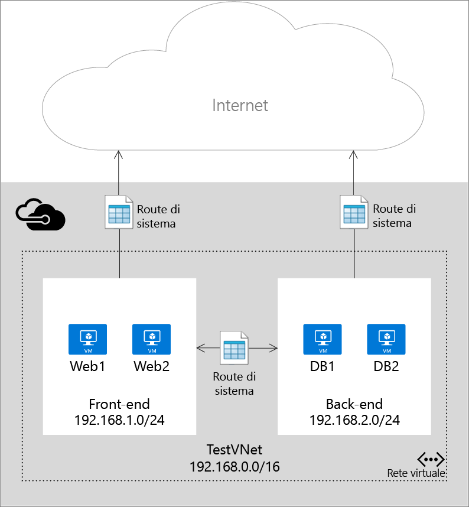
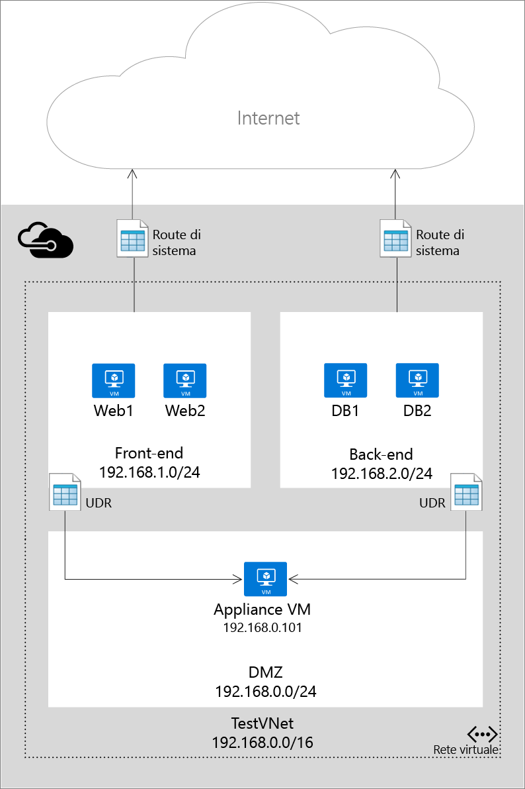

# Route definite dall'utente e inoltro IP

Quando si aggiungono macchine virtuali (VM) a una rete virtuale (VNet) in Azure, si noterà che le macchine virtuali sono in grado di comunicare con altri in rete, automaticamente. Non è necessario specificare un gateway, anche se le macchine virtuali si trovano in subnet diverse. Lo stesso vale per la comunicazione tra macchine virtuali e rete Internet pubblica e anche rete locale se è presente una connessione ibrida tra Azure e il proprio Data Center.

Questo flusso di comunicazione è possibile perché Azure utilizza una serie di route di sistema per definire il flusso di traffico IP. I route di sistema controllano il flusso delle comunicazioni negli scenari seguenti:

* All'interno della stessa subnet.
* Da una subnet a altra all'interno di una rete virtuale.
* Da macchine virtuali a Internet.
* Da una rete virtuale a un'altra rete virtuale tramite un gateway VPN.
* Da una rete virtuale a un'altra tramite il peering di rete virtuale (concatenamento dei servizi).
* Da una rete virtuale alla rete locale tramite un gateway VPN.

Nella figura seguente viene illustrato un semplice programma di installazione con una rete virtuale, due subnet e alcune macchine virtuali, con le route di sistema che consentono il flusso del traffico IP.

Sebbene l'utilizzo di route del sistema faciliti il traffico automaticamente per la distribuzione, esistono casi in cui si desidera controllare il routing dei pacchetti tramite un dispositivo virtuale. Questo è possibile tramite la creazione di route definite dall'utente che specifichino l'hop successivo per i pacchetti che passano a una subnet specifica per accedere all'applicazione virtuale e tramite l’attivazione dell'inoltro IP per la macchina virtuale in esecuzione come dispositivo virtuale.

Nella figura seguente viene illustrato un esempio di route definite dall'utente e di inoltro IP per imporre i pacchetti inviati a una subnet da un altro per passare attraverso un dispositivo virtuale su una terza subnet.

> [!IMPORTANT]
> Le route definite dall'utente vengono applicate al traffico che lascia una subnet da qualsiasi risorsa (ad esempio le interfacce di rete collegate alle VM) della subnet. Non è possibile creare una route per specificare come il traffico entra in una subnet da Internet, ad esempio. Il dispositivo in cui si vuole inoltrare il traffico non può essere nella stessa subnet da cui ha origine il traffico. Creare sempre una subnet separata per i dispositivi. 
> 
> 

## Risorsa di route
I pacchetti vengono inoltrati attraverso una rete TCP/IP basata su una tabella di route definita in ogni nodo nella rete fisica. Una tabella di route è un insieme di route singoli utilizzata per decidere dove inoltrare pacchetti in base a indirizzo IP di destinazione. Una route è costituita dai seguenti elementi:

| Proprietà | Descrizione | Vincoli | Considerazioni |
| --- | --- | --- | --- |
| Prefisso indirizzo |CIDR di destinazione a cui viene applicata la route, ad esempio 10.1.0.0/16. |Deve essere un intervallo CIDR valido che rappresenta gli indirizzi sulla rete Internet pubblica, la rete virtuale di Azure o un data center locale. |Assicurarsi che **Prefisso indirizzo** non contenga il valore di **Indirizzo hop successivo**, in caso contrario i pacchetti entreranno in un ciclo tra l'origine e l'hop successivo, senza mai raggiungere la destinazione. |
| Tipo hop successivo |Il tipo di hop Azure il pacchetto deve essere inviato. |Deve essere uno dei valori seguenti:    **Rete virtuale**. Rappresenta la rete virtuale locale. Se ad esempio sono presenti due subnet, 10.1.0.0/16 e 10.2.0.0/16 nella stessa rete virtuale, la route per ogni subnet nella tabella route avrà un valore di hop successivo di *Rete virtuale*.   **Gateway di rete virtuale**. Rappresenta un Gateway VPN S2S Azure.   **Internet**. Rappresenta il gateway Internet predefinito fornito dall'infrastruttura di Azure.   **Dispositivo virtuale**. Rappresenta un dispositivo virtuale che aggiunto alla rete virtuale Azure.   **Nessuno**. Rappresenta un black hole. I pacchetti inoltrati a un black hole non verranno inoltrati affatto. |Si consiglia di usare **appliance virtuale**  per indirizzare il traffico a una macchina virtuale o a un indirizzo IP interno di Azure Load Balancer.  Questo tipo consente di specificare un indirizzo IP come descritto di seguito. È consigliabile usare un tipo **Nessuno** per arrestare il flusso dei pacchetti verso una data destinazione. |
| Indirizzo hop successivo |L'indirizzo hop successivo contiene l'indirizzo IP per inoltrare i pacchetti. I valori di hop successivo sono consentiti solo nelle route dove il tipo di hop successivo è *dispositivo virtuale*. |Deve essere un indirizzo IP raggiungibile nella rete virtuale in cui viene applicata la route definita dall'utente, senza passare per un **gateway di rete virtuale**. L'indirizzo IP deve trovarsi nella stessa rete virtuale in cui viene applicato o in una rete virtuale con peering. |Se l'indirizzo IP rappresenta una macchina virtuale, assicurarsi di abilitare [Inoltro IP](#IP-forwarding) in Azure per la macchina virtuale. Se l'indirizzo IP rappresenta l'indirizzo IP interno di Azure Load Balancer, assicurarsi che ci sia una regola di bilanciamento del carico corrispondente per ogni porta per cui si desidera bilanciare il carico.|

In Azure PowerShell, alcuni dei valori di "NextHopType" hanno nomi diversi:

* Rete virtuale è VnetLocal
* Gateway di rete virtuale è VirtualNetworkGateway
* Appliance virtuale è VirtualAppliance
* Internet è Internet
* Nessuno è None

### Route di sistema
Ogni subnet creata in una rete virtuale viene associata automaticamente a una tabella di route che contiene le seguenti regole di route di sistema:

* **Regola di rete virtuale locale**: questa regola viene creata automaticamente per ogni subnet in una rete virtuale. Specifica che vi è un collegamento diretto tra le macchine virtuali nella rete virtuale e che non esiste alcun  hop successivo intermediario.
* **Regola Locale**: questa regola si applica a tutto il traffico destinato ad un intervallo di indirizzi locali e utilizza il gateway VPN come destinazione hop successiva.
* **Regola Internet**: questa regola gestisce tutto il traffico destinato alla rete Internet pubblica (prefisso indirizzo 0.0.0.0/0) e usa il gateway Internet dell'infrastruttura come hop successivo per tutto il traffico destinato a Internet.

### Route definite dall'utente
Per la maggior parte degli ambienti saranno necessarie solo le route di sistema già definite da Azure. Tuttavia, è necessario creare una tabella di route e aggiungere una o più route in casi specifici, ad esempio:

* Il tunneling forzato a Internet tramite la rete locale.
* Utilizzo di dispositivi virtuali nell'ambiente Azure.

Negli scenari precedenti, è necessario creare una tabella di route e aggiungervi route definite dall'utente. È possibile avere più tabelle di routing e la stessa tabella di route può essere associata a una o più subnet. E ogni subnet può essere associato a una tabella singola route. Tutte le macchine virtuali e servizi cloud in uso una subnet la tabella di route associato a tale subnet.

Le subnet si basano su route predefinite fino a quando una tabella di route viene associata alla subnet. Una volta che esiste un’associazione,il routing viene eseguito in base alla corrispondenza più lunga del prefisso (LPM) tra le route definite dall'utente e le route predefinite. Se è presente più di una route con la stessa corrispondenza LPM una route viene selezionata in base alla sua origine nell'ordine seguente:

1. Route definita utente
2. Route BGP (quando viene utilizzato ExpressRoute)
3. La route di sistema

Per informazioni su come creare route definite dall'utente, vedere [come creare route e abilitare l'inoltro dell'IP in Azure](virtual-network-create-udr-arm-template.md).

> [!IMPORTANT]
> Route definite dall'utente vengono applicate solo a servizi cloud e macchine virtuali di Azure. Ad esempio, se si vuole aggiungere un dispositivo virtuale firewall tra la rete locale e Azure, è necessario creare una route definita dall'utente per le tabelle di route di Azure per inoltrare tutto il traffico indirizzato allo spazio degli indirizzi locale al dispositivo virtuale. È anche possibile aggiungere una route definita dall'utente a GatewaySubnet per inoltrare tutto il traffico da locale ad Azure tramite l'appliance virtuale. Si tratta di un'aggiunta recente.
> 
> 

### Route BGP
Se si dispone di una connessione ExpressRoute tra la rete locale e Azure, è possibile abilitare BGP propagare route dalla rete locale in Azure. Queste route BGP vengono utilizzate nello stesso modo delle route predefinite e delle route definite dall'utente in ogni subnet di Azure. Per altre informazioni, vedere [Panoramica tecnica relativa a ExpressRoute](../expressroute/expressroute-introduction.md).

> [!IMPORTANT]
> È possibile configurare l'ambiente Azure per utilizzare il tunneling forzato attraverso la rete locale tramite la creazione di una route definita utente per 0.0.0.0/0 subnet che utilizza il gateway VPN come hop successivo. Tuttavia, funziona solo se si utilizza un gateway VPN, non ExpressRoute. Per ExpressRoute, il tunneling forzato viene configurato tramite BGP.
> 
> 

## Inoltro IP
Come descritto sopra, uno dei motivi principali per creare una route definita utente è di inoltrare il traffico a un dispositivo virtuale. Un dispositivo virtuale non è altro che una macchina virtuale che esegue un'applicazione utilizzata per gestire il traffico di rete in qualche modo, ad esempio un firewall o un dispositivo NAT.

Questo dispositivo virtuale macchina virtuale deve essere in grado di ricevere traffico in ingresso non viene indirizzato a se stesso. Per consentire a una macchina virtuale di ricevere il traffico indirizzato ad altre destinazioni, è necessario abilitare l'inoltro IP per la macchina virtuale. Si tratta di un'impostazione di Azure e non del sistema operativo guest.

## Passaggi successivi
* Informazioni su come [Creare route definite dall'utente in Resource Manager usando un modello](virtual-network-create-udr-arm-template.md) e associarle alle subnet. 
* Informazioni su come [creare route nel modello di distribuzione classica](virtual-network-create-udr-classic-ps.md) e associarle a subnet.

