# Eseguire la migrazione alla rete WAN virtuale di Azure
La rete WAN virtuale di Azure consente alle aziende di semplificare la connettività globale e trarre vantaggio dalla rete globale Microsoft su larga scala. Questo white paper fornisce i dettagli tecnici per le aziende che desiderano eseguire la migrazione da una topologia hub-spoke esistente gestita dal cliente a un'architettura che sfrutta gli hub della rete WAN virtuale gestiti da Microsoft.

L'articolo [Architettura di rete di transito globale e rete WAN virtuale](virtual-wan-global-transit-network-architecture.md) evidenzia i vantaggi offerti dalla rete WAN virtuale di Azure alle organizzazioni che adottano una rete globale aziendale moderna incentrata sul cloud.

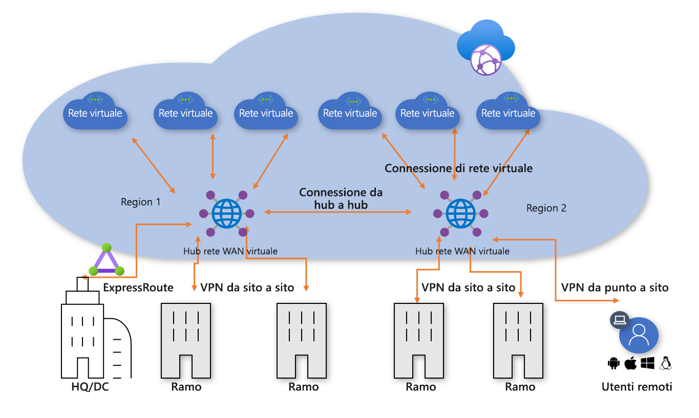
**Figura 1: Rete WAN virtuale di Azure**

Il modello di connettività hub-spoke del data center virtuale di Azure è stato adottato da migliaia di clienti per sfruttare il comportamento di routing di transito predefinito della rete di Azure al fine di creare reti cloud semplici e scalabili. Sulla base di questi concetti, la rete WAN virtuale di Azure introduce nuove funzionalità che consentono non solo di implementare topologie di connettività globali tra ambienti locali e Azure, ma anche di sfruttare la rete Microsoft su larga scala per incrementare le loro attuali reti globali.

Questo articolo descrive come eseguire la migrazione di un ambiente ibrido esistente alla rete WAN virtuale.

## Scenario

Contoso è un'organizzazione finanziaria globale con uffici in Europa e in Asia. La società pianifica di spostare le applicazioni esistenti da un data center locale in Azure e progetta una soluzione iniziale basata sull'architettura di data center virtuale, che include reti virtuali locali hub gestite dal cliente per la connettività ibrida. Durante il passaggio a tecnologie basate sul cloud, il team di rete viene incaricato di garantire che la connettività sia ottimizzata per la crescita futura del business.

La figura 2 mostra una visualizzazione generale della rete globale esistente, inclusa la connettività con più aree di Azure.

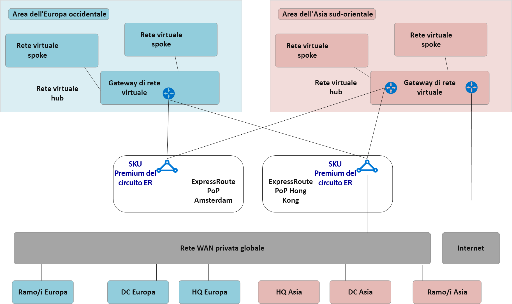
**Figura 2: Topologia di rete esistente di Contoso**

La topologia di rete esistente presenta le caratteristiche seguenti:
 
- Una topologia hub-spoke viene usata in più aree, inclusi i circuiti ExpressRoute Premium per la connettività a una rete WAN privata comune.
- In alcuni di questi siti sono anche presenti tunnel VPN collegati direttamente ad Azure per raggiungere le applicazioni ospitate nel cloud Microsoft.

## Requisiti
Il team di rete viene incaricato di sviluppare un modello di rete globale in grado di supportare la migrazione di Contoso al cloud e che sia ottimizzato in termini di costi, scalabilità e prestazioni. In breve, devono essere soddisfatti i requisiti seguenti:
- Fornire nelle sedi centrali e nelle filiali un percorso ottimizzato verso le applicazioni ospitate nel cloud. 
- Rimuovere la dipendenza dai data center locali esistenti per la terminazione VPN pur mantenendo i percorsi di connettività seguenti:
    - **Filiale-rete virtuale**: gli uffici connessi alla VPN devono essere in grado di accedere alle applicazioni trasferite nel cloud nell'area locale di Azure.
    - **Filiale-hub-hub-rete virtuale**: gli uffici connessi alla VPN devono essere in grado di accedere alle applicazioni trasferite nel cloud nell'area remota di Azure. 
    - **Filiale-filiale**: gli uffici locali connessi alla VPN devono essere in grado di comunicare tra loro e con i siti di sedi centrali/controller di dominio connessi a ExpressRoute. 
    - **Filiale-hub-hub-filiale**: gli uffici connessi alla VPN dislocati a livello globale devono essere in grado di comunicare tra loro e con i siti di sedi centrali/controller di dominio connessi a ExpressRoute.
    - **Filiale-Internet**: i siti connessi devono essere in grado di comunicare con Internet e questo traffico deve essere filtrato e registrato.
    - **Rete virtuale-rete virtuale**: le reti virtuali spoke nella stessa area devono essere in grado di comunicare tra loro.
    - **Rete virtuale-hub-hub-rete virtuale**: le reti virtuali spoke in aree diverse devono essere in grado di comunicare tra loro.
- Fornire agli utenti di Contoso la possibilità di accedere in roaming (tramite portatile e telefono) alle risorse aziendali quando non sono connessi alla rete aziendale.

## Architettura della rete WAN virtuale di Azure

La figura 3 mostra una visualizzazione generale della topologia di destinazione aggiornata usando la rete WAN virtuale di Azure per soddisfare i requisiti indicati nella sezione precedente.

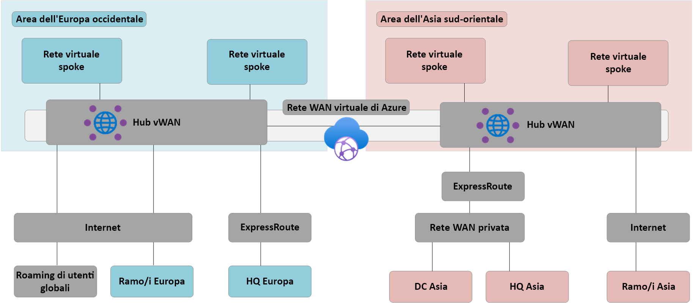
**Figura 3: Architettura della rete WAN virtuale di Azure**

In sintesi: 
- La sede centrale in Europa rimane connessa a ExpressRoute, i controller di dominio locali in Europa vengono completamente trasferiti in Azure e quindi rimossi.
- I controller di dominio e la sede centrale in Asia rimangono connessi alla rete WAN privata. La rete WAN virtuale di Azure viene ora usata per incrementare la rete dell'operatore locale e per fornire connettività globale 
- Gli hub della rete WAN virtuale di Azure nelle aree Europa occidentale e Asia sud-orientale di Azure forniscono l'hub di connettività per i dispositivi connessi a ExpressRoute e alla VPN. 
- Gli hub forniscono anche la terminazione VPN per gli utenti in roaming tra più tipi di client tramite connettività OpenVPN alla rete a mesh globale, consentendo l'accesso non solo alle applicazioni trasferite in Azure ma anche alle risorse rimaste nell'ambiente locale. 
- Connettività Internet per le risorse interne a una rete virtuale fornita dalla rete WAN virtuale di Azure. Anche la connettività Internet per i siti remoti è fornita dalla rete WAN virtuale di Azure. Breakout Internet locale supportato tramite l'integrazione di partner per l'accesso ottimizzato a servizi SaaS come Office 365.

## Eseguire la migrazione alla rete WAN virtuale di Azure

Questa sezione descrive i passaggi da eseguire per la migrazione alla rete WAN virtuale di Azure.
 
### Singola area hub-spoke di data center virtuale

La figura seguente mostra una topologia a singola area di Contoso prima dell'implementazione della rete WAN virtuale di Azure.

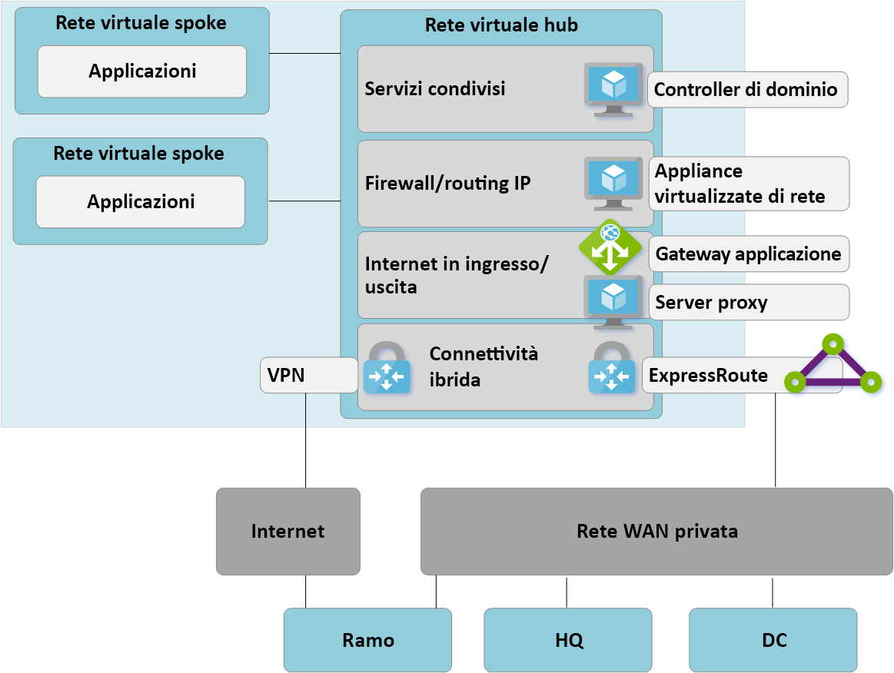

 **Figura 4: Singola area hub-spoke di data center virtuale - Passaggio 1**

In linea con l'approccio del data center virtuale, la rete virtuale hub gestita dal cliente contiene diversi blocchi funzionali:
- Servizi condivisi (qualsiasi funzione comune richiesta da più spoke). A tale scopo Contoso usa ad esempio controller di dominio di Windows Server in macchine virtuali IaaS (Infrastructure-as-a-service, infrastruttura distribuita come servizio).
- I servizi firewall di routing/IP sono forniti da un'appliance virtuale di rete di terze parti, abilitando il routing IP di livello 3 spoke-spoke. 
- Servizi in ingresso/uscita Internet, tra cui il gateway applicazione di Azure per le richieste HTTPS in ingresso e servizi proxy di terze parti in esecuzione in macchine virtuali per l'accesso in uscita filtrato alle risorse Internet.
- Gateway di rete virtuale ExpressRoute e VPN per la connettività con le reti locali.

### Distribuire gli hub della rete WAN virtuale

Il primo passaggio prevede la distribuzione di un hub di rete WAN virtuale in ogni area. Configurare l'hub della rete WAN virtuale con il gateway VPN e il gateway ExpressRoute come descritto negli articoli seguenti:  
- [Esercitazione: Creare una connessione da sito a sito con la rete WAN virtuale di Azure](virtual-wan-site-to-site-portal.md)
- [Esercitazione: Creare un'associazione ExpressRoute con la rete WAN virtuale di Azure](virtual-wan-expressroute-portal.md) 

> [!NOTE]
> Per rendere disponibili alcuni percorsi di traffico descritti in questo articolo, è necessario usare lo SKU Standard della rete WAN virtuale di Azure.

**Figura 5: Migrazione hub-spoke di data center virtuale alla rete WAN virtuale - Passaggio 2**

### Connettere i siti remoti (ExpressRoute e VPN) alla rete WAN virtuale

A questo punto connettere l'hub della rete WAN virtuale ai circuiti ExpressRoute esistenti e configurare le VPN da sito a sito per connetterle tramite Internet alle filiali remote.

> [!NOTE]
> I circuiti ExpressRoute devono essere aggiornati al tipo di SKU Premium per connetterli all'hub della rete WAN virtuale.

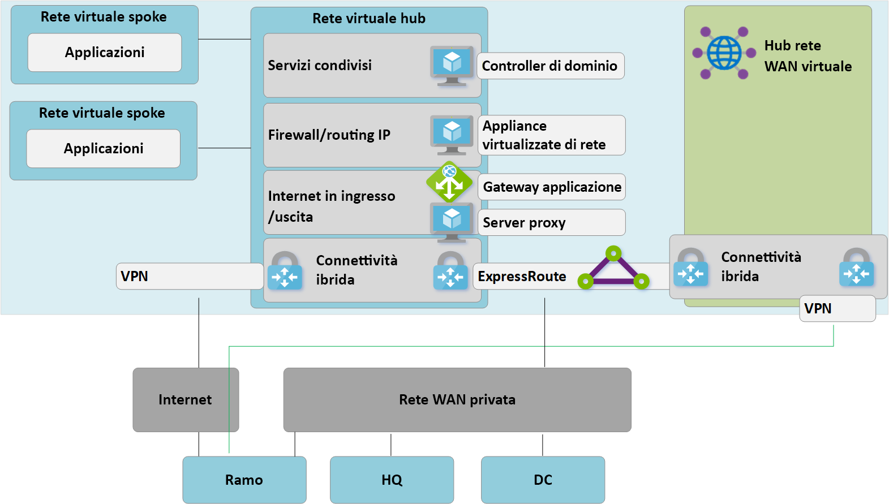
**Figura 6: Migrazione hub-spoke di data center virtuale alla rete WAN virtuale - Passaggio 3**

A questo punto, le apparecchiature di rete locali inizieranno a ricevere route che riflettono lo spazio indirizzi IP assegnato alla rete virtuale hub gestita della rete WAN virtuale. In questa fase le filiali remote connesse alla VPN vedranno due percorsi alle applicazioni esistenti nelle reti virtuali spoke. Questi dispositivi devono essere configurati per continuare a usare il tunnel verso l'hub del data center virtuale per assicurare il routing simmetrico durante la fase di transizione.

### Testare la connettività ibrida tramite rete WAN virtuale

Prima di utilizzare l'hub gestito della rete WAN virtuale per la connettività di produzione, è consigliabile configurare connessioni di rete virtuale di test per la rete virtuale spoke e la rete WAN virtuale. Verificare che le connessioni a questo ambiente di test funzionino tramite ExpressRoute e VPN da sito a sito prima di continuare con i passaggi successivi.

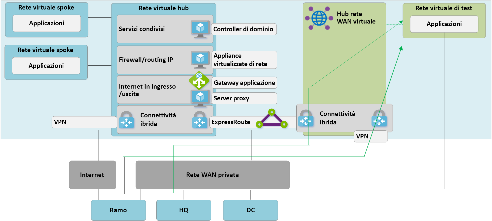
**Figura 7: Migrazione hub-spoke di data center virtuale alla rete WAN virtuale - Passaggio 4**

### Connettività di transizione all'hub della rete WAN virtuale

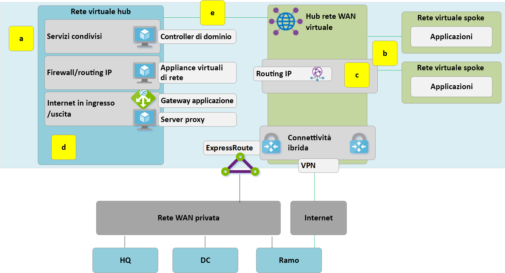
**Figura 8: Migrazione hub-spoke di data center virtuale alla rete WAN virtuale - Passaggio 5**

**a**. Eliminare le connessioni di peering esistenti tra le reti virtuali spoke e l'hub del data center virtuale precedente. L'accesso alle applicazioni nelle reti virtuali spoke non è disponibile finché non vengono completati i passaggi a-c.

**b**. Connettere le reti virtuali spoke all'hub della rete WAN virtuale tramite connessioni di rete virtuale.

**c**. Rimuovere le route definite dall'utente usate in precedenza nelle reti virtuali spoke per le comunicazioni spoke-spoke. Questo percorso è ora abilitato dal routing dinamico disponibile nell'hub della rete WAN virtuale.

**d**. I gateway VPN ed ExpressRoute esistenti nell'hub del data center virtuale vengono ora rimossi per consentire il passaggio successivo (e).

**e**. Connettere l'hub del data center virtuale (rete virtuale hub) precedente all'hub della rete WAN virtuale tramite una nuova connessione di rete virtuale.

### L'hub precedente diventa uno spoke di servizi condivisi

La rete di Azure è ora stata riprogettata in modo da configurare l'hub della rete WAN virtuale come punto centrale nella nuova topologia.

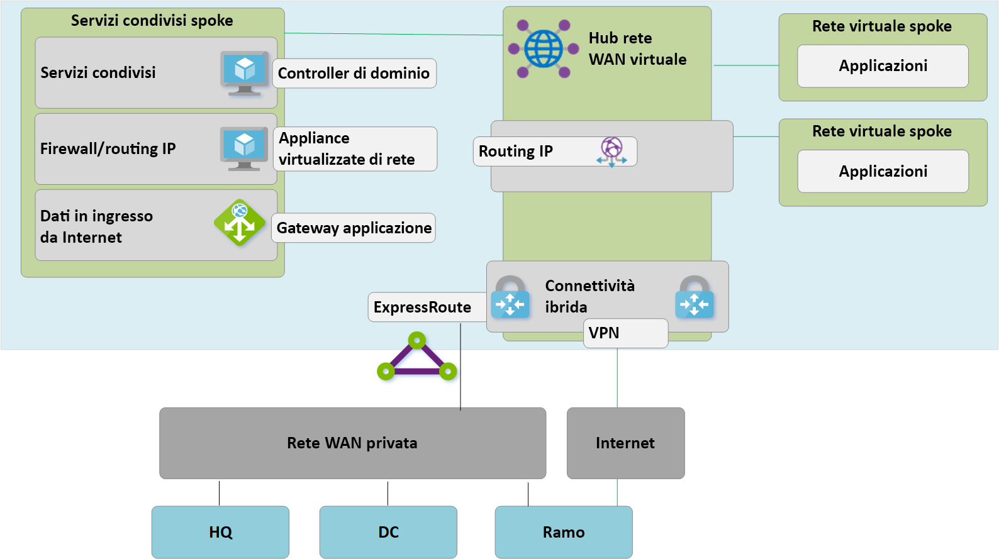
**Figura 9: Migrazione hub-spoke di data center virtuale alla rete WAN virtuale - Passaggio 6**

Poiché l'hub della rete WAN virtuale è un'entità gestita e non consente la distribuzione di risorse personalizzate, ad esempio le macchine virtuali, il blocco dei servizi condivisi ora esiste come rete virtuale spoke, che ospita funzioni come il traffico Internet in ingresso tramite gateway applicazione di Azure o appliance virtualizzata di rete. Il traffico tra l'ambiente di servizi condivisi e le macchine virtuali back-end ora transita attraverso l'hub gestito dalla rete WAN virtuale.

### Ottimizzare la connettività locale per utilizzare appieno la rete WAN virtuale

In questa fase, Contoso ha quasi completato la migrazione delle applicazioni aziendali al cloud Microsoft, con solo alcune applicazioni legacy rimanenti all'interno del controller di dominio locale.

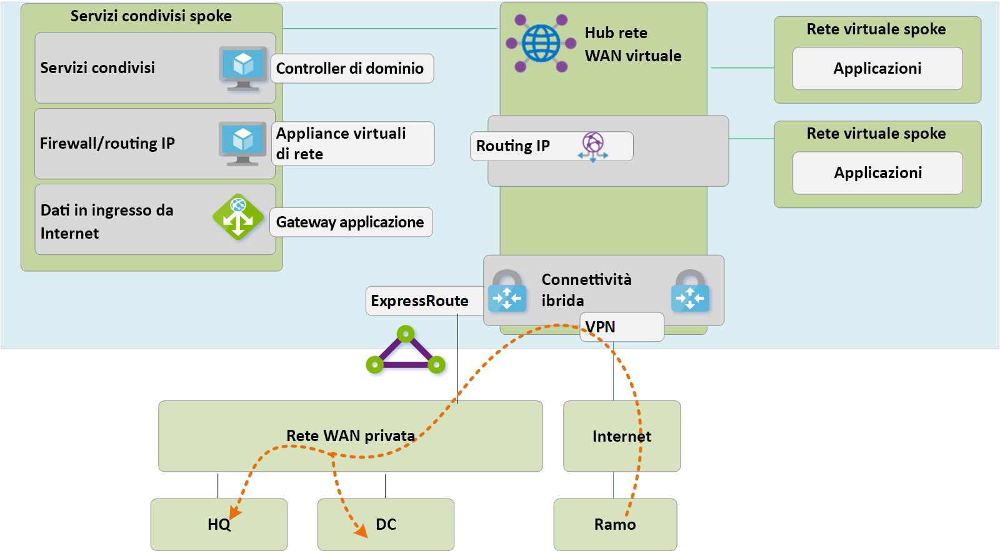
**Figura 10: Migrazione hub-spoke di data center virtuale alla rete WAN virtuale - Passaggio 7**

 Per sfruttare tutte le funzionalità della rete WAN virtuale di Azure, Contoso decide di rimuovere le connessioni VPN locali legacy. Le filiali che continuano ad accedere alle reti di sedi centrali o data center possono transitare nella rete globale Microsoft tramite il routing di transito predefinito della rete WAN virtuale di Azure. 

> [!NOTE]
> Il servizio Copertura globale di ExpressRoute rappresenta un'alternativa per i clienti che scelgono di sfruttare il backbone Microsoft per integrare le loro reti WAN private esistenti.

## Architettura dello stato finale e percorsi di traffico

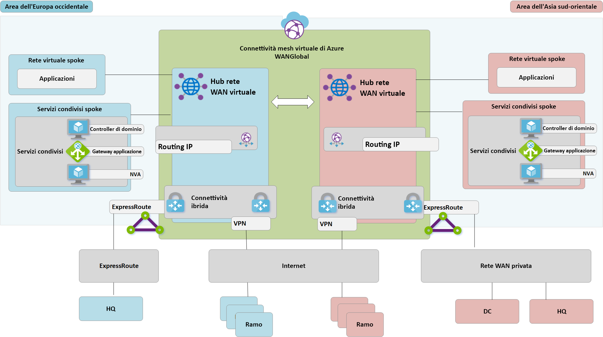
**Figura 11: Rete WAN virtuale con due aree**

Questa sezione include alcuni flussi di traffico di esempio per dimostrare come questa topologia soddisfa i requisiti originali.

### Percorso 1

Il percorso 1 descrive il flusso del traffico tra la filiale asiatica connessa tramite VPN da sito a sito a una rete virtuale di Azure nell'area Asia sud-orientale.

Il traffico viene instradato come segue:
- La filiale asiatica è connessa tramite tunnel resilienti abilitati per BGP da sito a sito all'hub della rete WAN virtuale dell'Asia sud-orientale.
- L'hub della rete WAN virtuale in Asia instrada il traffico in locale alla rete virtuale connessa.

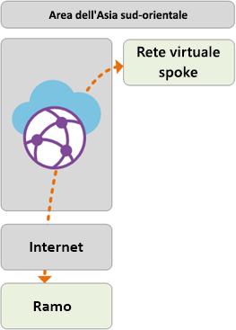

### Percorso 2
Il percorso 2 descrive il flusso del traffico tra la sede centrale europea connessa tramite ExpressRoute a una rete virtuale di Azure nell'area Asia sud-orientale.

Il traffico viene instradato come segue:
- La sede centrale europea è connessa tramite un circuito ExpressRoute Premium all'hub della rete WAN virtuale nell'area Europa occidentale.
- La connettività globale da hub a hub della rete WAN virtuale garantisce il transito del traffico verso la rete virtuale connessa nell'area remota.

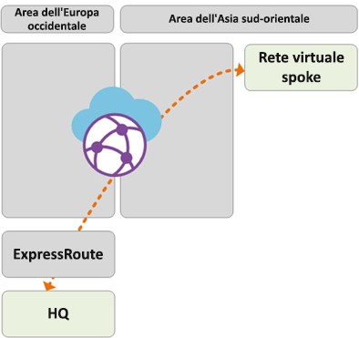

### Percorso 3
Il percorso 3 descrive il flusso del traffico tra il data center locale in Asia connesso tramite rete WAN a una filiale europea con connessione da sito a sito.

Il traffico viene instradato come segue:
- Il controller di dominio in Asia è connesso all'operatore della rete WAN privata locale.
- Il circuito ExpressRoute che in locale termina nella rete WAN privata è connesso all'hub della rete WAN virtuale nell'area Asia sud-orientale.
- La connettività globale da hub a hub della rete WAN virtuale garantisce il transito del traffico.

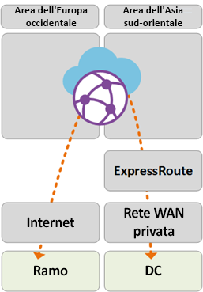

### Percorso 4
Il percorso 4 descrive il flusso del traffico tra la rete virtuale di Azure nell'area Asia sud-orientale e la rete virtuale di Azure nell'area Europa occidentale.

Il traffico viene instradato come segue:
- La connettività globale da hub a hub della rete WAN virtuale consente il transito nativo di tutte le reti virtuali di Azure connesse senza ulteriori configurazioni dell'utente.

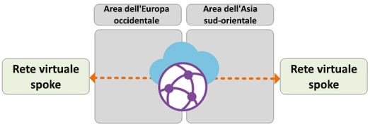

### Percorso 5
Il percorso 5 descrive il flusso di traffico tra l'utente della VPN in roaming (connessione da punto a sito) e la rete virtuale di Azure nell'area Europa occidentale.

Il traffico viene instradato come segue:
- Gli utenti di portatili e dispositivi mobili utilizzano il client OpenVPN per la connettività trasparente con il gateway VPN da punto a sito nell'area Europa occidentale.
- L'hub della rete WAN virtuale in Europa occidentale instrada il traffico in locale alla rete virtuale connessa.

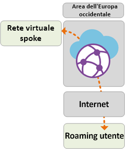

## Controllo di sicurezza e criteri tramite Firewall di Azure

Contoso ha ora verificato la connettività tra tutte le filiali e le reti virtuali in linea con i requisiti descritti in precedenza in questo documento. Per soddisfare i requisiti per il controllo di sicurezza e l'isolamento della rete, è necessario continuare a separare e registrare il traffico tramite la rete dell'hub, una funzione svolta in precedenza da un'appliance virtuale di rete. Contoso vuole anche rimuovere gli attuali servizi proxy e utilizzare servizi nativi di Azure per il filtro di Internet in uscita. 

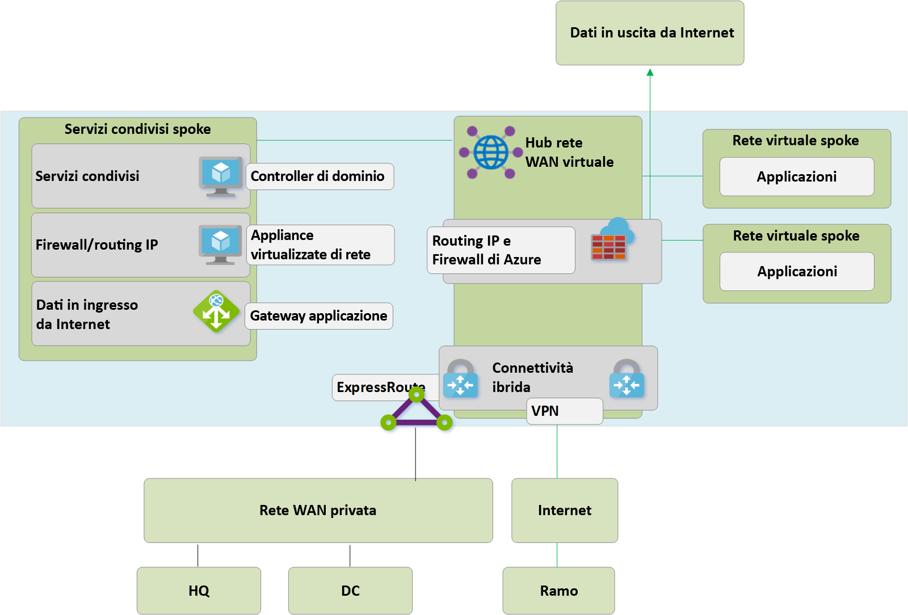
**Figura 12: Firewall di Azure nella rete WAN virtuale (hub virtuale protetto)**

I passaggi dettagliati seguenti sono necessari per introdurre Firewall di Azure negli hub della rete WAN virtuale e rendere disponibile un punto unificato di controllo dei criteri. Questo processo e il concetto di hub virtuali protetti sono descritti in maggior dettaglio [qui](https://go.microsoft.com/fwlink/?linkid=2107683).
- Creare i criteri di Firewall di Azure.
- Collegare i criteri firewall all'hub della rete WAN virtuale di Azure.
- Il passaggio precedente consente all'hub della rete WAN virtuale esistente di fungere da hub virtuale protetto e distribuisce le risorse necessarie di Firewall di Azure.

> [!NOTE]
> Se Firewall di Azure viene distribuito in un hub di rete WAN virtuale Standard (SKU Standard): I criteri V2V, B2V, V2I e B2I del firewall vengono applicati solo al traffico originato da reti virtuali e filiali connesse all'hub specifico in cui è distribuito Firewall di Azure (hub protetto). Il traffico originato da reti virtuali e filiali remote collegate ad altri hub della stessa rete WAN virtuale non viene protetto da firewall, neanche se tali filiali e reti virtuali remote sono interconnesse tramite collegamenti da hub a hub della rete WAN virtuale. Il supporto per il firewall tra più hub è previsto nella roadmap della rete WAN virtuale di Azure e di Gestione firewall di Azure.

Di seguito vengono descritti i percorsi di connettività abilitati utilizzando hub virtuali protetti di Azure.

### Percorso 6
Il percorso 6 descrive il flusso di traffico sicuro tra reti virtuali all'interno della stessa area.

Il traffico viene instradato come segue:
- Le reti virtuali connesse allo stesso hub virtuale protetto ora instradano il traffico tramite Firewall di Azure.
- Firewall di Azure può applicare i criteri a questi flussi.

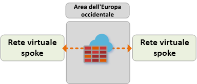

### Percorso 7
Il percorso 7 descrive il flusso del traffico da rete virtuale di Azure a Internet o a un servizio di sicurezza di terze parti.

Il traffico viene instradato come segue:
- Le reti virtuali connesse all'hub virtuale protetto possono inviare il traffico a destinazioni pubbliche su Internet, usando l'hub protetto come punto centrale di accesso a Internet.
- Questo traffico può essere filtrato localmente usando le regole FQDN di Firewall di Azure o inviato a un servizio di sicurezza di terze parti per l'ispezione.

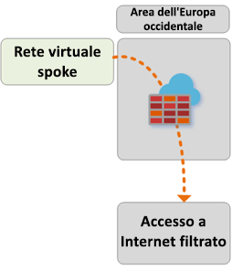

### Percorso 8
Il percorso 8 descrive il flusso del traffico da filiale a Internet o a un servizio di sicurezza di terze parti.

Il traffico viene instradato come segue:
- Le filiali connesse all'hub virtuale protetto possono inviare il traffico a destinazioni pubbliche su Internet, usando l'hub protetto come punto centrale di accesso a Internet.
- Questo traffico può essere filtrato localmente usando le regole FQDN di Firewall di Azure o inviato a un servizio di sicurezza di terze parti per l'ispezione.

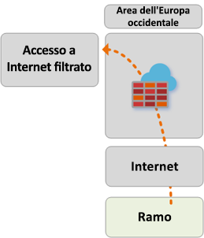 

## Passaggi successivi
Altre informazioni sulla [rete WAN virtuale di Azure](virtual-wan-about.md)
