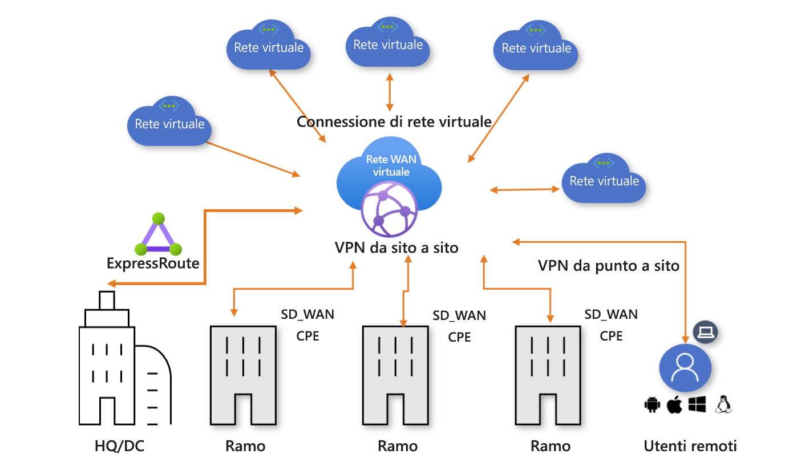

# Informazioni sulla rete WAN virtuale di Azure

La rete WAN virtuale di Azure è un servizio di rete che offre connettività tra rami ottimizzata e automatizzata verso e tramite Azure. Le aree di Azure fungono da hub a cui è possibile scegliere di connettere i rami. È possibile sfruttare il backbone di Azure per anche connettere i rami e sfruttare i vantaggi della connettività da ramo a VNet. È disponibile un elenco di partner che supportano l'automazione della connettività con VPN di rete WAN virtuale di Azure. Per maggiori informazioni, vedere l'articolo [Partner e località della rete WAN virtuale](virtual-wan-locations-partners.md).

La rete WAN virtuale di Azure raggruppa in una singola interfaccia operativa numerosi servizi di connettività cloud di Azure, ad esempio VPN da sito a sito, VPN utente da punto a sito ed ExpressRoute. La connettività con le reti virtuali di Azure viene stabilita tramite connessioni di rete virtuali. Rende disponibile un'[architettura di rete di transito globale](virtual-wan-global-transit-network-architecture.md) basata su un classico modello di connettività hub-spoke in cui l'hub di rete ospitato nel cloud consente la connettività di transito tra gli endpoint che possono essere distribuiti tra tipi diversi di spoke.

Questo articolo offre una panoramica rapida della connettività di rete nella rete WAN virtuale di Azure. La rete WAN virtuale offre i vantaggi seguenti:

* **Soluzioni di connettività integrate in un modello hub-spoke:** automatizzano la configurazione da sito a sito e la connettività tra siti locali e un hub di Azure.
* **Impostazione e configurazione automatizzate dello spoke:** consentono di connettere reti virtuali e carichi di lavoro all'hub di Azure senza interruzioni.
* **Risoluzione dei problemi intuitiva:** è possibile visualizzare l'intero flusso all'interno di Azure e quindi usare queste informazioni per intraprendere le azioni necessarie.

## Reti WAN virtuali di base e standard

Sono disponibili due tipi di rete WAN virtuale: Di base e standard. La tabella seguente mostra le configurazioni disponibili per ogni tipo.

[!INCLUDE [Basic and Standard SKUs](../../includes/virtual-wan-standard-basic-include.md)]

Per i passaggi necessari per l'aggiornamento di una rete WAN virtuale, vedere [Aggiornare una rete WAN virtuale dal livello di base a quello standard](upgrade-virtual-wan.md).

## Risorse della rete WAN virtuale

Per configurare una rete WAN virtuale completa, si creano le risorse seguenti:

* **Rete WAN virtuale:** la risorsa rete WAN virtuale rappresenta una sovrapposizione virtuale della rete di Azure ed è una raccolta di più risorse. Sono inclusi collegamenti a tutti gli hub virtuali che si desidera avere all'interno della rete WAN virtuale. Le risorse della rete WAN virtuale vengono isolate l'una dall'altra e non possono contenere un hub comune. Gli hub virtuali nella rete WAN virtuale non comunicano tra loro.

* **Hub**: Un hub virtuale è una rete virtuale gestita da Microsoft. L'hub contiene vari endpoint di servizio per abilitare la connettività. Dalla rete locale (vpnsite) è possibile connettersi a un gateway VPN all'interno dell'hub virtuale, connettere circuiti ExpressRoute a un hub virtuale o anche connettere utenti di dispositivi mobili a un gateway da punto a sito nell'hub virtuale. L'hub è l'elemento centrale della rete in un'area. Può esistere solo un unico hub per ogni area di Azure.

  Un gateway dell'hub non equivale a un gateway di rete virtuale, usato per ExpressRoute e Gateway VPN. Quando si usa una rete WAN virtuale, ad esempio, non si crea una connessione da sito a sito dal sito locale direttamente alla rete virtuale, ma al contrario una connessione da sito a sito all'hub. Il traffico passa sempre attraverso il gateway dell'hub. Questo significa che le reti virtuali non hanno bisogno di un gateway di rete virtuale proprio. La rete WAN virtuale consente alle reti virtuali di sfruttare i vantaggi di una facile scalabilità tramite l'hub virtuale e il gateway di hub virtuale.

* **Connessione di rete virtuale e hub:** questa risorsa viene usata per connettere facilmente l'hub alla rete virtuale.

* **Connessione da hub a hub (anteprima)** : gli hub sono connessi tra loro in una rete WAN virtuale. Ciò implica che un ramo, un utente o una rete virtuale connessa a un hub locale può comunicare con un altro ramo o rete virtuale usando l'architettura a mesh completa degli hub connessi. È anche possibile connettere reti virtuali all'interno di un hub che transita attraverso l'hub virtuale, oltre a reti virtuali tra hub, usando il framework connesso da hub a hub.

* **Tabella di route dell'hub:**  è possibile creare una route dell'hub virtuale e applicare la route alla tabella della route dell'hub virtuale. È possibile applicare più route alla tabella di route dell'hub virtuale.

**Altre risorse della rete WAN virtuale**

  * **Sito:** questa risorsa si usa solo per le connessioni da sito a sito. La risorsa sito è **vpnsite**. Rappresenta il dispositivo VPN locale e le relative impostazioni. Se si collabora con un partner di rete WAN virtuale, si avrà a disposizione una soluzione predefinita per esportare automaticamente queste informazioni in Azure.

## Connettività

La rete WAN virtuale consente i tipi di connettività seguenti: VPN da sito a sito, VPN utente da punto a sito ed ExpressRoute.

### Connessioni VPN da sito a sito

Per creare una connessione della rete WAN virtuale da sito a sito, è possibile collaborare con un partner disponibile. Se non si vuole coinvolgere un partner, è possibile configurare la connessione manualmente. Per altre informazioni, vedere [Creare una connessione da sito a sito con la rete WAN virtuale](virtual-wan-site-to-site-portal.md).

#### Flusso di lavoro del partner della rete WAN virtuale

Se si collabora con un partner della rete WAN virtuale, il flusso di lavoro è il seguente:

1. Il controller (VPN/SDWAN) del dispositivo della succursale viene autenticato per esportare le informazioni specifiche del sito in [Azure usando un'entità servizio di Azure](../active-directory/develop/howto-create-service-principal-portal.md).
2. Il controller (VPN/SDWAN) del dispositivo della succursale ottiene la configurazione della connettività di Azure e aggiorna il dispositivo locale. Ciò consente di automatizzare il download della configurazione, la modifica e l'aggiornamento del dispositivo VPN locale.
3. Quando il dispositivo ha la configurazione di Azure corretta, viene stabilita una connessione da sito a sito (due tunnel attivi) alla rete WAN di Azure. Azure supporta IKEv1 e IKEv2. BGP è facoltativo.

#### Partner per le connessioni di rete WAN virtuale da sito a sito

Per un elenco di partner e località disponibili, vedere l'articolo [Partner e località della rete WAN virtuale](virtual-wan-locations-partners.md).

### Connessioni di VPN utente da punto a sito

È possibile connettersi alle risorse in Azure tramite una connessione IPsec/IKE (IKEv2) o OpenVPN. Questo tipo di connessione richiede la configurazione di un client VPN nel computer client. Per altre informazioni, vedere [Creare una connessione da punto a sito](virtual-wan-point-to-site-portal.md).

### Connessioni ExpressRoute
ExpressRoute consente di connettere la rete locale ad Azure tramite una connessione privata. Per creare la connessione, vedere [Creare una connessione ExpressRoute tramite la rete WAN virtuale](virtual-wan-expressroute-portal.md).

## Località

Per informazioni sulle località, vedere l'articolo [Partner e località della rete WAN virtuale](virtual-wan-locations-partners.md).

## Domande frequenti

[!INCLUDE [Virtual WAN FAQ](../../includes/virtual-wan-faq-include.md)]

## Passaggi successivi

[Creare una connessione da sito a sito tramite la rete WAN virtuale](virtual-wan-site-to-site-portal.md)
