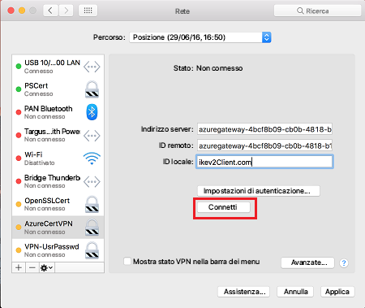

# <a name="configure-a-point-to-site-connection-to-a-vnet-using-radius-authentication-powershell-preview"></a>Configurare una connessione da punto a sito a una rete virtuale usando l'autenticazione RADIUS: PowerShell (Anteprima)

Questo articolo illustra come creare una rete virtuale con una connessione da punto a sito che usa l'autenticazione RADIUS. Questa configurazione è disponibile solo per il modello di distribuzione Resource Manager.

>[!NOTE]
>L'autenticazione RADIUS da punto a sito (P2S) è attualmente in fase di anteprima.
>

Un gateway VPN da punto a sito (P2S) consente di creare una connessione sicura alla rete virtuale da un singolo computer client. Le connessioni VPN da punto a sito sono utili per connettersi alla rete virtuale da una posizione remota, ad esempio nel caso di telecomunicazioni da casa o durante una riunione. Una VPN P2S è anche una soluzione utile da usare al posto di una VPN da sito a sito quando solo pochi client devono connettersi a una rete virtuale.

Una connessione VPN P2S viene avviata dai dispositivi Windows e Mac. I client che si connettono possono usare i metodi di autenticazione seguenti:

* Server RADIUS
* Autenticazione del certificato nativo tramite il gateway VPN

Questo articolo illustra come eseguire una configurazione P2S con l'autenticazione usando il server RADIUS. Per eseguire invece l'autenticazione usando i certificati generati e l'autenticazione del certificato nativo tramite il gateway VPN, vedere [Configurare una connessione da punto a sito a una rete virtuale usando l'autenticazione del certificato nativo tramite il gateway VPN](vpn-gateway-howto-point-to-site-rm-ps.md).


Le connessioni da punto a sito non richiedono un dispositivo VPN o un indirizzo IP pubblico. La modalità da punto a sito crea la connessione VPN tramite SSTP (Secure Sockets Tunneling Protocol) o IKEv2.

* SSTP è un tunnel VPN basato su SSL supportato solo nelle piattaforme client Windows. Può penetrare i firewall e per questo è l'opzione ideale per connettersi ad Azure ovunque. Sul lato server sono supportate le versioni 1.0, 1.1 e 1.2 di SSTP. Il client decide quale versione usare. Per Windows 8.1 e versioni successive, SSTP usa per impostazione predefinita la versione 1.2.

* VPN IKEv2, una soluzione VPN IPsec basata su standard. VPN IKEv2 può essere usato per connettersi da dispositivi Mac (versioni OSX 10.11 e successive).

Le connessioni da punto a sito richiedono gli elementi seguenti:

* Un gateway VPN RouteBased. 
* Un server RADIUS per gestire l'autenticazione utente. Il server RADIUS può essere distribuito in locale o nella rete virtuale di Azure.
* Un pacchetto di configurazione del client VPN per i dispositivi Windows che si connetteranno alla rete virtuale. Un pacchetto di configurazione del client VPN fornisce le impostazioni necessarie per la connessione di un client VPN tramite P2S.

## <a name="aboutad"></a>Informazioni sull'autenticazione di un dominio di Active Directory (AD) per le VPN P2S

L'autenticazione di un dominio di AD consente agli utenti di accedere ad Azure usando le credenziali di dominio dell'organizzazione. Richiede un server RADIUS che si integra con il server AD. Le organizzazioni possono anche sfruttare la distribuzione RADIUS esistente.
 
Il server RADIUS può trovarsi in locale o nella rete virtuale di Azure. Durante l'autenticazione, il gateway VPN funge da pass-through e inoltra i messaggi di autenticazione tra il server RADIUS e il dispositivo che si connette e viceversa. È importante per il gateway VPN poter raggiungere il server RADIUS. Se il server RADIUS si trova in locale, è necessaria una connessione VPN da sito a sito da Azure al sito locale.

Oltre che con Active Directory, un server RADIUS può anche integrarsi con altri sistemi di identità esterni, offrendo così molte opzioni di autenticazione per le VPN da punto a sito, incluse le opzioni MFA. Vedere la documentazione del fornitore del server RADIUS per ottenere l'elenco dei sistemi di identità con cui si integra.


> [!IMPORTANT]
>Per la connessione a un server RADIUS locale si può usare una connessione VPN da sito a sito. Non può essere usata una connessione ExpressRoute.
>
>

## <a name="before"></a>Prima di iniziare

* Verificare di possedere una sottoscrizione di Azure. Se non si ha una sottoscrizione di Azure, è possibile attivare i [vantaggi per i sottoscrittori di MSDN](https://azure.microsoft.com/pricing/member-offers/msdn-benefits-details) oppure iscriversi per ottenere un [account gratuito](https://azure.microsoft.com/pricing/free-trial).

* Installare la versione più recente dei cmdlet di PowerShell per Azure Resource Manager. Per altre informazioni sull'installazione dei cmdlet di PowerShell, vedere [Come installare e configurare Azure PowerShell](/powershell/azure/overview).

### <a name="log-in"></a>Accesso

[!INCLUDE [Log in](../../includes/vpn-gateway-ps-login-include.md)]

### <a name="example"></a>Valori di esempio

È possibile usare i valori di esempio per creare un ambiente di test o fare riferimento a questi valori per comprendere meglio gli esempi di questo articolo. È possibile seguire la procedura dettagliata e usare i valori senza modificarle oppure modificarli in base all'ambiente.

* **Nome: VNet1**
* **Spazio degli indirizzi: 192.168.0.0/16** e **10.254.0.0/16**<br>Per questo esempio, si usa più di uno spazio indirizzi per mostrare che la configurazione funziona con più spazi indirizzi, ma per questa configurazione non sono necessari più spazi indirizzi.
* **Nome subnet: FrontEnd**
  * **Intervallo di indirizzi subnet: 192.168.1.0/24**
* **Nome subnet: BackEnd**
  * **Intervallo di indirizzi subnet: 10.254.1.0/24**
* **Nome subnet: GatewaySubnet**<br>Il nome subnet *GatewaySubnet* è obbligatorio per il funzionamento del gateway VPN.
  * **Intervallo di indirizzi subnet del gateway: 192.168.200.0/24** 
* **Pool di indirizzi client VPN: 172.16.201.0/24**<br>I client VPN che si connettono alla rete virtuale con questa connessione da punto a sito ricevono un indirizzo IP dal pool di indirizzi client VPN.
* **Sottoscrizione:** se si hanno più sottoscrizioni, verificare di usare quella corretta.
* **Gruppo di risorse: TestRG**
* **Località: Stati Uniti orientali**
* **Server DNS: indirizzo IP** del server DNS che si vuole usare per la risoluzione dei nomi per la rete virtuale. (facoltativo).
* **Nome del gateway: Vnet1GW**
* **Nome dell'IP pubblico: VNet1GWPIP**
* **VpnType: RouteBased** 

## 1. <a name="vnet"></a>Creare il gruppo di risorse, la rete virtuale e l'indirizzo IP pubblico

I passaggi seguenti creano un gruppo di risorse e una rete virtuale nel gruppo di risorse con tre subnet. Quando si sostituiscono i valori, è importante che la subnet gateway venga denominata sempre esattamente 'GatewaySubnet'. Se si assegnano altri nomi, la creazione del gateway ha esito negativo.

1. Creare un gruppo di risorse.

  ```powershell
  New-AzureRmResourceGroup -Name "TestRG" -Location "East US"
  ```
2. Creare le configurazioni delle subnet per la rete virtuale, denominandole *FrontEnd*, *BackEnd* e *GatewaySubnet*. Questi prefissi devono fare parte dello spazio indirizzi della rete virtuale dichiarato.

  ```powershell
  $fesub = New-AzureRmVirtualNetworkSubnetConfig -Name "FrontEnd" -AddressPrefix "192.168.1.0/24"  
  $besub = New-AzureRmVirtualNetworkSubnetConfig -Name "Backend" -AddressPrefix "10.254.1.0/24"  
  $gwsub = New-AzureRmVirtualNetworkSubnetConfig -Name "GatewaySubnet" -AddressPrefix "192.168.200.0/24"
  ```
3. Creare la rete virtuale.

  In questo esempio il parametro del server -DnsServer è facoltativo. Se si specifica un valore, non verrà creato un nuovo server DNS. L'indirizzo IP del server DNS specificato deve essere un server DNS che riesce a risolvere i nomi per le risorse a cui ci si connette dalla rete virtuale. Per questo esempio, è stato usato un indirizzo IP privato, ma è probabile che non si tratti dell'indirizzo IP del server DNS. Assicurarsi di usare valori personalizzati. Il valore specificato viene usato dalle risorse distribuite nella rete virtuale, non dalla connessione P2S.

  ```powershell
  New-AzureRmVirtualNetwork -Name "VNet1" -ResourceGroupName "TestRG" -Location "East US" -AddressPrefix "192.168.0.0/16","10.254.0.0/16" -Subnet $fesub, $besub, $gwsub -DnsServer 10.2.1.3
  ```
4. Un gateway VPN deve avere un indirizzo IP pubblico. È necessario richiedere prima di tutto la risorsa dell'indirizzo IP e quindi farvi riferimento durante la creazione del gateway di rete virtuale. L'indirizzo IP viene assegnato dinamicamente alla risorsa durante la creazione del gateway VPN. Il gateway VPN supporta attualmente solo l'allocazione degli indirizzi IP pubblici *dinamici*. Non è possibile richiedere un'assegnazione degli indirizzi IP pubblici statici. Ciò non significa tuttavia che l'indirizzo IP viene modificato dopo l'assegnazione al gateway VPN. L'indirizzo IP pubblico viene modificato solo quando il gateway viene eliminato e ricreato. Non viene modificato in caso di ridimensionamento, reimpostazione o altre manutenzioni/aggiornamenti del gateway VPN.

  Specificare le variabili per richiedere un indirizzo IP pubblico assegnato dinamicamente.

  ```powershell
  $vnet = Get-AzureRmVirtualNetwork -Name "VNet1" -ResourceGroupName "TestRG"  
  $subnet = Get-AzureRmVirtualNetworkSubnetConfig -Name "GatewaySubnet" -VirtualNetwork $vnet 
  $pip = New-AzureRmPublicIpAddress -Name "VNet1GWPIP" -ResourceGroupName "TestRG" -Location "East US" -AllocationMethod Dynamic 
  $ipconf = New-AzureRmVirtualNetworkGatewayIpConfig -Name "gwipconf" -Subnet $subnet -PublicIpAddress $pip
  ```

## 2. <a name="radius"></a>Configurare il server RADIUS

Prima di creare e configurare il gateway di rete virtuale, il server RADIUS deve essere configurato correttamente per l'autenticazione.

1. Se necessario, distribuire un server RADIUS. Per la procedura di distribuzione, vedere la guida alla configurazione del fornitore RADIUS.  
2. Configurare il gateway VPN come client RADIUS in RADIUS. Quando si aggiunge questo client RADIUS, specificare l'elemento GatewaySubnet di rete virtuale creato. 
3. Dopo avere configurato il server RADIUS, ottenere l'indirizzo IP del server RADIUS e il segreto condiviso che i client RADIUS devono usare per comunicare con il server RADIUS. Se il server RADIUS è nella rete virtuale di Azure, usare l'IP della CA della VM del server RADIUS.

L'articolo [Server dei criteri di rete (NPS)](https://docs.microsoft.com/windows-server/networking/technologies/nps/nps-top) fornisce indicazioni sulla configurazione di un server RADIUS Windows (NPS) per l'autenticazione di un dominio di AD.

## 3. <a name="creategw"></a>Creare il gateway VPN

Configurare e creare il gateway VPN per la rete virtuale.

* -GatewayType deve essere "Vpn" e -VpnType deve essere "RouteBased".
* Per il completamento di un gateway VPN possono essere necessari fino a 45 minuti, in base allo  [SKU del gateway](vpn-gateway-about-vpn-gateway-settings.md#gwsku)  selezionato.

```powershell
New-AzureRmVirtualNetworkGateway -Name $GWName -ResourceGroupName $RG `
-Location $Location -IpConfigurations $ipconf -GatewayType Vpn `
-VpnType RouteBased -EnableBgp $false -GatewaySku VpnGw1
```

## 4. <a name="addradius"></a>Aggiungere il server RADIUS e il pool di indirizzi client
 
* -RadiusServer può essere specificato con il nome o con l'indirizzo IP. Se si specifica il nome e il server si trova in locale, il gateway VPN potrebbe non riuscire a risolvere il nome. In tal caso è meglio specificare l'indirizzo IP del server. 
* -RadiusSecret deve corrispondere a quanto configurato nel server RADIUS.
* -VpnCientAddressPool è l'intervallo da cui i client VPN che si connettono ricevono un indirizzo IP. Usare un intervallo di indirizzi IP privati che non si sovrapponga con la posizione locale da cui verrà effettuata la connessione o con la rete virtuale a cui ci si vuole connettere. Assicurarsi di avere configurato un pool di indirizzi di dimensioni sufficienti.  

1. Creare una stringa sicura per il segreto RADIUS.

  ```powershell
  $Secure_Secret=Read-Host -AsSecureStrinng -Prompt "RadiusSecret"
  ```

2. Viene richiesto di immettere il segreto RADIUS. I caratteri immessi non verranno visualizzati e saranno sostituiti dal carattere "*".

  ```powershell
  RadiusSecret:***
  ```
3. Aggiungere il pool di indirizzi client VPN e le informazioni sul server RADIUS.

  Per le configurazioni SSTP:

    ```powershell
    $Gateway = Get-AzureRmVirtualNetworkGateway -ResourceGroupName $RG -Name $GWName '
    Set-AzureRmVirtualNetworkGateway -VirtualNetworkGateway $Gateway '
    -VpnClientAddressPool "172.16.201.0/24" VpnClientProtocols "SSTP" '
    -RadiusServerAddress "10.51.0.15" -RadiusServerSecret $Secure_Secret
    ```

  Per le configurazioni IKEv2:

    ```powershell
    $Gateway = Get-AzureRmVirtualNetworkGateway -ResourceGroupName $RG -Name $GWName '
    Set-AzureRmVirtualNetworkGateway -VirtualNetworkGateway $Gateway '
    -VpnClientAddressPool "172.16.201.0/24" VpnClientProtocols "IKEv2" '
    -RadiusServerAddress "10.51.0.15" -RadiusServerSecret $Secure_Secret
    ```

  Per SSTP + IKEv2

    ```powershell
    Set-AzureRmVirtualNetworkGateway -VirtualNetworkGateway $Gateway '
    -VpnClientAddressPool "172.16.201.0/24" VpnClientProtocols @{ "SSTP", "IkeV2" } '
    -RadiusServerAddress "10.51.0.15" -RadiusServerSecret $Secure_Secret
    ```

## 5. <a name="vpnclient"></a>Scaricare il pacchetto di configurazione del client VPN e configurare il client VPN

La configurazione del client VPN consente ai dispositivi di connettersi a una rete virtuale tramite una connessione P2S. Per generare un pacchetto di configurazione del client VPN e configurare il client VPN, vedere [Creare una configurazione del client VPN per l'autenticazione RADIUS](point-to-site-vpn-client-configuration-radius.md).

## <a name="connect"></a>6. Connect to Azure

### <a name="to-connect-from-a-windows-vpn-client"></a>Per connettersi da un client VPN Windows

1. Per connettersi alla rete virtuale, nel computer client passare alle connessioni VPN e individuare quella creata, che ha lo stesso nome della rete virtuale locale. Immettere le credenziali di dominio e fare clic su "Connetti". Viene visualizzato un messaggio popup che richiede diritti elevati. Accettarlo e immettere le credenziali.

  
2. Verrà stabilita la connessione.

  

### <a name="connect-from-a-mac-vpn-client"></a>Connettersi da un client VPN Mac

Dalla finestra di dialogo Rete individuare il profilo client che si vuole usare, quindi fare clic su **Connessione**.

  

## <a name="verify"></a>Per verificare la connessione

1. Per verificare che la connessione VPN è attiva, aprire un prompt dei comandi con privilegi elevati ed eseguire *ipconfig/all*.
2. Visualizzare i risultati. Si noti che l'indirizzo IP ricevuto è uno degli indirizzi compresi nel pool di indirizzi del client VPN da punto a sito specificato al momento della configurazione. I risultati sono simili a questo esempio:

  ```
  PPP adapter VNet1:
      Connection-specific DNS Suffix .:
      Description.....................: VNet1
      Physical Address................:
      DHCP Enabled....................: No
      Autoconfiguration Enabled.......: Yes
      IPv4 Address....................: 172.16.201.3(Preferred)
      Subnet Mask.....................: 255.255.255.255
      Default Gateway.................:
      NetBIOS over Tcpip..............: Enabled
  ```

## <a name="connectVM"></a>Per connettersi a una macchina virtuale

[!INCLUDE [Connect to a VM](../../includes/vpn-gateway-connect-vm-p2s-include.md)]

## <a name="faq"></a>Domande frequenti

Queste domande frequenti si applicano a P2S con l'autenticazione RADIUS

[!INCLUDE [Point-to-Site RADIUS FAQ](../../includes/vpn-gateway-faq-p2s-radius-include.md)]

## <a name="next-steps"></a>Passaggi successivi

Dopo aver completato la connessione, è possibile aggiungere macchine virtuali alle reti virtuali. Per altre informazioni, vedere [Macchine virtuali](https://docs.microsoft.com/azure/#pivot=services&panel=Compute). Per altre informazioni sulla rete e sulle macchine virtuali, vedere [Panoramica di rete delle macchine virtuali Linux e Azure](../virtual-machines/linux/azure-vm-network-overview.md).
