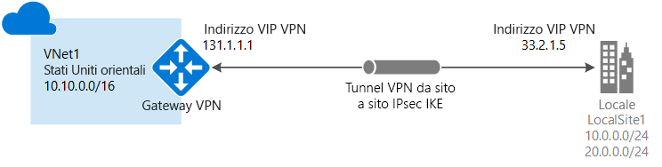
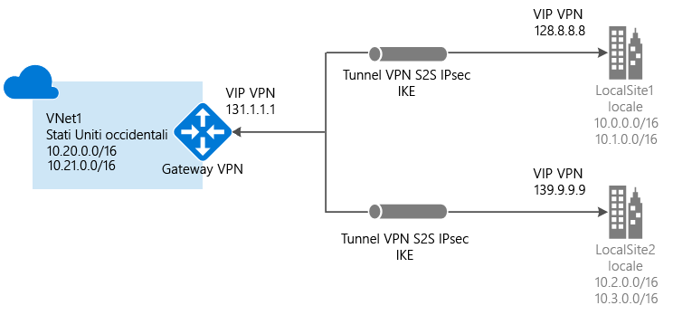
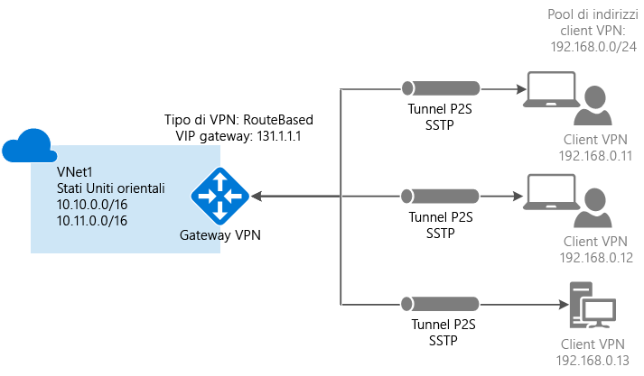
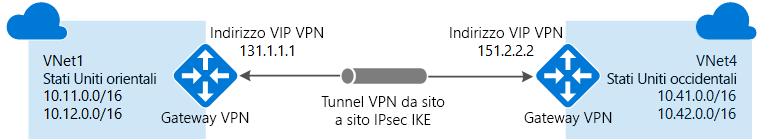
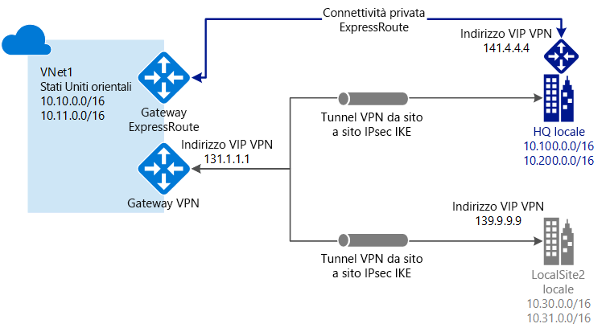

# Informazioni sul gateway VPN

Un gateway VPN è un tipo di gateway di rete virtuale che invia traffico crittografato a un percorso locale tramite una connessione pubblica. È possibile anche usare gateway VPN per inviare traffico crittografato tra le reti virtuali di Azure tramite la rete Microsoft. Per inviare traffico di rete crittografato tra la rete virtuale di Azure e il sito locale, è necessario creare un gateway VPN per la rete virtuale.

Sebbene ogni rete virtuale possa avere solo un gateway VPN, è possibile creare più connessioni allo stesso gateway VPN. Una configurazione di connessione multisito ne è un esempio. Quando si creano più connessioni allo stesso gateway VPN, tutti i tunnel VPN, incluse le VPN da punto a sito, condividono la larghezza di banda disponibile per il gateway.

### Che cos'è un gateway di rete virtuale?

Un gateway di rete virtuale è costituito da due o più macchine virtuali distribuite in una subnet specifica denominata GatewaySubnet. Le macchine virtuali presenti nella GatewaySubnet vengono create nel momento in cui si crea il gateway di rete virtuale. Le macchine virtuali del gateway di rete virtuale sono configurate per contenere tabelle di routing e servizi specifici del gateway. È possibile configurare direttamente le macchine virtuali che fanno parte del gateway di rete virtuale ed è opportuno non distribuire mai risorse aggiuntive nella GatewaySubnet.

Quando si crea un gateway di rete virtuale usando il tipo di gateway "Vpn", viene creato un tipo specifico di gateway di rete virtuale che esegue la crittografia del traffico, ovvero un gateway VPN. Per la creazione di un gateway VPN possono essere necessari fino a 45 minuti. Le VM per il gateway VPN vengono infatti distribuite in GatewaySubnet e vengono configurate con le impostazioni specificate. Lo SKU di gateway selezionato determina le capacità delle VM.

## SKU del gateway

[!INCLUDE [vpn-gateway-gwsku-include](../../includes/vpn-gateway-gwsku-include.md)]

## Configurazione di un gateway VPN

Una connessione gateway VPN si basa su più risorse configurate con impostazioni specifiche. La maggior parte delle risorse può essere configurata separatamente, anche se in alcuni casi è necessario configurarle seguendo un determinato ordine.

### Impostazioni

Le impostazioni scelte per ogni risorsa sono fondamentali per creare una connessione corretta. Per informazioni sulle singole risorse e le impostazioni per il gateway VPN, vedere [Informazioni sulle impostazioni del gateway VPN](vpn-gateway-about-vpn-gateway-settings.md). Si troveranno informazioni su tipi di gateway, tipi di VPN, tipi di connessione, subnet del gateway, gateway di rete locale e diverse altre impostazioni delle risorse che potrebbero essere utili.

### Strumenti di distribuzione

È possibile iniziare a creare e configurare le risorse usando uno strumento di configurazione, ad esempio il portale di Azure, e successivamente decidere di passare a un altro strumento, ad esempio PowerShell, per configurare risorse aggiuntive o eventualmente modificare quelle esistenti. Attualmente, non è possibile configurare tutte le risorse e le relative impostazioni nel portale di Azure. Le istruzioni riportate negli articoli per ogni topologia di connessione indicano se è necessario usare uno strumento di configurazione specifico. 

### Modello di distribuzione

Quando si configura un gateway VPN, i passaggi da eseguire dipendono dal modello di distribuzione usato per creare la rete virtuale. Ad esempio, se la rete virtuale è stata creata usando il modello di distribuzione classica, per creare e configurare le impostazioni del gateway VPN si usano le linee guida e le istruzioni per il modello di distribuzione classica. Per altre informazioni sui modelli di distribuzione, vedere [Confronto tra distribuzione di Azure Resource Manager e classica: comprensione dei modelli di implementazione e dello stato delle risorse](../azure-resource-manager/resource-manager-deployment-model.md).

## Diagrammi delle topologie di connessione

È importante tenere presente che sono disponibili configurazioni diverse per le connessioni del gateway VPN. È necessario determinare la configurazione più adatta alle proprie esigenze. Nelle sezioni seguenti è possibile trovare informazioni e diagrammi delle topologie sulle connessioni gateway VPN seguenti. Le sezioni seguenti contengono tabelle che elencano:

* Modello di distribuzione disponibile
* Strumenti di configurazione disponibili
* Collegamenti che visualizzano direttamente un articolo, se disponibile

Usare i diagrammi e le descrizioni per selezionare la topologia di connessione più adatta alle esigenze. I diagrammi illustrano le principali topologie di base, ma è possibile creare configurazioni più complesse usando i diagrammi come riferimento.

## Da sito a sito e multisito (tunnel VPN IPsec/IKE)

### Da sito a sito

Una connessione gateway VPN da sito a sito (S2S) avviene tramite un tunnel VPN IPsec/IKE (IKEv1 o IKEv2). Questo tipo di connessione richiede un dispositivo VPN che si trova in locale con un indirizzo IP pubblico assegnato e non dietro una NAT. Le connessioni S2S possono essere usate per le configurazioni cross-premise e ibride.   

### Multisito

Questo tipo di connessione è una variante della connessione da sito a sito. È possibile creare più di una connessione VPN dal gateway di rete virtuale, che in genere connette a più siti locali. Quando si usano più connessioni, è necessario usare una rete VPN di tipo RouteBased (nota come gateway dinamico nell'ambito delle reti virtuali classiche). Poiché ogni rete virtuale può avere un solo gateway VPN, tutte le connessioni che usano il gateway condividono la larghezza di banda disponibile. Questo tipo di connessione è spesso definito "multisito".

### Metodi e modelli di distribuzione per connessioni da sito a sito e multisito

[!INCLUDE [vpn-gateway-table-site-to-site](../../includes/vpn-gateway-table-site-to-site-include.md)]

## Da punto a sito (VPN su SSTP)

Una connessione gateway VPN da punto a sito (P2S) consente di creare una connessione sicura alla rete virtuale da un singolo computer client. P2S è una connessione VPN tramite SSTP (Secure Sockets Tunneling Protocol). A differenza delle connessioni da sito a sito, le connessioni da punto a sito non necessitano di un indirizzo IP pubblico locale o di un dispositivo VPN. Per stabilire la connessione VPN, avviarla dal computer client. Questa è la soluzione ideale quando ci si vuole connettere alla rete virtuale da una posizione remota, ad esempio da casa o durante una riunione, oppure quando solo pochi client devono connettersi a una rete virtuale. Le connessioni da punto a sito possono essere usate con le connessioni da sito a sito attraverso lo stesso gateway VPN, purché tutti i requisiti di configurazione per entrambe le connessioni siano compatibili.

### Metodi e modelli di distribuzione per connessioni da punto a sito

[!INCLUDE [vpn-gateway-table-point-to-site](../../includes/vpn-gateway-table-point-to-site-include.md)]

## Connessioni da rete virtuale a rete virtuale (tunnel VPN IPsec/IKE)

La connessione di una rete virtuale a un'altra rete virtuale (da rete virtuale a rete virtuale) è simile alla connessione di una rete virtuale a un percorso di sito locale. Entrambi i tipi di connettività utilizzano un gateway VPN per fornire un tunnel sicuro tramite IPsec/IKE. È anche possibile combinare una comunicazione tra reti virtuali con configurazioni di connessioni multisito. Questo permette di definire topologie di rete che consentono di combinare la connettività cross-premise con la connettività tra reti virtuali.

Le reti virtuali connesse possono essere:

* Nella stessa area o in aree diverse
* Nella stessa sottoscrizione o in sottoscrizioni diverse 
* Nello stesso modello di distribuzione o in modelli diversi

### Connessioni tra modelli di distribuzione

Azure offre attualmente di due modelli di distribuzione: classica e Resource Manager. Se si usa Azure da qualche tempo, si dispone probabilmente di VM e istanze del ruolo di Azure in esecuzione su una rete virtuale classica. Le VM e le istanze del ruolo più recenti potrebbero invece essere in esecuzione su una rete virtuale creata in Resource Manager. Si crea una connessione tra le reti virtuali per consentire alle risorse di una rete virtuale di comunicare direttamente con le risorse di un'altra.

### Peering reti virtuali

È possibile usare il peering reti virtuali per creare la connessione, purché la rete virtuale soddisfi determinati requisiti. Peering reti virtuali non usa un gateway di rete virtuale. Per altre informazioni, vedere [Peering reti virtuali](../virtual-network/virtual-network-peering-overview.md).

### Metodi e modelli di distribuzione per connessioni da rete virtuale a rete virtuale

[!INCLUDE [vpn-gateway-table-vnet-to-vnet](../../includes/vpn-gateway-table-vnet-to-vnet-include.md)]

## ExpressRoute (connessione privata dedicata)

Microsoft Azure ExpressRoute consente di estendere le reti locali nel cloud Microsoft tramite una connessione privata dedicata fornita da un provider di connettività. Con ExpressRoute è possibile stabilire connessioni ai servizi cloud Microsoft, come Microsoft Azure, Office 365 e CRM Online. La connettività può essere stabilita da una rete (IP VPN) any-to-any, da una rete Ethernet punto a punto o da una Cross Connection virtuale tramite un provider di connettività presso una struttura di condivisione del percorso.

Le connessioni ExpressRoute non sfruttano la rete Internet pubblica. In questo modo possono offrire un livello di sicurezza superiore, maggiore affidabilità, velocità più elevate e minori latenze rispetto alle connessioni Internet tradizionali.

Una connessione ExpressRoute non usa un gateway VPN, anche se usa un gateway di rete virtuale come parte della configurazione obbligatoria. In una connessione ExpressRoute il gateway di rete virtuale viene configurato con il tipo di gateway "ExpressRoute" invece che "Vpn". Per altre informazioni su ExpressRoute, vedere [Panoramica tecnica relativa a ExpressRoute](../expressroute/expressroute-introduction.md).

## Connessioni coesistenti da sito a sito ed ExpressRoute

ExpressRoute è una connessione dedicata diretta dalla rete WAN (non sulla rete Internet pubblica) a servizi Microsoft come Azure. Il traffico VPN da sito a sito viaggia crittografato sulla rete Internet pubblica. La possibilità di configurare connessioni VPN da sito a sito ed ExpressRoute per la stessa rete virtuale offre diversi vantaggi.

È possibile configurare una VPN da sito a sito come percorso di failover sicuro per ExpressRoute oppure usare VPN da sito a sito per connettersi a siti che non fanno parte della rete, ma che sono connessi tramite ExpressRoute. Si noti che questa configurazione richiede due gateway di rete virtuale per la stessa rete virtuale, uno che usa il tipo di gateway "Vpn" e l'altro che usa il tipo di gateway "ExpressRoute".

### Metodi e modelli di distribuzione per le connessioni da sito a sito ed ExpressRoute

[!INCLUDE [vpn-gateway-table-coexist](../../includes/vpn-gateway-table-coexist-include.md)]

## Prezzi

[!INCLUDE [vpn-gateway-about-pricing-include](../../includes/vpn-gateway-about-pricing-include.md)]

Per informazioni sugli SKU del gateway VPN, vedere [SKU del gateway](vpn-gateway-about-vpn-gateway-settings.md#gwsku).

## Domande frequenti

Per le domande frequenti sul gateway VPN, vedere le [Domande frequenti su Gateway VPN](vpn-gateway-vpn-faq.md).

## Passaggi successivi

- Pianificare la configurazione del gateway VPN. Vedere [Pianificazione e progettazione per il gateway VPN](vpn-gateway-plan-design.md).
- Per altre informazioni, vedere [Domande frequenti sul gateway VPN](vpn-gateway-vpn-faq.md).
- Vedere [Sottoscrizione e limiti del servizio](../azure-subscription-service-limits.md#networking-limits).
