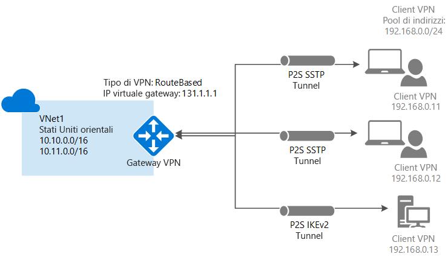

# Che cos'è un Gateway VPN?

Un gateway VPN è un tipo specifico di gateway di rete virtuale, usato per inviare traffico crittografato tra una rete virtuale di Azure e una posizione locale attraverso la rete Internet pubblica. È possibile usare un gateway VPN anche per inviare traffico crittografato tra le reti virtuali di Azure sulla rete Microsoft. Ogni rete virtuale può avere un solo gateway VPN, ma è possibile creare più connessioni allo stesso gateway VPN. Quando si creano più connessioni allo stesso gateway VPN, tutti i tunnel VPN condividono la larghezza di banda disponibile per il gateway.

## Informazioni sul gateway di rete virtuale

Un gateway di rete virtuale è costituito da due o più macchine virtuali distribuite in una subnet specifica creata, denominata *subnet del gateway*. Le macchine virtuali presenti nella subnet del gateway vengono create nel momento in cui si crea il gateway di rete virtuale. Le macchine virtuali del gateway di rete virtuale sono configurate per contenere tabelle di routing e servizi specifici del gateway. Non è possibile configurare direttamente le macchine virtuali che fanno parte del gateway di rete virtuale e non si devono mai distribuire risorse aggiuntive nella subnet del gateway.

I gateway VPN possono essere distribuiti nelle zone di disponibilità di Azure. In questo modo, i gateway di rete virtuale ottengono maggiore disponibilità, scalabilità e resilienza. La distribuzione di gateway in zone di disponibilità di Azure separa fisicamente e logicamente i gateway all'interno di un'area e consente, al contempo, di proteggere la connettività di rete locale ad Azure da errori a livello di zona. Vedere [Informazioni sui gateway di rete virtuale con ridondanza della zona in zone di disponibilità di Azure](about-zone-redundant-vnet-gateways.md)

La creazione di un gateway di rete virtuale può richiedere fino a 45 minuti. Quando si crea un gateway VPN, le macchine virtuali del gateway vengono distribuite nella subnet del gateway e configurate con le impostazioni specificate. Una delle impostazioni configurate è il tipo di gateway. Il tipo del gateway 'vpn' specifica che il tipo di gateway di rete virtuale creato è un gateway VPN. Dopo aver creato un gateway VPN, è possibile creare una connessione con tunnel VPN IPsec/IKE tra il gateway VPN creato e un altro gateway VPN (tra reti virtuali) o creare una connessione con tunnel VPN IPsec/IKE cross-premise tra il gateway VPN e un dispositivo VPN locale (da sito a sito). È anche possibile creare una connessione VPN da punto a sito (VPN su OpenVPN, IKEv2 o SSTP), che consente di connettersi alla rete virtuale da una posizione remota, ad esempio in una conferenza o da casa.

## Configurazione di un gateway VPN

Una connessione gateway VPN si basa su più risorse configurate con impostazioni specifiche. La maggior parte delle risorse può essere configurata separatamente, anche se alcune risorse devono essere configurate in un determinato ordine.

### Impostazioni

Le impostazioni scelte per ogni risorsa sono fondamentali per creare una connessione corretta. Per informazioni sulle singole risorse e le impostazioni per il gateway VPN, vedere [Informazioni sulle impostazioni del gateway VPN](vpn-gateway-about-vpn-gateway-settings.md). L'articolo contiene informazioni su tipi di gateway, SKU dei gateway, tipi di VPN, tipi di connessione, subnet dei gateway, gateway di rete locale e diverse altre impostazioni delle risorse che potrebbero risultare utili.

### Strumenti di distribuzione

È possibile iniziare a creare e configurare le risorse usando uno strumento di configurazione, ad esempio il portale di Azure, e successivamente decidere di passare a un altro strumento, ad esempio PowerShell, per configurare risorse aggiuntive o eventualmente modificare quelle esistenti. Attualmente, non è possibile configurare tutte le risorse e le relative impostazioni nel portale di Azure. Le istruzioni riportate negli articoli per ogni topologia di connessione indicano se è necessario usare uno strumento di configurazione specifico. 

### Modello di distribuzione

Esistono attualmente due modelli di distribuzione di Azure. Quando si configura un gateway VPN, i passaggi da eseguire dipendono dal modello di distribuzione usato per creare la rete virtuale. Ad esempio, se la rete virtuale è stata creata usando il modello di distribuzione classica, per creare e configurare le impostazioni del gateway VPN si usano le linee guida e le istruzioni per il modello di distribuzione classica. Per altre informazioni sui modelli di distribuzione, vedere [Confronto tra distribuzione di Azure Resource Manager e classica: comprensione dei modelli di implementazione e dello stato delle risorse](../azure-resource-manager/resource-manager-deployment-model.md).

### Tabella di pianificazione

La tabella seguente può aiutare nella scelta della migliore opzione di connettività per la soluzione.

[!INCLUDE [cross-premises](../../includes/vpn-gateway-cross-premises-include.md)]

## SKU del gateway

Quando si crea un gateway di rete virtuale, specificare lo SKU del gateway da usare. Selezionare lo SKU che soddisfa i requisiti relativi a tipi di carichi di lavoro, velocità effettive, funzionalità e contratti di servizio. Per altre informazioni sugli SKU del gateway, tra cui funzionalità supportate, produzione, sviluppo e test e procedure di configurazione, vedere la sezione [SKU del gateway dell'articolo sulle impostazioni del gateway VPN](vpn-gateway-about-vpn-gateway-settings.md#gwsku). Per informazioni sugli SKU legacy, vedere l'articolo sull'[uso di SKU legacy](vpn-gateway-about-skus-legacy.md).

### SKU del gateway per tunnel, connessione e velocità effettiva

[!INCLUDE [Aggregated throughput by SKU](../../includes/vpn-gateway-table-gwtype-aggtput-include.md)]

## Diagrammi delle topologie di connessione

È importante tenere presente che sono disponibili configurazioni diverse per le connessioni del gateway VPN. È necessario determinare la configurazione più adatta alle proprie esigenze. Nelle sezioni seguenti è possibile trovare informazioni e diagrammi delle topologie sulle connessioni gateway VPN seguenti: Le sezioni seguenti contengono tabelle che elencano:

* Modello di distribuzione disponibile
* Strumenti di configurazione disponibili
* Collegamenti che visualizzano direttamente un articolo, se disponibile

Usare i diagrammi e le descrizioni per selezionare la topologia di connessione più adatta alle esigenze. I diagrammi illustrano le principali topologie di base, ma è possibile creare configurazioni più complesse usando i diagrammi come riferimento.

## Da sito a sito e multisito (tunnel VPN IPsec/IKE)

### Da sito a sito

Una connessione gateway VPN da sito a sito (S2S) avviene tramite un tunnel VPN IPsec/IKE (IKEv1 o IKEv2). Le connessioni S2S possono essere usate per le configurazioni cross-premise e ibride. Una connessione da sito a sito richiede un dispositivo VPN in locale con un indirizzo IP pubblico assegnato e non situato dietro una NAT. Per informazioni sulla selezione di un dispositivo VPN, vedere [Domande frequenti sul gateway VPN - Dispositivi VPN](vpn-gateway-vpn-faq.md#s2s).

### Multisito

Questo tipo di connessione è una variante della connessione da sito a sito. È possibile creare più di una connessione VPN dal gateway di rete virtuale, che in genere connette a più siti locali. Quando si usano più connessioni, è necessario usare una rete VPN di tipo RouteBased (nota come gateway dinamico nell'ambito delle reti virtuali classiche). Poiché ogni rete virtuale può avere un solo gateway VPN, tutte le connessioni che usano il gateway condividono la larghezza di banda disponibile. Questo tipo di connessione è spesso definito connessione "multisito".

### Metodi e modelli di distribuzione per connessioni da sito a sito e multisito

[!INCLUDE [site-to-site and multi-site table](../../includes/vpn-gateway-table-site-to-site-include.md)]

## VPN da punto a sito

Una connessione gateway VPN da punto a sito (P2S) consente di creare una connessione sicura alla rete virtuale da un singolo computer client. Una connessione da punto a sito viene stabilita avviandola dal computer client. Questa soluzione è utile per i telelavoratori che intendono connettersi alle reti virtuali di Azure da una posizione remota, ad esempio da casa o durante una riunione. Una VPN da punto a sito è anche una soluzione utile da usare al posto di una VPN da sito a sito quando solo pochi client devono connettersi a una rete virtuale.

A differenza delle connessioni da sito a sito, le connessioni da punto a sito non necessitano di un indirizzo IP pubblico locale o di un dispositivo VPN. Le connessioni da punto a sito possono essere usate con le connessioni da sito a sito attraverso lo stesso gateway VPN, purché tutti i requisiti di configurazione per entrambe le connessioni siano compatibili. Per altre informazioni sulle connessioni da punto a sito, vedere [About Point-to-Site VPN](point-to-site-about.md) (Informazioni sulla VPN da punto a sito).

### Metodi e modelli di distribuzione per la connessione da punto a sito

[!INCLUDE [vpn-gateway-table-site-to-site](../../includes/vpn-gateway-table-point-to-site-include.md)]

## Connessioni da rete virtuale a rete virtuale (tunnel VPN IPsec/IKE)

La connessione di una rete virtuale a un'altra rete virtuale (da rete virtuale a rete virtuale) è simile alla connessione di una rete virtuale a un percorso di sito locale. Entrambi i tipi di connettività utilizzano un gateway VPN per fornire un tunnel sicuro tramite IPsec/IKE. È anche possibile combinare una comunicazione tra reti virtuali con configurazioni di connessioni multisito. Questo permette di definire topologie di rete che consentono di combinare la connettività cross-premise con la connettività tra reti virtuali.

Le reti virtuali connesse possono essere:

* Nella stessa area o in aree diverse
* Nella stessa sottoscrizione o in sottoscrizioni diverse 
* Nello stesso modello di distribuzione o in modelli diversi

### Connessioni tra modelli di distribuzione

Azure offre attualmente di due modelli di distribuzione: classica e Resource Manager. Se si usa Azure da qualche tempo, si dispone probabilmente di VM e istanze del ruolo di Azure in esecuzione su una rete virtuale classica. Le VM e le istanze del ruolo più recenti potrebbero invece essere in esecuzione su una rete virtuale creata in Resource Manager. Si crea una connessione tra le reti virtuali per consentire alle risorse di una rete virtuale di comunicare direttamente con le risorse di un'altra.

### Peering reti virtuali

È possibile usare il peering reti virtuali per creare la connessione, purché la rete virtuale soddisfi determinati requisiti. Peering reti virtuali non usa un gateway di rete virtuale. Per altre informazioni, vedere [Peering reti virtuali](../virtual-network/virtual-network-peering-overview.md).

### Metodi e modelli di distribuzione per connessioni da rete virtuale a rete virtuale

[!INCLUDE [vpn-gateway-table-vnet-to-vnet](../../includes/vpn-gateway-table-vnet-to-vnet-include.md)]

## ExpressRoute (connessione privata)

ExpressRoute consente di estendere le reti locali nel cloud Microsoft tramite una connessione privata fornita da un provider di connettività. Con ExpressRoute è possibile stabilire connessioni ai servizi cloud Microsoft, come Microsoft Azure, Office 365 e CRM Online. La connettività può essere stabilita da una rete (IP VPN) any-to-any, da una rete Ethernet punto a punto o da una Cross Connection virtuale tramite un provider di connettività presso una struttura di condivisione del percorso.

Le connessioni ExpressRoute non sfruttano la rete Internet pubblica. In questo modo possono offrire un livello di sicurezza superiore, maggiore affidabilità, velocità più elevate e minori latenze rispetto alle connessioni Internet tradizionali.

Una connessione ExpressRoute usa un gateway di rete virtuale come parte della configurazione obbligatoria. In una connessione ExpressRoute il gateway di rete virtuale viene configurato con il tipo di gateway "ExpressRoute" invece che "Vpn". Anche se, per impostazione predefinita, il traffico che passa in un circuito ExpressRoute non è crittografato, è possibile creare una soluzione che consente di inviare traffico crittografato su un circuito ExpressRoute. Per altre informazioni su ExpressRoute, vedere [Panoramica tecnica relativa a ExpressRoute](../expressroute/expressroute-introduction.md).

## Connessioni coesistenti da sito a sito ed ExpressRoute

ExpressRoute è una connessione privata diretta dalla rete WAN (non sulla rete Internet pubblica) a servizi Microsoft come Azure. Il traffico VPN da sito a sito viaggia crittografato sulla rete Internet pubblica. La possibilità di configurare connessioni VPN da sito a sito ed ExpressRoute per la stessa rete virtuale offre diversi vantaggi.

È possibile configurare una VPN da sito a sito come percorso di failover sicuro per ExpressRoute oppure usare VPN da sito a sito per connettersi a siti che non fanno parte della rete, ma che sono connessi tramite ExpressRoute. Si noti che questa configurazione richiede due gateway di rete virtuale per la stessa rete virtuale, uno che usa il tipo di gateway "Vpn" e l'altro che usa il tipo di gateway "ExpressRoute".

### Metodi e modelli di distribuzione per la coesistenza di connessioni da sito a sito ed ExpressRoute

[!INCLUDE [vpn-gateway-table-coexist](../../includes/vpn-gateway-table-coexist-include.md)]

## Prezzi

[!INCLUDE [vpn-gateway-about-pricing-include](../../includes/vpn-gateway-about-pricing-include.md)]

Per informazioni sugli SKU del gateway VPN, vedere [SKU del gateway](vpn-gateway-about-vpn-gateway-settings.md#gwsku).

## Domande frequenti

Per le domande frequenti sul gateway VPN, vedere le [Domande frequenti su Gateway VPN](vpn-gateway-vpn-faq.md).

## Passaggi successivi

- Per altre informazioni, vedere [Domande frequenti sul gateway VPN](vpn-gateway-vpn-faq.md).
- Vedere [Sottoscrizione e limiti del servizio](../azure-subscription-service-limits.md#networking-limits).
- Informazioni su alcune altre [funzionalità di rete](../networking/networking-overview.md) chiave di Azure.
