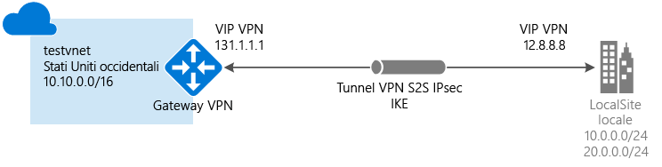

# <a name="create-a-vnet-with-a-site-to-site-vpn-connection-using-powershell"></a>Creare una rete virtuale con una connessione VPN da sito a sito usando PowerShell e Azure Resource Manager

Questo articolo illustra come usare PowerShell per creare una connessione gateway VPN da sito a sito dalla rete locale alla rete virtuale. I passaggi di questo articolo sono applicabili al modello di distribuzione Resource Manager. È anche possibile creare questa configurazione usando strumenti o modelli di distribuzione diversi selezionando un'opzione differente nell'elenco seguente:

> [!div class="op_single_selector"]
> * [Portale di Azure](vpn-gateway-howto-site-to-site-resource-manager-portal.md)
> * [PowerShell](vpn-gateway-create-site-to-site-rm-powershell.md)
> * [CLI](vpn-gateway-howto-site-to-site-resource-manager-cli.md)
> * [Portale di Azure (classico)](vpn-gateway-howto-site-to-site-classic-portal.md)
> * [Portale classico (versione classica)](vpn-gateway-site-to-site-create.md)
> 
>


Una connessione gateway VPN da sito a sito viene usata per connettere la rete locale a una rete virtuale di Azure tramite un tunnel VPN IPsec/IKE (IKEv1 o IKEv2). Questo tipo di connessione richiede un dispositivo VPN che si trova in locale con un indirizzo IP pubblico esterno assegnato. Per altre informazioni sui gateway VPN, vedere [Informazioni sul gateway VPN](vpn-gateway-about-vpngateways.md).



## <a name="before-you-begin"></a>Prima di iniziare

Prima di iniziare la configurazione, verificare di soddisfare i criteri seguenti:

* Assicurarsi di voler usare il modello di distribuzione Resource Manager. [!INCLUDE [deployment models](../../includes/vpn-gateway-classic-rm-include.md)]
* Un dispositivo VPN compatibile e un utente che sia in grado di configurarlo. Per altre informazioni sui dispositivi VPN compatibili e sulla configurazione dei dispositivi, vedere [Informazioni sui dispositivi VPN](vpn-gateway-about-vpn-devices.md).
* Un indirizzo IPv4 pubblico esterno per il dispositivo VPN. L'indirizzo IP non può trovarsi dietro un NAT.
* Se non si ha familiarità con gli intervalli degli indirizzi IP disponibili nella configurazione della rete locale, è necessario coordinarsi con qualcuno che possa fornire tali dettagli. Quando si crea questa configurazione, è necessario specificare i prefissi degli intervalli di indirizzi IP che Azure instraderà alla posizione locale. Nessuna delle subnet della rete locale può sovrapporsi alle subnet della rete virtuale a cui ci si vuole connettere.
* La versione più recente dei cmdlet di PowerShell per Azure Resource Manager. Per altre informazioni sull'installazione dei cmdlet di PowerShell, vedere [Come installare e configurare Azure PowerShell](/powershell/azure/overview) .

### <a name="example-values"></a>Valori di esempio

Gli esempi di questo articolo usano i valori seguenti. È possibile usare questi valori per creare un ambiente di test o farvi riferimento per comprendere meglio gli esempi di questo articolo.

```
#Example values

VnetName                = testvnet 
ResourceGroup           = testrg 
Location                = West US 
AddressSpace            = 10.0.0.0/16 
SubnetName              = Subnet1 
Subnet                  = 10.0.1.0/28 
GatewaySubnet           = 10.0.0.0/27
LocalNetworkGatewayName = LocalSite
LNG Public IP           = <VPN device IP address> 
Local Address Prefixes  = 10.0.0.0/24','20.0.0.0/24
Gateway Name            = vnetgw1
PublicIP                = gwpip
Gateway IP Config       = gwipconfig1 
VPNType                 = RouteBased 
GatewayType             = Vpn 
ConnectionName          = myGWConnection

```


## <a name="Login"></a>1. Eseguire la connessione alla sottoscrizione

[!INCLUDE [PowerShell login](../../includes/vpn-gateway-ps-login-include.md)]

## <a name="VNet"></a>2. Creare una rete virtuale e una subnet del gateway

Se non si ha una rete virtuale, crearne una. Quando si crea una rete virtuale, verificare che gli spazi di indirizzi specificati non si sovrappongano agli spazi di indirizzi presenti nella rete locale.

[!INCLUDE [About gateway subnets](../../includes/vpn-gateway-about-gwsubnet-include.md)]

[!INCLUDE [No NSG warning](../../includes/vpn-gateway-no-nsg-include.md)]

### <a name="to-create-a-virtual-network-and-a-gateway-subnet"></a>Per creare una rete virtuale e una subnet del gateway

Questo esempio crea una rete virtuale e una subnet del gateway. Se esiste già una rete virtuale a cui è necessario aggiungere una subnet del gateway, vedere [Per aggiungere una subnet del gateway a una rete virtuale già creata](#gatewaysubnet).

Creare un gruppo di risorse:

```powershell
New-AzureRmResourceGroup -Name testrg -Location 'West US'
```

Creare la rete virtuale.

1. Impostare le variabili.

  ```powershell
  $subnet1 = New-AzureRmVirtualNetworkSubnetConfig -Name 'GatewaySubnet' -AddressPrefix 10.0.0.0/27
  $subnet2 = New-AzureRmVirtualNetworkSubnetConfig -Name 'Subnet1' -AddressPrefix '10.0.1.0/28'
  ```
2. Creare la rete virtuale.

  ```powershell
  New-AzureRmVirtualNetwork -Name testvnet -ResourceGroupName testrg `
  -Location 'West US' -AddressPrefix 10.0.0.0/16 -Subnet $subnet1, $subnet2
  ```

### <a name="gatewaysubnet"></a>Per aggiungere una subnet del gateway a una rete virtuale già creata

1. Impostare le variabili.

  ```powershell
  $vnet = Get-AzureRmVirtualNetwork -ResourceGroupName testrg -Name testvnet
  ```
2. Creare la subnet del gateway.

  ```powershell
  Add-AzureRmVirtualNetworkSubnetConfig -Name 'GatewaySubnet' -AddressPrefix 10.0.0.0/27 -VirtualNetwork $vnet
  ```
3. Impostare la configurazione.

  ```powershell
  Set-AzureRmVirtualNetwork -VirtualNetwork $vnet
  ```

## 3. <a name="localnet"></a>Creare il gateway di rete locale

Il gateway di rete locale in genere fa riferimento al percorso locale. Assegnare al sito un nome che Azure possa usare come riferimento, quindi specificare l'indirizzo IP del dispositivo VPN locale con cui si creerà una connessione. Specificare anche i prefissi degli indirizzi IP che verranno instradati tramite il gateway VPN al dispositivo VPN. I prefissi degli indirizzi specificati sono quelli disponibili nella rete locale. Se la rete locale viene modificata, è possibile aggiornare facilmente i prefissi.

Usare i valori seguenti:

* Il *GatewayIPAddress* è l'indirizzo IP del dispositivo VPN locale. Il dispositivo VPN non può trovarsi dietro un NAT.
* *AddressPrefix* corrisponde allo spazio degli indirizzi locale.

Per aggiungere un gateway di rete locale con un solo prefisso di indirizzo:

  ```powershell
  New-AzureRmLocalNetworkGateway -Name LocalSite -ResourceGroupName testrg `
  -Location 'West US' -GatewayIpAddress '23.99.221.164' -AddressPrefix '10.0.0.0/24'
  ```

Per aggiungere un gateway di rete locale con più prefissi di indirizzo:

  ```powershell
  New-AzureRmLocalNetworkGateway -Name LocalSite -ResourceGroupName testrg `
  -Location 'West US' -GatewayIpAddress '23.99.221.164' -AddressPrefix @('10.0.0.0/24','20.0.0.0/24')
  ```

Per modificare i prefissi di indirizzo IP per il gateway di rete locale:<br>
Talvolta è possibile modificare i prefissi del gateway di rete locale. I passaggi necessari per modificare i prefissi di indirizzo IP dipendono dal fatto che sia stata creata una connessione di gateway VPN. Vedere la sezione [Per modificare i prefissi di indirizzo IP per un gateway di rete locale](#modify) di questo articolo.

## <a name="PublicIP"></a>4. Richiedere un indirizzo IP pubblico

Un gateway VPN deve avere un indirizzo IP pubblico. È necessario richiedere prima di tutto la risorsa dell'indirizzo IP e quindi farvi riferimento durante la creazione del gateway di rete virtuale. L'indirizzo IP viene assegnato dinamicamente alla risorsa durante la creazione del gateway VPN. Il gateway VPN supporta attualmente solo l'allocazione degli indirizzi IP pubblici *dinamici*. Non è possibile richiedere un'assegnazione degli indirizzi IP pubblici statici. Ciò non significa tuttavia che l'indirizzo IP viene modificato dopo l'assegnazione al gateway VPN. L'indirizzo IP pubblico viene modificato solo quando il gateway viene eliminato e ricreato. Non viene modificato in caso di ridimensionamento, reimpostazione o altre manutenzioni/aggiornamenti del gateway VPN.

Richiedere un indirizzo IP pubblico che verrà assegnato per il gateway VPN di rete virtuale.

```powershell
$gwpip= New-AzureRmPublicIpAddress -Name gwpip -ResourceGroupName testrg -Location 'West US' -AllocationMethod Dynamic
```

## <a name="GatewayIPConfig"></a>5. Creare la configurazione di indirizzamento IP gateway

La configurazione del gateway definisce la subnet e l'indirizzo IP pubblico da utilizzare. Per creare la configurazione del gateway, usare l'esempio seguente:

```powershell
$vnet = Get-AzureRmVirtualNetwork -Name testvnet -ResourceGroupName testrg
$subnet = Get-AzureRmVirtualNetworkSubnetConfig -Name 'GatewaySubnet' -VirtualNetwork $vnet
$gwipconfig = New-AzureRmVirtualNetworkGatewayIpConfig -Name gwipconfig1 -SubnetId $subnet.Id -PublicIpAddressId $gwpip.Id
```

## <a name="CreateGateway"></a>6. Creare il gateway VPN

Creare il gateway VPN di rete virtuale. Per completare la creazione di un gateway VPN, possono essere necessari fino a 45 minuti o più.

Usare i valori seguenti:

* Il valore di *-GatewayType* per una configurazione da sito a sito è *Vpn*. Il tipo di gateway è sempre specifico della configurazione che si sta implementando. Ad esempio, altre configurazioni di gateway possono richiedere -GatewayType ExpressRoute.
* Il valore di *-VpnType* può essere *RouteBased*, talvolta definito gateway dinamico nella documentazione, o *PolicyBased*, talvolta definito gateway statico nella documentazione. Per altre informazioni sui tipi di gateway VPN, vedere [Informazioni sul gateway VPN](vpn-gateway-about-vpngateways.md).
* Selezionare lo SKU del gateway da usare. Esistono limitazioni di configurazione per alcuni SKU. Per altre informazioni, vedere [SKU del gateway](vpn-gateway-about-vpn-gateway-settings.md#gwsku).

```powershell
New-AzureRmVirtualNetworkGateway -Name vnetgw1 -ResourceGroupName testrg `
-Location 'West US' -IpConfigurations $gwipconfig -GatewayType Vpn `
-VpnType RouteBased -GatewaySku VpnGw1
```

## <a name="ConfigureVPNDevice"></a>7. Configurare il dispositivo VPN

Le connessioni da sito a sito verso una rete locale richiedono un dispositivo VPN. In questo passaggio viene configurato il dispositivo VPN. Durante la configurazione del dispositivo VPN, è necessario quanto segue:

- Chiave condivisa. Si tratta della stessa chiave condivisa che viene specificata durante la creazione della connessione VPN da sito a sito. In questi esempi viene usata una chiave condivisa semplice. È consigliabile generare una chiave più complessa per l'uso effettivo.
- Indirizzo IP pubblico del gateway di rete virtuale. È possibile visualizzare l'indirizzo IP pubblico usando il portale di Azure, PowerShell o l'interfaccia della riga di comando. Per trovare l'indirizzo IP pubblico del gateway di rete virtuale con PowerShell, usare l'esempio seguente:

  ```powershell
  Get-AzureRmPublicIpAddress -Name GW1PublicIP -ResourceGroupName TestRG
  ```

[!INCLUDE [Configure VPN device](../../includes/vpn-gateway-configure-vpn-device-rm-include.md)]


## <a name="CreateConnection"></a>8. Creare la connessione VPN

Successivamente, creare la connessione VPN da sito a sito tra il gateway di rete virtuale e il dispositivo VPN. Assicurarsi di sostituire i valori con i propri. La chiave condivisa deve corrispondere al valore utilizzato per la configurazione del dispositivo VPN. Si noti che "-ConnectionType" per la connessione da sito a sito è *IPsec*.

1. Impostare le variabili.
  ```powershell
  $gateway1 = Get-AzureRmVirtualNetworkGateway -Name vnetgw1 -ResourceGroupName testrg
  $local = Get-AzureRmLocalNetworkGateway -Name LocalSite -ResourceGroupName testrg
  ```

2. Creare la connessione.
  ```powershell
  New-AzureRmVirtualNetworkGatewayConnection -Name MyGWConnection -ResourceGroupName testrg `
  -Location 'West US' -VirtualNetworkGateway1 $gateway1 -LocalNetworkGateway2 $local `
  -ConnectionType IPsec -RoutingWeight 10 -SharedKey 'abc123'
  ```

La connessione verrà stabilita in breve tempo.

## <a name="toverify"></a>9. Verificare la connessione VPN

Esistono diversi modi per verificare la connessione VPN.

[!INCLUDE [Verify connection](../../includes/vpn-gateway-verify-connection-ps-rm-include.md)]

## <a name="connectVM"></a>Per connettersi a una macchina virtuale

[!INCLUDE [Connect to a VM](../../includes/vpn-gateway-connect-vm-s2s-include.md)]


## <a name="modify"></a>Modificare i prefissi degli indirizzi IP per un gateway di rete locale

In caso di modifica dei prefissi degli indirizzi IP da indirizzare alla posizione locale, è possibile modificare il gateway di rete locale. Sono disponibili due set di istruzioni. La scelta delle istruzioni dipende dal fatto che sia già stata creata o meno la connessione gateway.

[!INCLUDE [Modify prefixes](../../includes/vpn-gateway-modify-ip-prefix-rm-include.md)]

## <a name="modifygwipaddress"></a>Modificare l'indirizzo IP del gateway per un gateway di rete locale

[!INCLUDE [Modify gateway IP address](../../includes/vpn-gateway-modify-lng-gateway-ip-rm-include.md)]

## <a name="next-steps"></a>Passaggi successivi

*  Dopo aver completato la connessione, è possibile aggiungere macchine virtuali alle reti virtuali. Per altre informazioni, vedere [Macchine virtuali](https://docs.microsoft.com/azure/#pivot=services&panel=Compute).
* Per informazioni su BGP, vedere [Panoramica di BGP](vpn-gateway-bgp-overview.md) e [Come configurare BGP](vpn-gateway-bgp-resource-manager-ps.md).

