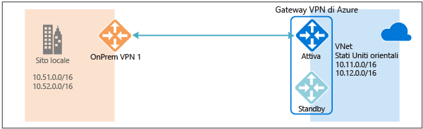
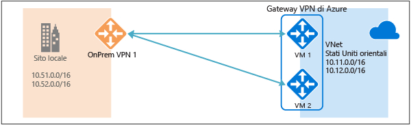
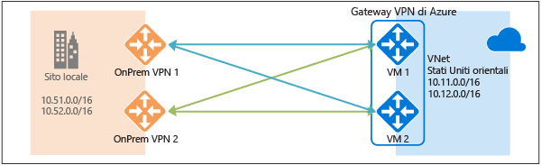
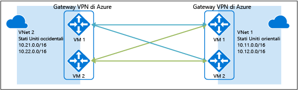

<properties
   pageTitle="Panoramica della configurazioni a disponibilità elevata con gateway VPN di Azure | Microsoft Azure"
   description="Questo articolo offre una panoramica delle opzioni di configurazione a disponibilità elevata con gateway VPN di Azure."
   services="vpn-gateway"
   documentationCenter="na"
   authors="yushwang"
   manager="rossort"
   editor=""
   tags=""/>



<tags
   ms.service="vpn-gateway"
   ms.devlang="na"
   ms.topic="get-started-article"
   ms.tgt_pltfrm="na"
   ms.workload="infrastructure-services"
   ms.date="09/24/2016"
   ms.author="yushwang"/>



# Connettività cross-premise e da rete virtuale a rete virtuale a disponibilità elevata

Questo articolo offre una panoramica delle opzioni di configurazione a disponibilità elevata per la connettività cross-premise e da rete virtuale a rete virtuale con gateway VPN di Azure.

## Informazioni sulla ridondanza dei gateway VPN di Azure

Ogni gateway VPN di Azure è costituito da due istanze in una configurazione di tipo attivo-standby. In caso di interruzione imprevista o di manutenzione pianificata nell'istanza attiva, l'istanza di standby assume automaticamente il controllo (failover) e riprende le connessioni VPN S2S o da rete virtuale a rete virtuale. Il passaggio causerà una breve interruzione. In caso di manutenzione pianificata, la connettività dovrebbe essere ripristinata entro 10-15 secondi. Per problemi imprevisti, il ripristino della connessione richiederà più tempo, approssimativamente da 1 minuto a 1 minuto e mezzo nel peggiore dei casi. Per le connessioni client VPN P2S al gateway, le connessioni P2S verranno interrotte e gli utenti dovranno riconnettersi dai computer client.





## Connettività cross-premise a disponibilità elevata

Per offrire una maggiore disponibilità per le connessioni cross premise, sono disponibili alcune opzioni:

- Più dispositivi VPN locali
- Gateway VPN di Azure di tipo attivo-attivo
- Combinazione di entrambe le opzioni

### Più dispositivi VPN locali

È possibile usare più dispositivi VPN dalla rete locale per connettersi al gateway VPN di Azure, come illustrato nel diagramma seguente:





Questa configurazione offre più tunnel attivi dallo stesso gateway VPN di Azure ai dispositivi locali nella stessa località. Esistono alcuni requisiti e vincoli:

1. È necessario creare più connessioni VPN S2S dai dispositivi VPN ad Azure. Quando si connettono più dispositivi VPN dalla stessa rete locale ad Azure, è necessario creare un gateway di rete locale per ogni dispositivo VPN e una connessione dal gateway VPN di Azure al gateway di rete locale.

2. I gateway di rete locali corrispondenti ai dispositivi VPN devono avere indirizzi IP pubblici univoci nella proprietà "GatewayIpAddress".

3. Per questa configurazione è necessario BGP. Per ogni gateway di rete locale che rappresenta un dispositivo VPN deve essere specificato un indirizzo IP univoco del peer BGP nella proprietà "BgpPeerIpAddress".

4. Il campo della proprietà AddressPrefix di ogni gateway di rete locale non deve sovrapporsi. È consigliabile specificare "BgpPeerIpAddress" nel campo AddressPrefix in formato CIDR /32, ad esempio 10.200.200.254/32.

5. È consigliabile usare BGP per annunciare gli stessi prefissi dei prefissi di rete locale al gateway VPN di Azure. Il traffico verrà inoltrato attraverso questi tunnel simultaneamente.

6. Ogni connessione viene conteggiata rispetto al numero massimo di tunnel per il gateway VPN di Azure: 10 per SKU Basic e Standard e 30 per SKU HighPerformance.

In questa configurazione, il gateway VPN di Azure è comunque in modalità attivo-standby, quindi si verificano lo stesso comportamento di failover e la stessa breve interruzione descritti [sopra](#activestandby). Questa configurazione protegge tuttavia da errori o interruzioni nella rete locale e nei dispositivi VPN.
 
### Gateway VPN di Azure di tipo attivo-attivo

È ora possibile creare un gateway VPN di Azure in una configurazione di tipo attivo-attivo, in cui entrambe le istanze delle VM del gateway stabiliscono tunnel VPN S2S con il dispositivo VPN locale, come illustrato nel diagramma seguente:





In questa configurazione, ogni istanza del gateway di Azure avrà un indirizzo IP pubblico univoco e stabilirà un tunnel VPN S2S IPsec/IKE con il dispositivo VPN locale specificato nella connessione e nel gateway di rete locale. Si noti che entrambi i tunnel VPN sono di fatto parte della stessa connessione. È comunque necessario configurare il dispositivo VPN locale in modo che accetti o stabilisca due tunnel VPN S2S con i due indirizzi IP pubblici del gateway VPN di Azure.

Dato che le istanze del gateway di Azure presentano una configurazione di tipo attivo-attivo, il traffico dalla rete virtuale di Azure alla rete locale verrà instradato attraverso i tunnel simultaneamente, anche se il dispositivo VPN potrebbe preferire un tunnel rispetto all'altro. Si noti, tuttavia, che lo stesso flusso TCP o UDP attraverserà sempre lo stesso tunnel o percorso, a meno che in una delle istanze non si verifichi un evento di manutenzione.

In caso di evento imprevisto o di manutenzione pianificata in un'istanza del gateway, il tunnel IPsec da tale istanza al dispositivo VPN locale verrà disconnesso. Le route corrispondenti nei dispositivi VPN verranno rimosse o revocate automaticamente in modo che il traffico venga trasferito sull'altro tunnel IPsec attivo. Sul lato Azure, verrà eseguito automaticamente il passaggio dall'istanza interessata all'istanza attiva.

### Doppia ridondanza: gateway VPN di tipo attivo-attivo sia per Azure che per le reti locali

L'opzione più affidabile consiste nel combinare gateway di tipo attivo-attivo sia nella propria rete che in Azure, come illustrato nel diagramma di seguito.





In questo caso si crea e si configura il gateway VPN di Azure in una configurazione di tipo attivo-attivo e si creano due gateway di rete locali e due connessioni per i dispositivi VPN locali, come descritto in precedenza. Si ottiene così una connettività a maglia completa di 4 tunnel IPSec tra la rete virtuale di Azure e la rete locale.

Tutti i gateway e i tunnel sono attivi dal lato Azure e il traffico verrà quindi distribuito simultaneamente tra tutti e 4 i tunnel, anche se ogni flusso TCP o UDP seguirà anche in questo caso lo stesso tunnel o percorso dal lato Azure. Anche se distribuendo il traffico si può rilevare un lieve miglioramento della velocità effettiva sui tunnel IPsec, l'obiettivo principale di questa configurazione è la disponibilità elevata. A causa della natura statistica della distribuzione, è difficile misurare l'impatto di diverse condizioni di traffico delle applicazioni sulla velocità effettiva aggregata.

Questa topologia richiederà due gateway di rete locali e due connessioni per supportare la coppia di dispositivi VPN locali e BGP per consentire le due connessioni alla stessa rete locale. Questi requisiti sono gli stessi descritti [sopra](#activeactiveonprem).

## Connettività da rete virtuale a rete virtuale a disponibilità elevata tramite gateway VPN di Azure

La stessa configurazione di tipo attivo-attivo può essere applicata anche alle connessioni da rete virtuale a rete virtuale di Azure. È possibile creare gateway VPN di tipo attivo-attivo per entrambe le reti virtuali e connetterle tra loro in modo da ottenere la stessa connettività a maglia completa di 4 tunnel tra le due reti virtuali, come illustrato nel diagramma di seguito:





Ciò assicura che tra le due reti virtuali sia sempre presente una coppia di tunnel per qualsiasi evento di manutenzione pianificata, garantendo una disponibilità ancora maggiore. Anche se la stessa topologia per la connettività cross-premise richiede due connessioni, per la topologia da rete virtuale a rete virtuale illustrata sopra sarà necessaria una sola connessione per ogni gateway. BGP è inoltre facoltativo, a meno che non sia necessario il routing di transito sulla connessione da rete virtuale a rete virtuale.

## Passaggi successivi

Per informazioni sulla procedura per configurare connessioni cross-premise e da rete virtuale a rete virtuale di tipo attivo-attivo, vedere [Configurazione di gateway VPN di tipo attivo-attivo per connessioni cross-premise e da rete virtuale a rete virtuale](http://go.microsoft.com/fwlink/?LinkId=828726).

<!---HONumber=AcomDC_0928_2016-->