# Configurare una connessione da punto a sito a una rete virtuale usando il portale di Azure (versione classica)

[!INCLUDE [deployment models](../../includes/vpn-gateway-classic-deployment-model-include.md)]

Questo articolo illustra come creare una rete virtuale con una connessione da punto a sito nel modello di distribuzione classica usando il portale di Azure. È anche possibile creare questa configurazione usando strumenti o modelli di distribuzione diversi selezionando un'opzione differente nell'elenco seguente:

> [!div class="op_single_selector"]
> * [Resource Manager - Portale di Azure](vpn-gateway-howto-point-to-site-resource-manager-portal.md)
> * [Resource Manager - PowerShell](vpn-gateway-howto-point-to-site-rm-ps.md)
> * [Distribuzione classica - Portale di Azure](vpn-gateway-howto-point-to-site-classic-azure-portal.md)
>
>

Una configurazione da punto a sito (P2S) permette di creare una connessione protetta da un singolo computer client a una rete virtuale. P2S è una connessione VPN tramite SSTP (Secure Sockets Tunneling Protocol). Una soluzione Da punto a sito è utile quando ci si vuole connettere alla rete virtuale da una posizione remota, ad esempio da casa o durante una riunione, oppure quando solo pochi client devono connettersi a una rete virtuale. Le connessioni P2S non richiedono un dispositivo VPN o un indirizzo IP pubblico. La connessione VPN viene avviata dal computer client. Per altre informazioni sulla connettività da punto a sito, consultare le [Domande frequenti sulla connettività da punto a sito](#faq) alla fine di questo articolo.

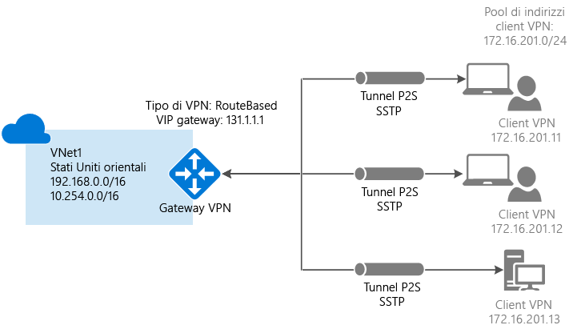

### Impostazioni di esempio

È possibile usare i valori seguenti per creare un ambiente di test o fare riferimento a questi valori per comprendere meglio gli esempi di questo articolo:

* **Nome: VNet1**
* **Spazio indirizzi: 192.168.0.0/16** Per questo esempio, viene usato un solo spazio indirizzi. È possibile avere più di uno spazio indirizzi per la rete virtuale.
* **Nome subnet: FrontEnd**
* **Intervallo di indirizzi subnet: 192.168.1.0/24**
* **Sottoscrizione:** se si hanno più sottoscrizioni, verificare di usare quella corretta.
* **Gruppo di risorse: TestRG**
* **Località: Stati Uniti orientali**
* **Tipo di connessione: Da punto a sito**
* **: 172.16.201.0/24**. I client VPN che si connettono alla rete virtuale con questa connessione da punto a sito ricevono un indirizzo IP dal pool specificato.
* **GatewaySubnet: 192.168.200.0/24**. La subnet del gateway deve usare il nome "GatewaySubnet".
* **Dimensioni:** selezionare lo SKU di gateway da usare.
* **Tipo di routing: Dinamico**

## Sezione 1: Creare una rete virtuale e un gateway VPN

Prima di iniziare, verificare di possedere una sottoscrizione di Azure. Se non si ha una sottoscrizione di Azure, è possibile attivare i [vantaggi per i sottoscrittori di MSDN](https://azure.microsoft.com/pricing/member-offers/msdn-benefits-details) oppure iscriversi per ottenere un [account gratuito](https://azure.microsoft.com/pricing/free-trial).

### Parte 1: Creare una rete virtuale

Se non si ha una rete virtuale, crearne una. Gli screenshot sono forniti come esempio. Assicurarsi di sostituire i valori con i propri. Per creare una rete virtuale usando il portale di Azure, seguire questa procedura:

1. In un browser passare al [portale di Azure](http://portal.azure.com) e, se necessario, accedere con l'account Azure.
2. Fare clic su **New**. Nel campo **Cerca nel Marketplace** digitare "Rete virtuale". Trovare **Rete virtuale** nell'elenco restituito e fare clic per aprire il pannello **Rete virtuale**.

  
3. Nella parte inferiore del pannello Rete virtuale selezionare **Classico** nell'elenco **Selezionare un modello di distribuzione** e quindi fare clic su **Crea**.

  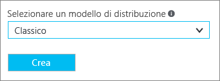
4. Nel pannello **Crea rete virtuale** configurare le impostazioni della rete virtuale. Aggiungere in questo pannello il primo spazio di indirizzi e un intervallo di indirizzi di una singola subnet. Dopo aver creato la rete virtuale, è possibile tornare indietro e aggiungere altre subnet e altri spazi di indirizzi.

  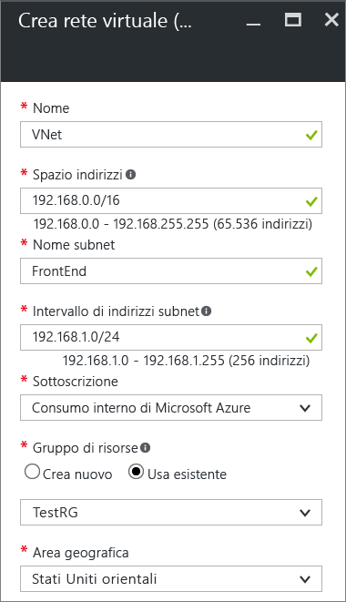
5. Verificare che la **sottoscrizione** sia quella corretta. È possibile cambiare sottoscrizione tramite l'elenco a discesa.
6. Fare clic su **Gruppo di risorse** e selezionare un gruppo di risorse esistente o crearne uno nuovo digitandone il nome. Se si crea un nuovo gruppo di risorse, denominare il gruppo in base ai valori di configurazione pianificati. Per altre informazioni sui gruppi di risorse, vedere [Panoramica di Azure Resource Manager](../azure-resource-manager/resource-group-overview.md#resource-groups).
7. Selezionare quindi le impostazioni relative alla **località** per la rete virtuale. La località determina la posizione in cui risiedono le risorse distribuite in questa rete virtuale.
8. Selezionare **Aggiungi al dashboard** se si vuole trovare facilmente la rete virtuale nel dashboard e quindi fare clic su **Crea**.

  
9. Dopo aver fatto clic su Crea, nel dashboard viene visualizzato un riquadro che riflette lo stato di avanzamento della rete virtuale. Il riquadro cambia durante la creazione della rete virtuale.

  
10. Al termine della creazione della rete virtuale, nella pagina Reti del portale di Azure classico verrà visualizzato **Creato** in **Stato**.
11. Aggiungere un server DNS (facoltativo). Dopo aver creato la rete virtuale, è possibile aggiungere l'indirizzo IP di un server DNS per la risoluzione dei nomi. Il server DNS specificato deve essere in grado di risolvere i nomi per le risorse della rete virtuale. Per aggiungere un server DNS, aprire le impostazioni della rete virtuale, fare clic su Server DNS e aggiungere l'indirizzo IP del server DNS da usare. Il pacchetto di configurazione del client generato in un passaggio successivo conterrà l'indirizzo IP dei server DNS specificati in questa impostazione. Se è necessario aggiornare l'elenco di server DNS in futuro, è possibile generare e installare nuovi pacchetti di configurazione del client VPN che riflettono l'elenco aggiornato.

### Parte 2: Creare una subnet del gateway e un gateway di routing dinamico

In questo passaggio vengono creati una subnet del gateway e un gateway di routing dinamico. Nel portale di Azure per il modello di distribuzione classica, la subnet del gateway e il gateway possono essere creati tramite gli stessi pannelli di configurazione.

1. Nel portale passare alla rete virtuale per cui si vuole creare un gateway.
2. Nel pannello **Panoramica** del pannello della rete virtuale fare clic su **Gateway** nella sezione Connessioni VPN.

  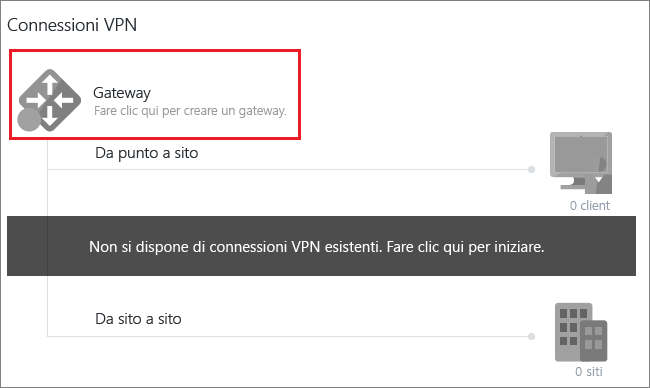
3. Nel pannello **Nuova connessione VPN** selezionare **Da punto a sito**.

  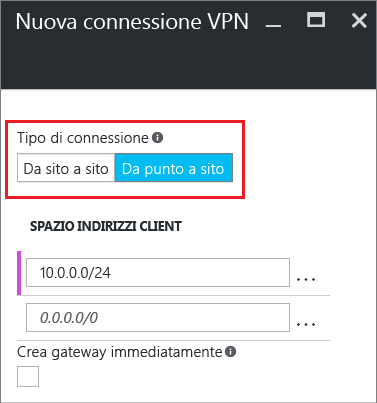
4. In **Spazio indirizzi client** aggiungere l'intervallo di indirizzi IP, da cui i client VPN ricevono un indirizzo IP al momento della connessione. Eliminare l'intervallo compilato automaticamente e aggiungere il proprio.

  
5. Selezionare la casella di controllo **Crea gateway immediatamente**.

  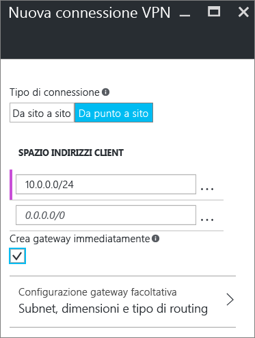
6. Fare clic su **Configurazione gateway facoltativa** per aprire il pannello **Configurazione gateway**.

  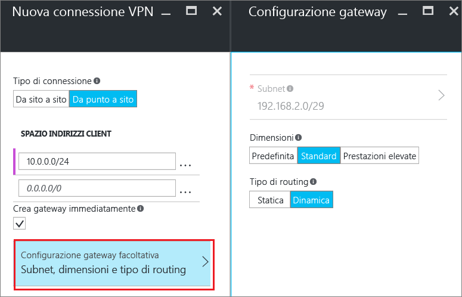
7. Fare clic su **Subnet Configure required settings** (Configura impostazioni necessarie subnet) per aggiungere la **subnet del gateway**. Nonostante sia possibile creare una subnet del gateway con dimensioni di /29 soltanto, è consigliabile crearne una più grande che includa più indirizzi selezionando almeno /28 o /27. In questo modo saranno disponibili indirizzi sufficienti per supportare in futuro le possibili configurazioni aggiuntive desiderate. Quando si usano le subnet del gateway, evitare di associare un gruppo di sicurezza di rete (NSG) alla subnet del gateway. Se si associa un gruppo di sicurezza di rete a tale subnet, il gateway VPN potrebbe smettere di funzionare come previsto.

  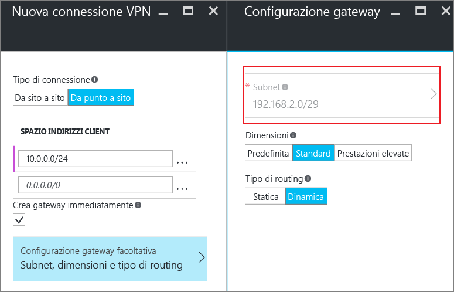
8. Selezionare le **dimensioni** del gateway, che rappresentano lo SKU di gateway per il gateway di rete virtuale. Nel portale, lo SKU predefinito è **Basic**. Per altre informazioni sugli SKU di gateway, vedere [Informazioni sulle impostazioni del gateway VPN](vpn-gateway-about-vpn-gateway-settings.md#gwsku).

  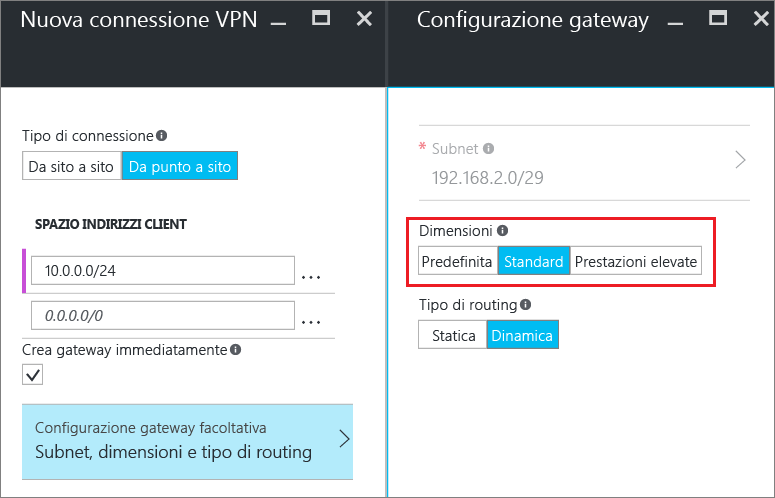
9. Selezionare il **tipo di routing** per il gateway. Le configurazioni P2S richiedono il tipo di routing **Dinamico**. Al termine della configurazione del pannello, fare clic su **OK**.

  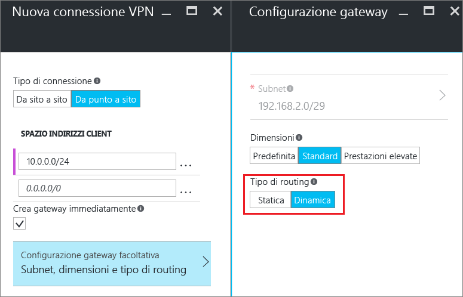
10. Nel pannello **Nuova connessione VPN** fare clic su **OK** nella parte inferiore per iniziare a creare il gateway della rete virtuale. Per completare un gateway VPN possono essere necessari fino a 45 minuti.

## Sezione 2 - Creare certificati

I certificati vengono usati da Azure per autenticare i client VPN per VPN da punto a sito.

### Parte 1: Ottenere il file di chiave pubblica (con estensione cer) per il certificato radice

[!INCLUDE [vpn-gateway-basic-vnet-rm-portal](../../includes/vpn-gateway-p2s-rootcert-include.md)]

### Parte 2: Generare un certificato client

[!INCLUDE [vpn-gateway-basic-vnet-rm-portal](../../includes/vpn-gateway-p2s-clientcert-include.md)]

## Sezione 3: Caricare il file CER del certificato radice

Dopo che il gateway è stato creato, è possibile caricare il file CER di un certificato radice trusted in Azure. È possibile caricare file per un massimo di 20 certificati radice. Non si può caricare la chiave privata per il certificato radice in Azure. Dopo che è stato caricato, il file CER viene usato da Azure per autenticare i client che si connettono alla rete virtuale.

1. Nella sezione **Connessioni VPN** del pannello della rete virtuale fare clic sull'icona **client** per aprire il pannello **Connessione VPN da punto a sito**.

  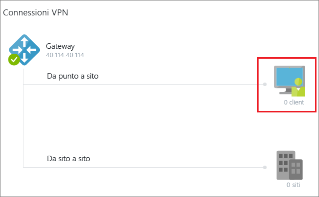
2. Nel pannello **Connessione VPN da punto a sito** fare clic su **Gestisci certificato** per aprire il pannello **Certificati**. 

  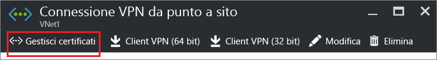  
3. Nel pannello **Certificati** fare clic su **Carica** per aprire il pannello **Carica certificato**. 

    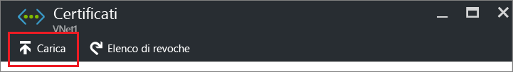 
4. Fare clic sull'icona della cartella per cercare il file CER. Selezionare il file e quindi fare clic su **OK**. Aggiornare la pagina per visualizzare il certificato caricato nel pannello **Certificati**.

  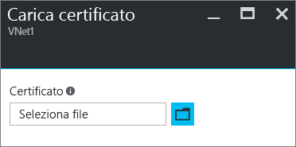 

## Sezione 4: Configurare il client

Per connettersi a una rete virtuale con una VPN da punto a sito, in ogni client deve essere installato un pacchetto di configurazione del client VPN. Il pacchetto non installa un client VPN, È possibile usare lo stesso pacchetto di configurazione del client VPN in ogni computer client, a condizione che la versione corrisponda all'architettura del client. Per l'elenco dei sistemi operativi client supportati, vedere [Domande frequenti sulla connettività da punto a sito](#faq) alla fine di questo articolo.

Il pacchetto di configurazione configura il client VPN Windows nativo con le impostazioni necessarie per la connessione alla rete virtuale e, se è stato specificato un server DNS per la rete virtuale, contiene l'indirizzo IP del server DNS che verrà usato dal client per la risoluzione dei nomi. Se si cambia in seguito il server DNS specificato, dopo la generazione del pacchetto di configurazione del client, assicurarsi di generare un nuovo pacchetto di configurazione del client da installare nei computer client.

### Parte 1: Generare e installare il pacchetto di configurazione del client VPN

1. Nel pannello **Panoramica** della rete virtuale nel portale di Azure fare clic sull'icona relativa ai client in **Connessioni VPN** per aprire il pannello **Connessione VPN da punto a sito**.
2. Nella parte superiore del pannello **Connessione VPN da punto a sito** fare clic sul pacchetto di download corrispondente al sistema operativo client in cui verrà installato.

  * Per client a 64 bit, selezionare **Client VPN (64 bit)**.
  * Per client a 32 bit, selezionare **Client VPN (32 bit)**.

  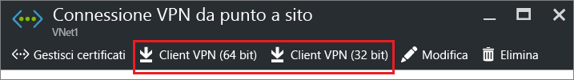 
3. Dopo che è stato generato, scaricare e installare il pacchetto nel computer client. Se viene visualizzato un popup SmartScreen, fare clic su **Altre informazioni** e quindi su **Esegui comunque** per installare il pacchetto. È anche possibile salvare il pacchetto per l'installazione su altri computer client.

### Parte 2: Installare il certificato client

Se si vuole creare una connessione da punto a sito da un computer client diverso da quello usato per generare i certificati client, è necessario installare un certificato client. Quando si installa un certificato client, è necessaria la password che è stata creata durante l'esportazione del certificato client. In genere è sufficiente fare doppio clic sul certificato e installarlo. Per altre informazioni, vedere [Installare un certificato client esportato](vpn-gateway-certificates-point-to-site.md#install).

## Sezione 5: Connettersi ad Azure

### Connettersi alla rete virtuale

1. Per connettersi alla rete virtuale, nel computer client passare alle connessioni VPN e individuare quella creata, che ha lo stesso nome della rete virtuale locale. Fare clic su **Connetti**. È possibile che venga visualizzato un messaggio popup che fa riferimento all'uso del certificato. In questo caso, fare clic su **Continua** per usare privilegi elevati.
2. Nella pagina **Stato connessione** fare clic su **Connetti** per avviare la connessione. Se viene visualizzato un **Seleziona certificato** dello schermo, verificare che il certificato client visualizzato sia quello che si desidera utilizzare per la connessione. In caso contrario, usare la freccia a discesa per selezionare il certificato corretto e quindi fare clic su **OK**.

  
3. Verrà stabilita la connessione.

  

In caso di problemi di connessione, effettuare i controlli seguenti:

- Aprire **Gestire i certificati utente** e passare ad **Autorità di certificazione radice attendibili\Certificati**. Verificare che il certificato radice sia incluso nell'elenco. Per il corretto funzionamento dell'autenticazione è necessario che il certificato radice sia presente. Quando si esporta un certificato client con estensione pfx con il valore predefinito "Se possibile, includi tutti i certificati nel percorso certificazione", vengono esportate anche le informazioni del certificato radice. Durante l'installazione del certificato client, nel computer client viene quindi installato anche il certificato radice. 

- Se si usa un certificato che è stato rilasciato tramite una soluzione CA globale e si riscontrano problemi durante l'autenticazione, controllare l'ordine di autenticazione del certificato client. È possibile controllare l'ordine dell'elenco di autenticazione facendo doppio clic sul certificato client e andando in **Dettagli > Utilizzo chiavi avanzato**. Assicurarsi che l'elenco mostri "Autenticazione client" come primo elemento. In caso contrario, è necessario emettere un certificato client in base al modello di utente con l'autenticazione client come primo elemento nell'elenco. 

### Verificare la connessione VPN

1. Per verificare che la connessione VPN è attiva, aprire un prompt dei comandi con privilegi elevati ed eseguire *ipconfig/all*.
2. Visualizzare i risultati. Si noti che l'indirizzo IP ricevuto è uno degli indirizzi compresi nell'intervallo di indirizzi di connettività da punto a sito specificato al momento della creazione della rete virtuale. I risultati dovrebbero essere simili a quanto segue:

Esempio:

    PPP adapter VNet1:
        Connection-specific DNS Suffix .:
        Description.....................: VNet1
        Physical Address................:
        DHCP Enabled....................: No
        Autoconfiguration Enabled.......: Yes
        IPv4 Address....................: 192.168.130.2(Preferred)
        Subnet Mask.....................: 255.255.255.255
        Default Gateway.................:
        NetBIOS over Tcpip..............: Enabled

 
 In caso di problemi durante la connessione a una macchina virtuale tramite P2S, usare "ipconfig" per controllare l'indirizzo IPv4 assegnato alla scheda Ethernet nel computer da cui viene effettuata la connessione. Se l'indirizzo IP è compreso nell'intervallo di indirizzi della rete virtuale a cui ci si connette o nell'intervallo di indirizzi del pool di indirizzi del client VPN, si verifica la cosiddetta sovrapposizione dello spazio indirizzi. Con questo tipo di sovrapposizione, il traffico di rete non raggiunge Azure e rimane nella rete locale. Se gli spazi indirizzi di rete non si sovrappongono ma non è comunque possibile connettersi alla VM, vedere l'articolo [Risolvere i problemi di connessione con Desktop remoto di una macchina virtuale di Azure](../virtual-machines/windows/troubleshoot-rdp-connection.md).

## Connettersi a una macchina virtuale

[!INCLUDE [Connect to a VM](../../includes/vpn-gateway-connect-vm-p2s-classic-include.md)]

## Aggiungere o rimuovere certificati radice attendibili

È possibile aggiungere e rimuovere certificati radice attendibili da Azure. Quando si rimuove un certificato radice, i client con un certificato generato da tale radice non potranno eseguire l'autenticazione e quindi non potranno connettersi. Per consentire ai client di eseguire l'autenticazione e connettersi, è necessario installare un nuovo certificato client generato da un certificato radice considerato attendibile (caricato) in Azure.

### Per aggiungere un certificato radice attendibile

In Azure è possibile aggiungere fino a 20 file CER di certificato radice trusted. Per istruzioni, vedere [Sezione 3: Caricare il file CER del certificato radice](#upload).

### Per rimuovere un certificato radice attendibile

1. Nella sezione **Connessioni VPN** del pannello della rete virtuale fare clic sull'icona **client** per aprire il pannello **Connessione VPN da punto a sito**.

  
2. Nel pannello **Connessione VPN da punto a sito** fare clic su **Gestisci certificato** per aprire il pannello **Certificati**. 

    
3. Nel pannello **Certificati** fare clic sui puntini di sospensione accanto al certificato che si vuole rimuovere e quindi fare clic su **Elimina**.

   

## Revocare un certificato client

È possibile revocare i certificati client. L'elenco di revoche di certificati consente di negare in modo selettivo la connettività da punto a sito basata sui singoli certificati client. Questa operazione è diversa rispetto alla rimozione di un certificato radice attendibile. Se si rimuove un file con estensione cer del certificato radice attendibile da Azure, viene revocato l'accesso per tutti i certificati client generati o firmati dal certificato radice revocato. La revoca di un certificato client, anziché del certificato radice, consente di continuare a usare gli altri certificati generati dal certificato radice per l'autenticazione per la connessione da punto a sito.

La regola generale è quella di usare il certificato radice per gestire l'accesso a livello di team o organizzazione, usando i certificati client revocati per il controllo di accesso con granularità fine su singoli utenti.

### Per revocare un certificato client

È possibile revocare un certificato client aggiungendo l'identificazione personale all'elenco di revoche di certificati.

1. Ottenere l'identificazione personale del certificato client. Per altre informazioni, vedere [Procedura: recuperare l'identificazione personale di un certificato](https://msdn.microsoft.com/library/ms734695.aspx).
2. Copiare le informazioni in un editor di testo e rimuovere tutti gli spazi in modo che sia una stringa continua.
3. Passare al pannello **"nome rete virtuale classica" > Connessione VPN da punto a sito > Certificati** e quindi fare clic su **Elenco di revoche** per aprire il pannello Elenco di revoche. 
4. Nel pannello **Elenco di revoche** fare clic su **+Aggiungi certificato** per aprire il pannello **Aggiungi certificato all'elenco di revoche**.
5. Nel pannello **Aggiungi certificato all'elenco di revoche** incollare l'identificazione personale del certificato come una riga di testo continua, senza spazi. Fare clic su **OK** nella parte inferiore del pannello.
6. Dopo aver completato l'aggiornamento, il certificato non può più essere usato per la connessione. Ai client che provano a connettersi con questo certificato verrà visualizzato un messaggio che informa che il certificato non è più valido.

## Domande frequenti sulla connettività da punto a sito

[!INCLUDE [Point-to-Site FAQ](../../includes/vpn-gateway-point-to-site-faq-include.md)]

## Passaggi successivi
Dopo aver completato la connessione, è possibile aggiungere macchine virtuali alle reti virtuali. Per altre informazioni, vedere [Macchine virtuali](https://docs.microsoft.com/azure/#pivot=services&panel=Compute). Per altre informazioni sulla rete e sulle macchine virtuali, vedere [Panoramica di rete delle macchine virtuali Linux e Azure](../virtual-machines/linux/azure-vm-network-overview.md).

