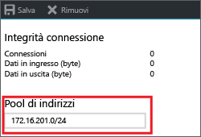
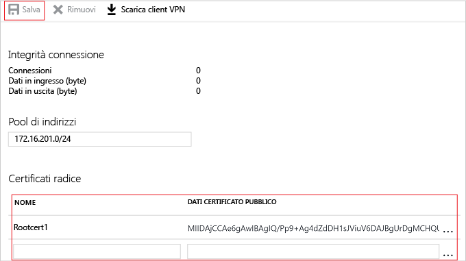
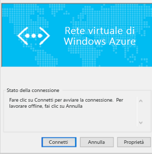

# <a name="configure-a-point-to-site-connection-to-a-vnet-using-native-azure-certificate-authentication-azure-portal"></a>Configurare una connessione da punto a sito a una rete virtuale usando l'autenticazione del certificato di Azure nativo: portale di Azure

Questo articolo illustra come creare una rete virtuale con una connessione da punto a sito nel modello di distribuzione Resource Manager usando il portale di Azure. Questa configurazione usa i certificati per l'autenticazione. In questa configurazione il gateway VPN di Azure esegue la convalida del certificato, invece che di un server RADIUS. È anche possibile creare questa configurazione usando strumenti o modelli di distribuzione diversi selezionando un'opzione differente nell'elenco seguente:

> [!div class="op_single_selector"]
> * [Azure portal](vpn-gateway-howto-point-to-site-resource-manager-portal.md)
> * [PowerShell](vpn-gateway-howto-point-to-site-rm-ps.md)
> * [Portale di Azure (classico)](vpn-gateway-howto-point-to-site-classic-azure-portal.md)
>
>

Un gateway VPN da punto a sito (P2S) consente di creare una connessione sicura alla rete virtuale da un singolo computer client. Le connessioni VPN da punto a sito sono utili per connettersi alla rete virtuale da una posizione remota, ad esempio nel caso di telecomunicazioni da casa o durante una riunione. Una VPN P2S è anche una soluzione utile da usare al posto di una VPN da sito a sito quando solo pochi client devono connettersi a una rete virtuale. Una connessione VPN P2S viene avviata dai dispositivi Windows e Mac.

I client che si connettono possono usare i metodi di autenticazione seguenti:

* Server RADIUS
* Autenticazione del certificato di Azure nativo tramite il gateway VPN

Questo articolo illustra come eseguire una configurazione P2S con l'autenticazione usando l'autenticazione del certificato di Azure nativo. Per usare RADIUS per autenticare gli utenti che si connettono, vedere [P2S using RADIUS authentication](point-to-site-how-to-radius-ps.md) (P2S con autenticazione RADIUS).


Le connessioni da punto a sito non richiedono un dispositivo VPN o un indirizzo IP pubblico. La modalità da punto a sito crea la connessione VPN tramite SSTP (Secure Sockets Tunneling Protocol) o IKEv2.

* SSTP è un tunnel VPN basato su SSL supportato solo nelle piattaforme client Windows. Può penetrare i firewall e per questo è l'opzione ideale per connettersi ad Azure ovunque. Sul lato server sono supportate le versioni 1.0, 1.1 e 1.2 di SSTP. Il client decide quale versione usare. Per Windows 8.1 e versioni successive, SSTP usa per impostazione predefinita la versione 1.2.

* VPN IKEv2, una soluzione VPN IPsec basata su standard. VPN IKEv2 può essere usato per connettersi da dispositivi Mac (versioni OSX 10.11 e successive).

Le connessioni da punto a sito con l'autenticazione del certificato di Azure nativo richiedono gli elementi seguenti:

* Un gateway VPN RouteBased.
* La chiave pubblica (file CER) per un certificato radice, caricato in Azure. Il certificato, dopo essere stato caricato, viene considerato un certificato attendibile e viene usato per l'autenticazione.
* Un certificato client generato dal certificato radice e installato in ogni computer client che si connetterà alla rete virtuale. Questo certificato viene usato per l'autenticazione client.
* Una configurazione del client VPN. I file di configurazione del client VPN contengono le informazioni necessarie per la connessione del client alla rete virtuale. I file configurano il client VPN esistente, nativo del sistema operativo. Ogni client che si connette deve essere configurato usando le impostazioni nei file di configurazione.

Per altre informazioni al riguardo, vedere [About Point-to-Site connections](point-to-site-about.md) (Informazioni sulle connessioni da punto a sito).

#### <a name="example"></a>Valori di esempio

È possibile usare i valori seguenti per creare un ambiente di test o fare riferimento a questi valori per comprendere meglio gli esempi di questo articolo:

* **Nome della rete virtuale:** VNet1
* **Spazio indirizzi:** 192.168.0.0/16<br>Per questo esempio, viene usato un solo spazio indirizzi. È possibile avere più di uno spazio indirizzi per la rete virtuale.
* **Nome subnet:** FrontEnd
* **Intervallo di indirizzi subnet:** 192.168.1.0/24
* **Sottoscrizione:** se si hanno più sottoscrizioni, verificare di usare quella corretta.
* **Gruppo di risorse:** TestRG
* **Località:** Stati Uniti orientali
* **GatewaySubnet:** 192.168.200.0/24<br>
* **Server DNS:** (facoltativo) indirizzo IP del server DNS che si vuole usare per la risoluzione dei nomi.
* **Nome gateway di rete virtuale:** VNet1GW
* **Tipo di gateway:** VPN
* **Tipo VPN:** Basato su route
* **Nome indirizzo IP pubblico:** VNet1GWpip
* **Tipo di connessione:** Da punto a sito
* **Pool di indirizzi client:** 172.16.201.0/24<br>I client VPN che si connettono alla rete virtuale con questa connessione da punto a sito ricevono un indirizzo IP dal pool di indirizzi client.

## <a name="createvnet"></a>1. Crea rete virtuale

Prima di iniziare, verificare di possedere una sottoscrizione di Azure. Se non si ha una sottoscrizione di Azure, è possibile attivare i [vantaggi per i sottoscrittori di MSDN](https://azure.microsoft.com/pricing/member-offers/msdn-benefits-details) oppure iscriversi per ottenere un [account gratuito](https://azure.microsoft.com/pricing/free-trial).
[!INCLUDE [Basic Point-to-Site VNet](../../includes/vpn-gateway-basic-p2s-vnet-rm-portal-include.md)]

## <a name="gatewaysubnet"></a>2. Aggiungere una subnet del gateway

Prima di connettere la rete virtuale a un gateway, è necessario creare la subnet del gateway per la rete virtuale con cui si vuole stabilire la connessione. Il servizio del gateway usa gli indirizzi IP specificati nella subnet del gateway. Se possibile, creare una subnet del gateway con un blocco CIDR di /28 o /27 per fornire indirizzi IP sufficienti a soddisfare altri requisiti di configurazione futuri.

[!INCLUDE [vpn-gateway-add-gwsubnet-rm-portal](../../includes/vpn-gateway-add-gwsubnet-p2s-rm-portal-include.md)]

## <a name="dns"></a>3. Specificare un server DNS (facoltativo)

Dopo aver creato la rete virtuale, è possibile aggiungere l'indirizzo IP di un server DNS per gestire la risoluzione dei nomi. Il server DNS è facoltativo per questa configurazione, ma obbligatorio per la risoluzione dei nomi. Se si specifica un valore, non verrà creato un nuovo server DNS. L'indirizzo IP del server DNS specificato deve essere un server DNS in grado di risolvere i nomi per le risorse a cui ci si connette. Per questo esempio, è stato usato un indirizzo IP privato, ma è probabile che non si tratti dell'indirizzo IP del server DNS. Assicurarsi di usare valori personalizzati. Il valore specificato viene usato dalle risorse distribuite nella rete virtuale, non dalla connessione P2S o dal client VPN.

[!INCLUDE [vpn-gateway-add-dns-rm-portal](../../includes/vpn-gateway-add-dns-rm-portal-include.md)]

## <a name="creategw"></a>4. Creare un gateway di rete virtuale

[!INCLUDE [create-gateway](../../includes/vpn-gateway-add-gw-p2s-rm-portal-include.md)]

## <a name="generatecert"></a>5. Generare i certificati

I certificati vengono usati da Azure per autenticare i client che si connettono a una rete virtuale tramite una connessione VPN da punto a sito. Dopo avere ottenuto un certificato radice, è necessario [caricare](#uploadfile) le informazioni della chiave pubblica in Azure. Il certificato radice viene quindi considerato "attendibile" da Azure per la connessione da punto a sito alla rete virtuale. È anche possibile generare i certificati client dal certificato radice considerato attendibile e quindi installarli in ogni computer client. Il certificato client viene usato per l'autenticazione del client all'avvio di una connessione alla rete virtuale. 

### <a name="getcer"></a>1. Ottenere il file CER per il certificato radice

[!INCLUDE [root-certificate](../../includes/vpn-gateway-p2s-rootcert-include.md)]

### <a name="generateclientcert"></a>2. Generazione di un certificato client

[!INCLUDE [generate-client-cert](../../includes/vpn-gateway-p2s-clientcert-include.md)]

## <a name="addresspool"></a>6. Aggiungere il pool di indirizzi client

Il pool di indirizzi client è un intervallo di indirizzi IP privati specificati dall'utente. I client che si connettono tramite VPN da punto a sito ricevono un indirizzo IP da questo intervallo. Usare un intervallo di indirizzi IP privati che non si sovrapponga con la posizione locale da cui viene effettuata la connessione o con la rete virtuale a cui ci si vuole connettere.

1. Dopo avere creato il gateway di rete virtuale, andare alla sezione **Impostazioni** della pagina della rete virtuale. Nella sezione **Impostazioni** fare clic su **Configurazione da punto a sito** per aprire la pagina **Configurazione da punto a sito**.

  
2. Nella pagina **Configurazione da punto a sito** è possibile eliminare l'intervallo compilato automaticamente e quindi aggiungere l'intervallo di indirizzi IP privati da usare. Fare clic su **Salva** per convalidare e salvare le impostazioni.

  

## <a name="uploadfile"></a>7. Caricare i dati del certificato pubblico per il certificato radice

Dopo la creazione del gateway, si caricano le informazioni sulla chiave pubblica per il certificato radice in Azure. Al termine del caricamento dei dati del certificato pubblico, Azure li può usare per autenticare i client che hanno installato un certificato client generato dal certificato radice attendibile. È possibile caricare fino a 20 certificati radice attendibili aggiuntivi.

1. I certificati vengono aggiunti nella pagina **Configurazione da punto a sito** nella sezione **Certificato radice**.  
2. Verificare di avere esportato il certificato radice come file X.509 con codifica in base 64 (CER). È necessario esportare il certificato in questo formato per poterlo aprire con un editor di testo.
3. Aprire il certificato con un editor di testo, ad esempio il Blocco note. Durante la copia dei dati del certificato, assicurarsi di copiare il testo come unica riga continua senza ritorni a capo o avanzamenti riga. Potrebbe essere necessario modificare la visualizzazione nell'editor di testo in "Show Symbol/Show all characters" (Mostra simbolo/Mostra tutti i caratteri) per visualizzare i ritorni a capo e gli avanzamenti riga. Copiare solo la sezione seguente come un'unica riga continua:

  
4. Incollare i dati del certificato nel campo **Public Certificate Data** (Dati del certificato pubblico). **Dare un nome** al certificato e fare quindi clic su **Salva**. È possibile aggiungere fino a 20 certificati radice attendibili.

  

## <a name="installclientcert"></a>8. Installare un certificato client esportato

Se si vuole creare una connessione da punto a sito da un computer client diverso da quello usato per generare i certificati client, è necessario installare un certificato client. Quando si installa un certificato client, è necessaria la password che è stata creata durante l'esportazione del certificato client.

Verificare che il certificato client sia stato esportato come PFX con l'intera catena di certificati (impostazione predefinita). In caso contrario, le informazioni del certificato radice non sono presenti nel computer client e il client non potrà essere autenticato correttamente.

Per la procedura di installazione, vedere [Install a client certificate](point-to-site-how-to-vpn-client-install-azure-cert.md) (Installare un certificato client).

## <a name="clientconfig"></a>9. Generare e installare il pacchetto di configurazione del client VPN

I file di configurazione del client VPN contengono le impostazioni per configurare i dispositivi per la connessione a una rete virtuale tramite una connessione P2S. Per le istruzioni per generare e installare i file di configurazione del client VPN, vedere [Create and install VPN client configuration files for native Azure certificate authentication P2S configurations](point-to-site-vpn-client-configuration-azure-cert.md) (Creare e installare i file di configurazione del client VPN per le configurazioni P2S per l'autenticazione del certificato di Azure nativo).

## <a name="connect"></a>10. Connect to Azure

### <a name="to-connect-from-a-windows-vpn-client"></a>Per connettersi da un client VPN Windows

1. Per connettersi alla rete virtuale, nel computer client passare alle connessioni VPN e individuare quella creata, che ha lo stesso nome della rete virtuale locale. Fare clic su **Connetti**. È possibile che venga visualizzato un messaggio popup che fa riferimento all'uso del certificato. Fare clic su **Continua** per usare privilegi elevati.

2. Nella pagina **Stato connessione** fare clic su **Connetti** per avviare la connessione. Se viene visualizzato un **Seleziona certificato** dello schermo, verificare che il certificato client visualizzato sia quello che si desidera utilizzare per la connessione. In caso contrario, usare la freccia a discesa per selezionare il certificato corretto e quindi fare clic su **OK**.

  
3. Verrà stabilita la connessione.

  

#### <a name="troubleshoot-windows-p2s-connections"></a>Risoluzione dei problemi delle connessioni P2S Windows

[!INCLUDE [verifies client certificates](../../includes/vpn-gateway-certificates-verify-client-cert-include.md)]

### <a name="to-connect-from-a-mac-vpn-client"></a>Per connettersi da un client VPN Mac

Dalla finestra di dialogo Rete individuare il profilo client che si vuole usare, quindi fare clic su **Connessione**.

  

## <a name="verify"></a>Per verificare la connessione

Queste istruzioni si applicano ai client Windows.

1. Per verificare che la connessione VPN è attiva, aprire un prompt dei comandi con privilegi elevati ed eseguire *ipconfig/all*.
2. Visualizzare i risultati. Si noti che l'indirizzo IP ricevuto è uno degli indirizzi compresi nel pool di indirizzi del client VPN da punto a sito specificato al momento della configurazione. I risultati sono simili a questo esempio:

  ```
  PPP adapter VNet1:
      Connection-specific DNS Suffix .:
      Description.....................: VNet1
      Physical Address................:
      DHCP Enabled....................: No
      Autoconfiguration Enabled.......: Yes
      IPv4 Address....................: 172.16.201.3(Preferred)
      Subnet Mask.....................: 255.255.255.255
      Default Gateway.................:
      NetBIOS over Tcpip..............: Enabled
  ```

## <a name="connectVM"></a>Per connettersi a una macchina virtuale

Queste istruzioni si applicano ai client Windows.

[!INCLUDE [Connect to a VM](../../includes/vpn-gateway-connect-vm-p2s-include.md)]

## <a name="add"></a>Per aggiungere o rimuovere certificato radice attendibili

È possibile aggiungere e rimuovere certificati radice attendibili da Azure. Quando si rimuove un certificato radice, i client con un certificato generato da tale radice non potranno eseguire l'autenticazione e quindi non potranno connettersi. Per consentire ai client di eseguire l'autenticazione e connettersi, è necessario installare un nuovo certificato client generato da un certificato radice considerato attendibile (caricato) in Azure.

### <a name="to-add-a-trusted-root-certificate"></a>Per aggiungere un certificato radice attendibile

In Azure è possibile aggiungere fino a 20 file CER di certificato radice trusted. Per istruzioni, vedere la sezione relativa al [caricamento di un certificato radice attendibile](#uploadfile) in questo articolo.

### <a name="to-remove-a-trusted-root-certificate"></a>Per rimuovere un certificato radice attendibile

1. Per rimuovere un certificato radice attendibile, passare alla pagina **Configurazione da punto a sito** per il gateway di rete virtuale.
2. Nella sezione **Certificato radice** della pagina individuare il certificato che si vuole rimuovere.
3. Fare clic sui puntini di sospensione accanto al certificato e quindi fare clic su "Rimuovi".

## <a name="revokeclient"></a>Per revocare un certificato client

È possibile revocare i certificati client. L'elenco di revoche di certificati consente di negare in modo selettivo la connettività da punto a sito basata sui singoli certificati client. Questa operazione è diversa rispetto alla rimozione di un certificato radice attendibile. Se si rimuove un file con estensione cer del certificato radice attendibile da Azure, viene revocato l'accesso per tutti i certificati client generati o firmati dal certificato radice revocato. La revoca di un certificato client, anziché del certificato radice, consente di continuare a usare gli altri certificati generati dal certificato radice per l'autenticazione.

La regola generale è quella di usare il certificato radice per gestire l'accesso a livello di team o organizzazione, usando i certificati client revocati per il controllo di accesso con granularità fine su singoli utenti.

### <a name="revoke-a-client-certificate"></a>Revocare un certificato client

È possibile revocare un certificato client aggiungendo l'identificazione personale all'elenco di revoche di certificati.

1. Ottenere l'identificazione personale del certificato client. Per altre informazioni, vedere [Procedura: recuperare l'identificazione personale di un certificato](https://msdn.microsoft.com/library/ms734695.aspx).
2. Copiare le informazioni in un editor di testo e rimuovere tutti gli spazi in modo che sia una stringa continua.
3. Passare al gateway di rete virtuale nella pagina **Configurazione da punto a sito** che è stata usata anche per [caricare un certificato radice attendibile](#uploadfile).
4. Nella sezione **Certificati revocati** immettere un nome descrittivo per il certificato (non deve corrispondere necessariamente alle credenziali del certificato).
5. Copiare e incollare la stringa di identificazione personale nel campo **Identificazione personale**.
6. L'identificazione personale viene convalidata e aggiunta automaticamente all'elenco di revoche. Verrà visualizzato un messaggio che segnala che è in corso l'aggiornamento dell'elenco. 
7. Dopo aver completato l'aggiornamento, il certificato non può più essere usato per la connessione. Ai client che provano a connettersi con questo certificato verrà visualizzato un messaggio che informa che il certificato non è più valido.

## <a name="faq"></a>Domande frequenti sulla connettività da punto a sito

[!INCLUDE [Point-to-Site FAQ](../../includes/vpn-gateway-faq-p2s-azurecert-include.md)]

## <a name="next-steps"></a>Passaggi successivi
Dopo aver completato la connessione, è possibile aggiungere macchine virtuali alle reti virtuali. Per altre informazioni, vedere [Macchine virtuali](https://docs.microsoft.com/azure/#pivot=services&panel=Compute). Per altre informazioni sulla rete e sulle macchine virtuali, vedere [Panoramica di rete delle macchine virtuali Linux e Azure](../virtual-machines/linux/azure-vm-network-overview.md).
