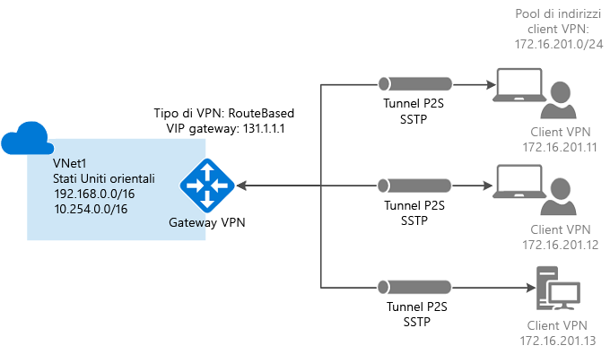
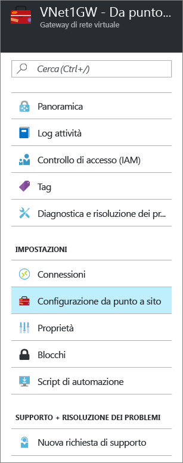

# Configurare una connessione da punto a sito a una rete virtuale usando il portale di Azure
> [!div class="op_single_selector"]
> * [Resource Manager - Portale di Azure](vpn-gateway-howto-point-to-site-resource-manager-portal.md)
> * [Resource Manager - PowerShell](vpn-gateway-howto-point-to-site-rm-ps.md)
> * [Classica - Portale di Azure](vpn-gateway-howto-point-to-site-classic-azure-portal.md)
> 
> 

Una configurazione da punto a sito (P2S) permette di creare una connessione protetta da un singolo computer client a una rete virtuale. P2S è una connessione VPN tramite SSTP (Secure Sockets Tunneling Protocol). Una soluzione Da punto a sito è utile quando ci si vuole connettere alla rete virtuale da una posizione remota, ad esempio da casa o durante una riunione, oppure quando solo pochi client devono connettersi a una rete virtuale. Le connessioni P2S non richiedono un dispositivo VPN o un indirizzo IP pubblico. La connessione VPN viene avviata dal computer client.

Questo articolo illustra la creazione di una rete virtuale con una connettività da punto a sito usando il Portale di Azure. Per altre informazioni sulla connettività da punto a sito, consultare le [Domande frequenti sulla connettività da punto a sito](#faq) alla fine di questo articolo.

### Metodi e modelli di distribuzione per connessioni P2S
[!INCLUDE [deployment models](../../includes/vpn-gateway-deployment-models-include.md)]

La tabella seguente descrive i due modelli di distribuzione e i metodi di distribuzione disponibili per le configurazioni P2S. Quando è disponibile un articolo contenente la procedura di configurazione, nella tabella è presente un collegamento diretto.

[!INCLUDE [vpn-gateway-clasic-rm](../../includes/vpn-gateway-table-point-to-site-include.md)]

## Flusso di lavoro di base

### Valori di esempio
* **Nome: VNet1**
* **Spazio indirizzi: 192.168.0.0/16** Per questo esempio, viene usato un solo spazio indirizzi. È possibile avere più di uno spazio indirizzi per la rete virtuale.
* **Nome subnet: FrontEnd**
* **Intervallo di indirizzi subnet: 192.168.1.0/24**
* **Sottoscrizione:** se si hanno più sottoscrizioni, verificare di usare quella corretta.
* **Gruppo di risorse: TestRG**
* **Località: Stati Uniti orientali**
* **GatewaySubnet: 192.168.200.0/24**
* **Nome gateway di rete virtuale: VNet1GW**
* **Tipo di gateway: VPN**
* **Tipo VPN: Basato su route**
* **Indirizzo IP pubblico: VNet1GWpip**
* **Tipo di connessione: Da punto a sito**
* **Pool di indirizzi client: 172.16.201.0/24** I client VPN che si connettono alla rete virtuale con questa connessione da punto a sito ricevono un indirizzo IP dal pool di indirizzi client.

## Parte 1: Creare una rete virtuale
Prima di iniziare, verificare di possedere una sottoscrizione di Azure. Se non si ha una sottoscrizione di Azure, è possibile attivare i [vantaggi per i sottoscrittori di MSDN](https://azure.microsoft.com/pricing/member-offers/msdn-benefits-details) oppure iscriversi per ottenere un [account gratuito](https://azure.microsoft.com/pricing/free-trial). Se si crea questa configurazione come esercizio, è possibile fare riferimento ai [valori di esempio](#example).

[!INCLUDE [vpn-gateway-basic-vnet-rm-portal](../../includes/vpn-gateway-basic-vnet-rm-portal-include.md)]

## Parte 2: Specificare lo spazio di indirizzi e le subnet
È possibile aggiungere altri spazi degli indirizzi e subnet alla rete virtuale dopo che è stata creata.

[!INCLUDE [vpn-gateway-additional-address-space](../../includes/vpn-gateway-additional-address-space-include.md)]

## Parte 3: Aggiungere una subnet del gateway

Prima di connettere la rete virtuale a un gateway, è necessario creare la subnet del gateway per la rete virtuale con cui si vuole stabilire la connessione. Il servizio del gateway usa gli indirizzi IP specificati nella subnet del gateway. Se possibile, creare una subnet del gateway con un blocco CIDR di /28 o /27 per fornire indirizzi IP sufficienti a soddisfare altri requisiti di configurazione futuri.

Gli screenshot di questa sezione servono come esempio di riferimento. Assicurarsi di usare l'intervallo di indirizzi GatewaySubnet corrispondente ai valori obbligatori per la configurazione.

###Per creare una subnet del gateway

[!INCLUDE [vpn-gateway-add-gwsubnet-rm-portal](../../includes/vpn-gateway-add-gwsubnet-rm-portal-include.md)]

## Parte 4: Specificare un server DNS (facoltativo)

Il server DNS non è necessario per le connessioni da punto a sito. Se tuttavia si vuole ottenere la risoluzione dei nomi per le risorse distribuite nella rete virtuale, è necessario specificare un server DNS. Questa impostazione consente di specificare il server DNS da usare per la risoluzione dei nomi nella rete virtuale. Non comporta la creazione di un server DNS.

[!INCLUDE [vpn-gateway-add-dns-rm-portal](../../includes/vpn-gateway-add-dns-rm-portal-include.md)]

## Parte 5: Creare un gateway di rete virtuale
Le connessioni da punto a sito richiedono le impostazioni seguenti.

* Tipo di gateway: VPN
* Tipo VPN: Basato su route

### Per creare un gateway di rete virtuale
[!INCLUDE [vpn-gateway-add-gw-rm-portal](../../includes/vpn-gateway-add-gw-rm-portal-include.md)]

## Parte 6: Generare i certificati

I certificati vengono usati da Azure per autenticare i client VPN per VPN da punto a sito. Dopo avere creato il certificato radice, esportare i dati del certificato pubblico, non la chiave privata, come file CER X.509 con codifica in base 64. Si caricano quindi i dati del certificato pubblico dal certificato radice ad Azure.

Ogni computer client che si connette a una rete virtuale usando la soluzione Da punto a sito deve avere un certificato client installato. Il certificato client viene generato dal certificato radice e viene installato in ogni computer client. Se non è stato installato un certificato client valido e il client prova a connettersi alla rete virtuale, l'autenticazione avrà esito negativo.

### Passaggio 1: Ottenere il file CER per il certificato radice

####Certificato aziendale
 
Se si tratta di una soluzione aziendale, è possibile usare la catena di certificati esistente. Ottenere il file con estensione cer per il certificato radice che si vuole usare.

####Certificato radice autofirmato

Se non si usa una soluzione aziendale per la creazione di certificati, è necessario creare un certificato radice autofirmato. Per creare un certificato radice autofirmato contenente i campi necessari per l'autenticazione da punto a sito, è possibile usare PowerShell. Per informazioni dettagliate sulla procedura di creazione di un certificato radice autofirmato, vedere [Creare un certificato radice autofirmato per connessioni da punto a sito con PowerShell](vpn-gateway-certificates-point-to-site.md).

> [!NOTE]
> In precedenza, makecert era il metodo consigliato per creare certificati radice autofirmati e generare i certificati client per le connessioni da punto a sito. Ora è possibile usare PowerShell per creare questi certificati. Un vantaggio dell'uso di PowerShell è costituito dalla possibilità di creare certificati SHA-2. Per informazioni sui valori necessari, vedere [Creare un certificato radice autofirmato per connessioni da punto a sito con PowerShell](vpn-gateway-certificates-point-to-site.md).
>
>

#### Per esportare la chiave pubblica per un certificato radice autofirmato

Le connessioni da punto a sito richiedono il caricamento della chiave pubblica (file con estensione cer) in Azure. La procedura seguente consente di esportare il file con estensione .cer per il certificato radice autofirmato.

1. Per ottenere un file con estensione .cer dal certificato, aprire **certmgr.msc**. Individuare il certificato radice autofirmato, in genere in "Certificati - Utente corrente\Personale\Certificati" e fare clic con il pulsante destro del mouse. Fare clic su **Tutte le attività** e quindi su **Esporta**. Si avvia la procedura di **Esportazione guidata certificati**.
2. Nella procedura guidata fare clic su **Avanti**. Selezionare **No, non esportare la chiave privata** e quindi fare clic su **Avanti**.
3. Nella pagina **Formato file di esportazione** selezionare **Codificato Base 64 X.509 (.CER)** e quindi fare clic su **Avanti**. 
4. In **File da esportare** fare clic su **Sfoglia** e passare alla posizione in cui si vuole esportare il certificato. Per **Nome file**, assegnare un nome al file del certificato. Quindi fare clic su **Avanti**.
5. Fare clic su **Fine** per esportare il certificato. Verrà visualizzato il messaggio **Esportazione completata**. Fare clic su **OK** per chiudere la procedura guidata.

### Passaggio 2: Generare un certificato client
È possibile generare un certificato univoco per ogni client che stabilirà la connessione alla rete virtuale oppure usare lo stesso certificato in più client. Il vantaggio della generazione di certificati client univoci è dato dalla possibilità di revocare un certificato, se necessario. Altrimenti, se tutti gli utenti usano lo stesso certificato client ed è necessario revocarlo per un client, si dovranno generare e installare nuovi certificati per tutti i client che usano tale certificato per l'autenticazione.

####Certificato aziendale
- Se si usa una soluzione aziendale per la creazione di certificati, generare un certificato client con il valore di nome comune nel formato "name@yourdomain.com", invece che nel formato "nome dominio\nome utente".
- Assicurarsi che il certificato client che si emette sia basato sul modello di certificato "Utente" con "Autenticazione client" come primo elemento nell'elenco d'uso, invece di Accesso smart card e così via. È possibile controllare il certificato facendo doppio clic sul certificato client e aprendo **Dettagli > Utilizzo chiavi avanzato**.

####Certificato radice autofirmato 
Se si usa un certificato radice autofirmato, vedere [Generare un certificato client usando PowerShell](vpn-gateway-certificates-point-to-site.md#clientcert) per informazioni sulla procedura per generare un certificato client compatibile con le connessioni da punto a sito.

### Passaggio 3: Esportare il certificato client
Se si genera un certificato client da un certificato radice autofirmato usando le istruzioni di [PowerShell](vpn-gateway-certificates-point-to-site.md#clientcert), viene eseguita l'installazione automatica nel computer usato per generarlo. Se si vuole installare un certificato client in un altro computer client, è necessario esportarlo.

1. Per esportare un certificato client, aprire **certmgr.msc**. Fare clic con il pulsante destro del mouse sul certificato client da esportare, scegliere **Tutte le attività** e quindi fare clic su **Esporta**. Si avvia la procedura di **Esportazione guidata certificati**.
2. Nella procedura guidata, fare clic su **Avanti**, selezionare **Sì, esporta la chiave privata** e quindi fare clic su **Avanti**.
3. Nella pagina **Formato file di esportazione** lasciare selezionate le impostazioni predefinite. Verificare che l'opzione **Se possibile, includi tutti i certificati nel percorso certificazione** sia selezionata. Quindi fare clic su **Avanti**. 
4. Nella pagina **Sicurezza** è necessario proteggere la chiave privata. Se si sceglie di usare una password, assicurarsi di registrare o ricordare quella impostata per questo certificato. Quindi fare clic su **Avanti**.
5. In **File da esportare** fare clic su **Sfoglia** e passare alla posizione in cui si vuole esportare il certificato. Per **Nome file**, assegnare un nome al file del certificato. Quindi fare clic su **Avanti**.
6. Fare clic su **Fine** per esportare il certificato.   

## Parte 7: Aggiungere il pool di indirizzi client
1. Dopo avere creato il gateway di rete virtuale, andare alla sezione **Impostazioni** del pannello della rete virtuale. Nella sezione **Impostazioni** fare clic su **Configurazione da punto a sito** per aprire il pannello **Configurazione**.
   
    
2. **Pool di indirizzi** è il pool di indirizzi IP da cui i client che si connettono riceveranno un indirizzo IP. Aggiungere il pool di indirizzi e quindi fare clic su **Salva**.
   
    

## Parte 8: Caricare il file CER del certificato radice
Dopo che il gateway è stato creato, è possibile caricare il certificato CER di un certificato radice trusted in Azure. È possibile caricare file per un massimo di 20 certificati radice. Non si può caricare la chiave privata per il certificato radice in Azure. Dopo che è stato caricato, il file CER viene usato da Azure per autenticare i client che si connettono alla rete virtuale.

1. I certificati vengono aggiunti nel pannello **Point-to-site configuration** (Configurazione da punt a sito) nella sezione **Certificato radice**.  
2. Verificare di avere esportato il certificato radice come file X.509 con codifica in base 64 (CER). È necessario esportare il certificato in questo formato per poterlo aprire con l'editor di testo.
3. Aprire il certificato con un editor di testo, ad esempio il Blocco note. Copiare solo la sezione seguente come un'unica riga continua:
   
    

    > [!NOTE]
    > Durante la copia dei dati del certificato, assicurarsi di copiare il testo come unica riga continua senza ritorni a capo o avanzamenti riga. Potrebbe essere necessario modificare la visualizzazione nell'editor di testo in "Show Symbol/Show all characters" (Mostra simbolo/Mostra tutti i caratteri) per visualizzare i ritorni a capo e gli avanzamenti riga.                                                                                                                                                                            
    >
    >

4. Incollare i dati del certificato nel campo **Public Certificate Data** (Dati del certificato pubblico). **Dare un nome** al certificato e fare quindi clic su **Salva**. È possibile aggiungere fino a 20 certificati radice attendibili.
   
    

## Parte 9: Scaricare e installare il pacchetto di configurazione del client VPN
Nei client che si connettono ad Azure con una connessione da punto a sito devono essere installati un certificato client e un pacchetto di configurazione del client VPN. I pacchetti di configurazione del client VPN sono disponibili per i client Windows. 

Nel pacchetto client VPN sono contenute le informazioni per configurare il software client VPN predefinito di Windows. La configurazione è specifica per la VPN a cui ci si vuole connettere. Tramite il pacchetto non viene installato del software aggiuntivo.

È possibile usare lo stesso pacchetto di configurazione del client VPN in ogni computer client, purché la versione corrisponda all'architettura del client.

### Passaggio 1: Scaricare il pacchetto di configurazione del client

1. Nel pannello **Configurazione da punto a sito** fare clic su **Download VPN client** (Scarica client VPN) per aprire il pannello **Download VPN client** (Scarica client VPN). La generazione del pacchetto richiede un paio di minuti.
   
    
2. Selezionare il pacchetto corretto per il client, quindi fare clic su **Scarica**. Salvare il file del pacchetto di configurazione. Questo file verrà installato in ogni computer client che si connetterà alla rete virtuale.

    

### Passaggio 2: Installare il pacchetto di configurazione del client

1. Copiare il file di configurazione in locale nel computer che si vuole connettere alla rete virtuale. 
2. Fare doppio clic sul file con estensione exe per installare il pacchetto nel computer client. Dal momento che il pacchetto di configurazione è stato creato dall'utente, non è firmato. Questo vuol dire che potrebbe essere visualizzato un avviso. Se viene visualizzato un popup Windows SmartScreen, fare clic su **Altre informazioni** (a sinistra) e quindi su **Esegui comunque** per installare il pacchetto.
3. Nel computer client passare a **Impostazioni di rete** e fare clic su **VPN**. La connessione verrà visualizzata in un elenco, con il nome della rete virtuale a cui si connette, e avrà un aspetto simile al seguente:
3. Installare il pacchetto nel computer client. Se viene visualizzato un popup Windows SmartScreen, fare clic su **Altre informazioni** (a sinistra) e quindi su **Esegui comunque** per installare il pacchetto.
4. Nel computer client passare a **Impostazioni di rete** e fare clic su **VPN**. La connessione verrà visualizzata in un elenco, insieme al nome della rete virtuale a cui si connette ed è simile a questo esempio: 
   
    

## Parte 10: Installare un certificato client esportato

Se si vuole creare una connessione da punto a sito da un computer client diverso da quello usato per generare i certificati client, è necessario installare un certificato client. Quando si installa un certificato client, sarà necessaria la password creata quando il certificato client è stato esportato. 

1. Individuare e copiare il file *.pfx* nel computer client. Nel computer client, fare doppio clic sul file *.pfx* per installarlo. Lasciare il **Percorso archivio** impostato come **Utente corrente** e quindi fare clic su **Avanti**.
2. Nella pagina **File da importare** non apportare alcuna modifica. Fare clic su **Avanti**.
3. Nella pagina **Protezione della chiave privata** immettere la password per il certificato, se usato, o verificare che l'entità di sicurezza che installa il certificato sia corretta, quindi fare clic su **Avanti**.
4. Nella pagina **Archivio certificati** lasciare la posizione come predefinita e quindi fare clic su **Avanti**.
5. Fare clic su **Fine**. In **Avviso di sicurezza** per l'installazione del certificato fare clic su **Sì**. È possibile fare clic su "Sì" perché il certificato è stato generato. Il certificato è stato importato correttamente.

## Parte 11: Connettersi ad Azure
1. Per connettersi alla rete virtuale, nel computer client passare alle connessioni VPN e individuare quella creata, che ha lo stesso nome della rete virtuale locale. Fare clic su **Connetti**. È possibile che venga visualizzato un messaggio popup che fa riferimento all'uso del certificato. In questo caso, fare clic su **Continua** per usare privilegi elevati. 
2. Nella pagina **Stato connessione** fare clic su **Connetti** per avviare la connessione. Se viene visualizzato un **Seleziona certificato** dello schermo, verificare che il certificato client visualizzato sia quello che si desidera utilizzare per la connessione. In caso contrario, usare la freccia a discesa per selezionare il certificato corretto e quindi fare clic su **OK**.
   
    

    
3. Verrà stabilita la connessione.
   
    
                                                                                                                                                                           

> [!NOTE]
> Se si usa un certificato che è stato rilasciato tramite una soluzione CA globale e si riscontrano problemi durante l'autenticazione, controllare l'ordine di autenticazione del certificato client. È possibile controllare l'ordine dell'elenco di autenticazione facendo doppio clic sul certificato client e andando in **Dettagli > Utilizzo chiavi avanzato**. Assicurarsi che l'elenco mostri "Autenticazione client" come primo elemento. In caso contrario, è necessario emettere un certificato client in base al modello di utente con l'autenticazione client come primo elemento nell'elenco. 
>
>

## Parte 12: Verificare la connessione
1. Per verificare che la connessione VPN è attiva, aprire un prompt dei comandi con privilegi elevati ed eseguire *ipconfig/all*.
2. Visualizzare i risultati. Si noti che l'indirizzo IP ricevuto è uno degli indirizzi compresi nel pool di indirizzi del client VPN da punto a sito specificato al momento della configurazione. I risultati dovrebbero essere simili a quanto segue:
   
        PPP adapter VNet1:
            Connection-specific DNS Suffix .:
            Description.....................: VNet1
            Physical Address................:
            DHCP Enabled....................: No
            Autoconfiguration Enabled.......: Yes
            IPv4 Address....................: 172.16.201.3(Preferred)
            Subnet Mask.....................: 255.255.255.255
            Default Gateway.................:
            NetBIOS over Tcpip..............: Enabled

## Aggiungere o rimuovere certificati radice attendibili
È possibile aggiungere e rimuovere certificati radice attendibili da Azure. Quando si rimuove un certificato attendibile, i certificati client generati dal certificato radice non potranno più connettersi ad Azure tramite una connessione da punto a sito. Per consentire ai client di connettersi, sarà necessario installare un nuovo certificato client generato da un certificato considerato attendibile in Azure.

### Per aggiungere un certificato radice attendibile

In Azure è possibile aggiungere fino a 20 file CER di certificato radice trusted. Per istruzioni, vedere la sezione relativa al [caricamento di un certificato radice attendibile](#uploadfile) in questo articolo.

### Per rimuovere un certificato radice attendibile

1. Per rimuovere un certificato radice attendibile, passare al pannello **Configurazione da punto a sito** per il gateway di rete virtuale.
2. Nella sezione **Certificato radice** del pannello individuare il certificato che si vuole rimuovere.
3. Fare clic sui puntini di sospensione accanto al certificato e quindi fare clic su "Rimuovi".

## Revocare un certificato client
È possibile revocare i certificati client. L'elenco di revoche di certificati consente di negare in modo selettivo la connettività da punto a sito basata sui singoli certificati client. Questa operazione è diversa rispetto alla rimozione di un certificato radice attendibile. Se si rimuove un file con estensione cer del certificato radice attendibile da Azure, viene revocato l'accesso per tutti i certificati client generati o firmati dal certificato radice revocato. La revoca di un certificato client, anziché del certificato radice, consente di continuare a usare gli altri certificati generati dal certificato radice per l'autenticazione per la connessione da punto a sito.

La regola generale è quella di usare il certificato radice per gestire l'accesso a livello di team o organizzazione, usando i certificati client revocati per il controllo di accesso con granularità fine su singoli utenti.

### Per revocare un certificato client

È possibile revocare un certificato client aggiungendo l'identificazione personale all'elenco di revoche di certificati.

1. Ottenere l'identificazione personale del certificato client. Per altre informazioni, vedere [Procedura: recuperare l'identificazione personale di un certificato](https://msdn.microsoft.com/library/ms734695.aspx).
2. Copiare le informazioni in un editor di testo e rimuovere tutti gli spazi in modo che sia una stringa continua.
3. Passare al gateway di rete virtuale nel pannello **Configurazione da punto a sito** che è stato usato per [caricare un certificato radice attendibile](#uploadfile).
4. Nella sezione **Certificati revocati** immettere un nome descrittivo per il certificato (non deve corrispondere necessariamente alle credenziali del certificato).
5. Copiare e incollare la stringa di identificazione personale nel campo **Identificazione personale**.
6. L'identificazione personale verrà convalidata e sarà aggiunta automaticamente all'elenco di revoche di certificati. Verrà visualizzato un messaggio relativo all'aggiornamento dell'elenco. 
7. Dopo aver completato l'aggiornamento, il certificato non può più essere usato per la connessione. Per i client che tentano di connettersi con questo certificato verrà visualizzato un messaggio che informa che il certificato non è più valido.

## Domande frequenti sulla connettività da punto a sito

[!INCLUDE [Point-to-Site FAQ](../../includes/vpn-gateway-point-to-site-faq-include.md)]

## Passaggi successivi
Dopo aver completato la connessione, è possibile aggiungere macchine virtuali alle reti virtuali. Per altre informazioni, vedere [Macchine virtuali](https://docs.microsoft.com/azure/#pivot=services&panel=Compute). Per altre informazioni sulla rete e sulle macchine virtuali, vedere [Panoramica di rete delle macchine virtuali Linux e Azure](../virtual-machines/virtual-machines-linux-azure-vm-network-overview.md).

