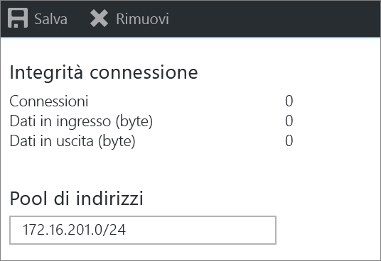
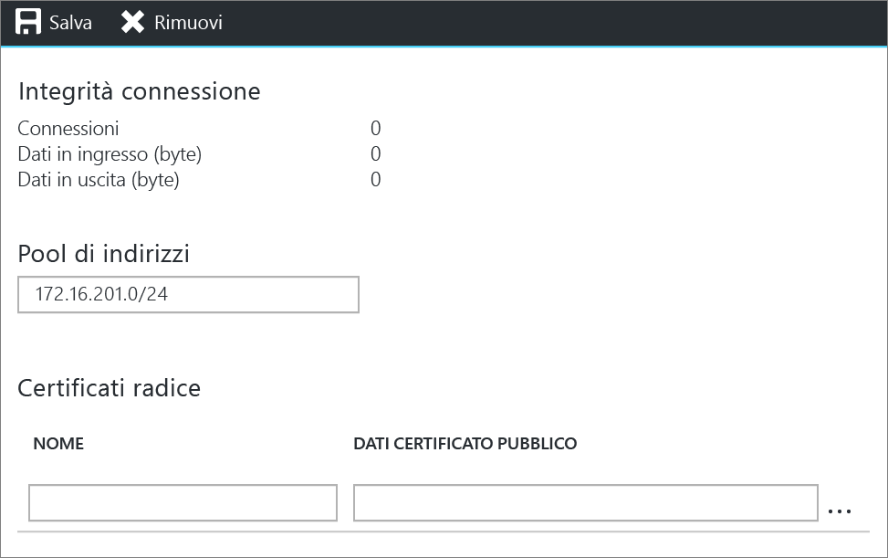
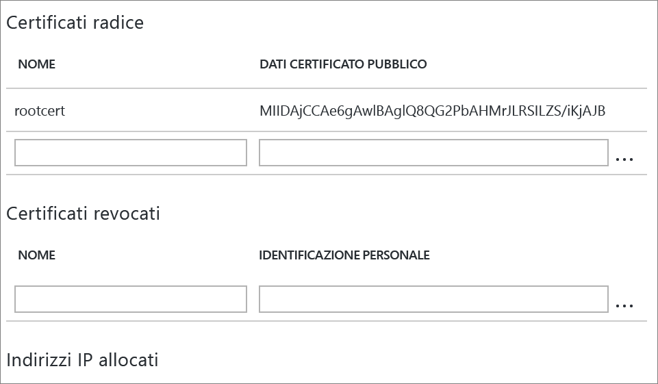
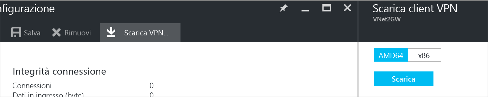

# Configurare una connessione da punto a sito a una rete virtuale usando il portale di Azure
> [!div class="op_single_selector"]
> * [Resource Manager - Portale di Azure](vpn-gateway-howto-point-to-site-resource-manager-portal.md)
> * [Resource Manager - PowerShell](vpn-gateway-howto-point-to-site-rm-ps.md)
> * [Classica - Portale di Azure](vpn-gateway-howto-point-to-site-classic-azure-portal.md)
> 
> 

Una configurazione da punto a sito (P2S) permette di creare una connessione protetta da un singolo computer client a una rete virtuale. Una soluzione P2S è utile quando ci si vuole connettere alla rete virtuale da una posizione remota, ad esempio da casa o durante una riunione, oppure quando solo pochi client devono connettersi a una rete virtuale. 

Le connessioni da punto a sito non richiedono un dispositivo VPN o un indirizzo IP pubblico per funzionare. Una connessione VPN viene stabilita avviando la connessione dal computer client. Per altre informazioni sulle connessioni da punto a sito, vedere [Domande frequenti sul gateway VPN](vpn-gateway-vpn-faq.md#point-to-site-connections) e [Pianificazione e progettazione](vpn-gateway-plan-design.md).

Questo articolo illustra la creazione di una rete virtuale con una connessione da punto a sito nel modello di distribuzione Resource Manager usando il portale di Azure.

### Metodi e modelli di distribuzione per connessioni P2S
[!INCLUDE [deployment models](../../includes/vpn-gateway-deployment-models-include.md)]

La tabella seguente descrive i due modelli di distribuzione e i metodi di distribuzione disponibili per le configurazioni P2S. Quando è disponibile un articolo contenente la procedura di configurazione, nella tabella è presente un collegamento diretto.

[!INCLUDE [vpn-gateway-clasic-rm](../../includes/vpn-gateway-table-point-to-site-include.md)]

## Flusso di lavoro di base

### Valori di esempio
* **Nome: VNet1**
* **Spazio indirizzi: 192.168.0.0/16** Per questo esempio, viene usato un solo spazio indirizzi. È possibile avere più di uno spazio indirizzi per la rete virtuale.
* **Nome subnet: FrontEnd**
* **Intervallo di indirizzi subnet: 192.168.1.0/24**
* **Sottoscrizione:** se si hanno più sottoscrizioni, verificare di usare quella corretta.
* **Gruppo di risorse: TestRG**
* **Località: Stati Uniti orientali**
* **GatewaySubnet: 192.168.200.0/24**
* **Nome gateway di rete virtuale: VNet1GW**
* **Tipo di gateway: VPN**
* **Tipo VPN: Basato su route**
* **Indirizzo IP pubblico: VNet1GWpip**
* **Tipo di connessione: Da punto a sito**
* **Pool di indirizzi client: 172.16.201.0/24** I client VPN che si connettono alla rete virtuale con questa connessione da punto a sito ricevono un indirizzo IP dal pool di indirizzi client.

## Prima di iniziare
* Verificare di possedere una sottoscrizione di Azure. Se non si ha una sottoscrizione di Azure, è possibile attivare i [vantaggi per i sottoscrittori di MSDN](https://azure.microsoft.com/pricing/member-offers/msdn-benefits-details) oppure iscriversi per ottenere un [account gratuito](https://azure.microsoft.com/pricing/free-trial).

## Parte 1: Creare una rete virtuale
Se si crea questa configurazione come esercizio, è possibile fare riferimento ai [valori di esempio](#example).

[!INCLUDE [vpn-gateway-basic-vnet-rm-portal](../../includes/vpn-gateway-basic-vnet-rm-portal-include.md)]

## Parte 2: Specificare lo spazio di indirizzi e le subnet
È possibile aggiungere altri spazi degli indirizzi e subnet alla rete virtuale dopo che è stata creata.

[!INCLUDE [vpn-gateway-additional-address-space](../../includes/vpn-gateway-additional-address-space-include.md)]

## Parte 3: Aggiungere una subnet del gateway

Prima di connettere la rete virtuale a un gateway, è necessario creare la subnet del gateway per la rete virtuale con cui si vuole stabilire la connessione. Se possibile, è consigliabile creare una subnet del gateway con un blocco CIDR di /28 o /27 per fornire indirizzi IP sufficienti a soddisfare altri requisiti di configurazione futuri.

Gli screenshot di questa sezione servono come esempio di riferimento. Assicurarsi di usare l'intervallo di indirizzi GatewaySubnet corrispondente ai valori obbligatori per la configurazione.

###Per creare una subnet del gateway

[!INCLUDE [vpn-gateway-add-gwsubnet-rm-portal](../../includes/vpn-gateway-add-gwsubnet-rm-portal-include.md)]

## Parte 4: Specificare un server DNS (facoltativo)
[!INCLUDE [vpn-gateway-add-dns-rm-portal](../../includes/vpn-gateway-add-dns-rm-portal-include.md)]

## Parte 5: Creare un gateway di rete virtuale
Le connessioni da punto a sito richiedono le impostazioni seguenti.

* Tipo di gateway: VPN
* Tipo VPN: Basato su route

### Per creare un gateway di rete virtuale
[!INCLUDE [vpn-gateway-add-gw-rm-portal](../../includes/vpn-gateway-add-gw-rm-portal-include.md)]

## Parte 6: Generare i certificati
I certificati vengono usati da Azure per autenticare i client VPN per VPN da punto a sito. I dati del certificato pubblico (non la chiave privata) vengono esportati come file CER X.509 con codifica in base&64; da un certificato radice generato da una soluzione aziendale per la creazione di certificati o da un certificato radice autofirmato. Si importano quindi i dati del certificato pubblico dal certificato radice ad Azure. È anche necessario generare un certificato client da un certificato radice per i client. In ogni client che si vuole connettere alla rete virtuale con una connessione P2S deve essere installato un certificato client generato dal certificato radice.

### Passaggio 1: Ottenere il file CER per il certificato radice
Se si tratta di una soluzione aziendale, è possibile usare la catena di certificati esistente. Se non si usa una soluzione CA aziendale, è possibile creare un certificato radice autofirmato. Il metodo consigliato per creare un certificato autofirmato per le connessioni P2S è makecert. Anche se è possibile usare PowerShell per creare certificati autofirmati, il certificato generato con PowerShell non contiene i campi necessari per le connessioni P2S.

* Se si usa un sistema aziendale per la creazione di certificati, ottenere il file CER per il certificato radice che si vuole usare. 
* Se non si usa una soluzione aziendale per la creazione di certificati, è necessario generare un certificato radice autofirmato. Per i passaggi relativi a Windows 10, è possibile vedere [Usare i certificati radice autofirmati per le configurazioni da punto a sito](vpn-gateway-certificates-point-to-site.md).

1. Per ottenere un file CER da un certificato, aprire **certmgr.msc** e individuare il certificato radice. Fare clic con il pulsante destro del mouse sul certificato radice autofirmato, scegliere **Tutte le attività** e quindi fare clic su **Esporta**. Si avvia la procedura di **Esportazione guidata certificati**.
2. Nella procedura guidata fare clic su **Avanti**, selezionare **No, non esportare la chiave privata** e quindi fare clic su **Avanti**.
3. Nella pagina **Formato file di esportazione** selezionare **Codificato Base&64; X.509 (.CER)**. Quindi fare clic su **Avanti**. 
4. In **File da esportare** fare clic su **Sfoglia** e passare alla posizione in cui si vuole esportare il certificato. Per **Nome file**, assegnare un nome al file del certificato. Quindi fare clic su **Avanti**.
5. Fare clic su **Fine** per esportare il certificato.

### Passaggio 2: Generare un certificato client
È possibile generare un certificato univoco per ogni client che stabilirà la connessione oppure usare lo stesso certificato in più client. Il vantaggio della generazione di certificati client univoci è dato dalla possibilità di revocare un certificato, se necessario. In caso contrario, se tutti gli utenti usano lo stesso certificato client ed è necessario revocarlo per un client, si dovranno generare e installare nuovi certificati per tutti i client che usano tale certificato per l'autenticazione.

* Se si usa una soluzione aziendale per la creazione di certificati, generare un certificato client con il valore di nome comune nel formato 'name@yourdomain.com', invece che nel formato "nome dominio\nome utente". 
* Se si usa un certificato autofirmato, per generare un certificato client vedere [Usare i certificati radice autofirmati per le configurazioni da punto a sito](vpn-gateway-certificates-point-to-site.md) .

### Passaggio 3: Esportare il certificato client
Il certificato client è necessario per l'autenticazione. Dopo avere generato il certificato client, esportarlo. Il certificato client esportato verrà installato in seguito in ogni computer client.

1. Per esportare un certificato client, è possibile usare *certmgr.msc*. Fare clic con il pulsante destro del mouse sul certificato client da esportare, scegliere **Tutte le attività** e quindi fare clic su **Esporta**.
2. Esportare il certificato client con la chiave privata. Si tratta di un file con estensione *prx* . Assicurarsi di eseguire la registrazione o ricordare la password (chiave) impostata per il certificato.

## Parte 7: Aggiungere il pool di indirizzi client
1. Dopo avere creato il gateway di rete virtuale, andare alla sezione **Impostazioni** del pannello della rete virtuale. Nella sezione **Impostazioni** fare clic su **Configurazione da punto a sito** per aprire il pannello **Configurazione**.
   
    
2. **Pool di indirizzi** è il pool di indirizzi IP da cui i client che si connettono riceveranno un indirizzo IP. Aggiungere il pool di indirizzi e quindi fare clic su **Salva**.
   
    

## Parte 8: Caricare il file CER del certificato radice
Dopo che il gateway è stato creato, è possibile caricare il certificato CER di un certificato radice trusted in Azure. È possibile caricare file per un massimo di 20 certificati radice. Non si può caricare la chiave privata per il certificato radice in Azure. Dopo che è stato caricato, il file CER viene usato da Azure per autenticare i client che si connettono alla rete virtuale.

1. Andare al pannello **Configurazione da punto a sito**. I file CER verranno aggiunti nella sezione **Certificati radice** di questo pannello.
   
    
2. Verificare di avere esportato il certificato radice come file X.509 con codifica in base&64; (CER). È necessario esportare il certificato in questo formato per poterlo aprire con l'editor di testo.
3. Aprire il certificato con un editor di testo, ad esempio il Blocco note. Copiare solo la sezione seguente:
   
    
4. Incollare i dati del certificato nella sezione **Dati del certificato pubblico** del portale. Inserire il nome del certificato nello spazio **Nome** e quindi fare clic su **Salva**. È possibile aggiungere fino a 20 certificati radice attendibili.
   
    

## Parte 9: Scaricare e installare il pacchetto di configurazione del client VPN
Nei client che si connettono ad Azure con una connessione da punto a sito devono essere installati un certificato client e un pacchetto di configurazione del client VPN. I pacchetti di configurazione del client VPN sono disponibili per i client Windows. 

Nel pacchetto client VPN sono contenute le informazioni per configurare il software client VPN predefinito di Windows. La configurazione è specifica per la VPN a cui ci si vuole connettere. Tramite il pacchetto non viene installato del software aggiuntivo. Per altre informazioni, vedere [Domande frequenti sul gateway VPN](vpn-gateway-vpn-faq.md#point-to-site-connections) .

1. Nel pannello **Configurazione da punto a sito** fare clic su **Download VPN client** (Scarica client VPN) per aprire il pannello **Download VPN client** (Scarica client VPN).
   
    
2. Selezionare il pacchetto corretto per il client, quindi fare clic su **Scarica**. Per i client a 64 bit, selezionare **AMD64**. Per i client a 32 bit, selezionare **x86**.
3. Installare il pacchetto nel computer client. Se viene visualizzato un popup SmartScreen, fare clic su **Altre informazioni**, quindi su **Esegui comunque** per installare il pacchetto.
4. Nel computer client passare a **Impostazioni di rete** e fare clic su **VPN**. La connessione verrà visualizzata in un elenco, insieme al nome della rete virtuale a cui si connette ed è simile a questo esempio: 
   
    

## Parte 10: Installare il certificato client
Ogni computer client deve avere un certificato client per l'autenticazione. Quando si installa il certificato client, sarà necessaria la password creata quando il certificato client è stato esportato.

1. Copiare il file PFX nel computer client.
2. Fare doppio clic sul file PFX per installarlo. Non modificare il percorso di installazione.

## Parte 11: Connettersi ad Azure
1. Per connettersi alla rete virtuale, nel computer client passare alle connessioni VPN e individuare quella creata, che ha lo stesso nome della rete virtuale locale. Fare clic su **Connetti**. È possibile che venga visualizzato un messaggio popup che fa riferimento all'uso del certificato. In questo caso, fare clic su **Continua** per usare privilegi elevati. 
2. Nella pagina **Stato connessione** fare clic su **Connetti** per avviare la connessione. Se viene visualizzato un **Seleziona certificato** dello schermo, verificare che il certificato client visualizzato sia quello che si desidera utilizzare per la connessione. In caso contrario, usare la freccia a discesa per selezionare il certificato corretto e quindi fare clic su **OK**.
   
    
3. Verrà stabilita la connessione.
   
    

## Parte 12: Verificare la connessione
1. Per verificare che la connessione VPN è attiva, aprire un prompt dei comandi con privilegi elevati ed eseguire *ipconfig/all*.
2. Visualizzare i risultati. Si noti che l'indirizzo IP ricevuto è uno degli indirizzi compresi nel pool di indirizzi del client VPN da punto a sito specificato al momento della configurazione. I risultati dovrebbero essere simili a quanto segue:
   
        PPP adapter VNet1:
            Connection-specific DNS Suffix .:
            Description.....................: VNet1
            Physical Address................:
            DHCP Enabled....................: No
            Autoconfiguration Enabled.......: Yes
            IPv4 Address....................: 172.16.201.3(Preferred)
            Subnet Mask.....................: 255.255.255.255
            Default Gateway.................:
            NetBIOS over Tcpip..............: Enabled

## Per aggiungere o rimuovere certificato radice attendibili
È possibile rimuovere un certificato radice attendibile da Azure. Quando si rimuove un certificato attendibile, i certificati client generati dal certificato radice non potranno più connettersi ad Azure tramite una connessione da punto a sito. Per consentire ai client di connettersi, sarà necessario installare un nuovo certificato client generato da un certificato considerato attendibile in Azure.

È possibile gestire l'elenco di certificati client revocati nel pannello **Configurazione da punto a sito** che è stato usato per [caricare un certificato radice attendibile](#uploadfile).

## Per gestire l'elenco dei certificati client revocati
È possibile revocare i certificati client. L'elenco di revoche di certificati consente di negare in modo selettivo la connettività da punto a sito basata sui singoli certificati client. Se si rimuove un file CER del certificato radice da Azure, viene revocato l'accesso per tutti i certificati client generati o firmati dal certificato radice revocato. Se necessario, è possibile revocare un certificato client specifico, non radice. In questo modo, gli altri certificati generati dal certificato radice rimarranno validi. 

La regola generale è quella di usare il certificato radice per gestire l'accesso a livello di team o organizzazione, usando i certificati client revocati per il controllo di accesso con granularità fine su singoli utenti.

È possibile gestire l'elenco di certificati client revocati nel pannello **Configurazione da punto a sito** che è stato usato per [caricare un certificato radice attendibile](#uploadfile).

## Passaggi successivi
Dopo aver completato la connessione, è possibile aggiungere macchine virtuali alle reti virtuali. Per altre informazioni, vedere [Macchine virtuali](https://docs.microsoft.com/azure/#pivot=services&panel=Compute).

<!--HONumber=Jan17_HO4-->

