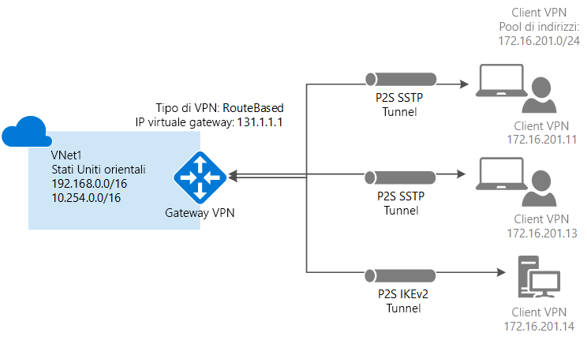

# <a name="configure-a-point-to-site-connection-to-a-vnet-using-native-azure-certificate-authentication-powershell"></a>Configurare una connessione da punto a sito a una rete virtuale usando l'autenticazione del certificato di Azure nativo: PowerShell

Questo articolo illustra come connettere in modo sicuro singoli client che eseguono Windows o Mac OS X a una rete virtuale di Azure. Le connessioni VPN da punto a sito sono utili per connettersi alla rete virtuale da una posizione remota, ad esempio nel caso di telecomunicazioni da casa o durante una riunione. È anche possibile usare una VPN da punto a sito al posto di una VPN da sito a sito quando solo pochi client devono connettersi a una rete virtuale. Le connessioni da punto a sito non richiedono un dispositivo VPN o un indirizzo IP pubblico. La modalità da punto a sito crea la connessione VPN tramite SSTP (Secure Sockets Tunneling Protocol) o IKEv2. Per altre informazioni sulle connessioni VPN da punto a sito, vedere [Informazioni sulla VPN da punto a sito](point-to-site-about.md).




## <a name="architecture"></a>Architecture

Le connessioni con autenticazione tramite certificato da punto a sito di Azure usano gli elementi seguenti, che vengono configurati in questo esercizio:

* Un gateway VPN RouteBased.
* La chiave pubblica (file CER) per un certificato radice, caricato in Azure. Il certificato, dopo essere stato caricato, viene considerato un certificato attendibile e viene usato per l'autenticazione.
* Un certificato client generato dal certificato radice. Il certificato client installato su ogni computer client che si connetterà alla rete virtuale. Questo certificato viene usato per l'autenticazione client.
* Una configurazione del client VPN. I file di configurazione del client VPN contengono le informazioni necessarie per la connessione del client alla rete virtuale. I file configurano il client VPN esistente, nativo del sistema operativo. Ogni client che si connette deve essere configurato usando le impostazioni nei file di configurazione.

## <a name="before-you-begin"></a>Prima di iniziare

* Verificare di possedere una sottoscrizione di Azure. Se non si ha una sottoscrizione di Azure, è possibile attivare i [vantaggi per i sottoscrittori di MSDN](https://azure.microsoft.com/pricing/member-offers/msdn-benefits-details) oppure iscriversi per ottenere un [account gratuito](https://azure.microsoft.com/pricing/free-trial).
* Installare la versione più recente dei cmdlet di PowerShell per Resource Manager. Per altre informazioni sull'installazione dei cmdlet di PowerShell, vedere [Come installare e configurare Azure PowerShell](/powershell/azure/overview). Questo elemento è importante perché le versioni precedenti dei cmdlet non contengono i valori correnti necessari per questo esercizio.

### <a name="example"></a>Valori di esempio

È possibile usare i valori di esempio per creare un ambiente di test o fare riferimento a questi valori per comprendere meglio gli esempi di questo articolo. Le variabili vengono impostate nella sezione [1](#declare) dell'articolo. È possibile seguire la procedura dettagliata e usare i valori senza modificarle oppure modificarli in base all'ambiente.

* **Nome: VNet1**
* **Spazio degli indirizzi: 192.168.0.0/16** e **10.254.0.0/16**<br>Questo esempio usa più di uno spazio indirizzi per mostrare che la configurazione funziona con più spazi indirizzi, ma per questa configurazione non sono necessari più spazi indirizzi.
* **Nome subnet: FrontEnd**
  * **Intervallo di indirizzi subnet: 192.168.1.0/24**
* **Nome subnet: BackEnd**
  * **Intervallo di indirizzi subnet: 10.254.1.0/24**
* **Nome subnet: GatewaySubnet**<br>Il nome subnet *GatewaySubnet* è obbligatorio per il funzionamento del gateway VPN.
  * **Intervallo di indirizzi subnet del gateway: 192.168.200.0/24** 
* **Pool di indirizzi client VPN: 172.16.201.0/24**<br>I client VPN che si connettono alla rete virtuale con questa connessione da punto a sito ricevono un indirizzo IP dal pool di indirizzi client VPN.
* **Sottoscrizione:** se si hanno più sottoscrizioni, verificare di usare quella corretta.
* **Gruppo di risorse: TestRG**
* **Località: Stati Uniti orientali**
* **Server DNS: indirizzo IP** del server DNS che si vuole usare per la risoluzione dei nomi. (facoltativo).
* **Nome del gateway: Vnet1GW**
* **Nome dell'IP pubblico: VNet1GWPIP**
* **VpnType: RouteBased** 

## <a name="declare"></a>1. Accedere e impostare le variabili

In questa sezione si accede e si dichiarano i valori usati per la configurazione. I valori dichiarati saranno usati negli script di esempio. È possibile modificare i valori in base all'ambiente personalizzato. In alternativa, è possibile usare i valori dichiarati e seguire la procedura come un esercizio.

1. Aprire la console di PowerShell con privilegi elevati e accedere al proprio account Azure. Il cmdlet richiederà le credenziali di accesso. Dopo l'accesso, vengono scaricate le impostazioni dell'account in modo che siano disponibili per Azure PowerShell.

  ```powershell
  Login-AzureRmAccount
  ```
2. Ottenere un elenco delle sottoscrizioni di Azure.

  ```powershell
  Get-AzureRmSubscription
  ```
3. Specificare la sottoscrizione da usare.

  ```powershell
  Select-AzureRmSubscription -SubscriptionName "Name of subscription"
  ```
4. Dichiarare le variabili da usare. Usare l'esempio seguente, sostituendo i valori con quelli personalizzati, se necessario.

  ```powershell
  $VNetName  = "VNet1"
  $FESubName = "FrontEnd"
  $BESubName = "Backend"
  $GWSubName = "GatewaySubnet"
  $VNetPrefix1 = "192.168.0.0/16"
  $VNetPrefix2 = "10.254.0.0/16"
  $FESubPrefix = "192.168.1.0/24"
  $BESubPrefix = "10.254.1.0/24"
  $GWSubPrefix = "192.168.200.0/26"
  $VPNClientAddressPool = "172.16.201.0/24"
  $RG = "TestRG"
  $Location = "East US"
  $GWName = "VNet1GW"
  $GWIPName = "VNet1GWPIP"
  $GWIPconfName = "gwipconf"
  ```

## <a name="ConfigureVNet"></a>2. Configurare una rete virtuale

1. Creare un gruppo di risorse.

  ```powershell
  New-AzureRmResourceGroup -Name $RG -Location $Location
  ```
2. Creare le configurazioni delle subnet per la rete virtuale, denominandole *FrontEnd*, *BackEnd* e *GatewaySubnet*. Questi prefissi devono fare parte dello spazio indirizzi della rete virtuale dichiarato.

  ```powershell
  $fesub = New-AzureRmVirtualNetworkSubnetConfig -Name $FESubName -AddressPrefix $FESubPrefix
  $besub = New-AzureRmVirtualNetworkSubnetConfig -Name $BESubName -AddressPrefix $BESubPrefix
  $gwsub = New-AzureRmVirtualNetworkSubnetConfig -Name $GWSubName -AddressPrefix $GWSubPrefix
  ```
3. Creare la rete virtuale.

  In questo esempio il parametro del server -DnsServer è facoltativo. Se si specifica un valore, non verrà creato un nuovo server DNS. L'indirizzo IP del server DNS specificato deve essere un server DNS che riesce a risolvere i nomi per le risorse a cui ci si connette dalla rete virtuale. Questo esempio usa un indirizzo IP privato, ma è probabile che non si tratti dell'indirizzo IP del server DNS in uso. Assicurarsi di usare valori personalizzati. Il valore specificato viene usato dalle risorse distribuite nella rete virtuale, non dalla connessione P2S o dal client VPN.

  ```powershell
  New-AzureRmVirtualNetwork -Name $VNetName -ResourceGroupName $RG -Location $Location -AddressPrefix $VNetPrefix1,$VNetPrefix2 -Subnet $fesub, $besub, $gwsub -DnsServer 10.2.1.3
  ```
4. Specificare le variabili per la rete virtuale creata.

  ```powershell
  $vnet = Get-AzureRmVirtualNetwork -Name $VNetName -ResourceGroupName $RG
  $subnet = Get-AzureRmVirtualNetworkSubnetConfig -Name "GatewaySubnet" -VirtualNetwork $vnet
  ```
5. Un gateway VPN deve avere un indirizzo IP pubblico. È necessario richiedere prima di tutto la risorsa dell'indirizzo IP e quindi farvi riferimento durante la creazione del gateway di rete virtuale. L'indirizzo IP viene assegnato dinamicamente alla risorsa durante la creazione del gateway VPN. Il gateway VPN supporta attualmente solo l'allocazione degli indirizzi IP pubblici *dinamici*. Non è possibile richiedere un'assegnazione degli indirizzi IP pubblici statici. Ciò non significa tuttavia che l'indirizzo IP venga modificato dopo l'assegnazione al gateway VPN. L'indirizzo IP pubblico viene modificato solo quando il gateway viene eliminato e ricreato. Non viene modificato in caso di ridimensionamento, reimpostazione o altre manutenzioni/aggiornamenti del gateway VPN.

  Richiedere un indirizzo IP pubblico assegnato dinamicamente.

  ```powershell
  $pip = New-AzureRmPublicIpAddress -Name $GWIPName -ResourceGroupName $RG -Location $Location -AllocationMethod Dynamic
  $ipconf = New-AzureRmVirtualNetworkGatewayIpConfig -Name $GWIPconfName -Subnet $subnet -PublicIpAddress $pip
  ```

## <a name="creategateway"></a>3. Creare il gateway VPN

Configurare e creare il gateway di rete virtuale per la rete virtuale.

* -GatewayType deve essere **Vpn** e -VpnType deve essere **RouteBased**.
* -VpnClientProtocol consente di specificare i tipi di tunnel da abilitare. Le due opzioni per i tunnel sono **SSTP** e **IKEv2**. È possibile scegliere di abilitarne una o entrambe. Per abilitarle entrambe, specificare entrambi i nomi separati da virgola. Il client strongSwan in Android e Linux e il client VPN IKEv2 nativo in iOS e OSX useranno solo il tunnel IKEv2 per la connessione. I client Windows provano prima IKEv2 e, se la connessione non viene stabilita, tornano a SSTP.
* Per il completamento di un gateway VPN possono essere necessari fino a 45 minuti, in base allo [SKU del gateway](vpn-gateway-about-vpn-gateway-settings.md) selezionato. In questo esempio viene usato IKEv2.

```powershell
New-AzureRmVirtualNetworkGateway -Name $GWName -ResourceGroupName $RG `
-Location $Location -IpConfigurations $ipconf -GatewayType Vpn `
-VpnType RouteBased -EnableBgp $false -GatewaySku VpnGw1 -VpnClientProtocol "IKEv2"
```

## <a name="addresspool"></a>4. Aggiungere il pool di indirizzi client VPN

Al termine della creazione del gateway VPN, è possibile aggiungere il pool di indirizzi del client VPN. Il pool di indirizzi client VPN è l'intervallo da cui i client VPN ricevono un indirizzo IP al momento della connessione. Usare un intervallo di indirizzi IP privati che non si sovrapponga con la posizione locale da cui viene effettuata la connessione o con la rete virtuale a cui ci si vuole connettere. In questo esempio, il pool di indirizzi client VPN viene dichiarato come [variabile](#declare) nel passaggio 1.

```powershell
$Gateway = Get-AzureRmVirtualNetworkGateway -ResourceGroupName $RG -Name $GWName
Set-AzureRmVirtualNetworkGateway -VirtualNetworkGateway $Gateway -VpnClientAddressPool $VPNClientAddressPool
```

## <a name="Certificates"></a>5. Generare i certificati

I certificati vengono usati da Azure per autenticare i client VPN per VPN da punto a sito. È necessario caricare le informazioni della chiave pubblica del certificato radice in Azure. La chiave pubblica viene quindi considerata "attendibile". I certificati client devono essere generati dal certificato radice attendibile e quindi installati in ogni computer client nell'archivio certificati Certificati - Utente corrente/Personale. Il certificato viene usato per l'autenticazione del client all'avvio di una connessione alla rete virtuale. 

Se usati, i certificati autofirmati devono essere creati con parametri specifici. È possibile creare un certificato autofirmato seguendo le istruzioni per [PowerShell e Windows 10](vpn-gateway-certificates-point-to-site.md) oppure è possibile usare [MakeCert](vpn-gateway-certificates-point-to-site-makecert.md) se Windows 10 non è disponibile. È importante seguire i passaggi delle istruzioni quando si generano certificati radice autofirmati e certificati client. In caso contrario, i certificati generati non saranno compatibili con le connessioni P2S e si riceverà un errore di connessione.

### <a name="cer"></a>1. Ottenere il file CER per il certificato radice

[!INCLUDE [vpn-gateway-basic-vnet-rm-portal](../../includes/vpn-gateway-p2s-rootcert-include.md)]


### <a name="generate"></a>2. Generazione di un certificato client

[!INCLUDE [vpn-gateway-basic-vnet-rm-portal](../../includes/vpn-gateway-p2s-clientcert-include.md)]

## <a name="upload"></a>6. Caricare le informazioni sulla chiave pubblica del certificato radice

Verificare che la creazione del gateway VPN sia stata completata. In tal caso sarà possibile caricare il file CER, contenente le informazioni sulla chiave pubblica, per un certificato radice attendibile in Azure. Al termine del caricamento di un file CER, Azure lo può usare per autenticare i client che hanno installato un certificato client generato dal certificato radice attendibile. È possibile caricare fino a 20 file di certificato radice attendibile aggiuntivi in un secondo momento, se necessario.

1. Dichiarare la variabile per il nome del certificato, sostituendo il valore con il proprio.

  ```powershell
  $P2SRootCertName = "P2SRootCert.cer"
  ```
2. Sostituire il percorso file con il proprio e quindi eseguire i cmdlet.

  ```powershell
  $filePathForCert = "C:\cert\P2SRootCert.cer"
  $cert = new-object System.Security.Cryptography.X509Certificates.X509Certificate2($filePathForCert)
  $CertBase64 = [system.convert]::ToBase64String($cert.RawData)
  $p2srootcert = New-AzureRmVpnClientRootCertificate -Name $P2SRootCertName -PublicCertData $CertBase64
  ```
3. Caricare le informazioni sulla chiave pubblica in Azure. Dopo aver caricato le informazioni sul certificato, Azure lo considera un certificato radice attendibile.

  ```powershell
  Add-AzureRmVpnClientRootCertificate -VpnClientRootCertificateName $P2SRootCertName -VirtualNetworkGatewayname "VNet1GW" -ResourceGroupName "TestRG" -PublicCertData $CertBase64
  ```

## <a name="clientcertificate"></a>7. Installare un certificato client esportato

Se si vuole creare una connessione da punto a sito da un computer client diverso da quello usato per generare i certificati client, è necessario installare un certificato client. Quando si installa un certificato client, è necessaria la password che è stata creata durante l'esportazione del certificato client.

Verificare che il certificato client sia stato esportato come PFX con l'intera catena di certificati (impostazione predefinita). In caso contrario, le informazioni del certificato radice non sono presenti nel computer client e il client non potrà essere autenticato correttamente. 

Per la procedura di installazione, vedere [Install a client certificate](point-to-site-how-to-vpn-client-install-azure-cert.md) (Installare un certificato client).

## <a name="clientconfig"></a>8. Configurare il client VPN nativo

I file di configurazione del client VPN contengono le impostazioni per configurare i dispositivi per la connessione a una rete virtuale tramite una connessione P2S. Per le istruzioni per generare e installare i file di configurazione del client VPN, vedere [Create and install VPN client configuration files for native Azure certificate authentication P2S configurations](point-to-site-vpn-client-configuration-azure-cert.md) (Creare e installare i file di configurazione del client VPN per le configurazioni P2S per l'autenticazione del certificato di Azure nativo).

## <a name="connect"></a>9. Connect to Azure

### <a name="to-connect-from-a-windows-vpn-client"></a>Per connettersi da un client VPN Windows

>[!NOTE]
>È necessario avere diritti di amministratore per il computer client Windows da cui ci si connette.
>
>

1. Per connettersi alla rete virtuale, nel computer client passare alle connessioni VPN e individuare quella creata, che ha lo stesso nome della rete virtuale locale. Fare clic su **Connetti**. È possibile che venga visualizzato un messaggio popup che fa riferimento all'uso del certificato. Fare clic su **Continua** per usare privilegi elevati. 
2. Nella pagina **Stato connessione** fare clic su **Connetti** per avviare la connessione. Se viene visualizzato un **Seleziona certificato** dello schermo, verificare che il certificato client visualizzato sia quello che si desidera utilizzare per la connessione. In caso contrario, usare la freccia a discesa per selezionare il certificato corretto e quindi fare clic su **OK**.

  
3. Verrà stabilita la connessione.

  

#### <a name="troubleshooting-windows-client-p2s-connections"></a>Risoluzione dei problemi delle connessioni P2S del client Windows

[!INCLUDE [client certificates](../../includes/vpn-gateway-certificates-verify-client-cert-include.md)]

### <a name="to-connect-from-a-mac-vpn-client"></a>Per connettersi da un client VPN Mac

Dalla finestra di dialogo Rete individuare il profilo client che si vuole usare, quindi fare clic su **Connessione**.

  

## <a name="verify"></a>Per verificare la connessione

Queste istruzioni si applicano ai client Windows.

1. Per verificare che la connessione VPN è attiva, aprire un prompt dei comandi con privilegi elevati ed eseguire *ipconfig/all*.
2. Visualizzare i risultati. Si noti che l'indirizzo IP ricevuto è uno degli indirizzi compresi nel pool di indirizzi del client VPN da punto a sito specificato al momento della configurazione. I risultati sono simili a questo esempio:

  ```
  PPP adapter VNet1:
      Connection-specific DNS Suffix .:
      Description.....................: VNet1
      Physical Address................:
      DHCP Enabled....................: No
      Autoconfiguration Enabled.......: Yes
      IPv4 Address....................: 172.16.201.3(Preferred)
      Subnet Mask.....................: 255.255.255.255
      Default Gateway.................:
      NetBIOS over Tcpip..............: Enabled
  ```

## <a name="connectVM"></a>Per connettersi a una macchina virtuale

Queste istruzioni si applicano ai client Windows.

[!INCLUDE [Connect to a VM](../../includes/vpn-gateway-connect-vm-p2s-include.md)]

## <a name="addremovecert"></a>Per aggiungere o rimuovere un certificato radice

È possibile aggiungere e rimuovere certificati radice attendibili da Azure. Quando si rimuove un certificato radice, i client con un certificato generato da tale certificato radice non possono eseguire l'autenticazione e non potranno connettersi. Per consentire ai client di eseguire l'autenticazione e connettersi, è necessario installare un nuovo certificato client generato da un certificato radice considerato attendibile (caricato) in Azure.

### <a name="addtrustedroot"></a>Per aggiungere un certificato radice attendibile

In Azure è possibile aggiungere fino a 20 file CER di certificato radice. La procedura seguente consente di aggiungere un certificato radice:

#### <a name="certmethod1"></a>Metodo 1

Si tratta del metodo più efficiente per caricare un certificato radice.

1. Preparare il file CER da caricare:

  ```powershell
  $filePathForCert = "C:\cert\P2SRootCert3.cer"
  $cert = new-object System.Security.Cryptography.X509Certificates.X509Certificate2($filePathForCert)
  $CertBase64_3 = [system.convert]::ToBase64String($cert.RawData)
  $p2srootcert = New-AzureRmVpnClientRootCertificate -Name $P2SRootCertName -PublicCertData $CertBase64_3
  ```
2. Caricare il file. È possibile caricare un solo file alla volta.

  ```powershell
  Add-AzureRmVpnClientRootCertificate -VpnClientRootCertificateName $P2SRootCertName -VirtualNetworkGatewayname "VNet1GW" -ResourceGroupName "TestRG" -PublicCertData $CertBase64_3
  ```

3. Per verificare che il file del certificato sia stato caricato:

  ```powershell
  Get-AzureRmVpnClientRootCertificate -ResourceGroupName "TestRG" `
  -VirtualNetworkGatewayName "VNet1GW"
  ```

#### <a name="certmethod2"></a>Metodo 2

Questo metodo prevede più passaggi rispetto al metodo 1, ma permette di ottenere lo stesso risultato. Viene incluso qualora si voglia visualizzare i dati del certificato.

1. Creare e preparare il nuovo certificato da aggiungere in Azure. Esportare la chiave pubblica come file CER con codifica Base 64 X.509 e aprirla con un editor di testo. Copiare i valori, come illustrato nell'esempio seguente:

  

  > [!NOTE]
  > Durante la copia dei dati del certificato, assicurarsi di copiare il testo come unica riga continua senza ritorni a capo o avanzamenti riga. Potrebbe essere necessario modificare la visualizzazione nell'editor di testo in "Show Symbol/Show all characters" (Mostra simbolo/Mostra tutti i caratteri) per visualizzare i ritorni a capo e gli avanzamenti riga.
  >
  >

2. Specificare il nome del certificato e le informazioni sulla chiave come variabile. Sostituire le informazioni con i propri dati, come illustrato nell'esempio seguente:

  ```powershell
  $P2SRootCertName2 = "ARMP2SRootCert2.cer"
  $MyP2SCertPubKeyBase64_2 = "MIIC/zCCAeugAwIBAgIQKazxzFjMkp9JRiX+tkTfSzAJBgUrDgMCHQUAMBgxFjAUBgNVBAMTDU15UDJTUm9vdENlcnQwHhcNMTUxMjE5MDI1MTIxWhcNMzkxMjMxMjM1OTU5WjAYMRYwFAYDVQQDEw1NeVAyU1Jvb3RDZXJ0MIIBIjANBgkqhkiG9w0BAQEFAAOCAQ8AMIIBCgKCAQEAyjIXoWy8xE/GF1OSIvUaA0bxBjZ1PJfcXkMWsHPzvhWc2esOKrVQtgFgDz4ggAnOUFEkFaszjiHdnXv3mjzE2SpmAVIZPf2/yPWqkoHwkmrp6BpOvNVOpKxaGPOuK8+dql1xcL0eCkt69g4lxy0FGRFkBcSIgVTViS9wjuuS7LPo5+OXgyFkAY3pSDiMzQCkRGNFgw5WGMHRDAiruDQF1ciLNojAQCsDdLnI3pDYsvRW73HZEhmOqRRnJQe6VekvBYKLvnKaxUTKhFIYwuymHBB96nMFdRUKCZIiWRIy8Hc8+sQEsAML2EItAjQv4+fqgYiFdSWqnQCPf/7IZbotgQIDAQABo00wSzBJBgNVHQEEQjBAgBAkuVrWvFsCJAdK5pb/eoCNoRowGDEWMBQGA1UEAxMNTXlQMlNSb290Q2VydIIQKazxzFjMkp9JRiX+tkTfSzAJBgUrDgMCHQUAA4IBAQA223veAZEIar9N12ubNH2+HwZASNzDVNqspkPKD97TXfKHlPlIcS43TaYkTz38eVrwI6E0yDk4jAuPaKnPuPYFRj9w540SvY6PdOUwDoEqpIcAVp+b4VYwxPL6oyEQ8wnOYuoAK1hhh20lCbo8h9mMy9ofU+RP6HJ7lTqupLfXdID/XevI8tW6Dm+C/wCeV3EmIlO9KUoblD/e24zlo3YzOtbyXwTIh34T0fO/zQvUuBqZMcIPfM1cDvqcqiEFLWvWKoAnxbzckye2uk1gHO52d8AVL3mGiX8wBJkjc/pMdxrEvvCzJkltBmqxTM6XjDJALuVh16qFlqgTWCIcb7ju"
  ```
3. Aggiungere il nuovo certificato radice. È possibile aggiungere solo un certificato alla volta.

  ```powershell
  Add-AzureRmVpnClientRootCertificate -VpnClientRootCertificateName $P2SRootCertName2 -VirtualNetworkGatewayname "VNet1GW" -ResourceGroupName "TestRG" -PublicCertData $MyP2SCertPubKeyBase64_2
  ```
4. È possibile verificare che il nuovo certificato sia stato aggiunto correttamente usando l'esempio seguente:

  ```powershell
  Get-AzureRmVpnClientRootCertificate -ResourceGroupName "TestRG" `
  -VirtualNetworkGatewayName "VNet1GW"
  ```

### <a name="removerootcert"></a>Per rimuovere un certificato radice

1. Dichiarare le variabili.

  ```powershell
  $GWName = "Name_of_virtual_network_gateway"
  $RG = "Name_of_resource_group"
  $P2SRootCertName2 = "ARMP2SRootCert2.cer"
  $MyP2SCertPubKeyBase64_2 = "MIIC/zCCAeugAwIBAgIQKazxzFjMkp9JRiX+tkTfSzAJBgUrDgMCHQUAMBgxFjAUBgNVBAMTDU15UDJTUm9vdENlcnQwHhcNMTUxMjE5MDI1MTIxWhcNMzkxMjMxMjM1OTU5WjAYMRYwFAYDVQQDEw1NeVAyU1Jvb3RDZXJ0MIIBIjANBgkqhkiG9w0BAQEFAAOCAQ8AMIIBCgKCAQEAyjIXoWy8xE/GF1OSIvUaA0bxBjZ1PJfcXkMWsHPzvhWc2esOKrVQtgFgDz4ggAnOUFEkFaszjiHdnXv3mjzE2SpmAVIZPf2/yPWqkoHwkmrp6BpOvNVOpKxaGPOuK8+dql1xcL0eCkt69g4lxy0FGRFkBcSIgVTViS9wjuuS7LPo5+OXgyFkAY3pSDiMzQCkRGNFgw5WGMHRDAiruDQF1ciLNojAQCsDdLnI3pDYsvRW73HZEhmOqRRnJQe6VekvBYKLvnKaxUTKhFIYwuymHBB96nMFdRUKCZIiWRIy8Hc8+sQEsAML2EItAjQv4+fqgYiFdSWqnQCPf/7IZbotgQIDAQABo00wSzBJBgNVHQEEQjBAgBAkuVrWvFsCJAdK5pb/eoCNoRowGDEWMBQGA1UEAxMNTXlQMlNSb290Q2VydIIQKazxzFjMkp9JRiX+tkTfSzAJBgUrDgMCHQUAA4IBAQA223veAZEIar9N12ubNH2+HwZASNzDVNqspkPKD97TXfKHlPlIcS43TaYkTz38eVrwI6E0yDk4jAuPaKnPuPYFRj9w540SvY6PdOUwDoEqpIcAVp+b4VYwxPL6oyEQ8wnOYuoAK1hhh20lCbo8h9mMy9ofU+RP6HJ7lTqupLfXdID/XevI8tW6Dm+C/wCeV3EmIlO9KUoblD/e24zlo3YzOtbyXwTIh34T0fO/zQvUuBqZMcIPfM1cDvqcqiEFLWvWKoAnxbzckye2uk1gHO52d8AVL3mGiX8wBJkjc/pMdxrEvvCzJkltBmqxTM6XjDJALuVh16qFlqgTWCIcb7ju"
  ```
2. Rimuovere il certificato.

  ```powershell
  Remove-AzureRmVpnClientRootCertificate -VpnClientRootCertificateName $P2SRootCertName2 -VirtualNetworkGatewayName $GWName -ResourceGroupName $RG -PublicCertData $MyP2SCertPubKeyBase64_2
  ```
3. Usare l'esempio seguente per verificare che il certificato sia stato rimosso correttamente.

  ```powershell
  Get-AzureRmVpnClientRootCertificate -ResourceGroupName "TestRG" `
  -VirtualNetworkGatewayName "VNet1GW"
  ```

## <a name="revoke"></a>Per revocare un certificato client

È possibile revocare i certificati client. L'elenco di revoche di certificati consente di negare in modo selettivo la connettività da punto a sito basata sui singoli certificati client. Questa operazione è diversa rispetto alla rimozione di un certificato radice attendibile. Se si rimuove un file con estensione cer del certificato radice attendibile da Azure, viene revocato l'accesso per tutti i certificati client generati o firmati dal certificato radice revocato. La revoca di un certificato client, anziché del certificato radice, consente di continuare a usare gli altri certificati generati dal certificato radice per l'autenticazione.

La regola generale è quella di usare il certificato radice per gestire l'accesso a livello di team o organizzazione, usando i certificati client revocati per il controllo di accesso con granularità fine su singoli utenti.

### <a name="revokeclientcert"></a>Revocare un certificato client

1. Ottenere l'identificazione personale del certificato client. Per altre informazioni, vedere [Procedura: recuperare l'identificazione personale di un certificato](https://msdn.microsoft.com/library/ms734695.aspx).
2. Copiare le informazioni in un editor di testo e rimuovere tutti gli spazi in modo che sia una stringa continua. Questa stringa viene dichiarata come variabile nel passaggio successivo.
3. Dichiarare le variabili. Assicurarsi di dichiarare l'identificazione personale ottenuta nel passaggio precedente.

  ```powershell
  $RevokedClientCert1 = "NameofCertificate"
  $RevokedThumbprint1 = "‎51ab1edd8da4cfed77e20061c5eb6d2ef2f778c7"
  $GWName = "Name_of_virtual_network_gateway"
  $RG = "Name_of_resource_group"
  ```
4. Aggiungere l'identificazione personale all'elenco dei certificati revocati. Viene visualizzato il messaggio "Operazione completata" quando l'identificazione personale è stata aggiunta.

  ```powershell
  Add-AzureRmVpnClientRevokedCertificate -VpnClientRevokedCertificateName $RevokedClientCert1 `
  -VirtualNetworkGatewayName $GWName -ResourceGroupName $RG `
  -Thumbprint $RevokedThumbprint1
  ```
5. Verificare che l'identificazione personale sia stata aggiunta all'elenco di revoche di certificati.

  ```powershell
  Get-AzureRmVpnClientRevokedCertificate -VirtualNetworkGatewayName $GWName -ResourceGroupName $RG
  ```
6. Dopo aver aggiunto l'identificazione personale, il certificato non può più essere usato per la connessione. Ai client che provano a connettersi con questo certificato verrà visualizzato un messaggio che informa che il certificato non è più valido.

### <a name="reinstateclientcert"></a>Per reintegrare un certificato client

È possibile reintegrare un certificato client rimuovendo l'identificazione personale dall'elenco dei certificati client revocati.

1. Dichiarare le variabili. Assicurarsi di dichiarare l'identificazione personale corretta per il certificato che si vuole reintegrare.

  ```powershell
  $RevokedClientCert1 = "NameofCertificate"
  $RevokedThumbprint1 = "‎51ab1edd8da4cfed77e20061c5eb6d2ef2f778c7"
  $GWName = "Name_of_virtual_network_gateway"
  $RG = "Name_of_resource_group"
  ```
2. Rimuovere l'identificazione personale del certificato dall'elenco di revoche di certificati.

  ```powershell
  Remove-AzureRmVpnClientRevokedCertificate -VpnClientRevokedCertificateName $RevokedClientCert1 `
  -VirtualNetworkGatewayName $GWName -ResourceGroupName $RG -Thumbprint $RevokedThumbprint1
  ```
3. Verificare che l'identificazione personale sia stata rimossa dall'elenco di quelle revocate.

  ```powershell
  Get-AzureRmVpnClientRevokedCertificate -VirtualNetworkGatewayName $GWName -ResourceGroupName $RG
  ```

## <a name="faq"></a>Domande frequenti sulla connettività da punto a sito

[!INCLUDE [Point-to-Site FAQ](../../includes/vpn-gateway-faq-p2s-azurecert-include.md)]

## <a name="next-steps"></a>Passaggi successivi
Dopo aver completato la connessione, è possibile aggiungere macchine virtuali alle reti virtuali. Per altre informazioni, vedere [Macchine virtuali](https://docs.microsoft.com/azure/#pivot=services&panel=Compute). Per altre informazioni sulla rete e sulle macchine virtuali, vedere [Panoramica di rete delle macchine virtuali Linux e Azure](../virtual-machines/linux/azure-vm-network-overview.md).

Per informazioni sulla risoluzione dei problemi della connessione da punto a sito, vedere [Risoluzione dei problemi: problemi di connessione da punto a sito di Azure](vpn-gateway-troubleshoot-vpn-point-to-site-connection-problems.md).