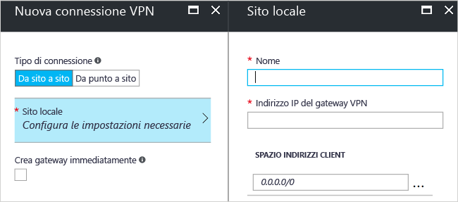

# <a name="create-a-site-to-site-connection-using-the-azure-portal-classic"></a>Creare una connessione da sito a sito usando il portale di Azure (distribuzione classica)

Una connessione gateway VPN da sito a sito (S2S) avviene tramite un tunnel VPN IPsec/IKE (IKEv1 o IKEv2). Questo tipo di connessione richiede un dispositivo VPN che si trova in locale con un indirizzo IP pubblico assegnato e non dietro una NAT. Le connessioni da sito a sito possono essere usate per le configurazioni cross-premise e ibride.


Questo articolo illustra la creazione di una rete virtuale e una connessione del gateway VPN da sito a sito alla rete locale con il modello di distribuzione classica e il portale di Azure. È anche possibile creare questa configurazione per il modello di distribuzione Resource Manager selezionando una diversa opzione nell'elenco seguente:

> [!div class="op_single_selector"]
> * [Resource Manager - Portale di Azure](vpn-gateway-howto-site-to-site-resource-manager-portal.md)
> * [Resource Manager - PowerShell](vpn-gateway-create-site-to-site-rm-powershell.md)
> * [Distribuzione classica - Portale di Azure](vpn-gateway-howto-site-to-site-classic-portal.md)
> * [Distribuzione classica - Portale classico](vpn-gateway-site-to-site-create.md)
>
>

#### <a name="additional-configurations"></a>Configurazioni aggiuntive
Se si vogliono connettere più reti virtuali senza creare una connessione a un percorso locale, vedere [Configurare una connessione da rete virtuale a rete virtuale](virtual-networks-configure-vnet-to-vnet-connection.md). Per aggiungere una connessione da sito a sito a una rete virtuale che ha già una connessione, vedere [Add a S2S connection to a VNet with an existing VPN gateway connection](vpn-gateway-multi-site.md) (Aggiungere una connessione da sito a sito a una rete virtuale con una connessione gateway VPN esistente).

## <a name="before-you-begin"></a>Prima di iniziare

[!INCLUDE [deployment models](../../includes/vpn-gateway-deployment-models-include.md)]

Prima di iniziare la configurazione, verificare la disponibilità degli elementi seguenti:

* Un dispositivo VPN compatibile e un utente che sia in grado di configurarlo. Vedere [Informazioni sui dispositivi VPN](vpn-gateway-about-vpn-devices.md). Se non si ha familiarità con la configurazione del dispositivo VPN o con gli intervalli di indirizzi IP disponibili nella configurazione di rete locale, è necessario coordinarsi con qualcuno che possa fornire tali dettagli.
* Un indirizzo IP IPv4 pubblico esterno per il dispositivo VPN. L'indirizzo IP non può trovarsi dietro un NAT.
* Una sottoscrizione di Azure. Se non si ha una sottoscrizione di Azure, è possibile attivare i [vantaggi per i sottoscrittori di MSDN](http://azure.microsoft.com/pricing/member-offers/msdn-benefits-details) oppure iscriversi per ottenere un [account gratuito](http://azure.microsoft.com/pricing/free-trial).
* Attualmente, è necessario usare PowerShell per specificare la chiave condivisa e creare la connessione del gateway VPN. Installare la versione più recente dei cmdlet di PowerShell per Azure Service Management. Per altre informazioni, vedere [Come installare e configurare Azure PowerShell](/powershell/azureps-cmdlets-docs). Quando si usa PowerShell per questa configurazione, assicurarsi di scegliere l'opzione Esegui come amministratore. 

> [!NOTE]
> Quando si configura una connessione da sito a sito, è necessario un indirizzo IP IPv4 pubblico per il dispositivo VPN.
>

### <a name="values"></a>Valori di configurazione di esempio per questo esercizio
Quando si segue questa procedura come esercizio, è possibile usare i valori della configurazione di esempio:

* **Nome della rete virtuale:** TestVNet1
* **Spazio di indirizzi:** 
    * 10.11.0.0/16
    * 10.12.0.0/16 (facoltativo per questo esercizio)
* **Subnet:**
  * FrontEnd: 10.11.0.0/24
  * BackEnd: 10.12.0.0/24 (facoltativo per questo esercizio)
* **GatewaySubnet:** 10.11.255.0/27
* **Gruppo di risorse:** TestRG1
* **Località:** Stati Uniti orientali
* **Server DNS:** 8.8.8.8 (facoltativo per questo esercizio)
* **Nome del sito locale:** Site2

## <a name="CreatVNet"></a>1. Crea rete virtuale

Quando si crea una rete virtuale da usare per una connessione da sito a sito, è necessario assicurarsi che gli spazi di indirizzi specificati non si sovrappongano a quelli usati nel client per i siti locali a cui ci si vuole connettere. Se sono presenti subnet che si sovrappongono, la connessione non funziona correttamente.

* Se si ha già una rete virtuale, verificare che le impostazioni siano compatibili con la progettazione del gateway VPN. Prestare particolare attenzione alle subnet che potrebbero sovrapporsi ad altre reti. 

* Se non si ha una rete virtuale, crearne una. Gli screenshot sono forniti come esempio. Assicurarsi di sostituire i valori con i propri.

### <a name="to-create-a-virtual-network"></a>Per creare una rete virtuale

1. In un browser passare al [portale di Azure](http://portal.azure.com) e, se necessario, accedere con l'account Azure.
2. Fare clic su **New**. Nel campo **Cerca nel Marketplace** digitare "Rete virtuale". Trovare **Rete virtuale** nell'elenco restituito e fare clic per aprire il pannello **Rete virtuale**.

    
3. Nella parte inferiore del pannello Rete virtuale selezionare **Classico** nell'elenco **Selezionare un modello di distribuzione** e quindi fare clic su **Crea**.

    
4. Nel pannello **Crea rete virtuale** configurare le impostazioni della rete virtuale. Aggiungere in questo pannello il primo spazio di indirizzi e un intervallo di indirizzi di una singola subnet. Dopo aver creato la rete virtuale, è possibile tornare indietro e aggiungere altre subnet e altri spazi di indirizzi.

    
5. Verificare che la **sottoscrizione** sia quella corretta. È possibile cambiare sottoscrizione tramite l'elenco a discesa.
6. Fare clic su **Gruppo di risorse** e selezionare un gruppo di risorse esistente o crearne uno nuovo digitandone il nome. Per altre informazioni sui gruppi di risorse, vedere [Panoramica di Azure Resource Manager](../azure-resource-manager/resource-group-overview.md#resource-groups).
7. Selezionare quindi le impostazioni relative alla **località** per la rete virtuale. La località determina la posizione in cui risiedono le risorse distribuite in questa rete virtuale.
8. Selezionare **Aggiungi al dashboard** se si vuole trovare facilmente la rete virtuale nel dashboard e quindi fare clic su **Crea**.

    
9. Dopo aver fatto clic su "Crea", nel dashboard verrà visualizzato un riquadro che riflette lo stato di avanzamento della rete virtuale. Il riquadro cambia durante la creazione della rete virtuale.

    

Al termine della creazione della rete virtuale, nella pagina Reti del portale di Azure classico verrà visualizzato **Creato** in **Stato**.

## <a name="additionaladdress"></a>2. Aggiungere altri spazi di indirizzi

Dopo aver creato la rete virtuale è possibile aggiungere altri spazi di indirizzi. Questa operazione non è obbligatoria in una configurazione da sito a sito, ma se sono necessari più spazi di indirizzi, è possibile seguire questa procedura:

1. Trovare le reti virtuali nel portale.
2. Nella sezione **Impostazioni** del pannello della rete virtuale fare clic su **Spazio di indirizzi**.
3. Nel pannello Spazio di indirizzi fare clic su **+Aggiungi** e immettere lo spazio di indirizzi aggiuntivo.
 
## <a name="dns"></a>3. Specificare un server DNS
Le impostazioni DNS non sono una parte obbligatoria di una configurazione da sito a sito, ma il servizio DNS è necessario per la risoluzione dei nomi.

Dopo aver creato la rete virtuale, è possibile aggiungere l'indirizzo IP di un server DNS per gestire la risoluzione dei nomi. Aprire le impostazioni della rete virtuale, fare clic su Server DNS e aggiungere l'indirizzo IP del server DNS da usare per la risoluzione dei nomi. Questa impostazione non comporta la creazione di un server DNS. Nelle impostazioni di esempio viene usato un server DNS pubblico. In genere è preferibile usare un server DNS privato. Assicurarsi di aggiungere un server DNS con cui le risorse possono comunicare.

1. Trovare le reti virtuali nel portale.
2. Nella sezione **Impostazioni** del pannello della rete virtuale fare clic su **Server DNS**.
3. Aggiungere un server DNS.
4. Per salvare le impostazioni, fare clic su **Salva** nella parte superiore della pagina.
 
## <a name="localsite"></a>4. Configurare il sito locale

In genere il sito locale fa riferimento alla posizione locale. Contiene l'indirizzo IP del dispositivo VPN a cui si crea una connessione e gli intervalli di indirizzi IP che verranno distribuiti tramite il gateway VPN al dispositivo VPN.

1. Nel portale passare alla rete virtuale per cui si vuole creare un gateway.
2. Nel pannello **Panoramica** del pannello della rete virtuale fare clic su **Gateway** nella sezione Connessioni VPN per aprire il pannello **Nuova connessione VPN**.

    
3. Nel pannello **Nuova connessione VPN** selezionare **Da sito a sito**.

    
4. Fare clic su **Sito locale - Configurare le impostazioni necessarie** per aprire il pannello **Sito locale**. Configurare le impostazioni e quindi fare clic su **OK** per salvarle.
    - **Nome:** creare un nome per il sito locale per semplificarne l'identificazione.
    - **Indirizzo IP del gateway VPN:** questo è l'indirizzo IP pubblico del dispositivo VPN per la rete locale. Per il dispositivo VPN è necessario usare un indirizzo IP IPv4 pubblico. Specificare un indirizzo IP pubblico valido per il dispositivo VPN a cui ci si vuole connettere. Non può essere protetto da NAT e deve essere raggiungibile da Azure.
    - **Spazio indirizzi client:** elencare gli intervalli di indirizzi IP che devono essere indirizzati alla rete locale tramite il gateway. È possibile aggiungere più intervalli di spazi indirizzi. Assicurarsi che gli intervalli specificati qui non si sovrappongano a quelli di altre reti a cui si connette la rete virtuale oppure agli intervalli di indirizzi della rete virtuale stessa.

    

## <a name="gatewaysubnet"></a>5. Configurare la subnet del gateway

È necessario creare una subnet del gateway per il gateway VPN. La subnet del gateway contiene gli indirizzi IP usati dai servizi del gateway VPN.

1. Nel pannello **Nuova connessione VPN** selezionare la casella di controllo **Crea gateway immediatamente**. Verrà visualizzato il pannello Configurazione di gateway facoltativa. Se non si seleziona la casella di controllo, il pannello per la configurazione della subnet del gateway non viene visualizzato.

    
2. Fare clic su **Configurazione gateway facoltativa - Subnet, dimensioni e tipo di routing** per aprire il pannello **Configurazione gateway**.
3. Nel pannello **Configurazione gateway** fare clic su **Subnet - Configurare le impostazioni necessarie** per aprire il pannello **Aggiungi subnet**.

    
4. Nel pannello **Aggiungi subnet** aggiungere la subnet del gateway. Se possibile, quando si aggiunge la subnet del gateway è consigliabile crearla usando un blocco CIDR di /28 o /27. In questo modo gli indirizzi IP disponibili saranno sufficienti a soddisfare eventuali esigenze di configurazione successive.  Fare clic su **OK** per salvare le impostazioni.

    

## <a name="sku"></a>6. Specificare il tipo SKU e di VPN
1. Selezionare le **dimensioni** del gateway, che rappresentano lo SKU di gateway usato per creare il gateway di rete virtuale. Nel portale, lo SKU predefinito è **Basic**. Per altre informazioni sugli SKU di gateway, vedere [Informazioni sulle impostazioni del gateway VPN](vpn-gateway-about-vpn-gateway-settings.md#gwsku).

    
2. Selezionare il **tipo di routing** per il gateway. Questo è noto anche come il tipo di VPN. È importante selezionare il tipo di gateway corretto, perché non è possibile convertire il gateway da un tipo a un altro. Il dispositivo VPN deve essere compatibile con il tipo di routing selezionato. Per altre informazioni sul tipo di VPN, vedere [Informazioni sulle impostazioni del gateway VPN](vpn-gateway-about-vpn-gateway-settings.md#vpntype). In alcuni articoli si potrebbe fare riferimento ai tipi di VPN "RouteBased" e "PolicyBased". "Dinamico" corrisponde a "RouteBased" e "Statico" corrisponde a "PolicyBased".
3. Fare clic su **OK** per salvare le impostazioni.
4. Nel pannello **Nuova connessione VPN** fare clic su **OK** nella parte inferiore per iniziare a creare il gateway della rete virtuale. Per completare questa operazione possono essere necessari fino a 45 minuti.

## <a name="vpndevice"></a>7. Configurare il dispositivo VPN

Le connessioni da sito a sito verso una rete locale richiedono un dispositivo VPN. Anche se non viene specificata la procedura di configurazione per tutti i dispositivi VPN, le informazioni contenute nei collegamenti seguenti potrebbero risultare utili:

- Per informazioni sui dispositivi VPN compatibili, vedere l'articolo relativo ai [dispositivi VPN](vpn-gateway-about-vpn-devices.md). 
- Per collegamenti alle impostazioni di configurazione dei dispositivi, vedere [Dispositivi VPN convalidati](vpn-gateway-about-vpn-devices.md#devicetable). I collegamenti forniti rappresentano i migliori possibili. È sempre consigliabile rivolgersi al produttore del dispositivo per le informazioni di configurazione più aggiornate.
- Per informazioni sulla modifica degli esempi, vedere [Modifica degli esempi di configurazione di dispositivo](vpn-gateway-about-vpn-devices.md#editing).
- Per informazioni sui parametri IPsec/IKE, vedere [Parametri](vpn-gateway-about-vpn-devices.md#ipsec).
- Prima di configurare il dispositivo VPN, verificare eventuali [Problemi noti di compatibilità del dispositivo](vpn-gateway-about-vpn-devices.md#known) per il dispositivo VPN da usare.

Durante la configurazione del dispositivo VPN, sono necessari gli elementi seguenti:

- Indirizzo IP pubblico del gateway di rete virtuale. Per trovarlo, passare al pannello **Panoramica** della rete virtuale usata.
- Chiave condivisa. Si tratta della stessa chiave condivisa che viene specificata durante la creazione della connessione VPN da sito a sito. In questi esempi viene usata una chiave condivisa molto semplice. È necessario generare una chiave più complessa per l'uso effettivo.

## <a name="CreateConnection"></a>8. Creare la connessione
Questo passaggio illustra come impostare la chiave condivisa e creare la connessione. La chiave impostata deve essere la stessa usata nella configurazione del dispositivo VPN.

> [!NOTE]
> Attualmente, questa configurazione non è disponibile nel portale di Azure. È necessario usare la versione Service Management dei cmdlet di Azure PowerShell.                                        >
>

### <a name="step-1-connect-to-your-azure-account"></a>Passaggio 1. Connettersi all'account di Azure

1. Aprire la console di PowerShell con diritti elevati e connettersi all'account. Per eseguire la connessione, usare gli esempi che seguono:

  ```powershell
  Login-AzureRmAccount
  ```
2. Controllare le sottoscrizioni per l'account.

  ```powershell
  Get-AzureRmSubscription
  ```
3. Se sono disponibili più sottoscrizioni, selezionare la sottoscrizione da usare.

  ```powershell
  Select-AzureRmSubscription -SubscriptionName "Replace_with_your_subscription_name"
  ```
4. Scaricare la versione Service Management dei cmdlet di PowerShell.

  ```powershell
  Add-AzureAccount
  ```

### <a name="step-2-set-the-shared-key-and-create-the-connection"></a>Passaggio 2. Impostare la chiave condivisa e creare la connessione

Quando si usa PowerShell e il modello di distribuzione classica, a volte i nomi delle risorse nel portale non corrispondono ai nomi previsti da Azure con l'uso di PowerShell. La procedura seguente consente di esportare il file di configurazione di rete per ottenere i valori esatti per i nomi.

1. Creare una directory nel computer ed esportarvi il file di configurazione di rete. In questo esempio il file di configurazione di rete viene esportato in C:\AzureNet.

  ```powershell
  Get-AzureVNetConfig -ExportToFile C:\AzureNet\NetworkConfig.xml
  ```
2. Aprire il file di configurazione di rete con un editor xml e controllare i valori di "LocalNetworkSite name" e "VirtualNetworkSite name". Modificare l'esempio in base a tali valori. Quando si specifica un nome che contiene spazi, racchiudere il valore tra virgolette singole.

3. Impostare la chiave condivisa e creare la connessione. "-SharedKey" è un valore che è possibile generare e specificare. Per questo esempio è stato usato "abc123", ma è possibile e consigliabile generare e usare un elemento più complesso. È importante che il valore specificato qui sia lo stesso valore specificato durante la configurazione del dispositivo VPN.

  ```powershell
  Set-AzureVNetGatewayKey -VNetName 'Group TestRG1 TestVNet1' `
  -LocalNetworkSiteName 'D1BFC9CB_Site2' -SharedKey abc123
  ```
Quando viene creata la connessione, il risultato è **Stato: Operazione completata**.

## <a name="verify"></a>9. Verificare la connessione

[!INCLUDE [vpn-gateway-verify-connection-azureportal-classic](../../includes/vpn-gateway-verify-connection-azureportal-classic-include.md)]

## <a name="next-steps"></a>Passaggi successivi
Dopo aver completato la connessione, è possibile aggiungere macchine virtuali alle reti virtuali. Per altre informazioni, vedere [Macchine virtuali](https://docs.microsoft.com/azure/#pivot=services&panel=Compute).


