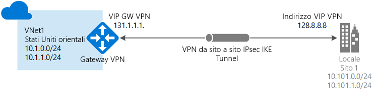

# Creare una connessione da sito a sito nel portale di Azure

Questo articolo illustra come usare il portale di Azure per creare una connessione gateway VPN da sito a sito dalla rete locale alla rete virtuale. I passaggi di questo articolo sono applicabili al modello di distribuzione Resource Manager. È anche possibile creare questa configurazione usando strumenti o modelli di distribuzione diversi selezionando un'opzione differente nell'elenco seguente:

> [!div class="op_single_selector"]
> * [Resource Manager - Portale di Azure](vpn-gateway-howto-site-to-site-resource-manager-portal.md)
> * [Resource Manager - PowerShell](vpn-gateway-create-site-to-site-rm-powershell.md)
> * [Resource Manager - Interfaccia della riga di comando](vpn-gateway-howto-site-to-site-resource-manager-cli.md)
> * [Distribuzione classica - Portale di Azure](vpn-gateway-howto-site-to-site-classic-portal.md)
> * [Distribuzione classica - Portale classico](vpn-gateway-site-to-site-create.md)
> 
>

Una connessione gateway VPN da sito a sito viene usata per connettere la rete locale a una rete virtuale di Azure tramite un tunnel VPN IPsec/IKE (IKEv1 o IKEv2). Questo tipo di connessione richiede un dispositivo VPN che si trova in locale con un indirizzo IP pubblico esterno assegnato. Per altre informazioni sui gateway VPN, vedere [Informazioni sul gateway VPN](vpn-gateway-about-vpngateways.md).

## Prima di iniziare

Prima di iniziare la configurazione, verificare di soddisfare i criteri seguenti:

* Assicurarsi di voler usare il modello di distribuzione Resource Manager. [!INCLUDE [deployment models](../../includes/vpn-gateway-deployment-models-include.md)] 
* Un dispositivo VPN compatibile e un utente che sia in grado di configurarlo. Per altre informazioni sui dispositivi VPN compatibili e sulla configurazione dei dispositivi, vedere [Informazioni sui dispositivi VPN](vpn-gateway-about-vpn-devices.md).
* Un indirizzo IP IPv4 pubblico esterno per il dispositivo VPN. L'indirizzo IP non può trovarsi dietro un NAT.
* Se non si ha familiarità con gli intervalli degli indirizzi IP disponibili nella configurazione della rete locale, è necessario coordinarsi con qualcuno che possa fornire tali dettagli. Quando si crea questa configurazione, è necessario specificare i prefissi degli intervalli di indirizzi IP che Azure instraderà alla posizione locale. Nessuna delle subnet della rete locale può sovrapporsi alle subnet della rete virtuale a cui ci si vuole connettere. 

### Valori di esempio
Quando si segue questa procedura come esercizio, è possibile usare i valori di esempio seguenti:

* **Nome della rete virtuale:** TestVNet1
* **Spazio di indirizzi:** 
    * 10.11.0.0/16
    * 10.12.0.0/16 (facoltativo per questo esercizio)
* **Subnet:**
  * FrontEnd: 10.11.0.0/24
  * BackEnd: 10.12.0.0/24 (facoltativo per questo esercizio)
  * GatewaySubnet: 10.11.255.0/27
* **Gruppo di risorse:** TestRG1
* **Località:** Stati Uniti orientali
* **Server DNS:** indirizzo IP del server DNS
* **Nome gateway di rete virtuale:** VNet1GW
* **IP pubblico:** VNet1GWIP
* **Tipo VPN:** Basato su route
* **Tipo di connessione:** Da sito a sito (IPSec)
* **Tipo di gateway:** VPN
* **Nome del gateway di rete locale:** Site2
* **Nome connessione:** VNet1toSite2

## 1. Crea rete virtuale

[!INCLUDE [vpn-gateway-basic-vnet-rm-portal](../../includes/vpn-gateway-basic-vnet-s2s-rm-portal-include.md)]

## 2. Specificare un server DNS
Il server DNS non è necessario per le connessioni da sito a sito. Se tuttavia si vuole ottenere la risoluzione dei nomi per le risorse distribuite nella rete virtuale, è necessario specificare un server DNS. Questa impostazione consente di specificare il server DNS da usare per la risoluzione dei nomi nella rete virtuale. Non comporta la creazione di un server DNS.

[!INCLUDE [vpn-gateway-add-dns-rm-portal](../../includes/vpn-gateway-add-dns-rm-portal-include.md)]

## 3. Creare la subnet del gateway

Il gateway di rete virtuale usa una subnet del gateway che contiene gli indirizzi IP usati dai servizi del gateway VPN. Quando si crea una subnet del gateway, deve essere denominata "GatewaySubnet". Se si assegnano altri nomi, la configurazione della connessione avrà esito negativo.

Le dimensioni della subnet del gateway specificata dipendono dalla configurazione del gateway VPN che si vuole creare. Nonostante sia possibile creare una subnet del gateway con dimensioni di /29 soltanto, è consigliabile crearne una più grande che includa più indirizzi selezionando /27 o /28. Le dimensioni della subnet del gateway specificata dipendono dalla configurazione del gateway VPN che si vuole creare. Nonostante sia possibile creare una subnet del gateway con dimensioni di /29 soltanto, è consigliabile crearne una più grande che includa più indirizzi selezionando /27 o /28. L'uso di una subnet del gateway di dimensioni maggiori consente un numero sufficiente di indirizzi IP per eventuali configurazioni future.

[!INCLUDE [vpn-gateway-add-gwsubnet-rm-portal](../../includes/vpn-gateway-add-gwsubnet-s2s-rm-portal-include.md)]

## 4. Creare il gateway VPN

[!INCLUDE [vpn-gateway-add-gw-s2s-rm-portal](../../includes/vpn-gateway-add-gw-s2s-rm-portal-include.md)]

## 5. Creare il gateway di rete locale

Il gateway di rete locale in genere fa riferimento al percorso locale. Assegnare al sito un nome che Azure possa usare come riferimento, quindi specificare l'indirizzo IP del dispositivo VPN locale con cui si creerà una connessione. Specificare anche i prefissi degli indirizzi IP che verranno instradati tramite il gateway VPN al dispositivo VPN. I prefissi degli indirizzi specificati sono quelli disponibili nella rete locale. Se la rete locale viene modificata, è possibile aggiornare facilmente i prefissi.

[!INCLUDE [vpn-gateway-add-lng-s2s-rm-portal](../../includes/vpn-gateway-add-lng-s2s-rm-portal-include.md)]

## 6. Configurare il dispositivo VPN
[!INCLUDE [vpn-gateway-configure-vpn-device-rm](../../includes/vpn-gateway-configure-vpn-device-rm-include.md)]

Per trovare l'indirizzo IP pubblico del gateway VPN usando il portale di Azure, passare a **Gateway di rete virtuali**, quindi fare clic sul nome del gateway.

## 7. Creare la connessione VPN

Creare la connessione VPN da sito a sito tra il gateway di rete virtuale e il dispositivo VPN locale.

[!INCLUDE [vpn-gateway-add-site-to-site-connection-rm-portal](../../includes/vpn-gateway-add-site-to-site-connection-s2s-rm-portal-include.md)]

## 8. Verificare la connessione VPN

[!INCLUDE [Azure portal](../../includes/vpn-gateway-verify-connection-portal-rm-include.md)]

## Passaggi successivi
*  Dopo aver completato la connessione, è possibile aggiungere macchine virtuali alle reti virtuali. Per altre informazioni, vedere [Macchine virtuali](https://docs.microsoft.com/azure/#pivot=services&panel=Compute).
*  Per informazioni su BGP, vedere [Panoramica di BGP](vpn-gateway-bgp-overview.md) e [Come configurare BGP](vpn-gateway-bgp-resource-manager-ps.md).

