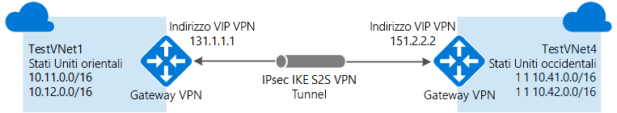
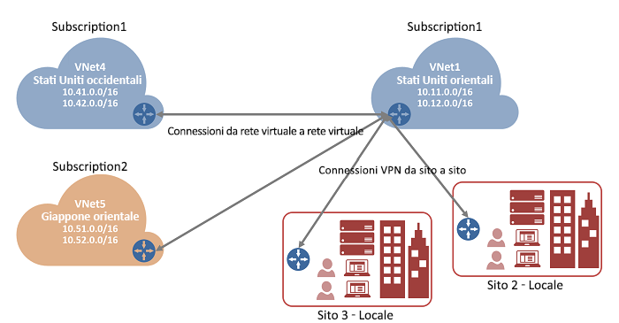

# Configurare una connessione da rete virtuale a rete virtuale con il portale di Azure
> [!div class="op_single_selector"]
> * [Resource Manager - Portale di Azure](vpn-gateway-howto-vnet-vnet-resource-manager-portal.md)
> * [Resource Manager - PowerShell](vpn-gateway-vnet-vnet-rm-ps.md)
> * [Classica - Portale classico](virtual-networks-configure-vnet-to-vnet-connection.md)
> 
> 

Questo articolo illustra la creazione di una connessione tra reti virtuali nel modello di distribuzione Resource Manager usando il gateway VPN e il portale di Azure.

Quando si usa il portale di Azure per connettere reti virtuali, queste devono trovarsi nella stessa sottoscrizione. Se le reti virtuali si trovano in sottoscrizioni diverse, è comunque possibile connetterle seguendo la procedura illustrata per [PowerShell](vpn-gateway-vnet-vnet-rm-ps.md).

### Metodi e modelli di distribuzione per connessioni da rete virtuale a rete virtuale
[!INCLUDE [deployment models](../../includes/vpn-gateway-deployment-models-include.md)]

La tabella seguente descrive i metodi e i modelli di distribuzione attualmente disponibili per le configurazioni da rete virtuale a rete virtuale. Quando è disponibile un articolo contenente la procedura di configurazione, nella tabella è presente un collegamento diretto.

[!INCLUDE [vpn-gateway-table-vnet-vnet](../../includes/vpn-gateway-table-vnet-to-vnet-include.md)]

#### Peering reti virtuali
[!INCLUDE [vpn-gateway-vnetpeeringlink](../../includes/vpn-gateway-vnetpeeringlink-include.md)]

## Informazioni sulla connessione da rete virtuale a rete virtuale
La connessione di una rete virtuale a un'altra rete virtuale (da rete virtuale a rete virtuale) è simile alla connessione di una rete virtuale a un percorso di sito locale. Entrambi i tipi di connettività usano un gateway VPN di Azure per fornire un tunnel sicuro tramite IPsec/IKE. Le reti virtuali a cui ci si connette possono trovarsi in aree geografiche o sottoscrizioni diverse.

È anche possibile combinare una comunicazione tra reti virtuali con configurazioni multisito. In questo modo è possibile definire topologie di rete che consentono di combinare la connettività cross-premise con la connettività tra reti virtuali, come illustrato nel diagramma seguente:

### Perché connettere reti virtuali?
È possibile connettere reti virtuali per i seguenti motivi:

* **Presenza e ridondanza in più aree geografiche**
  
  * È possibile configurare la sincronizzazione o la replica geografica con connettività sicura senza passare da endpoint con connessione Internet.
  * Con Gestione traffico e il servizio di bilanciamento del carico di Azure è possibile configurare il carico di lavoro a disponibilità elevata con ridondanza geografica in più aree di Azure. Un esempio importante è rappresentato dalla configurazione SQL AlwaysOn con gruppi di disponibilità distribuiti in più aree di Azure.
* **Applicazioni multilivello in singole aree geografiche con isolamento o limite amministrativo**
  
  * All'interno di una stessa area è possibile configurare applicazioni multilivello con più reti virtuali connesse tra loro a causa dell'isolamento o di requisiti amministrativi.

Per altre informazioni sulle connessioni da rete virtuale a rete virtuale, vedere la sezione [Domande frequenti relative alla connessione da rete virtuale a rete virtuale](#faq) alla fine di questo articolo.

### Impostazioni di esempio
Quando si segue questa procedura come esercizio, è possibile usare i valori della configurazione di esempio. A scopo esemplificativo, vengono usati più spazi di indirizzi per ogni rete virtuale, anche se per le configurazioni da rete virtuale a rete virtuale non sono necessari.

**Valori per TestVNet1:**

* Nome della rete virtuale: TestVNet1
* Spazio di indirizzi: 10.11.0.0/16
  * Nome subnet: FrontEnd
  * Intervallo di indirizzi subnet: 10.11.0.0/24
* Gruppo di risorse: TestRG1
* Location: Stati Uniti orientali
* Spazio di indirizzi: 10.12.0.0/16
  * Nome subnet: BackEnd
  * Intervallo di indirizzi subnet: 10.12.0.0/24
* Nome subnet del gateway: GatewaySubnet (compilato automaticamente nel portale)
  * Intervallo di indirizzi subnet del gateway: 10.11.255.0/27
* Server DNS: usare l'indirizzo IP del server DNS
* Nome gateway di rete virtuale: TestVNet1GW
* Tipo di gateway: VPN
* Tipo VPN: Basato su route
* SKU: selezionare lo SKU di gateway da usare
* Nome dell'indirizzo IP pubblico: TestVNet1GWIP
* Valori di connessione:
  * Nome: TestVNet1toTestVNet4
  * Chiave condivisa: è possibile creare personalmente la chiave condivisa. In questo esempio viene usato il valore abc123. Quando si crea la connessione tra le reti virtuali, è importante che il valore corrisponda.

**Valori per TestVNet4:**

* Nome della rete virtuale: TestVNet4
* Spazio di indirizzi: 10.41.0.0/16
  * Nome subnet: FrontEnd
  * Intervallo di indirizzi subnet: 10.41.0.0/24
* Gruppo di risorse: TestRG1
* Località: Stati Uniti occidentali
* Spazio di indirizzi: 10.42.0.0/16
  * Nome subnet: BackEnd
  * Intervallo di indirizzi subnet: 10.42.0.0/24
* Nome subnet del gateway: GatewaySubnet (compilato automaticamente nel portale)
  * Intervallo di indirizzi subnet del gateway: 10.41.255.0/27
* Server DNS: usare l'indirizzo IP del server DNS
* Nome gateway di rete virtuale: TestVNet4GW
* Tipo di gateway: VPN
* Tipo VPN: Basato su route
* SKU: selezionare lo SKU di gateway da usare
* Nome dell'indirizzo IP pubblico: TestVNet4GWIP
* Valori di connessione:
  * Nome: TestVNet4toTestVNet1
  * Chiave condivisa: è possibile creare personalmente la chiave condivisa. In questo esempio viene usato il valore abc123. Quando si crea la connessione tra le reti virtuali, è importante che il valore corrisponda.

## 1. Creare e configurare TestVNet1
Se si ha già una rete virtuale, verificare che le impostazioni siano compatibili con la progettazione del gateway VPN. Prestare particolare attenzione alle subnet che potrebbero sovrapporsi ad altre reti. Se sono presenti subnet che si sovrappongono, la connessione non funziona correttamente. Se la rete virtuale è configurata con le impostazioni corrette, è possibile iniziare la procedura descritta nella sezione [Specificare un server DNS](#dns) .

### Per creare una rete virtuale
[!INCLUDE [vpn-gateway-basic-vnet-rm-portal](../../includes/vpn-gateway-basic-vnet-rm-portal-include.md)]

## 2. Aggiungere altri spazi degli indirizzi e creare subnet
Dopo aver creato la rete virtuale è possibile aggiungere altri spazi degli indirizzi e creare subnet.
[!INCLUDE [vpn-gateway-additional-address-space](../../includes/vpn-gateway-additional-address-space-include.md)]

## 3. Creare una subnet del gateway
Prima di connettere la rete virtuale a un gateway, è necessario creare la subnet del gateway per la rete virtuale con cui si vuole stabilire la connessione. Se possibile, è consigliabile creare una subnet del gateway con un blocco CIDR di /28 o /27 per fornire indirizzi IP sufficienti a soddisfare altri requisiti di configurazione futuri.

Se si crea questa configurazione come esercizio, fare riferimento a queste [impostazioni di esempio](#values) quando si crea la subnet del gateway.

[!INCLUDE [vpn-gateway-no-nsg](../../includes/vpn-gateway-no-nsg-include.md)]

### Per creare una subnet del gateway
[!INCLUDE [vpn-gateway-add-gwsubnet-rm-portal](../../includes/vpn-gateway-add-gwsubnet-rm-portal-include.md)]

## 4. Specificare un server DNS (facoltativo)
Per ottenere la risoluzione dei nomi per le macchine virtuali distribuite nelle reti virtuali, è necessario specificare un server DNS.

[!INCLUDE [vpn-gateway-add-dns-rm-portal](../../includes/vpn-gateway-add-dns-rm-portal-include.md)]

## 5. Creare un gateway di rete virtuale
Questo passaggio illustra come creare il gateway di rete virtuale per la rete virtuale. Per completare questo passaggio possono essere necessari fino a 45 minuti. Se si crea questa configurazione come esercizio, è possibile fare riferimento alle [impostazioni di esempio](#values).

### Per creare un gateway di rete virtuale
[!INCLUDE [vpn-gateway-add-gw-rm-portal](../../includes/vpn-gateway-add-gw-rm-portal-include.md)]

## 6. Creare e configurare TestVNet4
Dopo aver configurato TestVNet1, creare TestVNet4 ripetendo i passaggi precedenti e sostituendo i valori con quelli di TestVNet4. Per configurare TestVNet4 non è necessario aspettare che sia terminata la creazione del gateway di rete virtuale per TestVNet1. Se si usano valori personalizzati, assicurarsi che gli spazi degli indirizzi non si sovrappongano alle reti virtuali a cui ci si vuole connettere.

## 7. Configurare la connessione per TestVNet1
Dopo aver completato i gateway di rete virtuale per TestVNet1 e TestVNet4, è possibile creare le connessioni al gateway di rete virtuale. Questa sezione illustra come creare una connessione da VNet1 a VNet4.

1. In **Tutte le risorse** passare al gateway di rete virtuale per la rete virtuale. Ad esempio, **TestVNet1GW**. Fare clic su **TestVNet1GW** per aprire il pannello del gateway di rete virtuale.
   
    
2. Fare clic su **+Aggiungi** per aprire il pannello **Aggiungi connessione**.
3. Nel pannello **Aggiungi connessione** digitare un nome per la connessione nel campo Nome. Ad esempio, **TestVNet1toTestVNet4**.
   
    
4. Per **Tipo di connessione**, selezionare **Da rete virtuale a rete virtuale** nell'elenco a discesa.
5. Il valore del campo **Primo gateway di rete virtuale** viene compilato automaticamente, perché la connessione viene creata dal gateway di rete virtuale specificato.
6. Il campo **Secondo gateway di rete virtuale** corrisponde al gateway di rete virtuali della rete virtuale a cui si vuole creare una connessione. Fare clic su **Scegliere un altro gateway di rete virtuale** per aprire il pannello **Scegliere un gateway di rete virtuale**.
   
    
7. Esaminare i gateway di rete virtuale visualizzati in questo pannello. Si noti che sono elencati solo i gateway di rete virtuale inclusi nella sottoscrizione. Per connettersi a un gateway di rete virtuale non incluso nella sottoscrizione, vedere l'[articolo relativo a PowerShell](vpn-gateway-vnet-vnet-rm-ps.md). 
8. Fare clic sul gateway di rete virtuale a cui ci si vuole connettere.
9. Nel campo **Chiave condivisa** digitare una chiave condivisa per la connessione. La chiave può essere generata o creata dall'utente. Nel caso di una connessione da sito a sito si userebbe esattamente la stessa chiave sia per il dispositivo locale che per la connessione del gateway di rete virtuale. In questo caso si applica un concetto simile, ma anziché connettersi a un dispositivo VPN ci si connette a un altro gateway di rete virtuale.
   
    
10. Fare clic su **OK** nella parte inferiore del pannello per salvare le modifiche.

## 8. Configurare la connessione per TestVNet4
Successivamente, creare una connessione da TestVNet4 a TestVNet1. Adottare lo stesso metodo usato per creare la connessione da TestVNet1 TestVNet4. Assicurarsi di usare la stessa chiave condivisa.

## 9. Verificare la connessione
Verificare la connessione. Per ogni gateway di rete virtuale, seguire questa procedura:

1. Trovare il pannello per il gateway di rete virtuale. Ad esempio, **TestVNet4GW**. 
2. Nel pannello per il gateway di rete virtuale fare clic su **Connessioni** per visualizzare il pannello delle connessioni per il gateway di rete virtuale.

Visualizzare le connessioni e verificare lo stato. Dopo aver creato la connessione, i valori di Stato visualizzati saranno **Operazione completata** e **Connesso**.

Per visualizzare altre informazioni, è possibile fare doppio clic su ogni singola connessione.

## Domande frequenti sulle connessioni da rete virtuale a rete virtuale
Visualizzare i dettagli delle frequenti per altre informazioni sulle connessioni da rete virtuale a rete virtuale.

[!INCLUDE [vpn-gateway-vnet-vnet-faq](../../includes/vpn-gateway-vnet-vnet-faq-include.md)]

## Passaggi successivi
Dopo aver completato la connessione, è possibile aggiungere macchine virtuali alle reti virtuali. Per i passaggi, vedere [Creare la prima macchina virtuale](../virtual-machines/virtual-machines-windows-hero-tutorial.md) .

<!--HONumber=Nov16_HO2-->

