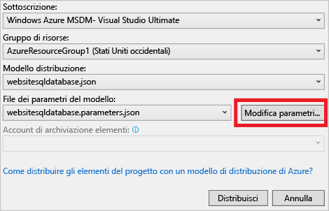
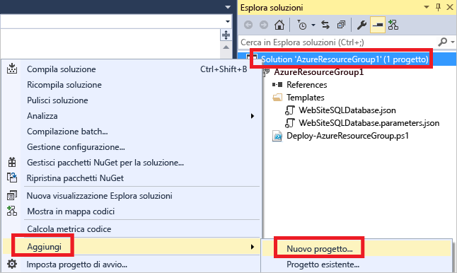
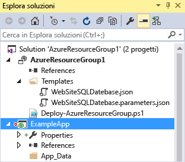
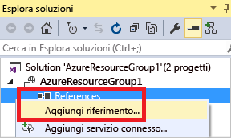
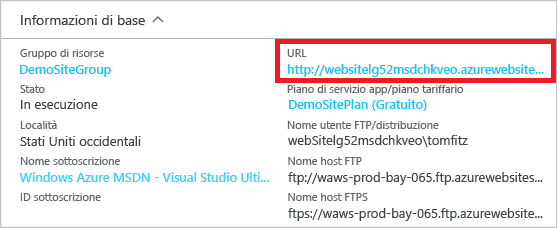

<properties
   pageTitle="Progetti Gruppo di risorse di Azure con Visual Studio | Microsoft Azure"
   description="Usare Visual Studio per creare un progetto Gruppo di risorse di Azure e distribuire le risorse in Azure."
   services="azure-resource-manager"
   documentationCenter="na"
   authors="tfitzmac"
   manager="timlt"
   editor="tysonn" />
<tags
   ms.service="azure-resource-manager"
   ms.devlang="multiple"
   ms.topic="get-started-article"
   ms.tgt_pltfrm="na"
   ms.workload="na"
   ms.date="09/20/2016"
   ms.author="tomfitz" />

# Creazione e distribuzione di gruppi di risorse di Azure tramite Visual Studio

Con Visual Studio e [Azure SDK](https://azure.microsoft.com/downloads/) è possibile creare un progetto che distribuisce l'infrastruttura e il codice in Azure. Ad esempio, è possibile definire l'host Web, il sito Web e il database per l'app e distribuire l'infrastruttura insieme al codice. In alternativa, è possibile definire una macchina virtuale, una rete virtuale e un account di archiviazione e distribuire questa infrastruttura insieme a uno script che viene eseguito nella macchina virtuale. Il progetto di distribuzione **Gruppo di risorse di Azure** consente di distribuire tutte le risorse necessarie in una singola operazione ripetibile. Per altre informazioni sulla distribuzione e sulla gestione delle risorse, vedere [Panoramica di Gestione risorse di Microsoft Azure](resource-group-overview.md).

I progetti di tipo Gruppo di risorse di Azure includono modelli JSON di Azure Resource Manager, che definiscono le risorse che vengono distribuite in Azure. Per informazioni sugli elementi del modello di Gestione risorse, vedere [Creazione di modelli di Gestione risorse di Azure](resource-group-authoring-templates.md). Visual Studio consente di modificare questi modelli e offre strumenti utili per semplificare l'utilizzo dei modelli.

In questo argomento si distribuisce un'app Web e un database SQL. I passaggi sono però quasi identici per qualsiasi tipo di risorsa. È possibile distribuire con altrettanta facilità una macchina virtuale e le rispettive risorse. Visual Studio offre molti modelli di partenza per la distribuzione di scenari comuni.

Questo articolo si basa su Visual Studio 2015 Update 2 e Microsoft Azure SDK per .NET 2.9. Se si usa Visual Studio 2013 con Azure SDK 2.9, l'esperienza sarà molto simile. È anche possibile usare Azure SDK 2.6 o versione successiva, ma l'esperienza dell'interfaccia utente può essere diversa da quella illustrata in questo articolo. È consigliabile installare la versione più recente di [Azure SDK](https://azure.microsoft.com/downloads/) prima di iniziare la procedura.

## Creare un progetto Gruppo di risorse di Azure

In questa procedura verrà creato un progetto Gruppo di risorse di Azure con un modello **App Web e SQL**.

1. In Visual Studio scegliere **File**, **Nuovo progetto**, scegliere **C#** o **Visual Basic**. Scegliere quindi **Cloud** e infine scegliere il progetto **Gruppo di risorse di Azure**.

    



1. Scegliere il modello da distribuire in Gestione risorse di Azure. Si noti che sono disponibili molte opzioni diverse in base al tipo di progetto da distribuire. Per questo argomento scegliere il modello **App Web e SQL**.

    



    Il modello scelto è solo un punto di partenza. È possibile aggiungere e rimuovere risorse per ottenere lo scenario desiderato.

    >[AZURE.NOTE] Visual Studio consente di recuperare un elenco dei modelli disponibili online. L'elenco è soggetto a modifiche.

    Visual Studio crea un progetto di distribuzione di tipo Gruppo di risorse per l'app Web e il database SQL.

1. Per visualizzare gli elementi creati, espandere i nodi nel progetto di distribuzione.

    



    Poiché per questo esempio è stato scelto il modello App Web e SQL, verranno visualizzati i file seguenti:

    |Nome file|Descrizione|
    |---|---|
    |Deploy-AzureResourceGroup.ps1|Script di PowerShell che richiama i comandi di PowerShell per la distribuzione in Azure Resource Manager. **Nota**: Visual Studio usa questo script di PowerShell per distribuire il modello. Eventuali modifiche apportate allo script influiscono sulla distribuzione in Visual Studio, quindi è opportuno prestare attenzione.|
    |WebSiteSQLDatabase.json|Modello di Resource Manager che definisce l'infrastruttura da distribuire in Azure e parametri che si possono specificare durante la distribuzione. Definisce anche le dipendenze tra le risorse, per consentire a Resource Manager di distribuire le risorse nell'ordine corretto.|
    |WebSiteSQLDatabase.parameters.json|File di parametri contenente i valori necessari per il modello, che vengono passati per personalizzare ogni distribuzione.|

    Tutti i progetti di distribuzione di tipo Gruppo di risorse contengono questi file di base. Altri progetti potrebbero includere file aggiuntivi per supportare altre funzionalità.

## Personalizzare il modello di Gestione risorse

È possibile personalizzare un progetto di distribuzione modificando i modelli JSON che descrivono le risorse da distribuire. JSON è l'acronimo di JavaScript Object Notation ed è un formato dati serializzati facile da usare. I file JSON usano uno schema a cui viene fatto riferimento all'inizio di ogni file. Per comprendere meglio lo schema, è possibile scaricarlo e analizzarlo. Lo schema definisce gli elementi validi, i tipi e i formati dei campi, i valori possibili dei valori enumerati e così via. Per informazioni sugli elementi del modello di Resource Manager, vedere [Creazione di modelli di Azure Resource Manager](resource-group-authoring-templates.md).

Per utilizzare il modello, aprire il file **WebSiteSQLDatabase.json**.

L'editor di Visual Studio offre strumenti utili per la modifica del modello di Resource Manager. La finestra **Struttura JSON** semplifica la visualizzazione degli elementi definiti nel modello.





Se si seleziona un elemento disponibile nella struttura, viene visualizzata la parte corrispondente del modello e viene evidenziato il rispettivo codice JSON.





È possibile aggiungere una risorsa facendo clic sul pulsante **Aggiungi risorsa** nella parte superiore della finestra Struttura JSON oppure facendo clic con il pulsante destro del mouse su **risorse** e scegliendo **Aggiungi nuova risorsa**.

Per questa esercitazione selezionare **Account di archiviazione** e specificare un nome. Specificare un nome contenente non più di 11 caratteri costituiti solo da numeri e lettere minuscole.





Si noti che non è stata aggiunta solo la risorsa, ma anche un parametro per il tipo di account di archiviazione e una variabile per il nome dell'account di archiviazione.

Il parametro **storageType** è preimpostato con i tipi consentiti e un tipo predefinito. È possibile usare questi valori o modificarli per il proprio scenario. Per impedire agli utenti di distribuire un account di archiviazione di tipo **Archiviazione con ridondanza locale Premium** tramite questo modello, rimuoverlo dai tipi consentiti.

    "storageType": {
      "type": "string",
      "defaultValue": "Standard_LRS",
      "allowedValues": [
        "Standard_LRS",
        "Standard_ZRS",
        "Standard_GRS",
        "Standard_RAGRS"
      ]
    }

Visual Studio fornisce anche il supporto per IntelliSense, per semplificare l'individuazione delle proprietà disponibili durante la modifica del modello. Ad esempio, per modificare le proprietà del piano di servizio app, passare alla risorsa **HostingPlan** e aggiungere un nuovo valore per **properties**. Si noti che IntelliSense mostra i valori disponibili e fornisce una descrizione di ogni valore.





È possibile impostare **numberOfWorkers** su 1.

    "properties": {
      "name": "[parameters('hostingPlanName')]",
      "numberOfWorkers": 1
    }

## Distribuire il progetto di tipo Gruppo di risorse in Azure

È ora possibile distribuire il progetto. Quando si distribuisce un progetto di Azure Resource Manager, lo si distribuisce in un gruppo di risorse di Azure. Il gruppo di risorse è un raggruppamento logico di risorse che condividono un ciclo di vita comune.

1. Dal menu di scelta rapida del nodo del progetto di distribuzione scegliere **Distribuisci** > **Nuova distribuzione**.

    



    Verrà visualizzata la finestra di dialogo **Distribuisci in gruppo di risorse**.

    



1. Nella casella di riepilogo a discesa **Gruppo di risorse** scegliere un gruppo di risorse esistente o crearne uno nuovo. Per creare un gruppo di risorse, aprire la casella di riepilogo a discesa **Gruppo di risorse** e scegliere **Crea nuovo**.

    



    Viene visualizzata la finestra di dialogo **Crea gruppo di risorse**. Specificare un nome e una posizione per il gruppo, quindi selezionare **Crea**.

    


   
1. Modificare i parametri per la distribuzione selezionando il pulsante **Modifica parametri**.

    



1. Specificare i valori per i parametri vuoti e fare clic sul pulsante **Salva**. I parametri vuoti sono **hostingPlanName**, **administratorLogin**, **administratorLoginPassword** e **databaseName**.

    **hostingPlanName** specifica un nome per il [piano di servizio app da creare](./app-service/azure-web-sites-web-hosting-plans-in-depth-overview.md).
    
    **administratorLogin** specifica il nome utente per l'amministratore di SQL Server. Non usare nomi di amministratore comuni, ad esempio **sa** o **admin**.
    
    **administratorLoginPassword** specifica una password per l'amministratore di SQL Server. L'opzione **Salva le password come testo normale nel file dei parametri** non è sicura, quindi non selezionarla. Poiché la password non viene salvata come testo normale, sarà necessario immetterla ancora durante la distribuzione.
    
    **databaseName** specifica un nome per il database da creare.

    


    
1. Scegliere il pulsante **Distribuisci** per distribuire il progetto in Azure. Una console di PowerShell viene aperta al di fuori dell'istanza di Visual Studio. Immettere la password di amministratore di SQL Server nella console di PowerShell quando richiesto. **La console di PowerShell potrebbe essere nascosta dietro altri elementi o ridotta a icona nella barra delle applicazioni.** Cercare la console e selezionarla per immettere la password.

    >[AZURE.NOTE] È possibile che Visual Studio richieda l'installazione dei cmdlet di Azure PowerShell. Per distribuire correttamente i gruppi di risorse, è necessario il cmdlet di Azure PowerShell. Se richiesto, occorre installarli.
    
1. La distribuzione può richiedere alcuni minuti. Nelle finestre **Output** viene visualizzato lo stato della distribuzione. Al termine della distribuzione, l'ultimo messaggio indica una distribuzione riuscita con un testo simile al seguente:

        ... 
        18:00:58 - Successfully deployed template 'c:\users\user\documents\visual studio 2015\projects\azureresourcegroup1\azureresourcegroup1\templates\websitesqldatabase.json' to resource group 'DemoSiteGroup'.

1. In un browser aprire il [portale di Azure](https://portal.azure.com/) e accedere con il proprio account. Per visualizzare il gruppo di risorse, selezionare **Gruppi di risorse** e il gruppo di risorse in cui è stata effettuata la distribuzione.

    



1. Vengono visualizzate tutte le risorse distribuite. Si noti che il nome dell'account di archiviazione non è esattamente quello specificato quando si è aggiunta la risorsa. L'account di archiviazione deve essere univoco. Il modello aggiunge automaticamente una stringa di caratteri al nome specificato per fornire un nome univoco.

    



1. Se si apportano modifiche e si vuole ridistribuire il progetto, scegliere il gruppo di risorse esistente direttamente dal menu di scelta rapida del progetto Gruppo di risorse di Azure. Dal menu di scelta rapida scegliere **Distribuisci** e quindi il gruppo di risorse distribuito.

    

## Distribuire codice con l'infrastruttura

A questo punto è stata distribuita l'infrastruttura per l'app, ma non è stato ancora distribuito codice effettivo con il progetto. Questo argomento illustra come distribuire un'app Web e tabelle del database SQL durante la distribuzione. Se si sta distribuendo una macchina virtuale invece di un'app Web, è consigliabile eseguire codice nella macchina virtuale come parte della distribuzione. Il processo di distribuzione di codice per un'app Web o per la configurazione di una macchina virtuale è quasi uguale.

1. Aggiungere un progetto alla soluzione Visual Studio. Fare clic con il pulsante destro del mouse sulla soluzione e scegliere **Aggiungi** > **Nuovo progetto**.

    



1. Aggiungere un'**Applicazione Web ASP.NET**.

    


    
1. Selezionare **MVC** e deselezionare il campo per **Host nel cloud**, perché il progetto Gruppo di risorse esegue questa attività.

    


    
1. Dopo che Visual Studio ha creato l'app Web, vengono visualizzati entrambi i progetti nella soluzione.

    



1. Ora è necessario verificare che il progetto del gruppo di risorse sia a conoscenza del nuovo progetto. Tornare al progetto del gruppo di risorse (AzureResourceGroup1). Fare clic con il pulsante destro del mouse su **Riferimenti** e scegliere **Aggiungi riferimento**.

    



1. Selezionare il progetto dell'app Web creato.

    


    
    Aggiungendo un riferimento si collega il progetto di app Web al progetto di gruppo di risorse e si impostano automaticamente tre proprietà chiave. Queste proprietà vengono visualizzate nella finestra **Proprietà** del riferimento.

      


    
    Le proprietà sono:

    - In **Additional Properties** (Proprietà aggiuntive) è disponibile la posizione di staging del pacchetto di distribuzione Web di cui viene effettuato il push in Archiviazione di Azure. Prendere nota della cartella (ExampleApp) e del file (package.zip). Questi valori verranno specificati come parametri durante la distribuzione dell'app.
    - In **Include File Path** (Includi percorso file) è disponibile il percorso in cui viene creato il pacchetto. In **Include Targets** (Includi destinazioni) è disponibile il comando che viene eseguito dalla distribuzione.
    - Il valore predefinito di **Build;Package** consente alla distribuzione di sviluppare e creare un pacchetto di distribuzione Web (package.zip).
    
    Il profilo di pubblicazione non è necessario, perché la distribuzione ottiene le informazioni necessarie dalle proprietà per creare il pacchetto.
      
1. Aggiungere una risorsa al modello.

    



1. Questa volta selezionare **Distribuzione Web per app Web**.

    


    
1. Ridistribuire il progetto Gruppo di risorse nel gruppo di risorse. Questa volta sono disponibili alcuni nuovi parametri. Non è necessario specificare valori per **\_artifactsLocation** o **\_artifactsLocationSasToken**, perché vengono generati automaticamente da Visual Studio. È tuttavia necessario impostare la cartella e il nome file sul percorso contenente il pacchetto di distribuzione (**ExampleAppPackageFolder** e **ExampleAppPackageFileName** nell'immagine seguente). Provide the values you saw earlier in the reference properties (**ExampleApp** and **package.zip**).

    


    
    Per **Account di archiviazione elementi** selezionare l'account distribuito con questo gruppo di risorse.
    
1. Al termine della distribuzione, selezionare l'app Web nel portale. Selezionare l'URL per passare al sito.

    



1. Si noti che l'app ASP.NET predefinita è stata distribuita correttamente.

    



## Passaggi successivi

- Per informazioni sulla gestione delle risorse tramite il portale, vedere [Gestire le risorse di Azure mediante il portale](./azure-portal/resource-group-portal.md).
- Per altre informazioni sui modelli, vedere [Creazione di modelli di Azure Resource Manager](resource-group-authoring-templates.md).

<!---HONumber=AcomDC_0921_2016-->