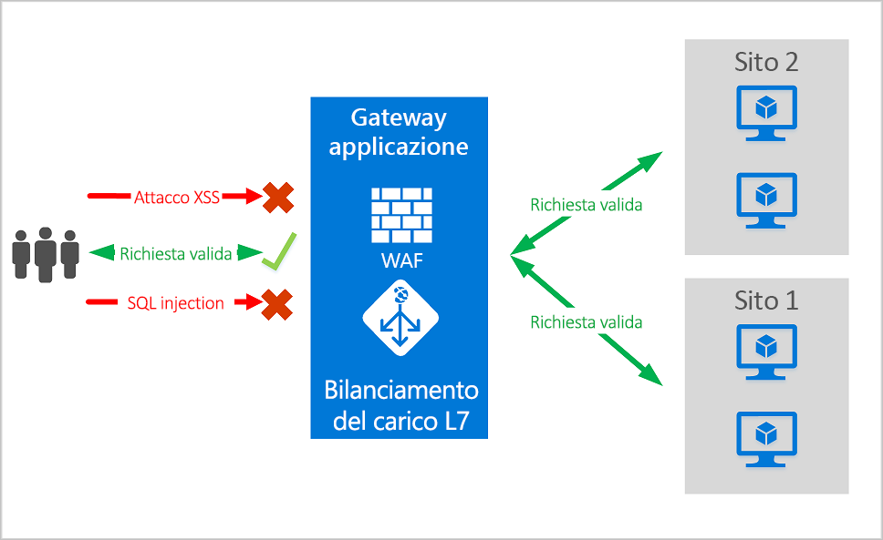
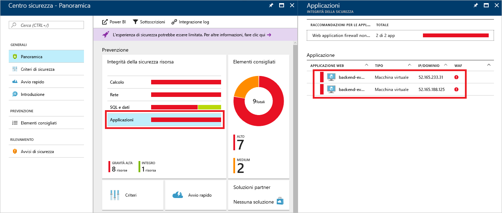

# <a name="azure-web-application-firewall-on-azure-application-gateway"></a>Web Application Firewall di Azure nel gateway applicazione di Azure

Web Application Firewall (WAF) di Azure nel gateway applicazione di Azure offre protezione centralizzata delle applicazioni Web da exploit e vulnerabilità comuni. Le applicazioni Web sono sempre più vittime di attacchi che sfruttano le più comuni vulnerabilità note. Gli attacchi SQL injection e quelli tramite script da altri siti sono tra i più comuni.

WAF in gateway applicazione basa sullo standard [CRS (Core Rule Set)](https://www.owasp.org/index.php/Category:OWASP_ModSecurity_Core_Rule_Set_Project) 3.1, 3.0 o 2.2.9 dell'OWASP (Open Web Application Security Project). WAF si aggiorna automaticamente per includere la protezione contro le nuove vulnerabilità, senza alcuna configurazione aggiuntiva. 

Tutte le funzionalità di WAF elencate di seguito sono disponibili all'interno di un criterio di WAF. È possibile creare tutti i criteri desiderati, che possono essere associati a un gateway applicazione, a singoli listener o a regole di routing basate su percorso in un gateway applicazione. In questo modo, se necessario, è possibile avere criteri distinti per ogni sito dietro il gateway applicazione. Per altre informazioni sui criteri di WAF, vedere [Creare un criterio di WAF](create-waf-policy-ag.md).

   > [!NOTE]
   > I criteri di WAF per sito e per URI sono disponibili in anteprima pubblica. Questa funzionalità è quindi soggetta alle condizioni per l'utilizzo supplementari di Microsoft. Per altre informazioni, vedere [Condizioni supplementari per l'utilizzo delle anteprime di Microsoft Azure](https://azure.microsoft.com/en-us/support/legal/preview-supplemental-terms/).



Il gateway applicazione funziona da controller per la distribuzione di applicazioni (ADC, Application Delivery Controller). Offre terminazione SSL (Secure Sockets Layer), affinità di sessione basata su cookie, distribuzione del carico round robin, routing basato sul contenuto, possibilità di ospitare più siti Web e miglioramenti della sicurezza.

I miglioramenti della sicurezza offerti dal gateway applicazione includono la gestione dei criteri di SSL e il supporto di SSL end-to-end. La sicurezza delle applicazioni è rafforzata dall'integrazione di WAF nel gateway applicazione. La combinazione protegge le applicazioni Web da vulnerabilità comuni. Fornisce inoltre una posizione centrale di facile configurazione da gestire.

## <a name="benefits"></a>Vantaggi

Questa sezione descrive i vantaggi principali offerti da WAF nel gateway applicazione.

### <a name="protection"></a>Protezione

* Protezione dell'applicazione Web dalle vulnerabilità e dagli attacchi del Web, senza alcuna modifica del codice di back-end.

* Protezione contemporanea di più applicazioni Web. Un'istanza del gateway applicazione può ospitare fino a 100 siti Web protetti da Web Application Firewall.

* Protezione delle applicazioni Web da bot dannosi con il set di regole IP Reputation

### <a name="monitoring"></a>Monitoraggio

* Monitoraggio degli attacchi contro le applicazioni Web tramite il log in tempo reale di WAF. Il log è integrato in [Monitoraggio di Azure](../../azure-monitor/overview.md) per tenere traccia degli avvisi di WAF e monitorare con facilità le tendenze.

* WAF nel gateway applicazione è integrato con il Centro sicurezza di Azure. Il Centro sicurezza offre una visione centralizzata dello stato di sicurezza di tutte le risorse di Azure.

### <a name="customization"></a>Personalizzazione

* Possibilità di personalizzare le regole e i gruppi di regole di WAF in base ai requisiti delle applicazioni e di eliminare i falsi positivi.

* È possibile associare un criterio di WAF per ogni sito dietro WAF per consentire la configurazione specifica per sito

## <a name="features"></a>Funzionalità

- Protezione da attacchi SQL injection.
- Protezione da attacchi tramite script da altri siti.
- Protezione da altri attacchi Web comuni, come command injection, HTTP Request Smuggling, HTTP Response Splitting e Remote File Inclusion.
- Protezione da violazioni del protocollo HTTP.
- Protezione da anomalie del protocollo HTTP, ad esempio agente utente host e intestazioni accept mancanti.
- Protezione da bot, crawler e scanner.
- Rilevamento di errori di configurazione comuni dell'applicazione, ad esempio Apache e IIS.
- Limiti inferiori e superiori configurabili per le dimensioni delle richieste.
- Elenchi di esclusione che consentono di omettere determinati attributi delle richieste da una valutazione di WAF. Un esempio comune è rappresentato dai token inseriti in Active Directory che vengono usati per l'autenticazione o per i campi delle password.

## <a name="waf-policy"></a>Criterio di WAF

Per abilitare Web Application Firewall in un gateway applicazione, è necessario creare un criterio di WAF. Questo criterio include tutte le regole gestite, le regole personalizzate, le esclusioni e altre personalizzazioni, ad esempio un limite per il caricamento di file. 

### <a name="core-rule-sets"></a>Set di regole principali

Il gateway applicazione supporta tre set di regole, ovvero CRS 3.1, CRS 3.0 e CRS 2.2.9. Queste regole proteggono le applicazioni Web da attività dannose.

Per altre informazioni, vedere [Regole e gruppi di regole CRS di Web Application Firewall](application-gateway-crs-rulegroups-rules.md).

### <a name="custom-rules"></a>Regole personalizzate

Il gateway applicazione supporta anche regole personalizzate, ossia regole che è possibile creare e che vengono valutate per ogni richiesta che passa attraverso WAF. Queste regole hanno una priorità più elevata rispetto alle altre dei set di regole gestiti. Se viene soddisfatto un set di condizioni, viene intrapresa un'azione per consentire o bloccare le richieste. 

Per altre informazioni, vedere [Regole personalizzate per l gateway applicazione](custom-waf-rules-overview.md).

### <a name="bot-mitigation-preview"></a>Mitigazione dei bot (anteprima)

Per WAF è possibile abilitare un set di regole gestito di protezione dai bot per bloccare o registrare le richieste provenienti da indirizzi IP noti per essere dannosi, oltre al set di regole gestito. Gli indirizzi IP sono originati dal feed di Microsoft Threat Intelligence. La soluzione Microsoft Threat Intelligence, basata su Intelligent Security Graph, viene usata da più servizi, tra cui Centro sicurezza di Azure.

> [!NOTE]
> Il set di regole di protezione dai bot è attualmente disponibile in anteprima pubblica e viene fornito con un contratto di servizio di anteprima. Alcune funzionalità potrebbero non essere supportate o potrebbero presentare funzionalità limitate. Vedere [Condizioni supplementari per l'uso delle anteprime di Microsoft Azure](https://azure.microsoft.com/support/legal/preview-supplemental-terms/).

Se la protezione dai bot è abilitata, le richieste in ingresso che corrispondono a IP client di bot dannosi vengono registrati nel log del firewall. Per altre informazioni, vedere di seguito. È possibile accedere ai log di WAF dall'account di archiviazione, dall'hub eventi o da Log Analytics. 

### <a name="waf-modes"></a>Modalità di WAF

WAF nel gateway applicazione può essere configurato per l'esecuzione nelle due modalità seguenti:

* **Modalità di rilevamento**: monitora e registra tutti gli avvisi sulle minacce. Attivare la registrazione diagnostica per il gateway applicazione usando la sezione **Diagnostica**. È anche necessario assicurarsi che il log di WAF sia selezionato e attivato. Quando viene eseguito in modalità di rilevamento, Web Application Firewall non blocca le richieste in ingresso.
* **Modalità di prevenzione**: blocca le intrusioni e gli attacchi rilevati dalle regole. L'autore dell'attacco riceve un'eccezione di "accesso non autorizzato 403" e la connessione viene chiusa. La modalità di prevenzione registra tali attacchi nei log di WAF.

> [!NOTE]
> Negli ambienti di produzione è consigliabile eseguire una nuova distribuzione di WAF in modalità di rilevamento per un breve periodo di tempo. In questo modo è possibile ottenere i [log del firewall](../../application-gateway/application-gateway-diagnostics.md#firewall-log) e aggiornare eventuali eccezioni o [regole personalizzate](./custom-waf-rules-overview.md) prima della transizione alla modalità di prevenzione. Ciò consente di ridurre la possibilità che il traffico venga bloccato in modo imprevisto.

### <a name="anomaly-scoring-mode"></a>Modalità di assegnazione di punteggi di anomalia

OWASP prevede due modalità per decidere se bloccare o meno il traffico: la modalità tradizionale e la modalità di assegnazione di punteggi di anomalia.

In modalità tradizionale, il traffico che corrisponde a qualsiasi regola viene considerato in modo indipendente da qualsiasi altra regola corrispondente. Questa modalità è facile da comprendere. Ma la mancanza di informazioni sul numero di regole che corrispondono a una specifica richiesta costituisce una limitazione. Per questo motivo, è stata introdotta la modalità di assegnazione di punteggi di anomalia. Si tratta dell'impostazione predefinita per OWASP 3.*x*.

In questa modalità, il traffico che corrisponde a qualsiasi regola non viene immediatamente bloccato se il firewall è in modalità di prevenzione. Le regole hanno uno specifico livello di gravità: *critico*, *errore*, *avviso* o *notifica*. Questo livello determina un valore numerico per la richiesta, ossia il punteggio di anomalia. Ad esempio, una regola di tipo *avviso* aggiunge 3 al punteggio. Una regola di livello *critico* aggiunge 5.

|Gravità  |Valore  |
|---------|---------|
|Critico     |5|
|Tipi di errore        |4|
|Avviso      |3|
|Notifica       |2|

Per bloccare il traffico, il punteggio di anomalia deve raggiungere la soglia 5. Quindi, una singola corrispondenza con una regola di livello *critico* è sufficiente perché WAF nel gateway applicazione blocchi una richiesta, anche in modalità di prevenzione. Invece una singola corrispondenza con una regola di tipo *avviso* si limita a incrementare di 3 il punteggio di anomalia, quindi non è sufficiente per bloccare il traffico.

> [!NOTE]
> Il messaggio registrato quando una regola di WAF corrisponde al traffico include il valore di azione "Blocked", ossia bloccato. Ma in realtà il traffico viene bloccato solo nel caso di un punteggio di anomalia pari o superiore a 5.  

### <a name="waf-monitoring"></a>Monitoraggio di WAF

Il monitoraggio dello stato del gateway applicazione è un'attività importante. Il monitoraggio dell'integrità di WAF e delle applicazioni che protegge è supportato dall'integrazione con il Centro sicurezza di Azure, con Monitoraggio di Azure e con i log di Monitoraggio di Azure.


#### <a name="azure-monitor"></a>Monitoraggio di Azure

I log del gateway applicazione sono integrati con [Monitoraggio di Azure](../../azure-monitor/overview.md). Ciò consente di tenere traccia delle informazioni diagnostiche, inclusi i log e gli avvisi di WAF. È possibile accedere a questa funzionalità nella scheda **Diagnostica** della risorsa Gateway applicazione nel portale o direttamente tramite Monitoraggio di Azure. Per altre informazioni sull'abilitazione dei log, vedere [Diagnostica del gateway applicazione](../../application-gateway/application-gateway-diagnostics.md).

#### <a name="azure-security-center"></a>Centro sicurezza di Azure

Il [Centro sicurezza](../../security-center/security-center-intro.md) aiuta a prevenire, rilevare e rispondere alle minacce. Offre maggiore visibilità e controllo sulla sicurezza delle risorse di Azure. Il gateway applicazione è [integrato con il Centro sicurezza](../../application-gateway/application-gateway-integration-security-center.md). Il Centro sicurezza analizza l'ambiente per rilevare eventuali applicazioni Web non protette e può consigliare a WAF nel gateway applicazione di proteggere queste risorse vulnerabili. I firewall vengono creati direttamente dal Centro sicurezza. Queste istanze di WAF sono integrate con il Centro sicurezza. Inviano avvisi e informazioni sull'integrità al Centro sicurezza a scopo di report.



#### <a name="logging"></a>Registrazione

WAF nel gateway applicazione fornisce report dettagliati su ogni minaccia rilevata. La registrazione è integrata con i log di Diagnostica di Azure. Gli avvisi vengono registrati nel formato JSON. Questi log possono essere integrati con i [log di Monitoraggio di Azure](../../azure-monitor/insights/azure-networking-analytics.md).


```json
{
  "resourceId": "/SUBSCRIPTIONS/{subscriptionId}/RESOURCEGROUPS/{resourceGroupId}/PROVIDERS/MICROSOFT.NETWORK/APPLICATIONGATEWAYS/{appGatewayName}",
  "operationName": "ApplicationGatewayFirewall",
  "time": "2017-03-20T15:52:09.1494499Z",
  "category": "ApplicationGatewayFirewallLog",
  "properties": {
    {
      "instanceId": "ApplicationGatewayRole_IN_0",
      "clientIp": "52.161.109.145",
      "clientPort": "0",
      "requestUri": "/",
      "ruleSetType": "OWASP",
      "ruleSetVersion": "3.0",
      "ruleId": "920350",
      "ruleGroup": "920-PROTOCOL-ENFORCEMENT",
      "message": "Host header is a numeric IP address",
      "action": "Matched",
      "site": "Global",
      "details": {
        "message": "Warning. Pattern match \"^[\\\\d.:]+$\" at REQUEST_HEADERS:Host ....",
        "data": "127.0.0.1",
        "file": "rules/REQUEST-920-PROTOCOL-ENFORCEMENT.conf",
        "line": "791"
      },
      "hostname": "127.0.0.1",
      "transactionId": "16861477007022634343"
      "policyId": "/subscriptions/1496a758-b2ff-43ef-b738-8e9eb5161a86/resourceGroups/drewRG/providers/Microsoft.Network/ApplicationGatewayWebApplicationFirewallPolicies/globalWafPolicy",
      "policyScope": "Global",
      "policyScopeName": " Global "
    }
  }
} 

```

## <a name="application-gateway-waf-sku-pricing"></a>Prezzi dello SKU WAF del gateway applicazione

I modelli di determinazione dei prezzi sono diversi per gli SKU WAF_v1 e WAF_v2. Per altre informazioni, vedere la pagina relativa ai [prezzi del gateway applicazione](https://azure.microsoft.com/pricing/details/application-gateway/). 

## <a name="next-steps"></a>Passaggi successivi

- Informazioni su [Web Application Firewall in Frontdoor di Azure](../afds/afds-overview.md)
