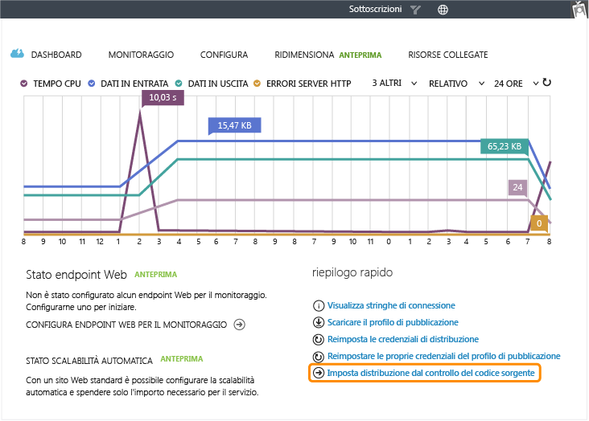
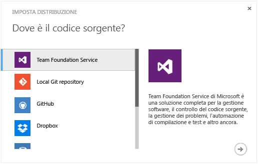
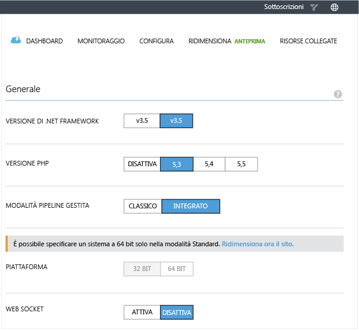
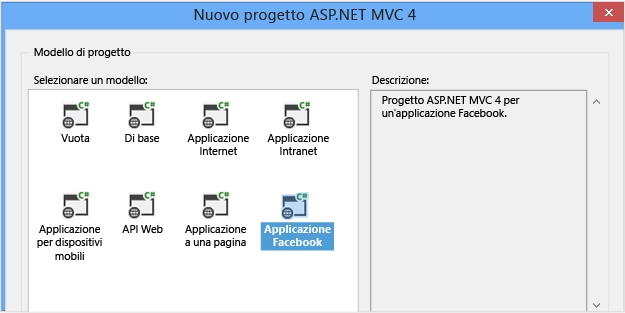
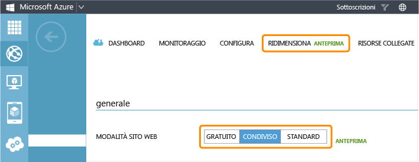
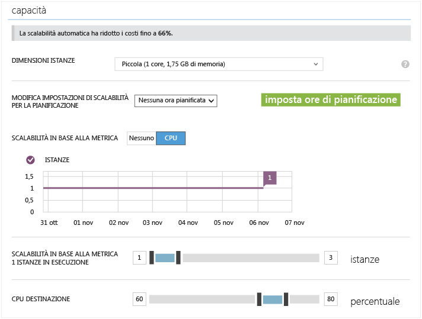
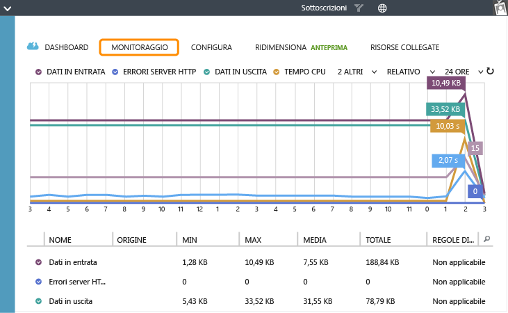
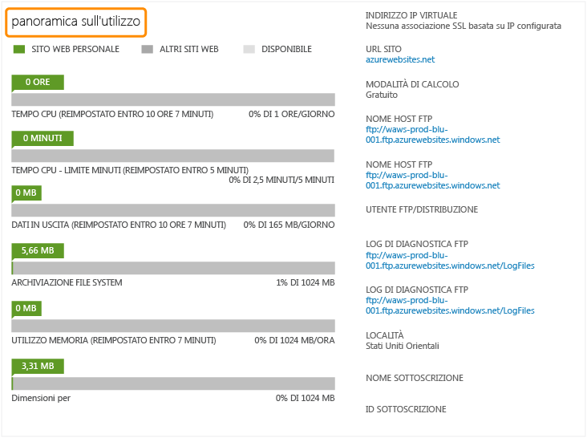

<properties linkid="websites-digital-marketing" urlDisplayName="Resources" pageTitle="Create a Digital Marketing Campaign on Azure Web Sites" metaKeywords="" description="This guide provides a technical overview of how to use Azure Web Sites to create digital marketing campaigns. This includes deployment, social media integration, scaling strategies, and monitoring." metaCanonical="" services="" documentationCenter="" title="Create a Digital Marketing Campaign on Azure Web Sites" authors="jroth" solutions="" manager="paulettm" editor="mollybos" />

Creazione di una campagna marketing digitale in Siti Web di Azure
=================================================================

In questa Guida è disponibile una panoramica tecnica dell'utilizzo di Siti Web di Azure per la creazione di campagne marketing digitali. Una campagna marketing digitale è in genere di breve durata e si propone di ottenere un obiettivo marketing a breve termine. È necessario prendere in considerazione due scenari principali. Nel primo scenario una società di marketing di terze parti crea e gestisce la campagna per conto del cliente, per l'intera durata della promozione. Nel secondo scenario la società di marketing crea la campagna marketing digitale, quindi trasferisce al cliente la proprietà delle risorse corrispondenti. La campagna marketing digitale verrà quindi eseguita e gestita autonomamente dal cliente.

[Siti Web di Azure](/en-us/documentation/services/web-sites/) è la soluzione ideale in entrambi gli scenari. Consente infatti una creazione rapida, supporta più framework e linguaggi, assicura la scalabilità in base alla domanda da parte degli utenti e permette di utilizzare diversi sistemi di distribuzione e di controllo del codice sorgente. Se si utilizza Azure, sarà inoltre possibile accedere ad altri servizi di Azure, ad esempio Servizi multimediali, che consentono di ottimizzare una campagna marketing.

Benché sia possibile utilizzare [Servizi cloud di Azure](/en-us/documentation/services/cloud-services/) o [Macchine virtuali di Azure](/en-us/documentation/services/virtual-machines/) per l'hosting di siti Web, tale opzione è consigliabile per questo scenario solo se è necessario disporre di una caratteristica non offerta da Siti Web di Azure. Per informazioni sulle opzioni disponibili, vedere [Confronto tra Siti Web, Servizi cloud e Macchine virtuali di Azure](/en-us/manage/services/web-sites/choose-web-app-service).

In questa guida vengono illustrati gli argomenti seguenti:

-   [Distribuzione di siti Web esistenti](#deployexisting)
-   [Integrazione con i social media](#socialmedia)
-   [Scalabilità in base alla domanda da parte degli utenti](#scale)
-   [Integrazione con altri servizi](#integrate)
-   [Monitoraggio della campagna](#monitor)

**Nota**

In questa guida vengono illustrate alcune delle aree e delle attività più comuni relative allo sviluppo di un sito .COM pubblico. In Siti Web di Azure sono tuttavia disponibili altre funzionalità che è possibile utilizzare nelle implementazioni specifiche. Per informazioni dettagliate su tali funzionalità, vedere le guide relative alla [presenza Web globale](http://www.windowsazure.com/en-us/manage/services/web-sites/global-web-presence-solution-overview/) e alle [applicazioni business](http://www.windowsazure.com/en-us/manage/services/web-sites/business-application-solution-overview).

Distribuzione di siti Web esistenti
-----------------------------------

Nello scenario relativo alla presenza Web globale vengono illustrate diverse opzioni per la creazione e la distribuzione di un nuovo sito Web. Se non si è esperti di Siti Web di Azure, è consigliabile [esaminare le informazioni disponibili](/en-us/manage/services/web-sites/global-web-presence-solution-overview/). Se si creano spesso campagne marketing digitali, è possibile che siano disponibili asset Web da personalizzare per le diverse promozioni. In questa sezione verranno esaminate in modo dettagliato le opzioni per la distribuzione di diversi tipi di siti Web dal controllo del codice sorgente.

Se si riutilizzano asset Web per finalità diverse, è consigliabile prendere in considerazione un sistema di gestione del controllo del codice sorgente, se non se ne utilizza già uno. Tale sistema consente di archiviare i modelli di soluzioni Web comuni, che possono essere sottoposti a branching e personalizzati per clienti specifici. Siti Web consente inoltre di eseguire la sincronizzazione con molti archivi diversi di codice sorgente. Nella scheda **Dashboard** selezionare il collegamento **Set up deployment from source control**.

Verrà visualizzata una finestra di dialogo con più opzioni per il controllo del codice sorgente, inclusi sistemi completi per il controllo del codice sorgente, come TFS, oltre a semplici soluzioni di distribuzione, ad esempio Dropbox.

Per gestire il nuovo progetto basato su una linea di base esistente, è possibile utilizzare diverse tecniche per il controllo del codice sorgente. È ad esempio possibile copiare un archivio di base, salvato in precedenza, per iniziare a creare il nuovo progetto oppure creare un nuovo branch per tenere traccia delle personalizzazioni per il progetto corrente. Per un esempio dell'utilizzo di branch per la gestione di distribuzioni diverse dallo stesso archivio di controllo del codice sorgente, vedere la pagina relativa agli [ambienti multipli con Siti Web di Azure](http://www.bradygaster.com/post/multiple-environments-with-windows-azure-web-sites). In questo post viene illustrato come utilizzare il branching Git per la gestione degli ambienti di gestione temporanea e di produzione.

Dopo la connessione del sito Web al controllo del codice sorgente, sarà possibile configurare le distribuzioni e tenerne traccia dal portale. Per ulteriori informazioni sull'utilizzo del controllo del codice sorgente con Siti Web, vedere [Pubblicazione da controllo del codice sorgente in Siti Web di Azure](/en-us/develop/net/common-tasks/publishing-with-git/).

Quando si utilizzano asset Web esistenti, è importante mantenere la flessibilità necessaria per l'hosting di tipi diversi di siti Web. Nella scheda **Configure** è possibile selezionare il supporto sia .NET che PHP per il sito Web.

Oltre a queste opzioni di configurazione, Siti Web offre automaticamente supporto per Python 2.7 e Node.js. La versione predefinita di Node.js è 0.10.5.

Siti Web di Azure consente inoltre di distribuire in modo rapido sul Web i siti di gestione temporanea. Durante la pianificazione, la creazione dei prototipi e le fasi iniziali dello sviluppo di un sito, l'agenzia e il cliente possono esaminare versioni effettivamente funzionanti del sito della campagna prima che sia attivato. Quando il sito è pronto per la produzione, l'agenzia può gestire la distribuzione in produzione per conto del cliente oppure può fornire al cliente gli asset Web da distribuire e gestire.

Integrazione con i social media
-------------------------------

La maggior parte delle campagne marketing digitali utilizza siti di social media, ad esempio Facebook o Twitter. Uno degli aspetti base dell'integrazione consiste nell'utilizzare le identità di social media per l'autenticazione. Per un esempio di questo approccio con un'applicazione ASP.NET, vedere [Distribuzione di un'app ASP.NET MVC sicura con appartenenza, OAuth e database SQL in un sito Web di Azure](/en-us/develop/net/tutorials/web-site-with-sql-database/).

Molte campagne marketing digitali, tuttavia, utilizzano l'integrazione con i social media non solo per l'autenticazione ma anche come elemento chiave della strategia adottata. I siti di social media includono in genere una sezione per sviluppatori, che illustra i diversi modi in cui è possibile integrare le applicazioni con i servizi offerti da tali siti. I servizi che offrono un'API REST possono essere utilizzati da quasi tutti i framework Web. Sono tuttavia spesso presenti informazioni specifiche per il linguaggio utilizzato. Ad esempio, Twitter offre [un elenco di librerie disponibili che supportano l'API Twitter](https://dev.twitter.com/docs/twitter-libraries#dotnet), incluse le librerie per .NET, Node.js, e PHP. È consigliabile esaminare le indicazioni per lo sviluppo specifiche direttamente in ogni sito di social media a cui si desidera fare riferimento nella campagna.

Se si è sviluppatori ASP.NET e si desidera fare riferimento a Facebook, in Visual Studio è disponibile un modello per un'applicazione MVC 4 specifica per Facebook.

Per una procedura dettagliata relativa all'utilizzo di questo modello con Siti Web, vedere [Creazione di un'app relativa a Facebook utilizzando i modelli Facebook MVC ASP.NET e ospitandoli gratuitamente nei siti Web di Azure](http://blogs.msdn.com/b/africaapps/archive/2013/02/20/creating-a-facebook-app-using-asp-net-mvc-facebook-templates-and-hosting-them-for-free-on-windows-azure-websites.aspx). Per un'esercitazione più dettagliata e un'applicazione di esempio, vedere le pagine relative all'[app Facebook MVC ASP.NET per i compleanni](http://www.asp.net/mvc/tutorials/mvc-4/aspnet-mvc-facebook-birthday-app) e al [nuovo modello per l'applicazione Facebook e la libreria MVC ASP.NET](http://blogs.msdn.com/b/webdev/archive/2012/12/13/the-new-facebook-application-template-and-library-for-asp.net-mvc.aspx).

È importante che gli sviluppatori ASP.NET comprendano che l'integrazione con i social media non è limitata ai modelli offerti da Visual Studio. Un modello consente di semplificare il processo, ma, come indicato in precedenza, ogni sito di social media offre in genere informazioni relative a modalità alternative per la connessione da .NET e da molti altri linguaggi e framework.

Scalabilità in base alla domanda da parte degli utenti
------------------------------------------------------

Il cloud computing risulta utile per i carichi di lavoro non prevedibili e le campagne marketing digitali rientrano in questa categoria. È infatti difficile prevedere la popolarità di un sito di marketing di durata relativamente breve, poiché molto dipende dalla capacità di catturare l'interesse degli utenti e dalle interazioni di social media correlate che contribuiscono all'incremento di traffico verso il sito. Azure offre alcune opzioni per la scalabilità di siti Web e servizi cloud.

-   Scalabilità manuale tramite il [portale di gestione di Azure](http://manage.windowsazure.com/).
-   Scalabilità a livello di codice tramite l'[API di gestione del servizio](http://msdn.microsoft.com/en-us/library/windowsazure/ee460799.aspx) o lo [scripting PowerShell](http://msdn.microsoft.com/en-us/library/windowsazure/jj152841.aspx).
-   Scalabilità automatica tramite la funzionalità Autoscale (Preview).

Nel portale di gestione passare alla scheda **Scale** per il sito Web. Sono disponibili diverse opzioni per la scalabilità. La prima opzione consente di determinare la modalità del sito Web, impostata su **Free**, **Shared** o **Standard**.

Le funzionalità e le opzioni di scalabilità aumentano in corrispondenza di ogni livello. Ad esempio, i siti in modalità **Free** non possono essere scalati orizzontalmente in istanze multiple, ma i siti in modalità **Shared** possono essere scalati orizzontalmente in 6 istanze. È inoltre possibile ottenere la scalabilità verticale selezionando la modalità **Standard**. Tale modalità consente di eseguire il sito in macchine virtuali dedicate e offre opzioni specifiche per macchine di dimensioni piccole, medie e grandi. Dopo avere definito la dimensione della macchina virtuale, è inoltre possibile avvalersi della scalabilità orizzontale in istanze multiple. La modalità **Standard** offre la scalabilità orizzontale fino a 10 istanze. Un elenco completo di differenze tra le modalità è disponibile nelle [indicazioni per la determinazione dei prezzi per i siti Web](https://www.windowsazure.com/en-us/pricing/details/web-sites/).

Quando si seleziona la modalità **Standard**, è inoltre possibile abilitare la funzionalità Autoscale (Preview), che consente di applicare la scalabilità in base alla CPU. La percentuale **Target CPU** indica un intervallo di utilizzo del processore a cui Azure fa riferimento come obiettivo per le istanze del sito Web. Se l'utilizzo medio della CPU è inferiore a tale obiettivo, Azure riduce il conteggio di istanze, poiché lo stesso carico su un numero inferiore di istanze consentirà di ottenere un incremento dell'utilizzo nelle istanze rimanenti. Non è tuttavia possibile ridurre il conteggio di istanze fino a un valore inferiore al minimo previsto per **Instance Count**. Analogamente, se l'utilizzo medio della CPU è superiore al valore specificato per **Target CPU**, Azure aumenterà il numero di istanze. La distribuzione dello stesso carico su macchine aggiuntive consentirà di ridurre l'utilizzo della CPU in ogni macchina. Il numero di istanze aggiunte è limitato dal valore massimo specificato per **Instance Count**.

La scalabilità automatica consente un utilizzo più efficiente delle risorse. È ad esempio possibile che una campagna marketing digitale sia più attiva durante la notte e nei giorni festivi. Questa soluzione permette inoltre di gestire in modo efficace uno scenario caratterizzato da un incremento imprevisto della popolarità di una campagna. La scalabilità automatica consente di gestire in modo efficiente un incremento del carico, quindi di ridurre il numero di istanze e il relativo costo quando il carico diminuisce.

Per ulteriori informazioni sulla scalabilità dei siti Web, vedere [Come applicare la scalabilità ai siti Web](/en-us/manage/services/web-sites/how-to-scale-websites/). Questo argomento è strettamente associato al monitoraggio. Per ulteriori informazioni, vedere la sezione relativa al [monitoraggio della campagna](#monitor) in questa guida.

**Nota**

Nel caso delle applicazioni Web che scelgono di utilizzare i servizi cloud e i ruoli Web, è disponibile un'opzione aggiuntiva per la scalabilità basata sulla lunghezza degli elementi in un coda. In un servizio cloud i ruoli che elaborano le code back-end costituiscono un modello di architettura molto diffuso. Per ulteriori informazioni sulla scalabilità dei servizi cloud, vedere [Come applicare la scalabilità a un servizio cloud](http://www.windowsazure.com/en-us/manage/services/cloud-services/how-to-scale-a-cloud-service/).

Integrazione con altri servizi
------------------------------

Un sito per il marketing digitale incorpora spesso elementi multimediali avanzati, ad esempio lo streaming di video. L'hosting di tali siti in Azure offre un'integrazione avanzata con i servizi di Azure correlati. È ad esempio possibile utilizzare Servizi multimediali di Azure per la codifica e lo streaming di video dal sito Web. Per ulteriori informazioni su Servizi multimediali, vedere [Introduzione a concetti e scenari di Servizi multimediali di Azure](http://msdn.microsoft.com/en-us/library/windowsazure/dn223282.aspx).

È possibile utilizzare altri servizi di Azure per creare un'applicazione più affidabile. Ad esempio, Siti Web è in grado di utilizzare la cache distribuita offerta dal [Servizio cache di Azure (anteprima)](http://msdn.microsoft.com/en-us/library/windowsazure/dn386094.aspx). In alternativa, è possibile utilizzare i servizi di archiviazione di Azure per l'archiviazione di dati e risorse dell'applicazione. Ad esempio, è possibile archiviare in modo permanente nei BLOB elementi grafici, video e altri file di grandi dimensioni. Sono inoltre disponibili servizi database, quali Database SQL di Azure e MySQL, per soddisfare le esigenze dei dati relazionali.

Monitoraggio della campagna
---------------------------

Nella scheda **Monitor** sono disponibili metriche che semplificano la valutazione dell'esito e delle prestazioni del sito di marketing digitale.

È ad esempio possibile esaminare i modelli e i livelli di utilizzo mediante metriche quali **CPU Time**, **Requests** e **Data Out**. I valori corrispondenti a tali metriche crescono insieme all'aumento di popolarità della campagna marketing. Le informazioni sull'utilizzo possono consentire di decidere quando applicare la scalabilità orizzontale o verticale. Per ulteriori informazioni, vedere [Come monitorare i siti Web](/en-us/manage/services/web-sites/how-to-monitor-websites/).

Se si utilizzano le modalità **Free** e **Shared**, è consigliabile esaminare anche le quote di risorse. Nella scheda **Dashboard** del portale vengono mostrate le statistiche di utilizzo correnti relative a diverse quote e viene indicato quando tali quote verranno reimpostate. Le statistiche di utilizzo visualizzate dipendono dalla modalità selezionata. Nella schermata seguente vengono mostrate le statistiche visualizzate per la modalità **Free**. Se si utilizza la modalità **Shared**, la quota per **Data Out** non verrà visualizzata. Nella modalità **Standard** vengono visualizzate solo le quote per **File System Storage** e **Size**.

Se tali quote sono quasi esaurite, è consigliabile valutare il passaggio dalla modalità **Free** alla modalità **Shared** oppure dalla modalità **Shared** alla modalità **Standard**. La modalità **Standard** offre risorse dedicate su una o più macchine virtuali di piccole, medie o grandi dimensioni.

Oltre a utilizzare il portale di gestione per questo tipo di informazioni, è possibile utilizzare alcuni strumenti di terze parti che forniscono dati di monitoraggio avanzati per i siti Web. È ad esempio possibile installare un componente aggiuntivo New Relic da Azure Store. Per una procedura dettagliata relativa all'utilizzo di New Relic per il monitoraggio, vedere [Gestione delle prestazioni delle applicazioni con New Relic in Siti Web di Azure](/en-us/develop/net/how-to-guides/new-relic/).

È infine possibile abilitare il monitoraggio e gli avvisi relativi agli endpoint nei siti Web in modalità Standard. Il monitoraggio degli endpoint esegue regolarmente il tentativo di raggiungere il sito Web e segnala quindi il tempo di risposta rilevato. Gli avvisi forniscono notifiche tramite posta elettronica nel caso in cui il tempo di risposta superi una soglia specificata. Per ulteriori informazioni, vedere la sezione relativa al monitoraggio dello scenario basato sulla [presenza Web globale](/en-us/manage/services/web-sites/global-web-presence-solution-overview/) e l'argomento [Procedura: Ricevere notifiche di avviso e gestire le relative regole in Azure](http://msdn.microsoft.com/library/windowsazure/dn306638.aspx).

Riepilogo
---------

Siti Web di Azure costituisce una soluzione ottimale per contenuto Web riutilizzabile, personalizzato per singole campagne marketing. Offre supporto per molti linguaggi, framework e sistemi di controllo di gestione del codice sorgente popolari, semplificando la migrazione degli asset e dei flussi di lavoro nel cloud. Il modello dell'applicazione Facebook ASP.NET semplifica la creazione di applicazioni Facebook, ma è possibile utilizzare praticamente qualsiasi strumento di terze parti per l'integrazione con i social media che supporti le interfacce Web. Servizi multimediali di Azure e altri servizi correlati offerti da Azure offrono strumenti aggiuntivi per la creazione di un sito progettato in modo adeguato per una campagna. Le diverse opzioni per la scalabilità manuale e automatica risultano inoltre utili per la gestione della domanda da parte degli utenti, che può essere difficile da prevedere. Per ulteriori informazioni, vedere gli articoli tecnici seguenti.

<table data-morhtml="true" cellspacing="0" border="1">
<tr data-morhtml="true">
   <th data-morhtml="true" align="left" valign="top">Area</th>
   <th data-morhtml="true" align="left" valign="top">Risorse</th>
</tr>
<tr data-morhtml="true">
   <td data-morhtml="true" valign="middle"><strong data-morhtml="true">Pianificazione</strong></td>
   <td data-morhtml="true" valign="top">- <a data-morhtml="true" href="http://www.windowsazure.com/en-us/manage/services/web-sites/choose-web-app-service">Confronto tra Siti Web, Servizi cloud e Macchine virtuali di Azure</a></td>
</tr>
<tr data-morhtml="true">
   <td data-morhtml="true" valign="middle"><strong data-morhtml="true">Creazione</strong></td>
   <td data-morhtml="true" valign="top">- <a data-morhtml="true" href="http://www.windowsazure.com/en-us/manage/services/web-sites/how-to-create-websites/">Come creare e distribuire un sito Web</a></td>
</tr>
<tr data-morhtml="true">
   <td data-morhtml="true" valign="middle"><strong data-morhtml="true">Distribuzione</strong></td>
   <td data-morhtml="true" valign="top">- <a data-morhtml="true" href="http://www.windowsazure.com/en-us/develop/net/common-tasks/publishing-with-git/">Pubblicazione da controllo del codice sorgente in Siti Web di Azure</a> - <a data-morhtml="true" href="http://www.windowsazure.com/en-us/manage/services/web-sites/how-to-create-websites/">Distribuzione di un'applicazione Web ASP.NET in un sito Web di Azure</a></td>
</tr>
<tr data-morhtml="true">
   <td data-morhtml="true" valign="middle"><strong data-morhtml="true">Social media</strong></td>
   <td data-morhtml="true" valign="top">- <a data-morhtml="true" href="http://www.windowsazure.com/en-us/develop/net/tutorials/web-site-with-sql-database/">Distribuzione di un'app ASP.NET MVC sicura con appartenenza, OAuth e database SQL in un sito Web di Windows Azure</a> - <a data-morhtml="true" href="http://blogs.msdn.com/b/africaapps/archive/2013/02/20/creating-a-facebook-app-using-asp-net-mvc-facebook-templates-and-hosting-them-for-free-on-windows-azure-websites.aspx">Creazione di un'app relativa a Facebook utilizzando i modelli Facebook MVC ASP.NET</a> - <a data-morhtml="true" href="http://blogs.msdn.com/b/webdev/archive/2012/12/13/the-new-facebook-application-template-and-library-for-asp.net-mvc.aspx">Modello per un'applicazione Facebook e libreria per MVC ASP.NET</a></td>
</tr>
<tr data-morhtml="true">
   <td data-morhtml="true" valign="middle"><strong data-morhtml="true">Scalabilit&agrave;</strong></td>
   <td data-morhtml="true" valign="top">- <a data-morhtml="true" href="http://www.windowsazure.com/en-us/manage/services/web-sites/how-to-scale-websites/">Come applicare la scalabilit&agrave; ai siti Web</a></td>
</tr>
<tr data-morhtml="true">
   <td data-morhtml="true" valign="middle"><strong data-morhtml="true">Dati multimediali elaborati</strong></td>
   <td data-morhtml="true" valign="top">- <a data-morhtml="true" href="http://msdn.microsoft.com/en-us/library/windowsazure/dn223282.aspx">Introduzione a concetti e scenari di Servizi multimediali di Azure</a></td>
</tr>
<tr data-morhtml="true">
   <td data-morhtml="true" valign="middle"><strong data-morhtml="true">Monitoraggio</strong></td>
   <td data-morhtml="true" valign="top">- <a data-morhtml="true" href="http://www.windowsazure.com/en-us/manage/services/web-sites/how-to-monitor-websites/">Come monitorare i siti Web</a> - <a data-morhtml="true" href="http://msdn.microsoft.com/library/windowsazure/dn306638.aspx">Procedura: Ricevere notifiche di avviso e gestire le relative regole in Azure</a></td>
</tr>
</table>

