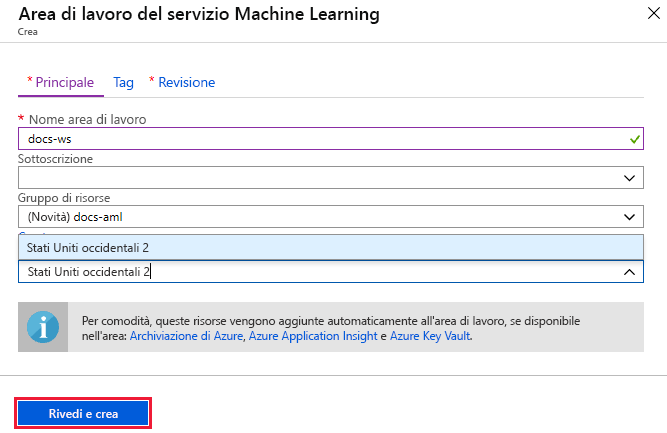
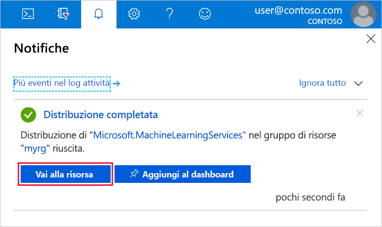

1. Accedere al [portale di Azure](https://portal.azure.com/) usando le credenziali della propria sottoscrizione di Azure. 

1. Nell'angolo in alto a sinistra del portale di Azure selezionare **Crea una risorsa**.

1. Usare la barra di ricerca per trovare **Area di lavoro del servizio Machine Learning**.

1. Selezionare **Area di lavoro del servizio Machine Learning**.

1. Nel riquadro **Area di lavoro del servizio Machine Learning** selezionare **Crea** per iniziare.

1. Configurare la nuova area di lavoro specificandone il nome, la sottoscrizione, il gruppo di risorse e la località.

    

   Campo|DESCRIZIONE 
   ---|---
   Nome dell'area di lavoro |Immettere un nome univoco che identifichi l'area di lavoro. In questo esempio si usa **docs-ws**. I nomi devono essere univoci all'interno del gruppo di risorse. Usare un nome facile da ricordare e da distinguere dai nomi delle aree di lavoro create da altri utenti.  
   Subscription |Selezionare la sottoscrizione di Azure da usare.
   Resource group | Usare un gruppo di risorse esistente nella sottoscrizione oppure immettere un nome per creare un nuovo gruppo di risorse. Un gruppo di risorse include risorse correlate per una soluzione Azure. In questo esempio si usa **docs-aml**. 
   Location | Selezionare la località più vicina agli utenti e alle risorse di dati per creare l'area di lavoro.

1. Dopo aver completato la configurazione dell'area di lavoro, selezionare **Crea**. 

   La creazione dell'area di lavoro può richiedere alcuni istanti.

   Al termine del processo verrà visualizzato un messaggio di conferma del completamento della distribuzione, presente anche nella sezione delle notifiche. Per visualizzare la nuova area di lavoro, selezionare **Vai alla risorsa**.

   

1. Se si intende usare un'opzione senza codice dal portale, ad esempio l'interfaccia visiva grafica o gli esperimenti di Machine Learning automatizzati, non è necessario eseguire altre operazioni. Lo stesso vale anche se si intende creare una [macchina virtuale per Notebook](../articles/machine-learning/service/tutorial-1st-experiment-sdk-setup.md#azure). 

1. Se si prevede di usare codice nell'ambiente locale che fa riferimento a questa area di lavoro, selezionare **Scarica config json** dalla sezione **Panoramica** dell'area di lavoro.  

   
   
   Inserire il file nella struttura di directory che contiene gli script Python o i notebook di Jupyter. Può trattarsi della stessa directory, in una sottodirectory denominata *.azureml* o in una directory padre. Quando si crea una macchina virtuale per Notebook, questo file viene aggiunto automaticamente alla directory corretta nella macchina virtuale.

    

