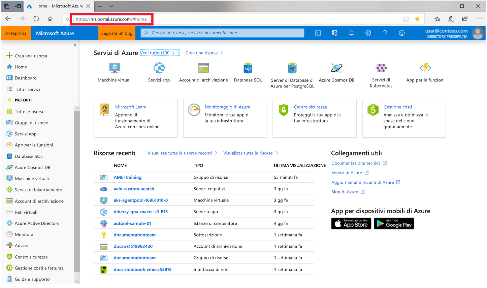
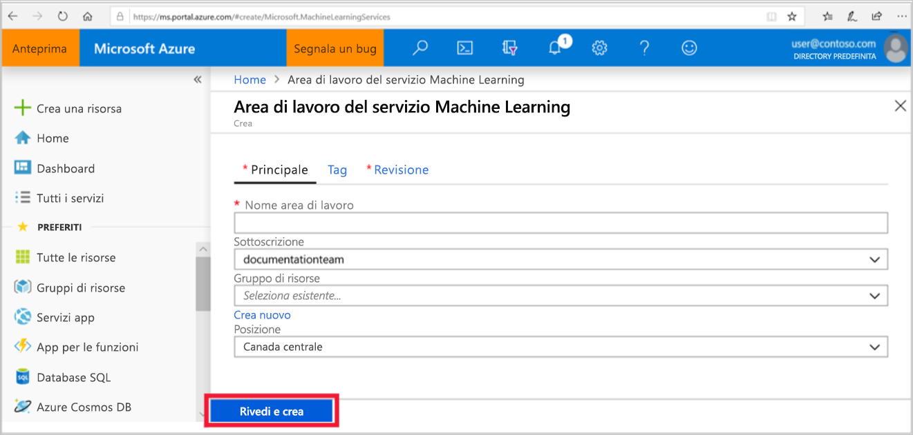

1. Accedere al [portale di Azure](https://portal.azure.com/) usando le credenziali della propria sottoscrizione di Azure. 

   

1. Nell'angolo superiore sinistro del portale selezionare **Crea una risorsa**.

   

1. Nella barra di ricerca immettere **Machine Learning**. Selezionare il risultato di ricerca **Area di lavoro del servizio Machine Learning**.

   

1. Nel riquadro **Area di lavoro del servizio Machine Learning** selezionare **Crea** per iniziare.

    

1. Nel riquadro **Area di lavoro del servizio ML** configurare l'area di lavoro.

   Campo|DESCRIZIONE
   ---|---
   Nome dell'area di lavoro |Immettere un nome univoco che identifichi l'area di lavoro. In questo esempio si usa **docs-ws**. I nomi devono essere univoci all'interno del gruppo di risorse. Usare un nome facile da ricordare e da distinguere dai nomi delle aree di lavoro create da altri utenti.  
   Sottoscrizione |Selezionare la sottoscrizione di Azure da usare.
   Gruppo di risorse | Usare un gruppo di risorse esistente nella sottoscrizione oppure immettere un nome per creare un nuovo gruppo di risorse. Un gruppo di risorse include risorse correlate per una soluzione Azure. In questo esempio si usa **docs-aml**. 
   Località | Selezionare la località più vicina agli utenti e alle risorse di dati. Si tratta della località in cui viene creata l'area di lavoro.

   

1. Per avviare il processo di creazione selezionare **Rivedi e crea**.

    

1. Rivedere la configurazione dell'area di lavoro. Se è corretta selezionare **Crea**. La creazione dell'area di lavoro può richiedere alcuni istanti.

    

1. Per controllare lo stato della distribuzione, selezionare l'icona Notifiche, **campanella**, sulla barra degli strumenti.

1. Al termine del processo verrà visualizzato un messaggio di conferma del completamento della distribuzione, presente anche nella sezione delle notifiche. Per visualizzare la nuova area di lavoro, selezionare **Vai alla risorsa**.

   
