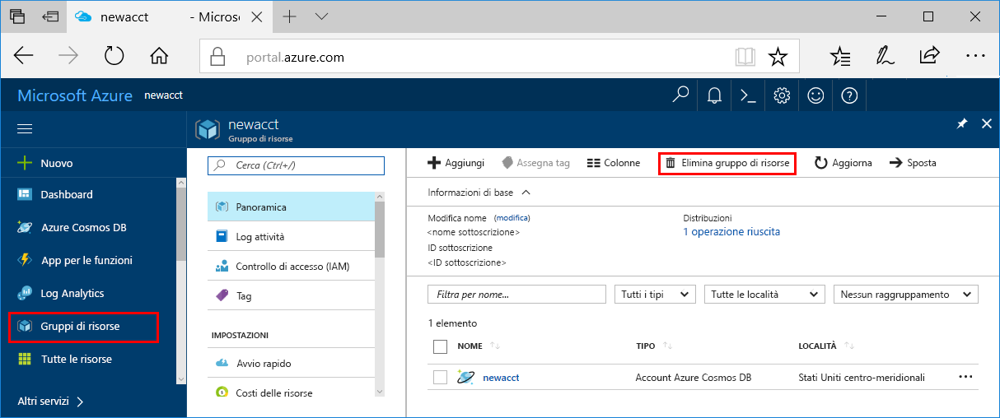

Se non si intende continuare a usare l'app, eliminare tutte le risorse create tramite questa guida di avvio rapido eseguendo i passaggi seguenti, per evitare qualsiasi addebito:

>[!NOTE]
>Queste risorse sono utili per completare ora le altre esercitazioni sui servizi di Azure Machine Learning.

1. Nel portale di Azure fare clic su **Gruppi di risorse** all'estrema sinistra.  
 
   

2. Nell'elenco dei gruppi di risorse selezionare il gruppo di risorse creato e quindi fare clic su **Elimina gruppo di risorse**.

3. Digitare il nome del gruppo di risorse da eliminare e fare clic su **Elimina**.

