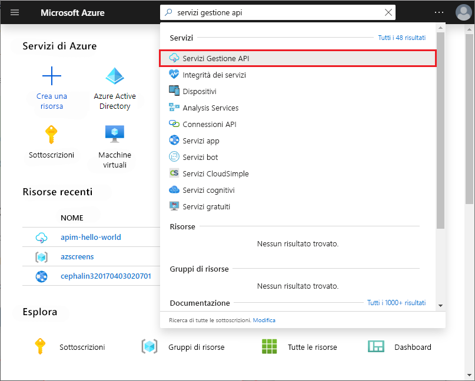
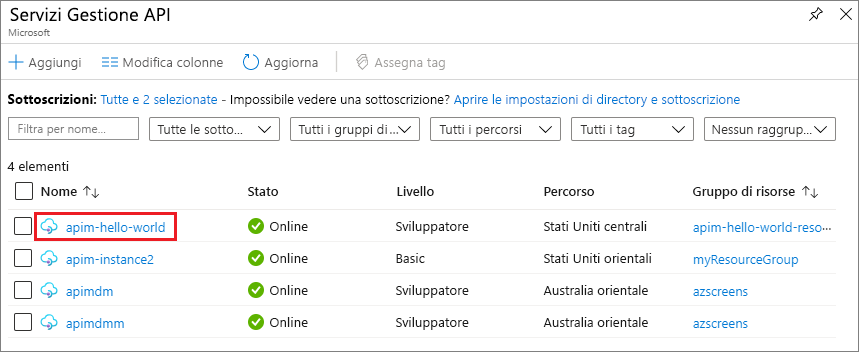

## Passare all'istanza di Gestione API

1. Nel portale di Azure cercare e selezionare **Servizi Gestione API**.

   

1. Nella schermata **Gestione API** selezionare l'istanza di Gestione API.

   

