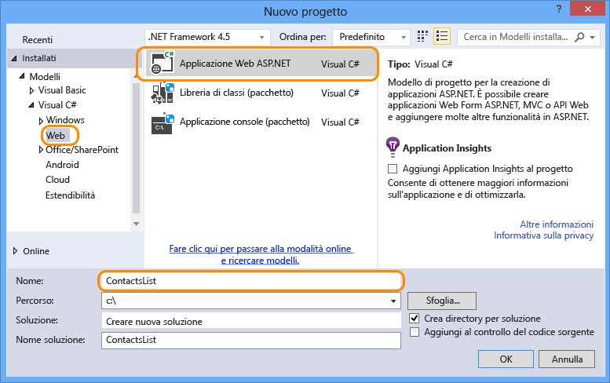
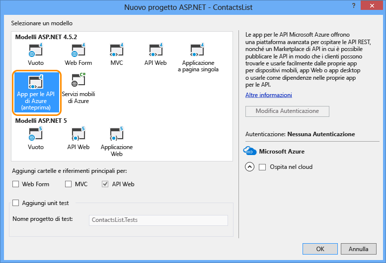

1. Aprire Visual Studio 2013.

2. Selezionare **File > nuovo progetto**.

3. Selezionare il modello **Applicazione Web ASP.NET**.

4. Assicurarsi che la casella di controllo **Aggiungi Application Insights al progetto** sia deselezionata.

4. Immettere un nome per il progetto.

	

5. Fare clic su **OK**.

6. Nella finestra di dialogo **Nuovo progetto ASP.NET** selezionare il modello di progetto **App per le API di Azure**.

	

7. Fare clic su **OK** per generare il progetto.

Visual Studio create un progetto API Web configurato per la distribuzione come app per le API.

<!---HONumber=July15_HO5-->