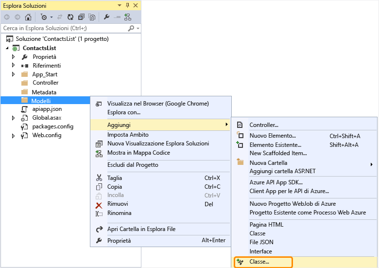
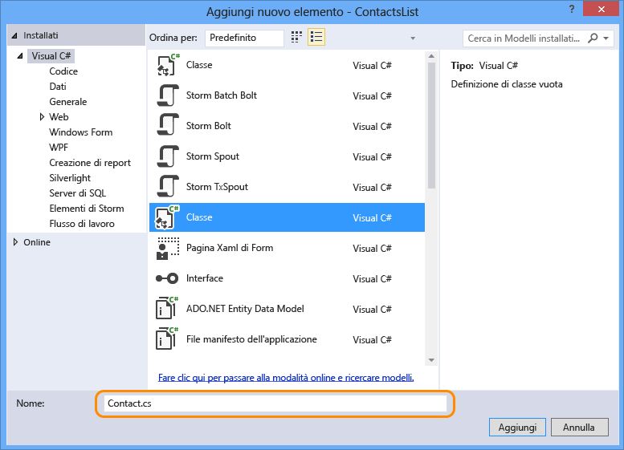
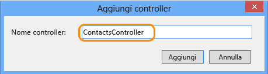

## Aggiungere codice per l'API Web

Nei passaggi seguenti verrà aggiunto codice per un semplice metodo HTTP Get che restituisce un elenco hardcoded di contatti.

1. In Esplora soluzioni fare clic con il pulsante destro del mouse sulla cartella **Modelli** e quindi scegliere **Aggiungi > Classe**. 

	

2. Assegnare al nuovo file il nome *Contact.cs*.

	

3. Fare clic su **Aggiungi**.

4. Dopo la creazione del file *Contact.cs*, sostituire l'intero contenuto del file con il codice seguente.

		namespace ContactsList.Models
		{
			public class Contact
			{
				public int Id { get; set; }
				public string Name { get; set; }
				public string EmailAddress { get; set; }
			}
		}

5. Fare clic con il pulsante destro del mouse sulla cartella **Controller** e quindi scegliere **Aggiungi > Controller**.

	

6. Nella finestra di dialogo **Aggiungi scaffolding** selezionare l'opzione **Controller API Web 2 - Vuoto** e fare clic su **Aggiungi**.

	

7. Assegnare al controller il nome **ContactsController** e quindi fare clic su **Aggiungi**.

	

8. Dopo la creazione del file ContactsController.cs, sostituire l'intero contenuto del file con il codice seguente.

		using ContactsList.Models;
		using System;
		using System.Collections.Generic;
		using System.Linq;
		using System.Net;
		using System.Net.Http;
		using System.Threading.Tasks;
		using System.Web.Http;
		
		namespace ContactsList.Controllers
		{
		    public class ContactsController : ApiController
		    {
		        [HttpGet]
		        public IEnumerable<Contact> Get()
		        {
		            return new Contact[]{
						new Contact { Id = 1, EmailAddress = "barney@contoso.com", Name = "Barney Poland"},
						new Contact { Id = 2, EmailAddress = "lacy@contoso.com", Name = "Lacy Barrera"},
	                	new Contact { Id = 3, EmailAddress = "lora@microsoft.com", Name = "Lora Riggs"}
		            };
		        }
		    }
		}

## Abilitare l'interfaccia utente di Swagger

Per impostazione predefinita, i progetti delle app per le API vengono abilitati con la generazione automatica dei metadati di [Swagger](http://swagger.io/ "Informazioni ufficiali su Swagger"). Se è stata usata la voce di menu **Aggiungi API App SDK** per convertire un progetto API Web, verrà abilitata anche una pagina di test API per impostazione predefinita.

Il modello di nuovo progetto di app per le di Azure, tuttavia, disabilita la pagina di test dell'API. Se il progetto di app per le API è stato creato usando il modello di progetto di app per le API, sarà necessario eseguire i passaggi seguenti per abilitare la pagina di test.

1. Aprire il file *App_Start/SwaggerConfig.cs* e cercare **EnableSwaggerUI**:

	

2. Rimuovere quindi i simboli di commento dalle righe di codice seguenti:

	        })
	    .EnableSwaggerUi(c =>
	        {

3. Al termine, il file dovrebbe avere un aspetto analogo al seguente:

	

## Testare l'API Web

Per visualizzare la pagina di test dell'API, eseguire i passaggi seguenti.

1. Eseguire l'app localmente (CTRL-F5) e passare a `/swagger`. 

	

2. Fare clic sul pulsante **Prova**. Si noterà che l'API funziona e restituisce il risultato previsto.

	

<!--HONumber=54-->