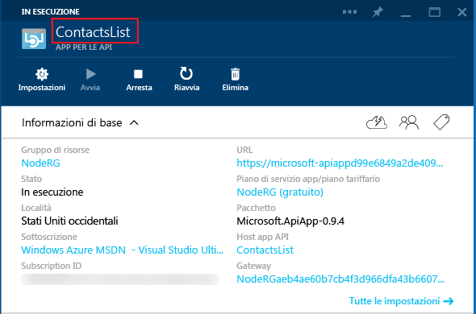

## Metadati dell'app per le API

Questa sezione fornisce informazioni aggiuntive sui metadati delle app per le API che possono essere personalizzati.

La maggior parte delle proprietà nel file *apiapp.json* e i file nella cartella *Metadata* influiscono sul modo in cui un pacchetto dell'app per le API viene presentato in Azure Marketplace. Le sezioni seguenti spiegano il modo in cui le proprietà e i file influiscono sulle app per le API quando si distribuisce direttamente il codice in un'app per le API nella sottoscrizione di Azure.

### ID app per le API 

La proprietà `id` determina il nome dell'app per le API. Ad esempio:

		"id": "ContactsList",

### Spazio dei nomi

Impostare la proprietà `namespace` sul dominio del tenant di Azure Active Directory. Per trovare il dominio, aprire il [portale di Azure classico](https://manage.windowsazure.com/) nel browser, passare ad **Active Directory** e selezionare la scheda **Domini**. Ad esempio:

		"namespace": "contoso.onmicrosoft.com",

### Definizione dell'API Swagger dinamica

Se l'app per le API può restituire una definizione dell’API [Swagger](http://swagger.io/) dinamica, archiviare l'URL relativo a una richiesta GET che restituisce il JSON della definizione dell'API nella proprietà `endpoints.apiDefinition`. Ad esempio:

		"endpoints": {
		    "apiDefinition": "/swagger/docs/v1"
		}

> **Nota:** se si usa Swashbuckle per generare una definizione dell'API Swagger, gli overload del metodo HTTP nei controller dell'API Web provocano ID operazione duplicati. Per altre informazioni, vedere [Personalizzare gli identificatori di operazione generati da Swashbuckle](../article/app-service-api/app-service-api-dotnet-swashbuckle-customize.md).
  
### Definizione dell'API Swagger statica

Per specificare un file di definizione dell'API [Swagger](http://swagger.io/) 2.0 statica, archiviare il file nella cartella *Metadata* e assegnargli il nome *apiDefinition.swagger.json*

Escludere `endpoints.apiDefinition` dal file *apiapp.json* o impostarne il valore su Null. Se si include sia un URL `endpoints.apiDefinition` che un file *apiDefinition.swagger.json*, l'URL avrà la precedenza e il file verrà ignorato.

<!---HONumber=62-->